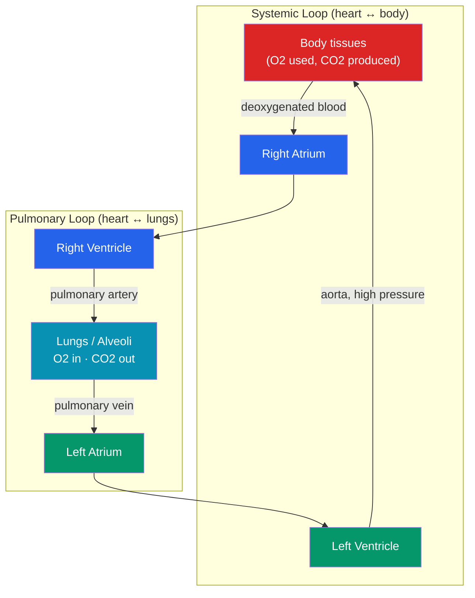

# 🫀 The Circulatory and Respiratory Systems

> [!abstract] TL;DR
> The **circulatory (cardiovascular) system** is a closed transport network: the **heart** pumps **blood** through **arteries**, **capillaries**, and **veins** to deliver oxygen and nutrients and remove waste. Humans have **double circulation** — a **pulmonary** loop (heart → lungs → heart) and a **systemic** loop (heart → body → heart) — kept separate by a four-chambered heart, so oxygenated and deoxygenated blood never mix. The **respiratory system** moves air to the **alveoli**, where **gas exchange** occurs by diffusion: O₂ into blood, CO₂ out. Oxygen is carried bound to **hemoglobin** in red blood cells; CO₂ travels mostly as **bicarbonate**. The two systems are inseparable partners — the lungs load the blood the heart delivers, and their coupling is tuned second-by-second to match the body's demand.

## Intuition — analogy first

Think of the body as a **city with a delivery fleet and a loading dock**.

Every building (cell) needs constant deliveries of oxygen and food and constant pickup of trash (CO₂, waste). The **blood** is the fleet of trucks. The **heart** is the central depot that keeps the trucks moving in a loop. The **blood vessels** are the road network — wide highways (**arteries**) leaving the depot, a dense grid of tiny local streets (**capillaries**) where actual deliveries happen at each doorstep, and return roads (**veins**) bringing the trucks back.

But the trucks arrive at the depot empty of oxygen. Before they can make deliveries, they must visit the **loading dock** — the **lungs** — to pick up fresh oxygen and drop off the trash gas. That's why the circuit runs in a figure-eight: trucks go depot → loading dock → depot → city → depot, over and over. The genius of the system is that the loading dock (respiration) and the depot (circulation) are physically wired together at the same organ (the heart), so oxygen pickup and city-wide delivery stay perfectly synchronized.

---

## How It Works — Double Circulation and Gas Exchange

Blood flows in one direction, enforced by **valves**. Deoxygenated blood returns to the **right** side of the heart and is pumped to the **lungs** (pulmonary loop); freshly oxygenated blood returns to the **left** side and is pumped at high pressure to the **body** (systemic loop). The left ventricle wall is thickest because it must push blood through the entire body.

## Key Concepts

### The Heart and the Cardiac Cycle

The heart has **four chambers**: two **atria** (receiving) on top and two **ventricles** (pumping) below. Valves prevent backflow: the **atrioventricular valves** (tricuspid on the right, **mitral/bicuspid** on the left) between atria and ventricles, and the **semilunar valves** (pulmonary and aortic) at the ventricular exits.

The **cardiac cycle** alternates **systole** (contraction, ejecting blood) and **diastole** (relaxation, filling). The heartbeat is **myogenic** — it originates in the heart itself. The **sinoatrial (SA) node** ("pacemaker") fires, spreading depolarization across the atria; the **atrioventricular (AV) node** delays and relays it to the ventricles via the **bundle of His** and **Purkinje fibers**. Heart rate is *modulated* (not created) by the autonomic nervous system — sympathetic input speeds it, parasympathetic (vagal) input slows it (see [[Homeostasis_and_the_Nervous_System]]).

### Blood

Blood is ~55% **plasma** (water, proteins, ions, glucose, hormones) and ~45% **formed elements**:

| Component | Function | Notes |
|---|---|---|
| **Red blood cells (erythrocytes)** | Carry O₂/CO₂ | Biconcave, no nucleus, packed with **hemoglobin** |
| **White blood cells (leukocytes)** | Immune defense | Neutrophils, lymphocytes, macrophages, etc. |
| **Platelets (thrombocytes)** | Clotting | Cell fragments; trigger the clotting cascade |
| **Plasma** | Transport medium | Carries nutrients, hormones, waste, CO₂ (as bicarbonate) |

### Blood Vessels

| Vessel | Wall | Pressure | Function |
|---|---|---|---|
| **Arteries** | Thick, elastic, muscular | High | Carry blood *away* from heart (usually oxygenated) |
| **Capillaries** | One cell thick | Low | Site of exchange with tissues |
| **Veins** | Thinner, have **valves** | Low | Return blood *to* heart (usually deoxygenated) |

Note the two exceptions: the **pulmonary artery** carries deoxygenated blood, and the **pulmonary veins** carry oxygenated blood — "artery/vein" refers to *direction relative to the heart*, not oxygen content. Capillaries are the functional heart of circulation: their walls are a single **endothelial** cell thick, so O₂, glucose, and hormones diffuse out and CO₂ and wastes diffuse in.

### The Respiratory System and Ventilation

Air travels: **nose/mouth → pharynx → larynx → trachea → bronchi → bronchioles → alveoli**. The **alveoli** are ~300 million tiny air sacs providing an enormous surface area (~70 m²) for exchange. **Ventilation** (breathing) is driven by the **diaphragm** and **intercostal muscles**: on inhalation the diaphragm contracts and flattens, thoracic volume increases, pressure drops, and air flows in (negative-pressure breathing); exhalation is largely passive elastic recoil.

### Gas Exchange and Transport

At the alveoli, gases move by **diffusion down partial-pressure gradients**: O₂ is high in alveolar air and low in returning blood, so O₂ diffuses *in*; CO₂ is high in blood and low in alveolar air, so CO₂ diffuses *out*. The alveolar–capillary membrane is thin and moist to maximize this.

**Oxygen transport:** ~98% of O₂ binds reversibly to **hemoglobin**, forming **oxyhemoglobin** (HbO₂). Hemoglobin's **cooperative binding** produces the sigmoidal **oxygen–hemoglobin dissociation curve** — it loads O₂ readily in the lungs (high pO₂) and unloads it in active tissues (low pO₂). Unloading is enhanced by higher CO₂, higher temperature, and lower pH (the **Bohr effect**) — exactly the conditions in hard-working tissue.

**Carbon dioxide transport:** ~70% travels as **bicarbonate (HCO₃⁻)** (formed via carbonic anhydrase in red cells), ~23% bound to hemoglobin (carbaminohemoglobin), and ~7% dissolved in plasma. This bicarbonate system also buffers **blood pH**, tying respiration to acid–base homeostasis.

### How the Two Systems Couple

The systems share the **pulmonary circuit**: the right heart delivers blood *to* the lungs and the left heart receives it back. **Breathing rate and heart rate are co-regulated** by the brainstem (medulla) based mainly on blood **CO₂ / pH** (detected by chemoreceptors), not oxygen directly. During exercise, both rise together to increase O₂ delivery and CO₂ removal — a coordinated homeostatic response.

## Real-World Notes

- **Blood pressure** (e.g., 120/80 mmHg) reports systolic/diastolic arterial pressure; chronic **hypertension** strains the heart and vessels and is a major cardiovascular risk factor.
- **Carbon monoxide** is dangerous because it binds hemoglobin ~200× more tightly than O₂, blocking oxygen transport even when breathing is normal.
- **Anemia** (low hemoglobin or red cells) reduces oxygen-carrying capacity, causing fatigue and breathlessness despite healthy lungs — a transport failure, not a ventilation failure.
- **Altitude:** low atmospheric pO₂ reduces O₂ loading; the body adapts over weeks by producing more red cells (via the hormone **erythropoietin** from the kidney — see [[The_Endocrine_System_and_Hormones]]).

## Common Pitfalls / Misconceptions

- **"All arteries carry oxygenated blood."** False — the pulmonary artery carries deoxygenated blood. The terms track direction relative to the heart, not oxygen content.
- **"We breathe because our body senses low oxygen."** The primary drive is *rising CO₂ / falling pH*, sensed by chemoreceptors; low O₂ is a secondary, weaker stimulus.
- **"The heart oxygenates blood."** No — the *lungs* oxygenate blood; the heart is a pump. The heart's own muscle is supplied by the coronary arteries.
- **"Deoxygenated blood is blue."** It is dark red, not blue; veins look bluish only through skin due to light scattering.
- **"Breathing pushes air in like inflating a balloon."** It's negative-pressure breathing — the diaphragm *expands* the chest, lowering internal pressure so air is drawn in.

## Related Concepts

- [[_MOC_Human_Physiology|↑ Section MOC]]
- [[Homeostasis_and_the_Nervous_System]] — Heart rate, breathing rate, and blood pressure are homeostatic variables tuned by the autonomic nervous system and brainstem
- [[The_Digestive_and_Excretory_Systems]] — The blood delivers absorbed nutrients from the gut and carries waste to the kidneys; both depend on circulation
- [[The_Endocrine_System_and_Hormones]] — Hormones (adrenaline, erythropoietin) travel in the blood and modulate heart rate and red-cell production
- [[The_Musculoskeletal_System]] — Working muscle drives the exercise demand that couples faster breathing to faster circulation
- Cross-vault: [[_MOC_Psychology_Master]] — Cardiovascular arousal (heart rate, blood pressure) is the physiological signature of stress and emotion (biological psychology)

## Review Questions

1. Explain what "double circulation" means and why a four-chambered heart is necessary to sustain it. What would be the physiological consequence if oxygenated and deoxygenated blood mixed?
2. Describe how oxygen is transported in the blood and explain the Bohr effect. Why is it advantageous that hemoglobin unloads *more* oxygen in tissues that are warm, acidic, and CO₂-rich?
3. Blood CO₂ rises during vigorous exercise. Trace the pathway by which this is detected and how the circulatory and respiratory systems jointly respond to restore homeostasis.

## Sources

- Hall, J.E. & Hall, M.E. (2020). *Guyton and Hall Textbook of Medical Physiology* (14th ed.). Elsevier
- Levick, J.R. (2010). *An Introduction to Cardiovascular Physiology* (5th ed.). Hodder Arnold
- West, J.B. & Luks, A.M. (2020). *West's Respiratory Physiology: The Essentials* (11th ed.). Wolters Kluwer
- Marieb, E.N. & Hoehn, K. (2018). *Human Anatomy & Physiology* (11th ed.). Pearson

#biology #human-physiology #circulatory-system #respiratory-system #gas-exchange #hemoglobin
