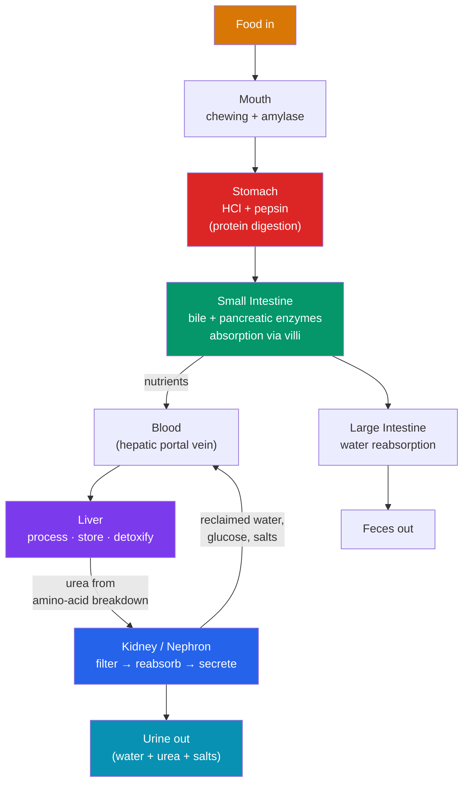

# 🍽️ The Digestive and Excretory Systems

> [!abstract] TL;DR
> The **digestive system** breaks food into absorbable molecules through **mechanical digestion** (chewing, churning) and **chemical digestion** (**enzymes** hydrolyzing carbohydrates, proteins, and fats). Nutrients are absorbed mainly across the **small intestine's** huge villous surface into the blood, which routes them through the **liver** — the body's metabolic hub — before general circulation. The **excretory system** disposes of nitrogenous waste (**urea**) and regulates water and salts. Its core organ is the **kidney**, whose functional unit, the **nephron**, cleans blood in three steps: **filtration** at the glomerulus, selective **reabsorption** of useful substances, and **secretion** of extra waste — producing urine while performing **osmoregulation** to keep blood volume, pressure, and salt concentration stable. Together the two systems handle input (nutrients in) and output (waste out).

## Intuition — analogy first

Think of the body as a **factory with a receiving line and a water-treatment plant**.

Raw materials (food) arrive at the loading bay too bulky to use, so the **digestive tract** is a disassembly line: it grinds materials down (mechanical) and applies chemical solvents (**enzymes**) that cut large molecules into standard parts — proteins into amino acids, starch into glucose, fats into fatty acids. Only these standardized parts are small enough to pass through the factory walls (the gut lining) into the internal supply network (the blood). Everything indigestible is bundled and shipped out as waste (feces).

But a running factory also *produces* waste inside its water supply — spent chemicals and toxic byproducts (nitrogenous waste from protein metabolism). You can't just keep dumping them into the recirculating water, or it becomes poisonous. So the factory runs a **water-treatment plant** — the **kidneys**. It pumps the entire water supply through filters, throws out the toxins and excess water, but carefully *reclaims* the clean water, salts, and sugar it still needs. The result is stable, clean internal water — **osmoregulation** — and a small concentrated waste stream (urine).

---

## How It Works — From Food to Filtered Blood

Digestion moves food through a one-way tube, adding enzymes at each stage; the blood carries absorbed nutrients through the **liver** first. Protein breakdown yields toxic ammonia, converted by the liver to **urea**, which the **kidney** then filters out — a clean hand-off from the digestive to the excretory system.

## Key Concepts

### Mechanical and Chemical Digestion

**Mechanical digestion** physically breaks food up (teeth chewing, stomach churning, bile emulsifying fat), increasing surface area. **Chemical digestion** uses **enzymes** — biological catalysts — to hydrolyze macromolecules:

| Nutrient | Enzyme(s) | Source | Product |
|---|---|---|---|
| **Carbohydrate** | Amylase | Salivary glands, pancreas | Maltose → glucose |
| **Protein** | Pepsin, trypsin, peptidases | Stomach, pancreas, intestine | Amino acids |
| **Fat (lipid)** | Lipase (+ **bile** salts) | Pancreas (bile from liver) | Fatty acids + glycerol |
| **Nucleic acid** | Nucleases | Pancreas | Nucleotides |

The **stomach** secretes **hydrochloric acid** (killing microbes, activating **pepsin** at low pH ~2) and churns food into **chyme**. The **small intestine** (duodenum, jejunum, ileum) is where most digestion is completed and absorption occurs, aided by **pancreatic enzymes** and **bile**.

### Absorption and the Small Intestine

The small intestine is lined with **villi** and **microvilli** — finger-like projections creating a vast surface area (~250 m²). Each **villus** has a rich capillary bed and a **lacteal** (lymph vessel). Glucose and amino acids are absorbed into the **blood capillaries** (often by active transport / co-transport with Na⁺); fatty acids are repackaged and absorbed into the **lacteals** as lymph. Blood from the intestine drains via the **hepatic portal vein** directly to the liver.

### The Liver's Central Role

The **liver** is the body's chemical processing plant. Key functions:

- **Metabolic hub:** regulates blood glucose (stores glucose as **glycogen**; releases it on demand under insulin/glucagon control — see [[The_Endocrine_System_and_Hormones]]).
- **Deamination & urea:** breaks down excess amino acids, converting toxic **ammonia** into less-toxic **urea** (the **ornithine/urea cycle**) for excretion by the kidney.
- **Detoxification:** neutralizes drugs, alcohol, and toxins.
- **Bile production:** makes **bile** (stored in the gallbladder) to emulsify fats.
- **Protein synthesis:** makes plasma proteins (albumin) and clotting factors.
- **Storage:** iron, and vitamins A, D, B₁₂.

### The Excretory System and the Nephron

**Excretion** removes metabolic waste — chiefly **urea**, plus excess water, salts, and CO₂ (via lungs). The kidneys are the primary excretory organs; each contains ~1 million **nephrons**. The nephron performs three processes:

| Step | Location | What happens |
|---|---|---|
| **1. Filtration** | **Glomerulus** → Bowman's capsule | Blood pressure forces water, ions, glucose, urea (but not cells/large proteins) into the tubule as filtrate |
| **2. Reabsorption** | Proximal tubule, **loop of Henle**, distal tubule | Useful substances (all glucose, most water and salts) are actively reclaimed back into blood |
| **3. Secretion** | Distal tubule, collecting duct | Extra waste (H⁺, K⁺, some drugs) is added from blood into the tubule; final urine forms |

The **loop of Henle** sets up a salt-concentration gradient in the kidney medulla that allows water to be reclaimed and concentrated urine to be produced.

### Osmoregulation

**Osmoregulation** keeps blood **water and salt concentration** (osmolarity) stable — a homeostatic loop (see [[Homeostasis_and_the_Nervous_System]]). When the body is dehydrated (high blood osmolarity), the hypothalamus triggers release of **antidiuretic hormone (ADH / vasopressin)** from the posterior pituitary. ADH makes the **collecting duct** more permeable to water, so more water is reabsorbed and urine becomes concentrated. When over-hydrated, ADH falls and dilute urine is produced. **Aldosterone** (from the adrenal cortex) similarly tunes Na⁺ reabsorption, controlling blood volume and pressure.

## Real-World Notes

- **Diabetes** classically presents with glucose in the urine: when blood glucose exceeds the nephron's reabsorption capacity, glucose "spills over" into urine, dragging water with it (hence frequent urination and thirst).
- **Dialysis** artificially performs the nephron's filtration and reabsorption when kidneys fail, cleaning the blood of urea and excess salts/water.
- **Lactose intolerance** results from missing the enzyme **lactase**; undigested lactose ferments in the colon, causing gas and diarrhea — a direct enzyme-deficiency illustration.
- **Alcohol** is processed by the liver at a roughly fixed rate and inhibits ADH, increasing urine output (dehydration/hangover). This ties liver detox to renal water balance.

## Common Pitfalls / Misconceptions

- **"Digestion happens in the stomach."** The stomach starts protein digestion, but *most* digestion and nearly all absorption happen in the **small intestine**.
- **"The kidney makes urine to get rid of water."** Its deeper job is **osmoregulation** — precisely balancing water *and* salts; urine volume is adjusted, not maximized.
- **"Filtration decides what's excreted."** No — the glomerulus filters indiscriminately (including glucose and water); it's **reabsorption** that reclaims the useful material, so the *combination* determines urine content.
- **"The liver is part of the digestive tract."** The liver is an accessory organ — food never passes through it — but it processes everything absorbed via the hepatic portal vein.
- **"Enzymes are used up in digestion."** Enzymes are catalysts; they are not consumed and can act repeatedly.

## Related Concepts

- [[_MOC_Human_Physiology|↑ Section MOC]]
- [[The_Circulatory_and_Respiratory_Systems]] — The blood delivers absorbed nutrients (via the hepatic portal vein) and carries urea to the kidney; the lungs handle CO₂ excretion
- [[Homeostasis_and_the_Nervous_System]] — Osmoregulation and blood pH are negative-feedback loops centered on the kidney
- [[The_Endocrine_System_and_Hormones]] — ADH, aldosterone, insulin, and glucagon regulate water balance and the liver's glucose handling
- [[The_Musculoskeletal_System]] — Smooth muscle drives peristalsis, moving food through the gut
- Cross-vault: [[_MOC_Psychology_Master]] — Hunger, satiety, and thirst are motivational states linking gut signals to behavior

## Review Questions

1. Distinguish mechanical from chemical digestion, then name the enzyme, its source, and its product for carbohydrate, protein, and fat digestion.
2. Trace a molecule of glucose from the small intestinal lumen to a body cell, naming the vessels and organs it passes through (including why it visits the liver first).
3. Describe the three functions of the nephron (filtration, reabsorption, secretion) and explain how ADH lets the kidney produce concentrated urine when the body is dehydrated.

## Sources

- Hall, J.E. & Hall, M.E. (2020). *Guyton and Hall Textbook of Medical Physiology* (14th ed.). Elsevier
- Widmaier, E.P., Raff, H. & Strang, K.T. (2019). *Vander's Human Physiology* (15th ed.). McGraw-Hill
- Marieb, E.N. & Hoehn, K. (2018). *Human Anatomy & Physiology* (11th ed.). Pearson
- Boron, W.F. & Boulpaep, E.L. (2016). *Medical Physiology* (3rd ed.). Elsevier

#biology #human-physiology #digestive-system #excretory-system #nephron #osmoregulation
