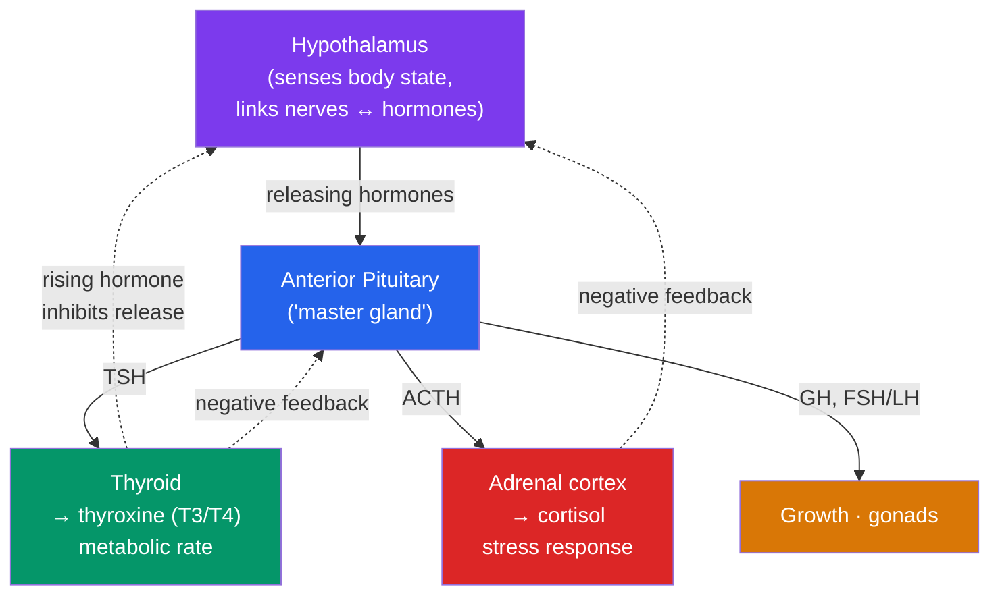

# 🧬 The Endocrine System and Hormones

> [!abstract] TL;DR
> The **endocrine system** is the body's slow, long-range chemical signaling network. **Glands** secrete **hormones** directly into the **blood**, which carries them everywhere, but only cells bearing the matching **receptor** respond — so a broadcast signal produces targeted effects. **Peptide hormones** (e.g., insulin) bind surface receptors and act via **second messengers** (fast, short-lived); **steroid hormones** (e.g., cortisol) cross the membrane and alter **gene expression** (slower, longer-lasting). The master controller is the **hypothalamus–pituitary axis**: the hypothalamus links the nervous and endocrine systems and commands the **pituitary**, which in turn directs the **thyroid**, **adrenal glands**, and gonads. Blood glucose is governed by the **pancreas** (insulin lowers it, glucagon raises it), and most axes are held stable by **negative feedback**. Compared with the nervous system, endocrine signaling is slower to start but broader and longer-lasting.

## Intuition — analogy first

Think of two ways a company sends messages: **phone calls** and a **company-wide memo**.

The **nervous system** is the phone call — point-to-point, near-instant, and over the moment you hang up. You call one specific person and get an immediate action. That's a neuron firing at a specific muscle.

The **endocrine system** is the memo dropped into the internal mail that reaches *every* office in the building. It's slower to arrive, but it goes everywhere at once and its effect lingers. Here's the clever part: even though the memo reaches every office, only the departments that were *expecting it* — the ones with the right "inbox" (a matching **receptor**) — actually act on it. Everyone else ignores it. So a single hormone released into the blood can coordinate a body-wide, sustained response (growth, puberty, the stress response, metabolism) while still hitting only its intended targets. And just like a good organization, the system uses **feedback**: once the memo's goal is achieved, a reply goes back up the chain telling the sender to stop broadcasting.

---

## How It Works — The Hypothalamus-Pituitary Axis and Feedback

The hypothalamus releases **releasing hormones** that tell the anterior pituitary to secrete **tropic hormones** (TSH, ACTH, etc.), which command downstream glands. When the target hormone (e.g., thyroxine, cortisol) rises in the blood, it **feeds back** to inhibit the hypothalamus and pituitary — a self-limiting negative-feedback cascade that holds levels steady.

## Key Concepts

### Hormones as Chemical Messengers

A **hormone** is a signaling molecule secreted by a gland into the blood that acts on distant **target cells** expressing its **receptor**. Specificity comes from the receptor, not the messenger — the lock, not the key's delivery route. Two major classes act very differently:

| Property | **Peptide / Protein hormones** | **Steroid hormones** |
|---|---|---|
| Examples | Insulin, glucagon, ADH, growth hormone | Cortisol, aldosterone, estrogen, testosterone |
| Solubility | Water-soluble (can't cross membrane) | Lipid-soluble (cross membrane freely) |
| Receptor location | **Cell surface** | **Inside** cell (cytoplasm/nucleus) |
| Mechanism | **Second messengers** (e.g., cAMP) | Alter **gene transcription** |
| Speed / duration | Fast onset, short-lived | Slow onset, long-lasting |
| Blood transport | Dissolve freely in plasma | Carried on transport proteins |

### Major Glands and Their Hormones

| Gland | Key hormone(s) | Principal effect |
|---|---|---|
| **Hypothalamus** | Releasing/inhibiting hormones; makes ADH & oxytocin | Links nervous & endocrine systems; commands pituitary |
| **Pituitary (anterior)** | TSH, ACTH, GH, FSH/LH, prolactin | "Master gland" — directs other glands and growth |
| **Pituitary (posterior)** | ADH, oxytocin (stored, hypothalamic origin) | Water balance; uterine contraction/milk let-down |
| **Thyroid** | **Thyroxine (T₃/T₄)**, calcitonin | Sets basal metabolic rate; lowers blood Ca²⁺ |
| **Adrenal cortex** | **Cortisol**, aldosterone | Stress metabolism; Na⁺/water balance (blood pressure) |
| **Adrenal medulla** | **Adrenaline (epinephrine)** | Fast "fight or flight" surge |
| **Pancreas (islets)** | **Insulin (β-cells), glucagon (α-cells)** | Blood-glucose regulation |

### The Hypothalamus–Pituitary Axis

The **hypothalamus** is the crossroads of neural and hormonal control. It senses the internal environment (temperature, osmolarity, hormone levels) and converts that into endocrine commands. It secretes **releasing hormones** into a private portal blood supply to the **anterior pituitary**, which releases **tropic hormones** that act on peripheral glands (thyroid, adrenal cortex, gonads). The **posterior pituitary** is neural tissue that *stores and releases* hypothalamus-made ADH and oxytocin. Each axis (e.g., **hypothalamus → pituitary → adrenal**, the "HPA axis" of the stress response) is regulated by **negative feedback** from the final hormone.

### Blood-Glucose Regulation (Insulin & Glucagon)

The **pancreas** runs the body's central glucose thermostat with two antagonistic hormones (a textbook negative-feedback pair, connecting to [[Homeostasis_and_the_Nervous_System]]):

- **After eating (glucose high):** β-cells release **insulin** → cells take up glucose, and the **liver** stores it as **glycogen** (glycogenesis) → blood glucose falls.
- **Fasting (glucose low):** α-cells release **glucagon** → the liver breaks glycogen down (glycogenolysis) and makes new glucose (gluconeogenesis) → blood glucose rises.

**Cortisol** and **adrenaline** also raise blood glucose during stress, mobilizing energy. This system's failure defines **diabetes mellitus** (type 1: no insulin; type 2: insulin resistance).

### Nervous vs. Endocrine Signaling

| Feature | **Nervous system** | **Endocrine system** |
|---|---|---|
| Signal | Electrical (action potential) + neurotransmitter | Hormone in blood |
| Speed | Milliseconds | Seconds to hours/days |
| Duration | Brief | Sustained |
| Target | Specific cells (wired) | Any cell with the receptor (broadcast) |
| Best for | Fast, precise, transient (reflexes, movement) | Slow, widespread, lasting (growth, metabolism) |

The two are integrated — the hypothalamus and the adrenal medulla (neurons secreting adrenaline into blood) are literal bridges between them.

## Real-World Notes

- **Adrenaline (epinephrine)** is used clinically for anaphylaxis and cardiac arrest — it produces a fast, whole-body sympathetic effect (↑ heart rate, bronchodilation, ↑ blood glucose), showing endocrine amplification of a nervous signal.
- **Hypothyroidism** (too little thyroxine) slows metabolism — fatigue, weight gain, cold intolerance; **hyperthyroidism** does the opposite. Both trace to a single axis being mis-set.
- **Chronic stress** keeps the HPA axis and cortisol elevated, with downstream effects on immunity, sleep, and mood — a key bridge to biological psychology (see cross-vault link).
- **Insulin therapy** replaces the missing hormone in type 1 diabetes; it must be *injected* because, as a peptide, it would be digested if swallowed.

## Common Pitfalls / Misconceptions

- **"Hormones only affect their target organ."** A hormone reaches every cell via the blood; specificity comes from which cells carry the **receptor**, not from targeted delivery.
- **"The pituitary is the body's master gland, in full control."** The pituitary is directed by the **hypothalamus** above it and reined in by **negative feedback** from below — it's a relay, not an autocrat.
- **"Insulin and glucagon are the same kind of signal."** They are antagonists — insulin *lowers* blood glucose, glucagon *raises* it; confusing their direction is a common error.
- **"Endocrine is just a slower nervous system."** They differ in kind — broadcast chemical vs. wired electrical — and are best suited to different jobs; neither replaces the other.
- **"Steroid and peptide hormones work the same way."** Steroids enter cells and change gene expression; peptides act at the surface via second messengers — a fundamental mechanistic split.

## Related Concepts

- [[_MOC_Human_Physiology|↑ Section MOC]]
- [[Homeostasis_and_the_Nervous_System]] — Hormones are the chemical arm of homeostasis; the hypothalamus links neural and endocrine control, and glucose regulation is shared
- [[The_Circulatory_and_Respiratory_Systems]] — The blood is the delivery medium for every hormone; adrenaline and erythropoietin act on heart and blood cells
- [[The_Digestive_and_Excretory_Systems]] — ADH and aldosterone control kidney water/salt handling; the liver is insulin's and glucagon's main target
- [[The_Musculoskeletal_System]] — Growth hormone, thyroxine, and sex steroids drive bone growth; adrenaline primes muscle for action
- Cross-vault: [[_MOC_Psychology_Master]] — The HPA axis, cortisol, and adrenaline underlie the biology of stress, emotion, and motivation

## Review Questions

1. Compare peptide and steroid hormones in terms of solubility, receptor location, mechanism of action, and speed/duration of effect. Why must insulin be injected rather than taken as a pill?
2. Explain how negative feedback stabilizes the hypothalamus–pituitary–thyroid axis. What would happen to TSH levels if a tumor caused the thyroid to over-produce thyroxine?
3. Describe how the pancreas restores normal blood glucose after (a) a carbohydrate-rich meal and (b) an overnight fast, naming the cells, hormones, and liver processes involved.

## Sources

- Hall, J.E. & Hall, M.E. (2020). *Guyton and Hall Textbook of Medical Physiology* (14th ed.). Elsevier
- Melmed, S. et al. (2020). *Williams Textbook of Endocrinology* (14th ed.). Elsevier
- Widmaier, E.P., Raff, H. & Strang, K.T. (2019). *Vander's Human Physiology* (15th ed.). McGraw-Hill
- Marieb, E.N. & Hoehn, K. (2018). *Human Anatomy & Physiology* (11th ed.). Pearson

#biology #human-physiology #endocrine-system #hormones #insulin #negative-feedback
