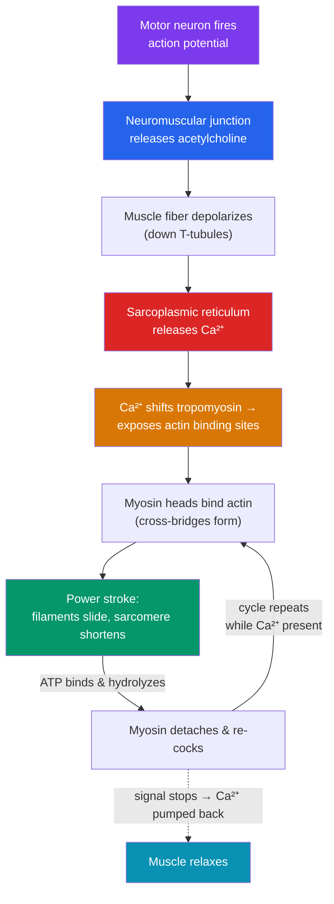

# 💪 The Musculoskeletal System

> [!abstract] TL;DR
> The **musculoskeletal system** provides structure and movement. The **skeleton** (206 bones) supports the body, **protects** organs, enables **movement** (as levers for muscles at **joints**), stores **calcium**, and produces blood cells (**hematopoiesis**) in red bone marrow. There are three **muscle types**: **skeletal** (voluntary, striated), **cardiac** (heart, involuntary, striated), and **smooth** (organs/vessels, involuntary). Skeletal muscle contracts by the **sliding-filament mechanism**: the protein filaments **actin** (thin) and **myosin** (thick) slide past each other, shortening each **sarcomere**. A nerve signal at the **neuromuscular junction** releases **acetylcholine**, triggering **calcium (Ca²⁺)** release from the sarcoplasmic reticulum; Ca²⁺ exposes myosin's binding sites on actin, and repeated **cross-bridge** cycling — powered by **ATP** — pulls the filaments together. Bones and muscles work as antagonistic pairs to produce controlled motion.

## Intuition — analogy first

Think of your body as a **puppet worked by rowing crews**.

The **bones** are the puppet's rigid rods — they give it shape, keep it upright, and provide the hard levers that motion pivots around at the **joints**. Rods alone can't move, though; something has to pull them. That's the **muscles**, and the way they pull is the surprising part.

Zoom into a muscle and you find it's built from countless tiny **rowing crews**. Each crew sits between two sliding rails (the thin **actin** filaments) and reaches out with hundreds of oars (the **myosin** heads). To contract, every oar grabs the rail, pulls (a **power stroke**), lets go, resets, and grabs again — thousands of times per second — hauling the two rails toward each other. The muscle shortens not because the filaments themselves shrink, but because they **slide past each other**, like two hands interlacing more deeply. The "go" command is a nerve impulse, and the "grab now" switch is a pulse of **calcium** that uncovers the grip points on the rail. Cut the calcium, and every oar lets go — the muscle relaxes. That is why the whole system is exquisitely controlled: the nervous system flips a chemical switch, and molecular rowers do the work.

---

## How It Works — The Sliding-Filament Mechanism

The chain runs: nerve signal → acetylcholine at the neuromuscular junction → muscle depolarization → **Ca²⁺ release** → binding sites exposed → **cross-bridge cycling** powered by ATP → filaments slide → contraction. Remove the stimulus and Ca²⁺ is pumped back, so the muscle relaxes. Note that ATP is needed both to *power* the stroke and to *release* myosin afterward.

## Key Concepts

### The Skeleton and Its Functions

The adult **skeleton** has **206 bones**, split into the **axial skeleton** (skull, vertebral column, rib cage) and **appendicular skeleton** (limbs, girdles). Its five functions:

| Function | How |
|---|---|
| **Support** | Rigid framework holds the body upright and gives shape |
| **Protection** | Skull shields the brain; ribs shield heart & lungs; vertebrae shield the spinal cord |
| **Movement** | Bones act as **levers**; muscles pull on them across **joints** |
| **Mineral storage** | Reservoir of **calcium** and phosphate, released under hormonal control |
| **Blood cell production** | **Hematopoiesis** in red bone marrow makes red cells, white cells, platelets |

**Bone** is living tissue: a hard **matrix** of collagen and calcium phosphate (hydroxyapatite), maintained by **osteoblasts** (build), **osteoclasts** (resorb), and **osteocytes** (mature cells). **Joints** (e.g., synovial joints like the knee) allow movement, cushioned by **cartilage** and lubricated by synovial fluid; **ligaments** join bone to bone, **tendons** join muscle to bone.

### The Three Muscle Types

| Type | Location | Control | Appearance | Feature |
|---|---|---|---|---|
| **Skeletal** | Attached to bones | Voluntary | Striated, multinucleate | Fast, fatigues; moves the skeleton |
| **Cardiac** | Heart wall | Involuntary | Striated, branched | Self-exciting; **intercalated discs**; tireless |
| **Smooth** | Gut, vessels, bladder | Involuntary | Non-striated, spindle | Slow, sustained; peristalsis, vessel tone |

Skeletal muscle drives the somatic movement discussed in [[Homeostasis_and_the_Nervous_System]]; cardiac and smooth muscle are controlled by the autonomic nervous system and hormones.

### Skeletal Muscle Structure

A **muscle** is bundles of **muscle fibers** (cells), each packed with **myofibrils**, which are chains of the contractile unit: the **sarcomere** (region between two **Z-lines**). Within each sarcomere, **thin filaments** of **actin** anchor at the Z-lines and interdigitate with central **thick filaments** of **myosin**. Associated regulatory proteins — **tropomyosin** and **troponin** — sit on the actin and act as the calcium-controlled "safety switch" over the myosin binding sites.

### The Sliding-Filament Mechanism (Detail)

1. A **motor neuron** action potential reaches the **neuromuscular junction** and releases **acetylcholine**, depolarizing the muscle fiber.
2. The impulse spreads along the membrane and down **T-tubules**, triggering the **sarcoplasmic reticulum** to release stored **Ca²⁺** into the cytoplasm.
3. **Ca²⁺ binds troponin**, shifting **tropomyosin** aside and **exposing the myosin-binding sites** on actin.
4. **Myosin heads** (energized by prior ATP hydrolysis) bind actin, forming **cross-bridges**, and pull — the **power stroke** — sliding actin toward the sarcomere center.
5. A new **ATP** binds myosin, detaching it; ATP hydrolysis re-cocks the head for another cycle. This repeats as long as Ca²⁺ and ATP are present, so the sarcomere (and thus the whole muscle) shortens.
6. When stimulation stops, Ca²⁺ is actively pumped back into the sarcoplasmic reticulum, tropomyosin re-covers the sites, cross-bridges can't form, and the muscle **relaxes**.

Note: the filaments never change length — the muscle shortens purely because they **slide**. This also explains **rigor mortis**: without ATP after death, myosin cannot detach, so cross-bridges lock and muscles stiffen.

### Motor Units and Antagonistic Pairs

A **motor unit** is one motor neuron plus all the fibers it controls; recruiting more units grades the force. Muscles can only **pull**, not push, so they work in **antagonistic pairs** across a joint — e.g., at the elbow the **biceps** (flexor) contracts to bend the arm while the **triceps** (extensor) relaxes, and vice versa. This reciprocal arrangement gives precise, reversible control of movement.

## Real-World Notes

- **Exercise** thickens muscle fibers (**hypertrophy**) by adding myofibrils, and mechanical loading strengthens bone by stimulating osteoblasts — the basis of resistance-training benefits and why weightlessness/immobility weakens both.
- **Osteoporosis** is loss of bone density (osteoclast activity outpacing osteoblasts, often post-menopause as estrogen falls), increasing fracture risk — linking bone to the endocrine system (see [[The_Endocrine_System_and_Hormones]]).
- **Curare** and some nerve agents paralyze by blocking the neuromuscular junction (acetylcholine receptors), showing that contraction depends entirely on that chemical relay.
- **Muscle fatigue and cramps** involve depleted ATP and disrupted Ca²⁺ handling; sustained contraction without adequate blood flow (oxygen) forces anaerobic metabolism and lactate build-up — tying muscle to the circulatory and respiratory systems.

## Common Pitfalls / Misconceptions

- **"Filaments shorten during contraction."** They do not — actin and myosin **slide past** each other; the sarcomere shortens while the filaments keep their length.
- **"Muscles push and pull."** Muscles can only **pull** (shorten). Pushing motions come from an antagonistic muscle pulling the joint the other way.
- **"Bones are dead, inert scaffolding."** Bone is dynamic living tissue, constantly remodeled and serving as a calcium bank and blood-cell factory.
- **"ATP is only needed to make muscles contract."** ATP is *also* required to *release* myosin from actin and to pump Ca²⁺ back — which is why the ATP-less state after death causes rigor mortis (stiffness), not floppiness.
- **"Calcium makes muscles strong like it makes bones strong."** In contraction, Ca²⁺ acts as a fast *signal* that uncovers binding sites — a switch, not a structural material.

## Related Concepts

- [[_MOC_Human_Physiology|↑ Section MOC]]
- [[Homeostasis_and_the_Nervous_System]] — Skeletal muscle is the effector of the somatic nervous system; the neuromuscular junction converts nerve signal to movement, and the reflex arc ends here
- [[The_Circulatory_and_Respiratory_Systems]] — Working muscle demands oxygen and glucose and produces CO₂/heat, driving faster breathing and heart rate; cardiac muscle is a muscle type
- [[The_Endocrine_System_and_Hormones]] — Growth hormone, thyroxine, and sex steroids build bone and muscle; calcium balance is hormonally controlled; adrenaline primes muscle
- [[The_Digestive_and_Excretory_Systems]] — Smooth muscle powers peristalsis; muscle metabolism generates the urea and heat the excretory and thermoregulatory systems manage
- Cross-vault: [[_MOC_Psychology_Master]] — Voluntary movement, motor learning, and reflexes as the behavioral output of the brain

## Review Questions

1. List the five functions of the skeleton and give a specific bone or structure that illustrates each.
2. Walk through the sliding-filament mechanism from motor-neuron firing to muscle relaxation, explaining the roles of acetylcholine, Ca²⁺, troponin/tropomyosin, and ATP. Why doesn't the muscle stay contracted forever?
3. Explain why skeletal muscles must be arranged in antagonistic pairs, using the biceps–triceps at the elbow. What does this tell you about the fact that muscles can only pull?

## Sources

- Hall, J.E. & Hall, M.E. (2020). *Guyton and Hall Textbook of Medical Physiology* (14th ed.). Elsevier
- Huxley, A.F. & Niedergerke, R. (1954). "Structural changes in muscle during contraction." *Nature*, 173, 971–973
- Marieb, E.N. & Hoehn, K. (2018). *Human Anatomy & Physiology* (11th ed.). Pearson
- Tortora, G.J. & Derrickson, B. (2017). *Principles of Anatomy and Physiology* (15th ed.). Wiley

#biology #human-physiology #musculoskeletal-system #muscle-contraction #sliding-filament #actin-myosin
