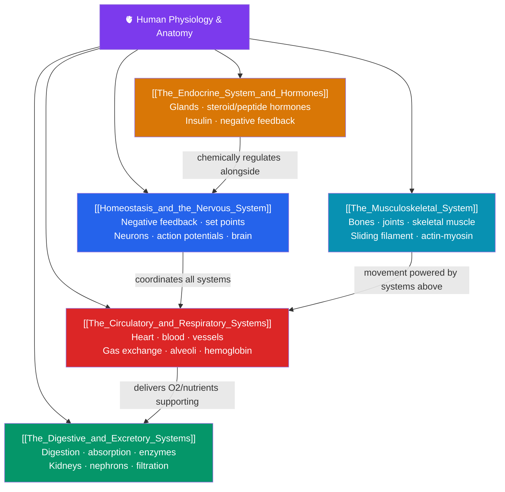

# 🫀 Human Physiology and Anatomy — Map of Content

> [!abstract] What This Section Covers
> The human body is a federation of organ systems held in dynamic balance. This section is organized around **homeostasis and the nervous system** — the negative-feedback loops that keep internal conditions stable, and the neurons, action potentials, and brain regions that sense and coordinate. It then works through the major systems: **circulatory and respiratory** (the heart, blood, blood vessels, and gas exchange in the lungs), **digestive and excretory** (breaking down food and filtering blood via the kidneys), **the endocrine system** (hormones and long-range chemical signaling), and **the musculoskeletal system** (bones, joints, and the sliding-filament basis of muscle contraction). The recurring theme is integration: how independent systems communicate to maintain the stable internal environment life requires.

## Concept Map

## Learning Path

1. [[Homeostasis_and_the_Nervous_System]] — Set points and negative/positive feedback, the structure of neurons, resting and action potentials, synaptic transmission, and an overview of the central and peripheral nervous systems.
2. [[The_Circulatory_and_Respiratory_Systems]] — The heart and cardiac cycle, blood composition, arteries/veins/capillaries, the mechanics of breathing, and gas exchange with hemoglobin.
3. [[The_Digestive_and_Excretory_Systems]] — Mechanical and chemical digestion, absorption in the small intestine, and how the nephron filters blood to form urine.
4. [[The_Endocrine_System_and_Hormones]] — Endocrine glands, steroid vs. peptide hormone signaling, key hormones like insulin and glucagon, and hormonal feedback loops.
5. [[The_Musculoskeletal_System]] — Bone structure and joints, skeletal muscle organization, and the sliding-filament mechanism of actin-myosin contraction.

## All Notes at a Glance

| Note | Difficulty | What You'll Learn |
|------|------------|-------------------|
| [[Homeostasis_and_the_Nervous_System]] | Intermediate | Feedback loops, neuron structure, action potentials, synapses, neurotransmitters, CNS/PNS, brain regions |
| [[The_Circulatory_and_Respiratory_Systems]] | Intermediate | Heart anatomy, cardiac cycle, blood, blood pressure, lungs, ventilation, gas exchange, hemoglobin |
| [[The_Digestive_and_Excretory_Systems]] | Intermediate | GI tract, enzymes, absorption, liver, kidney anatomy, nephron, filtration, osmoregulation |
| [[The_Endocrine_System_and_Hormones]] | Intermediate | Hypothalamus-pituitary axis, thyroid, adrenal, pancreas, hormone types, receptors, feedback |
| [[The_Musculoskeletal_System]] | Intermediate | Bone tissue, joints, muscle types, sarcomere, sliding-filament theory, motor units |

## Key Questions This Section Answers

- How does the body keep temperature, blood sugar, and pH nearly constant despite a changing environment?
- How does an electrical signal travel down a neuron and jump to the next cell?
- How do the lungs and heart cooperate to get oxygen to every cell?
- What is the difference between how steroid and peptide hormones act on a cell?
- What actually happens inside a muscle when it contracts?

## Related Sections

- [[_MOC_Biology_Master|↑ Biology Master MOC]]
- [[_MOC_Ecology|← Ecology]]
- [[_MOC_Plant_Biology|→ Plant Biology]]
- Cross-vault: [[_MOC_Psychology_Master]] — the nervous system as the substrate of mind

#MOC #Biology #HumanPhysiology
