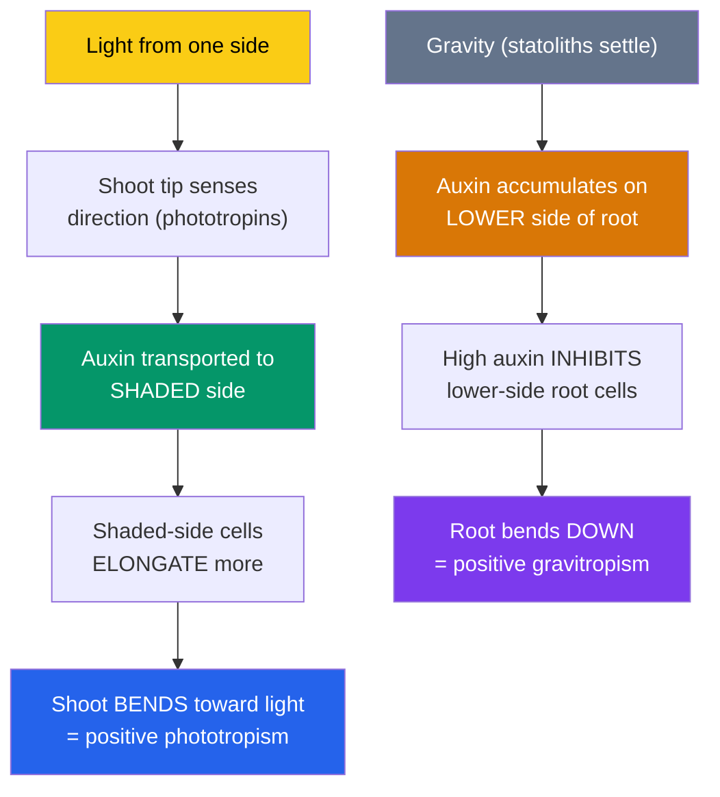

# 🌿 Plant Growth and Hormones

> [!abstract] TL;DR
> A plant can't move, but it can **grow in a direction** — and hormones are how it decides which way. Five classic **plant hormones** run the show: **auxin** (elongation, apical dominance, tropisms, the master coordinator), **gibberellins** (stem elongation, germination), **cytokinins** (cell division, delaying aging), **abscisic acid / ABA** (dormancy, stomatal closure, stress "stop" signal), and **ethylene** (a gas — fruit ripening, aging, stress responses). Directional growth responses to environmental cues are **tropisms**: bending toward light (**phototropism**), orienting to gravity (**gravitropism**), and responding to touch (**thigmotropism**) — mostly orchestrated by auxin redistribution. Separately, the pigment **phytochrome** lets plants read day-length (**photoperiodism**) and light quality, timing flowering and germination. Hormones almost always act in **ratios and combinations**, not alone.

## Intuition — analogy first

A plant hormone system is like **a country with no central government — just chemical memos passed between departments**.

An animal has a brain that issues commands down nerves. A plant has neither brain nor nerves, yet it makes coordinated, whole-body decisions: grow toward the light, drop your leaves before winter, ripen now, sleep through the drought. It does this the way a large decentralized organization does — by circulating **memos** (hormones) that each department (tissue) reads and reacts to according to its own local situation. The *same* memo means different things in different offices: auxin says "elongate" to a stem cell but "don't grow" to a root cell at the same concentration.

Crucially, decisions come from **ratios of memos**, not single ones. Whether a cutting grows roots or shoots depends on the auxin-to-cytokinin *balance*, the way a recipe depends on the ratio of ingredients, not any one alone. And because a plant is rooted, its most important skill is **turning growth into movement**: it can't walk to the sun, so it *bends* toward it — and that bend is just cells on the shady side being told, by an auxin memo, to grow longer than cells on the sunny side.

---

## How It Works — Auxin Redistribution Drives a Tropism

## Key Concepts / Details

### The Five Classic Hormones

Plant hormones (**phytohormones**) are signaling molecules active at tiny concentrations, often produced in one tissue and acting in another. Their effects are **concentration-dependent** and **context-dependent**.

| Hormone | Signature roles | Everyday example |
|---|---|---|
| **Auxin** (IAA) | Cell **elongation**, apical dominance, tropisms, root initiation, vascular differentiation, fruit development | Bending toward light; rooting powder for cuttings |
| **Gibberellins** (GA) | Stem/internode **elongation**, seed **germination**, bolting, breaks seed dormancy | "Bolting" of lettuce; larger seedless grapes |
| **Cytokinins** | **Cell division**, shoot formation, **delay leaf aging** (senescence), counteract apical dominance | Keeping cut flowers/leaves green; tissue culture |
| **Abscisic acid (ABA)** | **Stress "stop" signal** — seed/bud **dormancy**, **closes stomata** under drought | Stomata shutting in a wilting plant |
| **Ethylene** (a gas) | **Fruit ripening**, senescence, leaf/fruit **abscission** (drop), triple response to obstacles | One bad apple ripening the whole bag |

A few newer additions (brassinosteroids, jasmonates, salicylic acid, strigolactones) handle steroid-like growth, wound/defense signaling, and branching, but the five above are the core.

### Auxin — the Master Coordinator

**Auxin** (chiefly indole-3-acetic acid, IAA) is the most influential hormone. It's produced mainly in shoot tips and young leaves and moves in a distinctive **polar (one-directional) transport** — cell to cell, shoot-tip toward root-tip — via PIN efflux carriers. Its jobs:

- **Cell elongation** via the **acid-growth hypothesis**: auxin triggers proton pumping into the cell wall, activating enzymes (expansins) that loosen it so turgor can stretch the cell.
- **Apical dominance** (below).
- **Tropisms** — asymmetric auxin distribution causes differential elongation and bending.
- **Root formation** — high auxin promotes adventitious roots (the basis of commercial rooting hormone).

### Apical Dominance

The **terminal bud** suppresses the growth of **axillary (side) buds** below it, so plants tend to grow upward before branching out. **Auxin** flowing down from the apical tip enforces this dominance (partly by promoting the branching-inhibitor strigolactone and suppressing cytokinin). **Cytokinins** promote lateral bud outgrowth. The practical consequence: **pinch off the terminal bud (pruning)** and you remove the auxin source, releasing side buds → a bushier plant. Gardeners exploit this constantly.

### Tropisms — Directional Growth Responses

A **tropism** is growth *toward or away from* a directional stimulus (contrast with a non-directional **nastic** movement like a flower opening in warmth). Positive = toward; negative = away.

- **Phototropism** — growth relative to light. Shoots are **positively** phototropic: blue-light receptors (**phototropins**) in the tip sense the light direction; auxin is redistributed to the **shaded** side; those cells elongate more; the shoot bends toward the light. This is the classic **Darwin (1880) → Boysen-Jensen → Went** line of experiments that discovered auxin.
- **Gravitropism** — growth relative to gravity. Roots are **positively** gravitropic (grow down); shoots **negatively** (grow up). Dense starch-filled organelles called **statoliths (amyloplasts)** settle to the bottom of gravity-sensing cells, cueing auxin to accumulate on the lower side. In shoots that lower-side auxin *promotes* elongation (bends up); in roots the higher auxin *inhibits* the lower side (bends down) — same signal, opposite tissue response.
- **Thigmotropism** — growth in response to **touch/contact**. Tendrils of climbing plants coil around a support they contact; roots grow around obstacles. (The Venus flytrap's snap and a *Mimosa*'s leaf-folding are fast **thigmonastic** movements, not tropisms.)

### Phytochrome and Photoperiodism

Plants don't just sense light *direction* — they sense its **color and timing** through the pigment **phytochrome**, which flips between two forms: **Pr** (absorbs red, ~660 nm) and **Pfr** (absorbs far-red, ~730 nm). Red light converts Pr → Pfr (the biologically active form); far-red or darkness reverts it. This red/far-red switch lets plants:

- Detect **shade** (canopy leaves absorb red, enriching far-red → tells a seedling it's being shaded, triggering the **shade-avoidance** stretch).
- Time **germination** (many seeds need a flash of red light).
- Measure **day length** for **photoperiodism** — the seasonal timing of flowering. Plants are classed as **short-day** (flower when night length exceeds a critical value — chrysanthemums, poinsettias), **long-day** (flower with short nights — spinach, lettuce), or **day-neutral**. Experiments show it's actually the **length of continuous darkness** that matters: a brief flash of light in the middle of the night can prevent a short-day plant from flowering. The signal is perceived in leaves and relayed to buds by a mobile "florigen" protein (**FT**). See [[Plant_Reproduction]].

### Hormones Work in Ratios

Almost no plant response is controlled by one hormone alone.

| Balance | Outcome |
|---|---|
| High **auxin : cytokinin** | Root formation (in tissue culture / cuttings) |
| High **cytokinin : auxin** | Shoot/bud formation |
| High **gibberellin : ABA** | Seed germination, active growth |
| High **ABA : gibberellin** | Seed/bud dormancy, stress arrest |

This is why the same hormone can promote growth in one organ and inhibit it in another, and why applied plant-growth regulators must get the *combination* right.

## Real-World Notes

- **Rooting hormone**: synthetic auxins (IBA, NAA) dusted on cut stems trigger adventitious roots — how gardeners and nurseries clone plants from cuttings.
- **Ethylene & the fruit trade**: bananas and tomatoes are shipped unripe and gassed with **ethylene** to ripen on arrival; conversely, ripening is *slowed* by ventilating away ethylene and storing produce cool. "One bad apple spoils the barrel" is literal ethylene chemistry.
- **Herbicides**: synthetic auxins like **2,4-D** kill broadleaf (eudicot) weeds by forcing lethal, uncontrolled growth while leaving narrow-leaf monocot crops (lawns, cereals) largely unharmed.
- **Gibberellins in industry**: sprayed on grapes to enlarge fruit and loosen clusters; used to malt barley for brewing (GA triggers the enzymes that break down starch).
- **Poinsettias at Christmas**: growers manipulate **photoperiod** (long uninterrupted nights) to force these short-day plants to color up on schedule.
- **Seedless produce**: auxin/gibberellin treatments can drive fruit development without fertilization (parthenocarpy).

## Common Pitfalls / Misconceptions

- **"Plants bend toward light because the light pulls or attracts them."** No physical pull — the **shaded** side simply grows *faster* (more auxin there), tipping the shoot toward the light.
- **"Hormones have fixed effects."** Effects depend on **concentration, tissue, and the ratio to other hormones** — auxin promotes shoot elongation but inhibits root elongation at the same dose.
- **"Roots grow down and shoots grow up because roots are heavier / seek water."** The primary cue is **gravity sensed via statoliths**, redistributing auxin — it works even in a seed planted upside-down in the dark.
- **"Short-day plants need short days."** They actually need a long enough **continuous dark period**; a light flash mid-night blocks flowering. The names are historical and slightly misleading.
- **"Ethylene is a growth booster."** It's largely an **aging/ripening/stress** signal — it can trigger leaf drop, senescence, and fruit softening, not vigorous growth.

## Related Concepts

- [[_MOC_Plant_Biology|↑ Section MOC]]
- [[Plant_Structure_and_Tissues]] — Meristems and cells whose division and elongation these hormones control
- [[Transport_in_Plants]] — ABA's role in closing stomata under drought
- [[Plant_Reproduction]] — Photoperiodism, phytochrome, and florigen timing the switch to flowering
- [[Plant_Nutrition_and_Soil]] — Nutrient status modulating growth and hormone signaling
- Cross-vault: [[Gene_Regulation]] — How hormone signals ultimately switch genes on and off
- Cross-vault: [[The_Cell_Membrane_and_Transport]] — Proton pumping and turgor behind auxin's acid-growth mechanism

## Review Questions

1. Describe, step by step, how a shoot bends toward a light source coming from its left. Name the receptor, the hormone, which side of the shoot elongates, and cite the historical experiment (Darwin → Went) that revealed the mechanism.
2. Explain apical dominance in terms of auxin and cytokinin, and use it to justify why pinching off a plant's growing tip produces a bushier plant.
3. Roots and shoots both use auxin redistribution for gravitropism, yet a root bends *down* and a shoot bends *up* in response to the same gravity cue. Resolve this apparent contradiction, and explain the role of statoliths.

## Sources

- Taiz, L., Zeiger, E., Møller, I.M. & Murphy, A. (2015). *Plant Physiology and Development*, 6th ed., Ch. 15–20. Sinauer
- Urry, L.A. et al. (2020). *Campbell Biology*, 12th ed., Ch. 39 (Plant Responses to Internal and External Signals). Pearson
- Davies, P.J. (ed.) (2010). *Plant Hormones: Biosynthesis, Signal Transduction, Action!*, 3rd ed. Springer
- Went, F.W. & Thimann, K.V. (1937). *Phytohormones*. Macmillan (foundational auxin work)

#biology #plant-biology #hormones #auxin #tropisms #photoperiodism #signaling
