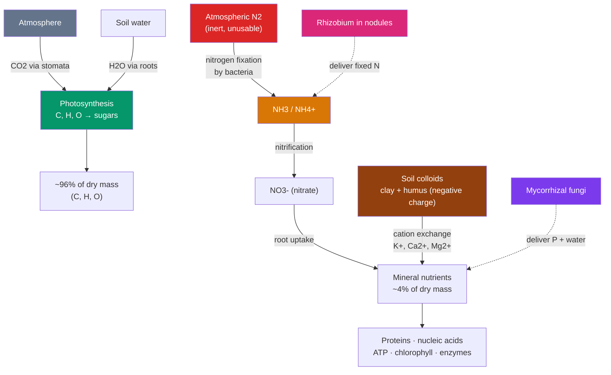

# 🪱 Plant Nutrition and Soil

> [!abstract] TL;DR
> Plants build their bodies mostly from **air and water** (C, H, O from CO₂ and H₂O), but they need **14 essential mineral elements** from the soil to function. Six **macronutrients** (N, P, K, Ca, Mg, S) are needed in bulk; eight **micronutrients** (Fe, Mn, Zn, Cu, B, Mo, Cl, Ni) in traces. **Nitrogen** is usually the growth-limiting nutrient because the atmosphere's abundant N₂ is chemically inert — only lightning, industrial fixation, and **nitrogen-fixing bacteria** (like *Rhizobium* in legume root nodules) can crack the triple bond. Soil supplies these ions, held on negatively charged clay/humus surfaces and traded by **cation exchange**. Two great symbioses supercharge uptake: **mycorrhizal fungi** extend the root's reach for phosphorus and water, and N-fixing bacteria hand over usable nitrogen. Where soil fails — bogs, host tissue — plants turn **carnivorous** or **parasitic**.

## Intuition — analogy first

A plant's diet is like **baking bread from air, with a pinch of expensive spices from the pantry**.

The flour — the overwhelming bulk of the loaf — is made from ingredients the plant pulls out of thin air and water: carbon from CO₂, hydrogen and oxygen from H₂O, assembled by photosynthesis. That's why a tree can gain a ton of mass while the soil in its pot barely lightens: most of a plant is "baked air."

But you can't make bread from flour alone. You need small, specific amounts of yeast, salt, and spices — and if even one is missing, the loaf fails. Those are the **mineral nutrients**: nitrogen for proteins and DNA, phosphorus for energy and membranes, potassium for the plant's electrical and osmotic housekeeping, plus a shelf of trace metals that each enzyme demands. The catch is that the single most-needed spice, **nitrogen**, is bizarrely hard to get: the air is 78% nitrogen gas, yet plants can't touch it — like standing in a locked pantry stocked with a spice no one has the key for. The "key" belongs to certain bacteria, and much of plant nutrition is the story of plants recruiting those bacteria (and helpful fungi) as partners.

---

## How It Works — Where a Plant's Atoms Come From

## Key Concepts / Details

### What Counts as an Essential Element

An element is **essential** if the plant cannot complete its life cycle without it, it can't be substituted, and it plays a direct role in metabolism. About **96% of a plant's dry mass is just C, H, and O** — pulled from CO₂ and water, not "soil food." The remaining ~4% is the mineral nutrients, split by required quantity:

| Class | Elements | Rough amount needed | Representative roles |
|---|---|---|---|
| **Macronutrients** | **N, P, K**, Ca, Mg, S | grams per plant | N: amino acids, nucleic acids, chlorophyll · P: ATP, DNA, membranes · K: osmosis, stomata, enzyme cofactor |
| **Micronutrients** | Fe, Mn, Zn, Cu, B, Mo, Cl, Ni | milligrams / traces | Fe: chlorophyll synthesis, electron transport · Mo & Cl: enzymes · Mn: photosynthesis water-splitting |

The commercial shorthand **N-P-K** on fertilizer bags names the three most commonly limiting macronutrients (nitrogen, phosphorus, potassium).

**Deficiency symptoms are diagnostic.** Mobile nutrients (N, P, K, Mg) are relocated from old leaves to new growth, so deficiency shows first in **older leaves** (e.g., nitrogen deficiency = general yellowing/**chlorosis** of lower leaves). Immobile nutrients (Fe, Ca, B) can't be moved, so their deficiency shows first in **young leaves** (e.g., iron chlorosis between the veins of new growth).

### Soil — the Nutrient Reservoir

Soil is a structured mix of mineral particles (sand > silt > clay, by size), decomposed organic matter (**humus**), water, air, and a teeming community of organisms. Its properties for nutrition:

- **Texture** (sand/silt/clay ratio) sets drainage and water-holding; **loam** (a balanced mix) is agriculturally ideal.
- **Cation exchange capacity (CEC)**: clay and humus surfaces carry **negative charges**, so they electrostatically hold positively charged nutrient cations (K⁺, Ca²⁺, Mg²⁺, NH₄⁺) against being washed away. Roots release **H⁺** (and CO₂ forming carbonic acid) to displace and take up these cations — **cation exchange**. Negatively charged ions like nitrate (NO₃⁻) are *not* held and leach easily, which is why nitrogen runoff pollutes waterways.
- **pH** governs availability: most nutrients are most available near pH 6–7; acidic soils free up (and can make toxic) aluminum and manganese, while alkaline soils lock up iron and phosphorus.

### Nitrogen — the Limiting Nutrient

Nitrogen is needed in the largest amounts of any mineral and is usually what limits plant growth. The paradox: air is **78% N₂**, but the N≡N triple bond is so strong that plants (and animals) cannot use N₂ directly. Nitrogen must first be **fixed** into ammonia (NH₃/NH₄⁺):

- **Biological nitrogen fixation** — bacteria using the enzyme **nitrogenase** reduce N₂ to NH₃. This is the dominant natural source. (See [[Biogeochemical_Cycles]] for the full nitrogen cycle.)
- **Lightning** fixes a small amount abiotically.
- **Industrial (Haber-Bosch)** fixation makes synthetic fertilizer — a process that now supports roughly half the human population's food supply, at large energy and pollution cost.

Once ammonium is in soil, **nitrifying bacteria** oxidize it to **nitrate (NO₃⁻)**, the form most plants absorb most; inside the plant it's reduced back to ammonium and built into amino acids.

### Symbiosis I — Nitrogen-Fixing Bacteria and *Rhizobium*

**Legumes** (beans, peas, clover, soybeans, alfalfa) form an intimate partnership with soil bacteria of the genus ***Rhizobium*** (and relatives). The plant and bacteria exchange chemical signals; the root grows a **nodule** — a specialized organ — that houses the bacteria as **bacteroids**. Inside:

- The bacteria run **nitrogenase** and hand fixed nitrogen (as ammonia) to the plant.
- The plant supplies sugars (energy) and, crucially, **leghemoglobin** — a red, oxygen-binding protein that keeps free O₂ away from nitrogenase, which is destroyed by oxygen.

This is why legumes enrich soil and are prized in **crop rotation** and as green manure — they bring their own nitrogen supply. Some non-legumes (e.g., alder) partner with the actinobacterium *Frankia* for the same benefit.

### Symbiosis II — Mycorrhizae

**Mycorrhizae** ("fungus-roots") are symbioses between plant roots and fungi that occur in the vast majority (~80–90%) of land plants — an ancient partnership dating to plants' first colonization of land. The fungal **hyphae** are far thinner than root hairs and extend the root's absorptive network enormously, especially for the poorly mobile ion **phosphate**, plus water and other minerals. In return the fungus receives sugars.

| Type | Structure | Typical hosts |
|---|---|---|
| **Arbuscular (endo-) mycorrhizae** | Fungi penetrate root cells, forming branched **arbuscules** for exchange | ~80% of plants: grasses, crops, most herbs |
| **Ectomycorrhizae** | Fungi sheathe the root and grow *between* cells (Hartig net); don't penetrate | Many trees: pines, oaks, birches |

Mycorrhizal networks can even link neighboring plants belowground (the "wood-wide web"), moving carbon and signals between individuals.

### When Soil Isn't Enough — Carnivorous and Parasitic Plants

Some plants evolved alternatives where soil nutrients are scarce or where they can steal:

- **Carnivorous plants** (Venus flytrap, pitcher plants, sundews, bladderworts) grow in nutrient-poor (often nitrogen-poor, boggy) soils. They still photosynthesize for carbon, but **trap and digest animals — mainly insects — to obtain nitrogen and phosphorus**. Their "leaves" are modified into snap-traps, sticky flypaper, or pitfall pitchers, and they secrete digestive enzymes.
- **Parasitic plants** tap other plants directly via modified roots called **haustoria** that penetrate the host's vascular tissue. **Hemiparasites** (like mistletoe) still photosynthesize but steal water and minerals; **holoparasites** (like dodder, *Cuscuta*, and *Rafflesia*) have lost photosynthesis entirely and steal sugars too, often lacking chlorophyll and leaves.

## Real-World Notes

- **Crop rotation** with legumes (e.g., alternating corn with soybeans or clover) restores soil nitrogen naturally, cutting fertilizer needs — a practice centuries old, now explained by *Rhizobium*.
- **Fertilizer runoff & eutrophication**: because nitrate leaches freely, excess N and P fertilizer washes into rivers and coasts, triggering algal blooms and oxygen-dead zones — a nutrient success indoors becoming a pollution problem outdoors.
- **Hydroponics** proves the point that "soil" per se isn't essential — plants grow fine in water with the right dissolved mineral ions; soil is just the usual *delivery system*.
- **Iron chlorosis** in alkaline-soil gardens (yellow young leaves with green veins) is a classic immobile-micronutrient deficiency, treated with acidifiers or chelated iron.
- **Reforestation** often fails without the right mycorrhizal fungi in the soil; nurseries increasingly inoculate seedlings with fungal partners.

## Common Pitfalls / Misconceptions

- **"Plants eat soil / get their mass from the ground."** ~96% of dry mass is C, H, O from **air and water**. Van Helmont's 17th-century willow experiment showed a tree gained ~74 kg while the soil lost only grams.
- **"Plants can use nitrogen from the air."** No — atmospheric **N₂ is inert**; plants depend on bacteria (or fertilizer) to fix it first.
- **"Fertilizer is plant food."** Fertilizer supplies *minerals*, not energy or carbon; the plant makes its own food (sugar) by photosynthesis. Over-fertilizing can even harm plants (salt stress, root burn).
- **"Carnivorous plants eat insects for energy."** They photosynthesize for carbon/energy like any plant; prey supply scarce **nitrogen and phosphorus**, not calories.
- **"More nitrogen is always better."** Excess N drives lush foliage at the expense of roots, flowers, and fruit, and pollutes waterways; nutrient balance matters.

## Related Concepts

- [[_MOC_Plant_Biology|↑ Section MOC]]
- [[Transport_in_Plants]] — How absorbed minerals are selected at the endodermis and carried up in the transpiration stream
- [[Plant_Structure_and_Tissues]] — Root hairs, nodules, and the root anatomy where uptake happens
- [[Plant_Growth_and_Hormones]] — Nutrient status feeds back on growth and signaling
- Cross-vault: [[Biogeochemical_Cycles]] — The full nitrogen and phosphorus cycles that soil nutrition plugs into
- Cross-vault: [[Ecosystems_and_Energy_Flow]] — Plants as primary producers whose nutrient limits shape whole ecosystems
- Cross-vault: [[Photosynthesis]] — The source of the ~96% of plant mass that comes from air and water

## Review Questions

1. A student insists that most of a tree's mass comes from the soil it grows in. Refute this with the correct source of the bulk of plant dry mass, and cite the classic experiment (or reasoning) that establishes it. Then explain what the soil *does* provide.
2. Explain why nitrogen is usually the limiting nutrient despite being the most abundant gas in the atmosphere. In your answer, describe the role of nitrogenase, *Rhizobium*, root nodules, and leghemoglobin.
3. Compare mycorrhizae and *Rhizobium* symbioses: what does the plant gain from each, what does the partner gain, and which nutrient is each partnership most associated with delivering? Then explain how carnivorous plants solve the *same* underlying nutrient problem differently.

## Sources

- Taiz, L., Zeiger, E., Møller, I.M. & Murphy, A. (2015). *Plant Physiology and Development*, 6th ed., Ch. 5, 13. Sinauer
- Urry, L.A. et al. (2020). *Campbell Biology*, 12th ed., Ch. 37 (Soil and Plant Nutrition). Pearson
- Marschner, P. (ed.) (2012). *Marschner's Mineral Nutrition of Higher Plants*, 3rd ed. Academic Press
- Smith, S.E. & Read, D.J. (2008). *Mycorrhizal Symbiosis*, 3rd ed. Academic Press

#biology #plant-biology #nutrition #soil #nitrogen-fixation #mycorrhizae #symbiosis
