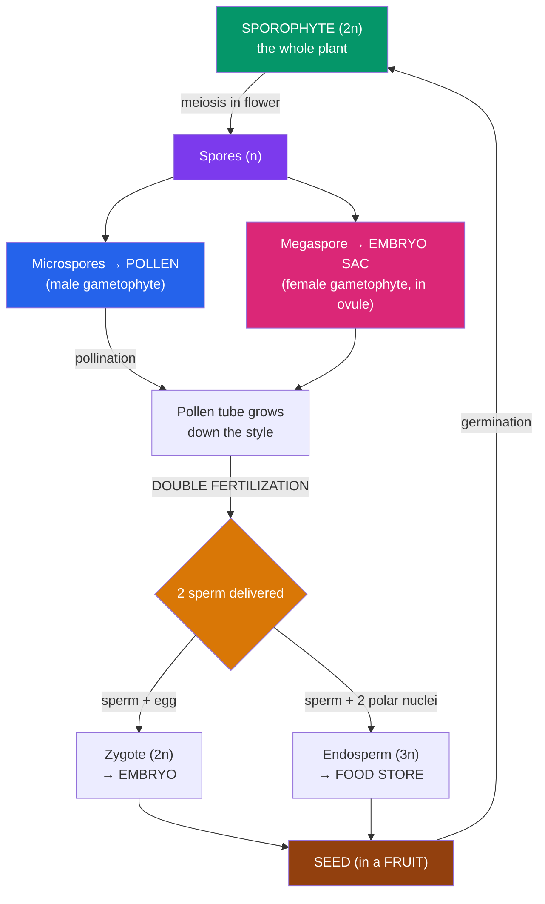

# 🌸 Plant Reproduction

> [!abstract] TL;DR
> Every plant life cycle swings between two multicellular generations — the **alternation of generations**: a diploid **sporophyte** that makes haploid spores by meiosis, and a haploid **gametophyte** that makes gametes by mitosis. Over evolution the gametophyte shrank from dominant (mosses) to microscopic and dependent (flowering plants). In **angiosperms**, the flower is the reproductive organ: **sepals, petals, stamens** (male — pollen), and **carpels/pistil** (female — ovules). **Pollination** delivers pollen to the stigma; a pollen tube then drives **double fertilization** — a hallmark of flowering plants — where one sperm makes the diploid **zygote (embryo)** and a second makes the triploid **endosperm** (the seed's food). The ovule becomes a **seed**; the ovary becomes a **fruit** that aids **seed dispersal**. Plants also reproduce **asexually** (runners, tubers, cuttings), cloning themselves without seeds.

## Intuition — analogy first

A plant's life cycle is like **a relay race run by two very different runners who take turns carrying the baton**.

In animals, only one "runner" is multicellular — you, the diploid body — and gametes (sperm, egg) are just single cells you hand off. Plants are stranger: they alternate between **two complete multicellular organisms**, one diploid (the **sporophyte**) and one haploid (the **gametophyte**), each producing the other. It's as if humans alternated each generation between an adult body and a separate multicellular "gamete-plant."

Over plant evolution the two runners changed size. In mosses, the haploid gametophyte is the big green plant you see and the sporophyte is a little stalk riding on it. By the time you reach a flowering plant, the ratio has completely flipped: the **sporophyte** is the whole tree, and the **gametophyte** has shrunk to a handful of cells hidden inside a flower — a pollen grain and a tiny sac in the ovule. The flower, then, isn't the "plant having sex" so much as the **stadium where the two tiny gametophyte runners are grown, sheltered, and introduced** — with pollinators hired as couriers because a rooted plant can't deliver its own pollen.

---

## How It Works — The Angiosperm Life Cycle

## Key Concepts / Details

### Alternation of Generations

All land plants alternate between two multicellular generations (contrast with animals, where meiosis makes gametes directly):

- **Sporophyte (2n)** — the diploid generation; produces haploid **spores** by **meiosis** (see [[Meiosis_and_Genetic_Variation]]).
- **Gametophyte (n)** — the haploid generation; grows from a spore by mitosis and produces **gametes** (sperm, egg) by **mitosis** (not meiosis — they're already haploid).
- Gametes fuse (**fertilization**) → diploid **zygote** → grows into the next sporophyte. The cycle closes.

The evolutionary trend across plant groups is a **shrinking, increasingly dependent gametophyte**:

| Group | Dominant generation | Gametophyte |
|---|---|---|
| **Mosses** (bryophytes) | **Gametophyte** (the green carpet) | Large, free-living; sporophyte depends on it |
| **Ferns** (seedless vascular) | **Sporophyte** (the leafy fern) | Small but free-living (the heart-shaped prothallus) |
| **Gymnosperms** (conifers) | Sporophyte (the tree) | Microscopic, retained in cones |
| **Angiosperms** (flowering) | Sporophyte (the plant) | **Reduced to a few cells** inside the flower |

Reduction of the gametophyte, plus the **seed** and (in angiosperms) the **flower and fruit**, were the great innovations freeing plants from needing external water for fertilization.

### Flower Structure

A flower is a modified shoot bearing four whorls of modified leaves, attached to a **receptacle**. From outside in:

- **Sepals** (collectively the **calyx**) — usually green, protect the bud.
- **Petals** (collectively the **corolla**) — often colored/scented to attract pollinators.
- **Stamens** — the **male** parts: an **anther** (makes pollen) on a stalk (**filament**).
- **Carpels** (one or more, together the **pistil**) — the **female** part: a sticky **stigma** to catch pollen, a **style** (the stalk), and an **ovary** at the base containing one or more **ovules** (each holding the female gametophyte, the embryo sac).

A **complete** flower has all four whorls; **incomplete** flowers lack one or more. A **perfect** flower has both stamens and carpels; **imperfect** flowers are unisexual. Species may be **monoecious** (both sexes on one plant) or **dioecious** (separate male and female plants, e.g., holly, willow).

### Pollination

**Pollination** is the transfer of pollen from anther to stigma — note this is *not* the same as fertilization; it's the delivery step that precedes it.

- **Self-pollination** — pollen lands on a stigma of the same (or genetically identical) plant; guarantees reproduction but reduces genetic variation. Many plants have **self-incompatibility** systems to prevent it.
- **Cross-pollination** — pollen moves between different plants, promoting variation. Vectors include **wind** (grasses, many trees — copious, light, dry pollen; think hay fever), **water** (a few aquatics), and **animals** (insects, birds, bats — the flower's color, scent, shape, and nectar are advertisements/rewards). Flower and pollinator often show tight **coevolution** (long nectar spurs matched to long tongues).

### Double Fertilization — the Angiosperm Signature

Once a compatible pollen grain lands on the stigma, it germinates a **pollen tube** that grows down the style to the ovule, carrying **two sperm cells**. Then the defining event of flowering plants occurs — **double fertilization**:

1. One sperm fuses with the **egg** → diploid (2n) **zygote** → develops into the **embryo**.
2. The other sperm fuses with **two polar nuclei** in the central cell → triploid (3n) **endosperm** → the seed's **nutritive tissue**.

The genius of this is **economy**: the plant only invests in building food-rich endosperm *after* fertilization succeeds, rather than pre-stocking every ovule. Endosperm is also agriculturally central — the starchy endosperm of wheat, rice, and corn feeds much of humanity.

### Seeds and Fruits

After double fertilization:
- The **ovule** matures into a **seed** — a dormant **embryo** plus stored food (endosperm and/or **cotyledons**) wrapped in a protective **seed coat**. Seeds allow the embryo to survive dormancy and travel.
- The **ovary** (and sometimes accessory tissue) matures into a **fruit** — a structure that protects the seeds and promotes their dispersal. (A **fruit** is botanically any mature ovary, so tomatoes, cucumbers, and grains are fruits.)

**Germination** resumes when dormancy breaks (right water, temperature, sometimes light — see phytochrome in [[Plant_Growth_and_Hormones]]): the seed imbibes water, the embryonic **radicle** (root) emerges first, then the shoot, and the seedling becomes an independent photosynthetic sporophyte.

### Seed Dispersal

Getting offspring away from the parent reduces competition and colonizes new ground. Fruits and seeds are adapted to different vectors:

| Vector | Adaptation | Example |
|---|---|---|
| **Wind** | Wings, plumes, tiny size | Maple samaras, dandelion parachutes |
| **Animal (external)** | Hooks, burrs, sticky coats | Burdock, cocklebur |
| **Animal (internal)** | Fleshy, tasty fruit; seeds survive gut | Berries, cherries |
| **Water** | Buoyant, waterproof | Coconut |
| **Ballistic (self)** | Explosive pods | Touch-me-not, witch hazel |

### Asexual (Vegetative) Reproduction

Many plants also clone themselves without seeds, producing genetically identical offspring from vegetative parts — fast, reliable, and independent of pollinators, but with no genetic variation (see [[Asexual_and_Sexual_Reproduction]]):

- **Runners/stolons** (strawberry), **rhizomes** (ginger, bamboo), **tubers** (potato "eyes"), **bulbs** (onion), **suckers** (aspen groves that are one giant clone).
- **Fragmentation** — a broken piece regrows a whole plant.
- **Apomixis** — seeds formed without fertilization (dandelions), cloning through a seed.
- Human-assisted: **cuttings, grafting, layering, and tissue culture (micropropagation)** — the basis of orchards (grafted fruit trees are clones of a chosen variety) and the houseplant trade.

## Real-World Notes

- **Agriculture depends on pollinators**: roughly a third of crop production relies on animal pollination (bees especially); pollinator declines threaten food supply, and orchards sometimes rent hives or hand-pollinate (e.g., vanilla).
- **Endosperm feeds the world**: the starchy endosperm of cereal grains (wheat, rice, maize) is the caloric base of human diets — a direct product of double fertilization.
- **Grafting** joins a chosen **scion** (fruit variety) onto a hardy **rootstock**; nearly all apple, grape, and citrus orchards are clonal grafts, so a "Honeycrisp" everywhere is genetically one tree.
- **Seedless fruits** (bananas, seedless grapes/watermelon) arise from parthenocarpy or sterility and must be propagated **asexually** — which also makes monoculture clones vulnerable (the near-extinction of the 'Gros Michel' banana to Panama disease).
- **Hay fever** is an unintended consequence of **wind pollination** — plants that broadcast huge clouds of light pollen (grasses, ragweed, many trees) rather than package it for animal couriers.

## Common Pitfalls / Misconceptions

- **"Pollination and fertilization are the same thing."** Pollination is pollen *delivery* to the stigma; **fertilization** is the later fusion of sperm and egg after the pollen tube grows down. Pollination can happen without successful fertilization.
- **"Flowers are for us / for beauty."** Petal color and scent are **advertisements to pollinators**; the flower is a reproductive organ, and its aesthetics are evolutionary marketing.
- **"A fruit is a sweet dessert food; vegetables aren't fruits."** Botanically a **fruit is a mature ovary** — tomatoes, peppers, cucumbers, pea pods, and grains all qualify. "Vegetable" is a culinary, not botanical, term.
- **"Gametes are made by meiosis in plants."** In the alternation of generations, **spores** are made by meiosis; **gametes** are made by **mitosis** in the already-haploid gametophyte.
- **"Asexual offspring are a different, weaker plant."** They're **genetically identical clones** — often vigorous, but with zero variation, so a whole clonal population can be wiped out by one adapted pathogen.

## Related Concepts

- [[_MOC_Plant_Biology|↑ Section MOC]]
- [[Plant_Structure_and_Tissues]] — The flower as a modified shoot; the seedling sporophyte's organs
- [[Plant_Growth_and_Hormones]] — Photoperiodism and florigen triggering flowering; hormones in germination and fruit ripening
- [[Plant_Nutrition_and_Soil]] — Nutrient investment in seeds and the germinating seedling
- Cross-vault: [[Meiosis_and_Genetic_Variation]] — Meiosis that produces the spores starting the gametophyte generation
- Cross-vault: [[Asexual_and_Sexual_Reproduction]] — The general trade-offs between cloning and sexual recombination
- Cross-vault: [[Natural_Selection_and_Adaptation]] — Flower–pollinator coevolution and dispersal as adaptations

## Review Questions

1. Define the alternation of generations and identify the sporophyte and gametophyte in a flowering plant. State which generation is dominant in mosses versus angiosperms, and describe the evolutionary trend in gametophyte size and independence.
2. Walk through **double fertilization** from pollen landing on the stigma to seed formation. What two products result, what is the ploidy of each, and why is producing endosperm only after fertilization advantageous to the plant?
3. Contrast sexual and asexual (vegetative) reproduction in plants in terms of genetic variation, speed, and dependence on pollinators. Give one real agricultural example where each strategy is deliberately used, and explain one risk of relying on the asexual route.

## Sources

- Taiz, L., Zeiger, E., Møller, I.M. & Murphy, A. (2015). *Plant Physiology and Development*, 6th ed. Sinauer
- Urry, L.A. et al. (2020). *Campbell Biology*, 12th ed., Ch. 30 & 38 (Seed Plants; Angiosperm Reproduction). Pearson
- Raven, P.H., Evert, R.F. & Eichhorn, S.E. (2013). *Biology of Plants*, 8th ed. W.H. Freeman
- Willmer, P. (2011). *Pollination and Floral Ecology*. Princeton University Press

#biology #plant-biology #reproduction #flowers #pollination #alternation-of-generations #seeds
