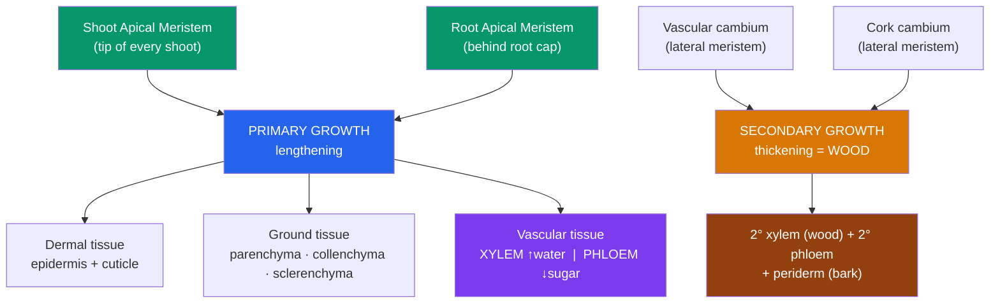

# 🌱 Plant Structure and Tissues

> [!abstract] TL;DR
> A vascular plant is built from two organ systems — the **root system** below ground and the **shoot system** (stems + leaves) above — made from just three tissue systems: **dermal** (the skin), **ground** (the filling, where photosynthesis and storage happen), and **vascular** (the plumbing: **xylem** for water, **phloem** for sugar). Unlike animals, plants grow their whole lives from perpetually embryonic regions called **meristems**. **Apical meristems** at root and shoot tips drive *primary growth* (lengthening); **lateral meristems** (vascular and cork cambium) drive *secondary growth* (thickening, i.e. wood). The two great flowering-plant lineages — **monocots** and **eudicots** — differ predictably in seed leaves, veins, roots, and flower parts.

## Intuition — analogy first

Think of a plant as a **modular building that never stops being under construction**.

An animal is built once, from a blueprint, and then mostly just maintains itself — you don't grow a new arm each spring. A plant is different: it keeps small crews of construction workers (**meristems**) permanently on site at the tips of every root and shoot. Those crews lay down new "floors" (nodes, leaves, branches) for as long as the plant lives. Because a rooted organism can't walk to better light or water, this open-ended, modular growth *is* its strategy for moving — it grows toward opportunity instead of walking to it.

The building has three trades working together: a **weatherproof exterior** (dermal tissue), the **interior rooms** where the actual living and storage happen (ground tissue), and the **utilities running through the walls** (vascular tissue — pipes going up for water, pipes going down for food). Every plant organ, from a root tip to a petal, is just a different arrangement of these same three trades.

---

## How It Works — From Meristem to Mature Organ

## Key Concepts / Details

### The Three Organs of the Plant Body

**Roots** anchor the plant, absorb water and dissolved minerals, and often store carbohydrates (think carrots and beets). Absorption is concentrated in the **root hairs** — thin extensions of epidermal cells just behind the tip that multiply surface area enormously. Two basic architectures exist: a **taproot** system (one dominant vertical root, typical of eudicots) and a **fibrous root** system (a mat of similar-sized roots, typical of monocots and grasses, excellent at holding topsoil).

**Stems** are the scaffolding: they raise leaves into the light and bear the vascular highways connecting roots to leaves. A stem is organized into **nodes** (points where leaves attach) and **internodes** (the gaps between). At each node an **axillary bud** sits in the leaf axil, a dormant meristem that can grow into a branch or flower. The **terminal bud** at the very tip contains the shoot apical meristem.

**Leaves** are the photosynthetic factories. A typical leaf is a flattened **blade** joined to the stem by a **petiole**. Internally it is a sandwich: upper epidermis, a densely packed **palisade mesophyll** (most chloroplasts, most photosynthesis), a loosely packed **spongy mesophyll** (air spaces for gas exchange), and a lower epidermis studded with **stomata** (pores for CO₂ in / water and O₂ out). See [[Transport_in_Plants]] for how stomata gate water loss.

### The Three Tissue Systems

Every organ above is woven from the same three continuous tissue systems.

| Tissue system | Main cell types | Job | Where it dominates |
|---|---|---|---|
| **Dermal** | Epidermis (+ waxy **cuticle**); **periderm**/cork in woody parts | Protection, waterproofing, gas exchange via stomata | Outer surface of every organ |
| **Ground** | **Parenchyma**, **collenchyma**, **sclerenchyma** | Photosynthesis, storage, support | The bulk of leaves, cortex, pith |
| **Vascular** | **Xylem** (tracheids, vessel elements) + **phloem** (sieve-tube elements, companion cells) | Long-distance transport | Veins, vascular bundles, stele |

The three **ground-tissue cell types** are worth distinguishing:
- **Parenchyma** — thin-walled, living, versatile "generalist" cells; sites of photosynthesis and storage; retain the ability to divide (important for wound repair and cloning).
- **Collenchyma** — unevenly thickened but still flexible walls; the "flexible support" of young stems and petioles (the strings in celery).
- **Sclerenchyma** — thick, **lignified**, usually dead-at-maturity cells providing rigid support; includes **fibers** (hemp, flax) and **sclereids** (the grit in pear flesh).

### Xylem and Phloem — the Vascular Plumbing

**Xylem** conducts water and minerals *upward* from root to shoot. Its conducting cells — **tracheids** (all vascular plants) and the wider **vessel elements** (mainly angiosperms) — are **dead at maturity**, leaving hollow, lignin-reinforced pipes. Because they're dead, xylem transport needs no metabolic energy at the pipe — it's driven by evaporation from the leaves (see cohesion-tension in [[Transport_in_Plants]]).

**Phloem** conducts sugars (mostly sucrose) from **sources** (leaves) to **sinks** (roots, fruits, buds). Its conducting **sieve-tube elements** are *alive* but streamlined — they've shed their nucleus and most organelles — so each is kept running by an attached **companion cell** that provides the metabolic support and loads sugar in.

### Meristems — Why Plants Grow Forever

A **meristem** is a region of perpetually undifferentiated, dividing cells — the plant equivalent of stem cells (see [[Stem_Cells_and_Differentiation]]). This **indeterminate growth** is why a tree can keep getting taller for centuries.

- **Apical meristems** sit at the tips of roots and shoots and drive **primary growth** — increase in *length*. They generate the three primary tissue systems above.
- **Lateral meristems** are cylinders running the length of woody stems and roots and drive **secondary growth** — increase in *girth*:
  - The **vascular cambium** adds **secondary xylem (wood)** to its inside and **secondary phloem** to its outside. Years of wood = tree rings.
  - The **cork cambium** produces the tough, waterproof **periderm** (the functional bark) that replaces the epidermis on thickening stems.

### Primary vs Secondary Growth

| | Primary growth | Secondary growth |
|---|---|---|
| **Driven by** | Apical meristems | Lateral meristems (cambia) |
| **Result** | Lengthening (roots deeper, shoots taller) | Thickening (wood + bark) |
| **In which plants** | All vascular plants | Woody plants; most eudicots, few monocots |
| **Key product** | Primary xylem/phloem, epidermis | Secondary xylem (wood), periderm (bark) |

### Monocots vs Eudicots

The angiosperms split into two great groups whose anatomy differs in a memorable, correlated set of traits.

| Trait | **Monocots** (grasses, lilies, palms) | **Eudicots** (beans, oaks, sunflowers) |
|---|---|---|
| Cotyledons (seed leaves) | **One** | **Two** |
| Leaf venation | **Parallel** | **Netted / reticulate** |
| Vascular bundles in stem | **Scattered** | **Ring** |
| Root system | **Fibrous** | **Taproot** |
| Flower parts | Multiples of **three** | Multiples of **four or five** |
| Pollen apertures | One | Three |

## Real-World Notes

- **Agriculture & lawns**: fibrous monocot roots make grasses superb at holding topsoil and resisting erosion — a big reason cover crops and turf are grass-based.
- **Timber & dendrochronology**: secondary xylem *is* wood; each annual ring is one season of vascular-cambium activity, letting scientists date wood and reconstruct past climates.
- **Girdling / ring-barking**: cutting a ring through the bark severs the **phloem** (which sits outside the vascular cambium) while leaving the xylem intact. Roots starve and the tree dies — the basis of a classic experiment proving phloem carries sugar downward.
- **Food is mostly ground tissue**: potatoes (storage parenchyma of a stem tuber), lettuce and celery (collenchyma-rich stems/petioles), and the gritty texture of pears (sclereids) are all ground tissue you eat daily.

## Common Pitfalls / Misconceptions

- **"Trees grow taller from the base."** No — height comes from apical meristems at the *tips*. A nail hammered into a trunk stays at the same height for the tree's life; the trunk only thickens around it.
- **"Xylem is alive, pushing water up."** Xylem conducting cells are **dead** hollow tubes; water is *pulled* by transpiration, not pumped by the pipe.
- **"Dicots" as a formal group.** The old "dicots" is not a natural (monophyletic) group; the coherent lineage is the **eudicots**. A handful of "dicot-like" lineages (magnolias, water lilies) fall outside it.
- **"Bark = dead outer layer only."** The functional inner bark includes living **secondary phloem**; killing it (girdling) kills the tree even though the "wood" is untouched.
- **Confusing wood rings with age precisely** — a ring is one *growing season*, and drought or a second flush can produce false or missing rings.

## Related Concepts

- [[_MOC_Plant_Biology|↑ Section MOC]]
- [[Transport_in_Plants]] — How the xylem and phloem built here actually move water and sugar
- [[Plant_Growth_and_Hormones]] — The hormones (especially auxin) that pattern meristems and drive tropic growth
- [[Plant_Reproduction]] — How floral meristems convert a shoot tip into a flower
- [[Plant_Nutrition_and_Soil]] — What the roots described here absorb, and how
- Cross-vault: [[The_Cell_Theory_and_Cell_Types]] — Plant cell walls, plastids, and the eukaryotic cells these tissues are made of
- Cross-vault: [[Stem_Cells_and_Differentiation]] — Meristems as the plant analog of animal stem cells

## Review Questions

1. Name the three tissue systems and give the primary function and one representative cell type of each. Which two cell types make up the vascular tissue, and which of them is dead at maturity?
2. A gardener hammers a nail into a young sapling's trunk at 1 meter. Twenty years later, at what height is the nail, and why? In your answer distinguish primary from secondary growth and name the meristems responsible for each.
3. You are handed an unlabeled flowering plant. List four independent anatomical features you could check to decide whether it is a monocot or a eudicot, and state which value points to which group.

## Sources

- Taiz, L., Zeiger, E., Møller, I.M. & Murphy, A. (2015). *Plant Physiology and Development*, 6th ed. Sinauer
- Evert, R.F. & Eichhorn, S.E. (2013). *Raven Biology of Plants*, 8th ed. W.H. Freeman
- Urry, L.A. et al. (2020). *Campbell Biology*, 12th ed., Ch. 35 (Plant Structure, Growth, and Development). Pearson
- Beck, C.B. (2010). *An Introduction to Plant Structure and Development*, 2nd ed. Cambridge University Press

#biology #plant-biology #anatomy #tissues #meristems #xylem #phloem
