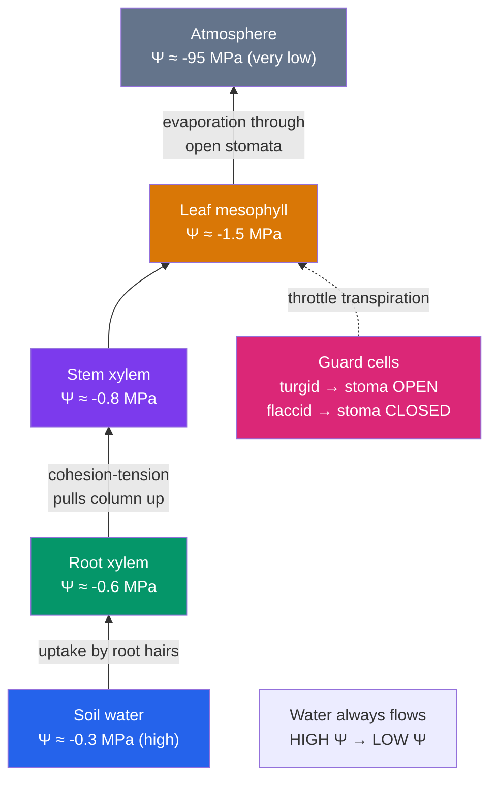

# 💧 Transport in Plants

> [!abstract] TL;DR
> Plants move water tens of meters upward with **no pump** and burn almost no energy doing it. Water always flows from high to low **water potential (Ψ)**. Evaporation from leaf pores (**transpiration**) drops the leaf's water potential to strongly negative values; because water molecules stick to each other (**cohesion**) and to the xylem walls (**adhesion**), that pull is transmitted as an unbroken **tension** down continuous water columns in the dead **xylem** pipes — the **cohesion-tension theory**. **Stomata**, opened and closed by turgid **guard cells**, are the throttle balancing CO₂ intake against water loss. Sugar moves separately in the living **phloem** by the **pressure-flow** model: sugar loaded at a source draws in water osmotically, and the resulting pressure pushes sap toward sugar-hungry sinks.

## Intuition — analogy first

Water transport in a plant is **drinking through a straw that the sun is sucking on**.

When you sip a drink, you lower the pressure at the top of the straw and atmospheric pressure pushes the liquid up. A tree does something cleverer: it never sucks at all. Instead, **evaporation** from the wet inner surfaces of its leaves continuously pulls water molecules off the top of the column. Because water is astonishingly cohesive — its molecules cling together through hydrogen bonds (see [[Water_and_Lifes_Chemistry]]) — removing one molecule at the top tugs the whole chain up behind it, like pulling a rope. The "straw" (xylem) is a bundle of ultra-thin dead pipes, and the "suction" is free solar energy evaporating water at the leaf. The plant's only job is to decide, moment to moment, *how far to open the valves* (stomata) — because every molecule of CO₂ it lets in costs it water molecules lost.

Sugar transport is a completely different system — think of it as a **hydraulic conveyor belt** rather than a straw, which we'll get to below.

---

## How It Works — The Ascent of Water

## Key Concepts / Details

### Water Potential (Ψ) — the Master Variable

Water does not move "up" or "toward roots" as a rule — it moves down its **water potential gradient**, from higher Ψ to lower Ψ, always. Water potential (measured in **megapascals, MPa**) has two main components:

$$\Psi = \Psi_s + \Psi_p$$

- **Solute potential (Ψs)**, also called osmotic potential — always **negative**; dissolving solutes lowers water potential (water is "diluted"). More solute → more negative Ψs.
- **Pressure potential (Ψp)** — the physical pressure. **Positive** inside a turgid cell (turgor pressure pushing out on the wall); **negative** (tension) in the transpiring xylem.

Pure water at atmospheric pressure defines Ψ = 0. Nearly everything in a plant is therefore negative, and the atmosphere on a dry day is *hugely* negative (around −95 MPa) — which is exactly why water is pulled relentlessly out of leaves.

### Getting Water Into the Root

At the root surface, water and dissolved minerals enter through **root hairs** and cross the cortex by two routes: the **apoplast** (through cell walls and spaces, "outside" the cells) and the **symplast** (cell-to-cell through **plasmodesmata**). Both routes are forced through the symplast at the **endodermis**, whose **Casparian strip** — a waxy, waterproof band in the cell walls — blocks the apoplast. This checkpoint lets the plant selectively control which minerals enter the xylem (see [[Plant_Nutrition_and_Soil]]).

### The Cohesion-Tension Mechanism (Transpiration Pull)

This is the headline mechanism for the **ascent of xylem sap**:

1. **Transpiration** — water evaporates from the moist cell walls of the leaf mesophyll into the air spaces and out through the stomata into drier air (huge Ψ gradient).
2. Losing water makes the leaf mesophyll Ψ more negative, pulling water out of the nearest leaf-vein xylem — creating **tension** (negative pressure) at the top of the water column.
3. **Cohesion** — hydrogen bonds hold water molecules together, so this tension is transmitted, molecule to molecule, down an unbroken column all the way to the roots.
4. **Adhesion** — water's attraction to the hydrophilic xylem walls helps resist gravity and keeps the column from slipping.

The result: water is under **tension** (like a stretched rope), *not* pushed under positive pressure. The energy source is sunlight (driving evaporation) — the plant spends essentially no ATP on the lift itself. This is why xylem cells can be **dead**; they're passive pipes.

### Stomata and Guard Cells — the Transpiration Throttle

Each **stoma** is a pore flanked by two **guard cells**. They open and close by changing their turgor:

- To **open**: guard cells actively pump in K⁺ ions (and accumulate solutes) → Ψs drops → water enters osmotically → cells become turgid → their unevenly thickened walls bow apart → pore opens.
- To **close**: solutes leave → water follows out → guard cells go flaccid → pore shuts.

The plant faces a permanent **trade-off**: open stomata let CO₂ in for photosynthesis but let water out. Stomata typically open in daylight and close at night, and close under drought — a response driven by the hormone **abscisic acid (ABA)** (see [[Plant_Growth_and_Hormones]]). Specialized photosynthesis (**C4** and **CAM**) evolved partly to ease this trade-off; CAM plants open stomata only at night.

### Phloem and the Pressure-Flow Model (Translocation)

**Translocation** is the transport of sugars (mostly sucrose) through the living **phloem**, and it works on a completely different principle from xylem. Phloem flows from **sources** (net sugar producers — mature leaves) to **sinks** (net sugar consumers/stores — roots, growing tips, fruits). Direction can even reverse seasonally (a spring bud is a sink; a storage root that fed it was the source).

The **pressure-flow (mass-flow) model**:

1. At the **source**, companion cells actively **load sucrose** into the sieve tubes (often against its gradient, using energy).
2. High sugar concentration lowers Ψs, so water flows in **osmotically** from the adjacent xylem → high **turgor (positive pressure)** builds at the source end.
3. At the **sink**, sugar is **unloaded** (used or stored), Ψs rises, water leaves, pressure drops.
4. The **pressure difference** between source (high) and sink (low) drives bulk flow of sap through the sieve tubes — a hydraulic push, not diffusion.

### Xylem vs Phloem at a Glance

| Feature | **Xylem** | **Phloem** |
|---|---|---|
| Transports | Water + dissolved minerals | Sugars (sucrose), amino acids, signals |
| Direction | Up only (root → shoot) | Source → sink (either direction) |
| Conducting cells | Tracheids, vessel elements (**dead**) | Sieve-tube elements (**living**) + companion cells |
| Driving force | **Transpiration pull** (tension, cohesion) | **Pressure-flow** (turgor gradient) |
| Energy use | ~None at the pipe (solar-driven) | Active loading/unloading at ends (ATP) |
| Pressure state | Negative (tension) | Positive (turgor) |

### Root Pressure and Guttation

At night, when transpiration is near zero, some plants actively pump minerals into the root xylem, lowering Ψ and drawing water in — generating positive **root pressure**. This can push water up short distances and force droplets out of leaf margins (**guttation**, distinct from dew). Root pressure alone is far too weak to raise water up a tall tree — cohesion-tension does the real work.

## Real-World Notes

- **Wilting** is loss of turgor: when soil Ψ falls or transpiration outpaces uptake, cells lose water, Ψp drops, and non-woody tissues droop. Turgor is a plant's "hydraulic skeleton."
- **Cavitation & drought**: extreme tension can snap the water column, forming an air bubble (**embolism**) that blocks a xylem conduit — a major cause of drought-driven tree death. Vessel pitting and refilling mechanisms limit the damage.
- **The tallest trees** (coast redwoods, ~115 m) sit near the theoretical limit of cohesion-tension: gravity and friction make Ψ at the treetop so negative that leaf growth there is water-stressed.
- **Maple syrup** exploits early-spring **positive** stem pressure (from freeze-thaw gas dynamics and sugar) that pushes xylem sap out of a tapped hole — an unusual case where sap flows *out* under pressure.
- **Aphids** tap phloem: their stylets pierce single sieve tubes, and the phloem's positive pressure pushes sugary sap into (and through) them — historically used by scientists to sample pure phloem sap.

## Common Pitfalls / Misconceptions

- **"Roots push water up to the leaves."** Mostly backwards — leaves *pull* water up via transpiration. Root pressure is a minor, nighttime, short-distance effect.
- **"Water moves toward higher solute concentration."** Water moves toward **lower water potential**. Higher solute usually means lower Ψ, but pressure matters too — a turgid cell can have high Ψ despite lots of solute.
- **"Xylem sap is under positive pressure like a hose."** It's under **tension** (negative pressure). This is why a cut stem draws air *in*, and why embolisms are so damaging.
- **"Phloem and xylem flow in the same direction."** Xylem is one-way up; phloem flows source-to-sink and reverses with the seasons.
- **"Transpiration is wasteful."** It's an unavoidable cost of keeping stomata open for CO₂, but it also cools leaves and drives mineral delivery — the plant manages, not eliminates, it.

## Related Concepts

- [[_MOC_Plant_Biology|↑ Section MOC]]
- [[Plant_Structure_and_Tissues]] — The xylem, phloem, stomata, and root anatomy that make transport possible
- [[Plant_Nutrition_and_Soil]] — The minerals the transpiration stream delivers and how roots select them
- [[Plant_Growth_and_Hormones]] — Abscisic acid's control of stomatal closure under drought
- Cross-vault: [[Water_and_Lifes_Chemistry]] — Hydrogen bonding, cohesion, and adhesion, the physical basis of the ascent of sap
- Cross-vault: [[The_Cell_Membrane_and_Transport]] — Osmosis and membrane transport underlying water potential
- Cross-vault: [[Photosynthesis]] — The CO₂-for-water trade-off stomata regulate

## Review Questions

1. Write the water-potential equation and use it to explain why a plant cell placed in pure water swells but does not burst, whereas the same cell in concentrated salt solution plasmolyzes. Reference both Ψs and Ψp.
2. Trace a single water molecule from soil to atmosphere, naming at each step the tissue it's in and the force acting on it. Where in this journey is the water under tension, and what physical property of water makes an unbroken column possible?
3. Contrast the driving force for xylem transport with that for phloem transport. Why can xylem conducting cells be dead while phloem conducting cells must stay alive?

## Sources

- Taiz, L., Zeiger, E., Møller, I.M. & Murphy, A. (2015). *Plant Physiology and Development*, 6th ed., Ch. 3–4, 10–11. Sinauer
- Urry, L.A. et al. (2020). *Campbell Biology*, 12th ed., Ch. 36 (Resource Acquisition and Transport in Vascular Plants). Pearson
- Tyree, M.T. & Zimmermann, M.H. (2002). *Xylem Structure and the Ascent of Sap*, 2nd ed. Springer
- Nobel, P.S. (2009). *Physicochemical and Environmental Plant Physiology*, 4th ed. Academic Press

#biology #plant-biology #transport #water-potential #xylem #phloem #transpiration
