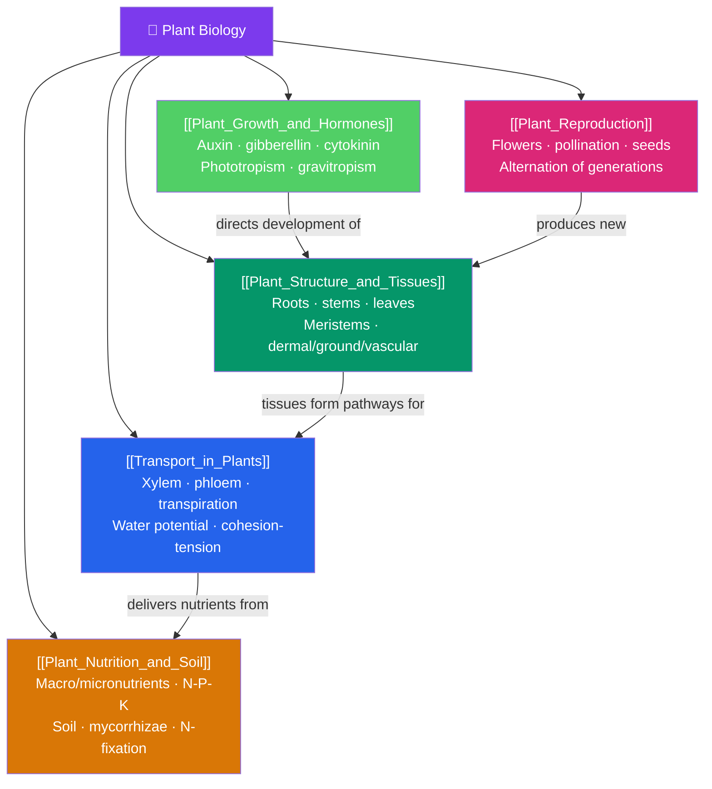

# 🌿 Plant Biology — Map of Content

> [!abstract] What This Section Covers
> Plants are the foundation of terrestrial life — the primary producers that turn sunlight into the food and oxygen the rest of the biosphere depends on. This section starts with **plant structure and tissues**: roots, stems, and leaves, and the meristems from which all new growth arises. **Transport in plants** explains how water and minerals rise through the xylem (driven by transpiration and water potential) and how sugars move through the phloem. **Plant nutrition and soil** covers the essential nutrients and the soil chemistry that supplies them. **Plant growth and hormones** examines auxins, gibberellins, and the tropisms that let a rooted organism respond to light and gravity. Finally, **plant reproduction** covers flowers, pollination, seeds, and the alternation of generations that defines the plant life cycle.

## Concept Map

## Learning Path

1. [[Plant_Structure_and_Tissues]] — The root, shoot, and leaf systems; dermal, ground, and vascular tissues; and apical and lateral meristems that drive primary and secondary growth.
2. [[Transport_in_Plants]] — Water potential, the cohesion-tension theory of xylem transport, transpiration and stomatal control, and pressure-flow in the phloem.
3. [[Plant_Nutrition_and_Soil]] — Essential macro- and micronutrients, soil structure and cation exchange, nitrogen fixation, and mycorrhizal partnerships.
4. [[Plant_Growth_and_Hormones]] — The major plant hormones (auxin, gibberellin, cytokinin, abscisic acid, ethylene) and tropic responses to light and gravity.
5. [[Plant_Reproduction]] — Flower anatomy, pollination and double fertilization, seed and fruit development, and the alternation of gametophyte and sporophyte generations.

## All Notes at a Glance

| Note | Difficulty | What You'll Learn |
|------|------------|-------------------|
| [[Plant_Structure_and_Tissues]] | Beginner → Intermediate | Roots/stems/leaves, dermal/ground/vascular tissue, meristems, primary/secondary growth |
| [[Transport_in_Plants]] | Intermediate | Water potential, xylem, cohesion-tension, transpiration, stomata, phloem, pressure-flow |
| [[Plant_Nutrition_and_Soil]] | Intermediate | Essential nutrients, N-P-K, soil composition, cation exchange, nitrogen fixation, mycorrhizae |
| [[Plant_Growth_and_Hormones]] | Intermediate | Auxin, gibberellin, cytokinin, ABA, ethylene, phototropism, gravitropism, photoperiodism |
| [[Plant_Reproduction]] | Intermediate | Flower parts, pollination, double fertilization, seeds, fruits, alternation of generations |

## Key Questions This Section Answers

- How does a plant lift water dozens of meters from root to leaf without a pump?
- What are meristems, and why can plants keep growing throughout their lives?
- Which nutrients do plants need, and how do they get nitrogen from the air?
- How does a rooted, immobile organism sense and grow toward light?
- What is the alternation of generations, and where do flowers fit into it?

## Related Sections

- [[_MOC_Biology_Master|↑ Biology Master MOC]]
- [[_MOC_Human_Physiology|← Human Physiology and Anatomy]]
- [[_MOC_Microbiology_Immunology|→ Microbiology and Immunology]]
- Cross-vault: photosynthesis detailed in [[_MOC_Metabolism|Metabolism and Bioenergetics]]

#MOC #Biology #PlantBiology
