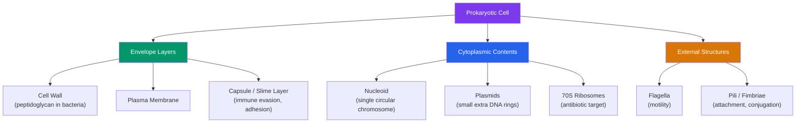

# 🦠 Bacteria and Archaea

> [!abstract] TL;DR
> Bacteria and archaea are the two **prokaryotic** domains of life — single-celled organisms without a membrane-bound nucleus or organelles. They are the oldest, most abundant, and most metabolically versatile life on Earth. Bacteria are defined by a peptidoglycan cell wall (the basis of the **Gram stain**), reproduce by **binary fission**, and evolve fast through short generations plus **horizontal gene transfer** (conjugation, transformation, transduction). Archaea look superficially similar under a microscope but are biochemically distinct — different membrane lipids, no peptidoglycan — and dominate extreme environments. Far from being merely germs, most bacteria are harmless or essential: the human **microbiome** contains as many bacterial cells as human cells, and only a small minority of species are pathogens.

## Intuition — analogy first

Think of a eukaryotic cell as a modern office building with private offices (the nucleus), specialized departments in separate rooms (organelles like mitochondria), and internal walls everywhere. A prokaryote is a **one-room workshop**: everything happens in the same open space. There is no walled-off nucleus — the DNA floats freely in a region called the nucleoid — and no membrane-bound organelles. All the machinery of life is packed into a single compartment, typically ten times smaller than a eukaryotic cell.

That simplicity is not primitiveness — it is a different, wildly successful strategy. A one-room workshop can be built fast, run cheaply, and copied in twenty minutes. What prokaryotes lack in internal architecture they make up for in sheer numbers and metabolic ingenuity: collectively, bacteria and archaea have "invented" nearly every chemical trick life uses to extract energy, from photosynthesis to breathing sulfur to eating rock.

---

## How It Works — Prokaryotic Cell Architecture

## Key Concepts

### The Prokaryotic Cell and Its Wall

A prokaryote is bounded by a **plasma membrane**, and almost always surrounded by a rigid **cell wall** that maintains shape and resists osmotic bursting. In bacteria, this wall is built from **peptidoglycan** — a mesh of sugar chains cross-linked by short peptides. Peptidoglycan is unique to bacteria, which makes it an ideal drug target: penicillin blocks its synthesis, and human cells (which have no wall) are unharmed. See [[Vaccines_and_Antibiotics]].

The **Gram stain** exploits wall architecture to split bacteria into two great groups:

| Feature | Gram-positive | Gram-negative |
|---|---|---|
| Peptidoglycan layer | Thick, outermost | Thin |
| Outer membrane | Absent | Present (contains **LPS/endotoxin**) |
| Crystal violet stain | Retained → **purple** | Lost → counterstained **pink** |
| Antibiotic access | Generally easier | Harder (extra barrier) |
| Examples | *Staphylococcus*, *Streptococcus* | *E. coli*, *Salmonella*, *Pseudomonas* |

The Gram-negative outer membrane carries **lipopolysaccharide (LPS)**, an "endotoxin" that triggers strong inflammation and, in bloodstream infections, can drive septic shock.

### DNA, Plasmids, and Other Structures

The main genome is usually a **single circular chromosome** in the nucleoid. Many bacteria also carry **plasmids** — small, independently replicating DNA rings that often encode "optional extras" like antibiotic-resistance genes, toxins, or metabolic capabilities. Plasmids are the currency of **horizontal gene transfer** (below).

- **Flagella** — whip-like protein filaments driven by a rotary motor; enable directed swimming (chemotaxis) toward nutrients.
- **Pili / fimbriae** — hair-like appendages for attaching to surfaces and host cells; a special **sex pilus** connects two cells during conjugation.
- **Capsule** — a sticky outer polysaccharide coat that resists phagocytosis and glues cells into **biofilms**.
- **Endospores** — some Gram-positives (*Bacillus*, *Clostridium*) form dormant, heat- and desiccation-resistant spores that survive boiling and can persist for centuries.

### Binary Fission and Rapid Evolution

Prokaryotes reproduce **asexually** by **binary fission**: the chromosome replicates, the cell elongates, and a septum pinches it into two identical daughters. Under ideal conditions *E. coli* divides every ~20 minutes, so a single cell can become a billion overnight. Short generations plus large populations mean **mutations that would take a mammal millennia to spread through a population sweep through a bacterial culture in days** — the engine behind antibiotic resistance (see [[Natural_Selection_and_Adaptation]]).

Crucially, bacteria also swap genes *sideways* between unrelated cells via **horizontal gene transfer (HGT)**:

| Mechanism | How genes move |
|---|---|
| **Transformation** | Cell takes up free DNA from the environment |
| **Conjugation** | Direct cell-to-cell transfer of a plasmid through a pilus |
| **Transduction** | A bacteriophage (virus) accidentally packages and delivers host DNA |

HGT lets a resistance gene jump between species, which is why resistance spreads so alarmingly fast in hospitals.

### Metabolic Diversity

Prokaryotes collectively exploit almost every conceivable energy source. They are classified by their carbon and energy inputs:

- **Photoautotrophs** (e.g., cyanobacteria) — light + CO₂; cyanobacteria invented oxygenic photosynthesis and oxygenated the early atmosphere.
- **Chemoautotrophs** — energy from inorganic chemicals (H₂S, NH₃, Fe²⁺); found at hydrothermal vents where they anchor entire ecosystems with no sunlight.
- **Heterotrophs** — consume organic molecules (most familiar bacteria).

They also differ in oxygen tolerance: **obligate aerobes** require O₂, **obligate anaerobes** are poisoned by it, and **facultative anaerobes** switch as needed. Key ecological services include **nitrogen fixation** (converting inert N₂ into usable ammonia — the basis of the nitrogen cycle) and decomposition.

### Archaea — The Third Domain

**Archaea** were long mistaken for bacteria but are a genetically distinct domain, in some ways *more closely related to eukaryotes* (us) than to bacteria. Key differences:

- **Membrane lipids** use ether linkages and branched isoprenoid chains (bacteria/eukaryotes use ester-linked fatty acids) — this makes archaeal membranes exceptionally stable.
- **No peptidoglycan** in their cell walls.
- Distinct RNA polymerase and gene-expression machinery resembling the eukaryotic version.

Archaea are famous as **extremophiles**: **thermophiles** in boiling springs, **halophiles** in saturated salt lakes, **acidophiles** in acid mine drainage, and **methanogens** that produce methane in cattle guts, wetlands, and sediments. Notably, **no archaeon is a known human pathogen** — a striking contrast with bacteria.

### The Human Microbiome

The **microbiome** is the community of microbes living in and on us — concentrated in the gut, but also on skin, in the mouth, and elsewhere. Modern counts put bacterial cells at roughly **1:1 with human cells** (older "10:1" figures are outdated). These microbes are not passengers; they:

- **Digest** fibers we cannot, producing short-chain fatty acids that nourish the colon.
- **Synthesize** vitamins (K, several B vitamins).
- **Train and regulate** the immune system (see [[The_Innate_Immune_System]]).
- **Exclude pathogens** by occupying niches and competing for resources ("colonization resistance").

Disrupting this community — a **dysbiosis**, often from broad-spectrum antibiotics — is linked to *C. difficile* infections, and associated with conditions from inflammatory bowel disease to metabolic and even mood disorders (the gut–brain axis).

## Real-World Notes

- **Medicine**: Gram status guides empirical antibiotic choice before culture results return; endospores explain why sterilization requires autoclaving (121 °C), not just boiling; biofilms on catheters and implants are notoriously drug-tolerant.
- **Biotechnology**: the heat-stable DNA polymerase that made PCR possible (*Taq*) came from a thermophile in a Yellowstone hot spring; bacteria are engineered factories for insulin and other proteins.
- **Ecology and climate**: nitrogen-fixing bacteria underpin agriculture; methanogenic archaea are a significant source of the greenhouse gas methane.
- **Food**: fermentation by lactic-acid bacteria produces yogurt, cheese, and sauerkraut — beneficial bacteria harnessed deliberately.

## Common Pitfalls / Misconceptions

- **"Bacteria are germs / all bacteria cause disease."** The vast majority are harmless or essential. Only a small minority of species are pathogens; the microbiome is indispensable.
- **"Archaea are just weird bacteria."** They are a separate domain, biochemically and genetically distinct, and in several respects closer to eukaryotes than to bacteria.
- **"We outnumber our microbes 10-to-1."** That widely repeated figure has been revised to roughly 1-to-1 by direct measurement.
- **"Prokaryotes are primitive."** Simplicity of structure is not evolutionary inferiority — prokaryotes are exquisitely adapted, and their metabolic repertoire dwarfs that of all eukaryotes.
- **"Antibiotics kill viruses too."** Antibiotics target bacterial-specific structures (like peptidoglycan and 70S ribosomes); they do nothing to viruses. See [[Viruses]].

## Related Concepts

- [[_MOC_Microbiology_Immunology|↑ Section MOC]]
- [[Viruses]] — Acellular replicators that infect bacteria (bacteriophages) and mediate transduction
- [[The_Innate_Immune_System]] — The first responder that detects bacterial LPS and other microbial signatures
- [[Vaccines_and_Antibiotics]] — How we target bacterial-specific structures, and how resistance evolves
- [[The_Cell_Theory_and_Cell_Types]] — The prokaryote/eukaryote distinction in the broader context of cell biology
- Cross-vault: [[Natural_Selection_and_Adaptation]] — The evolutionary mechanism that rapid fission and HGT accelerate

## Review Questions

1. A blood culture returns Gram-negative rods. Explain what the Gram result tells you about the cell wall architecture, why this species may be harder to treat, and what molecule in its outer membrane can trigger septic shock.
2. Describe the three mechanisms of horizontal gene transfer and explain why HGT, combined with binary fission, makes antibiotic resistance spread faster than ordinary vertical inheritance would predict.
3. Give three biochemical features that distinguish archaea from bacteria, and state one striking epidemiological fact about archaea and human disease.

## Sources

- Madigan, M.T. et al. (2021). *Brock Biology of Microorganisms*, 16th ed. Pearson
- Woese, C.R., Kandler, O. & Wheelis, M.L. (1990). "Towards a natural system of organisms: proposal for the domains Archaea, Bacteria, and Eucarya." *PNAS*, 87(12)
- Sender, R., Fuchs, S. & Milo, R. (2016). "Revised estimates for the number of human and bacteria cells in the body." *PLoS Biology*, 14(8)
- Alberts, B. et al. (2022). *Molecular Biology of the Cell*, 7th ed. Garland Science

#biology #microbiology #prokaryotes #bacteria #archaea #microbiome
