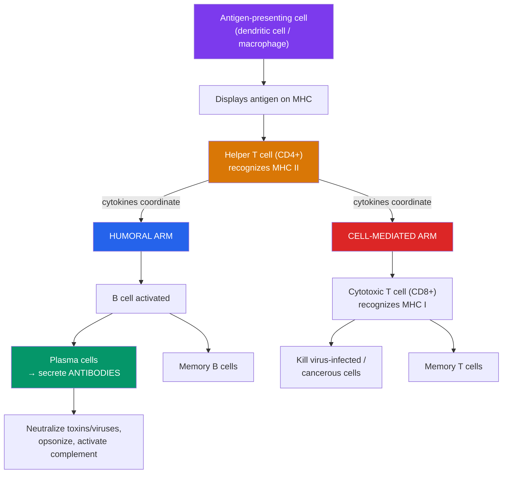

# 🎯 The Adaptive Immune System

> [!abstract] TL;DR
> The adaptive immune system is the body's **slow, precise, and remembering** defense. Where innate immunity is fast and generic, adaptive immunity is **specific** — each **lymphocyte** bears a unique receptor for one molecular target (**antigen**) — and it forms **memory**, so a second encounter with the same pathogen is met faster and harder. It has two arms: **humoral immunity**, in which **B cells** secrete **antibodies** that neutralize and tag extracellular threats; and **cell-mediated immunity**, in which **T cells** (helper T cells that coordinate, cytotoxic T cells that kill infected cells) handle intracellular threats. The system reads antigens presented on **MHC** molecules, selects the rare lymphocyte that fits (**clonal selection**), and expands it into an army — leaving behind long-lived memory cells. This memory is exactly what vaccines exploit. See [[Vaccines_and_Antibiotics]].

## Intuition — analogy first

If the innate system is the castle's rapid-response guards, the adaptive system is a **trained intelligence agency that builds a wanted poster for each specific enemy**. It is slower to spin up the first time — days, not minutes — because it must find, among millions of agents, the one specialist whose "photograph" matches this exact intruder, then mass-produce that specialist. But once it does, its response is devastatingly precise: it targets *this* pathogen and nothing else, and it keeps the wanted poster on file forever.

The genius is in the archive. After the threat is cleared, most of the army stands down, but a cadre of **memory** agents remains, pre-briefed. The next time this enemy appears — even decades later — there is no slow search: the specialists are already trained and waiting, and the invader is crushed before it can cause illness. That archived memory is why you catch chickenpox once, and why a vaccine can protect you from a disease you have never had.

---

## How It Works — Two Arms of the Adaptive Response

## Key Concepts

### Antigens, Specificity, and Clonal Selection

An **antigen** is any molecule the immune system can recognize; the specific piece a receptor actually binds is an **epitope**. The defining feature of adaptive immunity is that each **lymphocyte** (B or T cell) is born bearing a **single, unique receptor** for one epitope, generated by random gene shuffling (**V(D)J recombination**) that creates a repertoire of billions of specificities *before any pathogen is ever seen*.

**Clonal selection** is the organizing principle:
1. Millions of distinct lymphocytes circulate, each with its own receptor.
2. A pathogen's antigen binds only the rare few whose receptors happen to fit.
3. Those selected cells are activated to **proliferate** (clonal expansion), producing an army of identical clones all targeting that antigen.
4. The clones differentiate into **effector cells** (that fight now) and **memory cells** (that persist).

Self-reactive lymphocytes are normally deleted during development (**central tolerance**); failure of tolerance underlies **autoimmune disease**.

### B Cells and Humoral Immunity

**B cells** mediate **humoral immunity** — defense in the body's fluids (Latin *humor*). When a B cell's receptor binds its antigen and it receives help from a helper T cell, it proliferates and differentiates into:

- **Plasma cells** — antibody factories that secrete thousands of antibody molecules per second.
- **Memory B cells** — long-lived cells that lie in wait for re-exposure.

**Antibodies** (immunoglobulins) are Y-shaped proteins whose two arm-tips bind antigen with exquisite specificity. They do not usually kill microbes directly; they **mark and disable**:

| Antibody function | Effect |
|---|---|
| **Neutralization** | Coat a virus or toxin so it can no longer bind/enter host cells |
| **Opsonization** | Tag microbes so phagocytes engulf them more efficiently |
| **Complement activation** | Trigger the classical complement pathway → lysis and inflammation |
| **Agglutination** | Clump microbes together for easier clearance |

There are five antibody **classes**, each specialized: **IgG** (most abundant, crosses the placenta, long-term immunity), **IgM** (first produced in a response, potent complement activator), **IgA** (guards mucosal surfaces and breast milk), **IgE** (allergy and antiparasite defense), and **IgD** (B-cell receptor). Through **affinity maturation** and **class switching** in germinal centers, antibodies get progressively better and more tailored over the course of a response.

### T Cells and Cell-Mediated Immunity

**T cells** mature in the **thymus** and handle threats that antibodies cannot reach — chiefly pathogens *hidden inside cells*. They recognize antigen only when it is **presented** on MHC molecules (below).

- **Helper T cells (CD4⁺)** — the **coordinators**. They recognize antigen on **MHC class II** and release **cytokines** that activate B cells, boost cytotoxic T cells, and amplify macrophages. They command the whole adaptive response — which is why HIV's destruction of CD4⁺ cells is so devastating (see [[Viruses]]).
- **Cytotoxic T cells (CD8⁺)** — the **assassins**. They recognize antigen on **MHC class I** and kill the presenting cell using **perforin** and **granzymes** to induce **apoptosis**. This eliminates virus factories and cancer cells.
- **Regulatory T cells (Tregs)** — the **brakes**. They suppress immune responses to prevent autoimmunity and shut the response down once the threat clears.

### Antigen Presentation and MHC

**MHC** (major histocompatibility complex) molecules are cellular display cases that show fragments of proteins to T cells. Two classes divide the labor:

| Feature | MHC class I | MHC class II |
|---|---|---|
| Found on | **Almost all** nucleated cells | **Antigen-presenting cells** (dendritic, macrophage, B cell) |
| Displays | Fragments of proteins made *inside* the cell | Fragments of *engulfed* external material |
| Read by | **Cytotoxic (CD8⁺)** T cells | **Helper (CD4⁺)** T cells |
| Signal | "Here's what I'm making — kill me if it's viral" | "Here's what I found outside — help coordinate" |

This is the master link between innate and adaptive immunity: **dendritic cells** and **macrophages** engulf pathogens (innate), then present the pieces on MHC II to helper T cells (adaptive), igniting the specific response. MHC diversity between individuals is also what makes organ transplants prone to rejection.

### Immunological Memory — The Payoff

After the infection is cleared, effector cells mostly die off, but **memory B and T cells** persist for years to decades. This produces the sharp difference between first and second encounters:

| | Primary response | Secondary response |
|---|---|---|
| Speed | Slow (~5–10 days lag) | Fast (1–3 days) |
| Magnitude | Lower antibody levels | Much higher |
| Antibody class | IgM first, then IgG | Predominantly IgG immediately |
| Affinity | Lower | Higher (affinity-matured) |
| Outcome | You may get sick | Often cleared before symptoms |

This memory is the entire basis of vaccination: expose the system to a harmless version of a pathogen, generate memory cells, and be protected against the real thing — without ever suffering the disease. See [[Vaccines_and_Antibiotics]].

## Real-World Notes

- **Transplant rejection**: because MHC differs between people, transplanted organs are attacked; recipients need immunosuppressants and careful HLA matching.
- **Autoimmune disease** (type 1 diabetes, rheumatoid arthritis, multiple sclerosis): a breakdown of self-tolerance turns adaptive immunity against the body's own tissues.
- **Immunotherapy for cancer**: checkpoint inhibitors release the brakes on cytotoxic T cells; CAR-T therapy engineers a patient's own T cells to attack tumors — a revolution built on adaptive immunology.
- **Monoclonal antibodies**: lab-made antibodies (e.g., for cancer, autoimmune disease, and COVID-19) directly deploy humoral specificity as medicine.
- **Passive immunity**: pre-made antibodies (maternal IgG across the placenta, or antivenom) give instant but temporary protection with no memory.

## Common Pitfalls / Misconceptions

- **"Antibodies kill pathogens directly."** They mostly **neutralize and tag** — the actual killing is done by phagocytes, complement, or (for infected cells) cytotoxic T cells.
- **"B cells and T cells do the same job."** B cells make antibodies for *extracellular* threats (humoral); T cells handle *intracellular* threats and coordination (cell-mediated). They are complementary.
- **"The adaptive system works alone."** It is *ignited* by the innate system via antigen presentation and depends on it throughout. The two are one integrated system.
- **"Immunity always lasts forever."** Memory duration varies by pathogen and vaccine — lifelong for some (measles), waning for others (tetanus needs boosters; some coronaviruses).
- **"A weak or absent immune response is always the problem."** Overactive adaptive immunity causes autoimmunity, allergy, and transplant rejection — dysregulation cuts both ways.

## Related Concepts

- [[_MOC_Microbiology_Immunology|↑ Section MOC]]
- [[The_Innate_Immune_System]] — The fast first responder that presents antigen and activates this system
- [[Vaccines_and_Antibiotics]] — Vaccines engineer the immunological memory described here
- [[Viruses]] — Intracellular pathogens cleared by cytotoxic T cells; HIV destroys helper T cells
- [[Bacteria_and_Archaea]] — Extracellular bacteria are prime targets for antibody-mediated (humoral) immunity
- Cross-vault: [[Natural_Selection_and_Adaptation]] — Clonal selection is Darwinian selection operating on cells within the body

## Review Questions

1. Explain clonal selection. How does the immune system generate specificity for pathogens it has never encountered, and how does the same mechanism produce immunological memory?
2. A virus replicates inside a host cell where circulating antibodies cannot reach it. Trace how MHC class I presentation allows cytotoxic (CD8⁺) T cells to detect and eliminate the infected cell.
3. Contrast the primary and secondary immune responses across speed, magnitude, and antibody class. Explain precisely how this difference makes vaccination possible.

## Sources

- Murphy, K. & Weaver, C. (2022). *Janeway's Immunobiology*, 10th ed. Garland Science
- Abbas, A.K., Lichtman, A.H. & Pillai, S. (2021). *Cellular and Molecular Immunology*, 10th ed. Elsevier
- Burnet, F.M. (1959). *The Clonal Selection Theory of Acquired Immunity*. Cambridge University Press
- Zinkernagel, R.M. & Doherty, P.C. (1974). "Restriction of in vitro T cell-mediated cytotoxicity... by the major histocompatibility complex." *Nature*, 248 (Nobel Prize work on MHC restriction)

#biology #immunology #adaptive-immunity #lymphocytes #antibodies #t-cells
