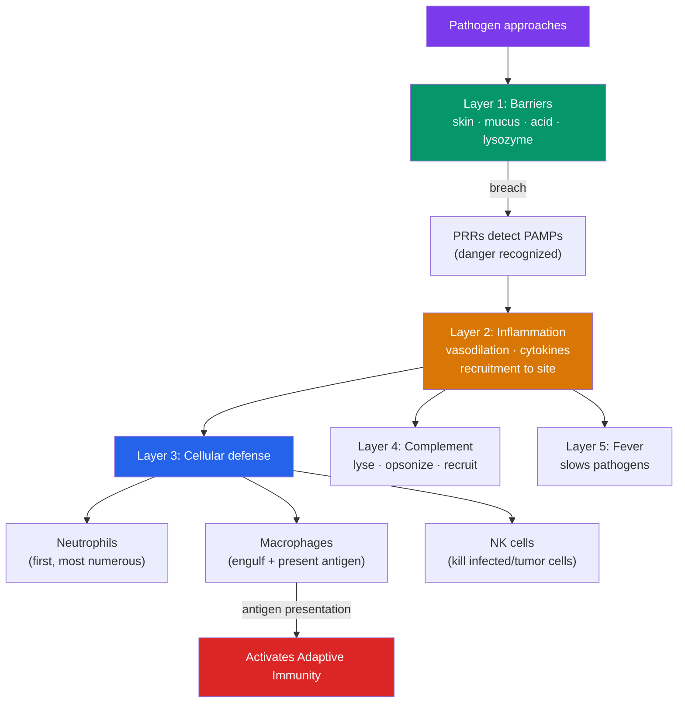

# 🛡️ The Innate Immune System

> [!abstract] TL;DR
> The innate immune system is the body's **fast, general-purpose defense** — present from birth, responding within minutes to hours, and treating all pathogens with the same broad toolkit. Its layers are: **physical and chemical barriers** (skin, mucus, stomach acid, lysozyme) that keep microbes out; **inflammation**, which recruits defenders to a breach; **phagocytes** (neutrophils and macrophages) that engulf and digest invaders; **natural killer (NK) cells** that destroy virus-infected and cancerous cells; the **complement system**, a cascade of blood proteins that punctures microbes and tags them for destruction; and **fever**, a whole-body response that slows pathogens. It is **non-specific** and keeps **no memory** — but it also detects danger, sounds the alarm, and activates the slower, specific adaptive system.

## Intuition — analogy first

Think of the innate immune system as a **castle's standing defenses plus its rapid-response guards**. The outer wall and moat (skin, mucus, acid) stop most attackers before they get in. If someone breaches the wall, alarm bells ring automatically (inflammation) and the nearest guards rush to the gap — they do not need to know *who* the attacker is, only *that* there is one. They fight anyone who looks like a generic enemy: carrying a banner the guards recognize as "not one of us."

These guards are fast, always on duty, and never take a day off — but they are not specialists. They cannot recognize an individual enemy commander they fought last year, and they do not get better at fighting a repeat invader. For that kind of precision and memory you need the trained special forces: the adaptive immune system (see [[The_Adaptive_Immune_System]]), which the innate guards summon by lighting the signal fires.

---

## How It Works — Layers of Innate Defense

## Key Concepts

### Physical and Chemical Barriers

The first line of defense never lets most microbes enter at all:

- **Skin** — a tough, dry, constantly shedding keratinized barrier; few pathogens penetrate intact skin.
- **Mucous membranes** — line the respiratory, digestive, and urogenital tracts; sticky **mucus** traps microbes, and the **mucociliary escalator** (cilia beating mucus upward in the airway) sweeps them out.
- **Chemical defenses** — **stomach acid** (pH ~2) sterilizes most swallowed microbes; **lysozyme** in tears, saliva, and mucus digests bacterial cell walls; antimicrobial peptides (defensins) puncture membranes.
- **Microbiome** — resident harmless bacteria outcompete pathogens for space and nutrients (colonization resistance). See [[Bacteria_and_Archaea]].

### Pattern Recognition — How "Nonspecific" Still Recognizes

Innate immunity is non-specific but not blind. Its cells carry **pattern recognition receptors (PRRs)** — most famously **Toll-like receptors (TLRs)** — that detect **PAMPs** (pathogen-associated molecular patterns): conserved microbial signatures such as bacterial **LPS**, flagellin, and viral double-stranded RNA. These molecules are shared across whole classes of microbes and absent from host cells, so one receptor flags "microbe present" for millions of species at once. This is the trade-off: broad coverage, no fine discrimination.

### Inflammation

When barriers are breached, **inflammation** localizes and amplifies the response. Damaged and sentinel cells (like **mast cells** and macrophages) release signaling molecules — **histamine** and **cytokines** — producing the four classic signs:

| Sign (Latin) | Cause |
|---|---|
| Redness (*rubor*) | Vasodilation increases blood flow |
| Heat (*calor*) | Warm blood pooling at the site |
| Swelling (*tumor*) | Capillaries leak fluid into tissue (edema) |
| Pain (*dolor*) | Mediators sensitize nerve endings |

The functional payoff: dilated, leaky vessels let plasma proteins (including complement and antibodies) and phagocytes **exit the bloodstream and reach the infected tissue**. **Cytokines** — especially **chemokines** — form chemical gradients that guide immune cells to the exact site (chemotaxis).

### Phagocytes

**Phagocytes** engulf and digest microbes by **phagocytosis** — surrounding the invader, sealing it in a vesicle (phagosome), and fusing it with enzyme- and oxidant-filled lysosomes.

- **Neutrophils** — the most abundant white blood cell and the **first responders** to bacterial infection; short-lived, they die in large numbers, and dead neutrophils are the main component of **pus**. They can also cast out sticky DNA webs (**NETs**) to trap bacteria.
- **Macrophages** — long-lived "big eaters" that patrol tissues, engulf pathogens and debris, secrete cytokines that drive inflammation, and — critically — **present antigen** to activate the adaptive system (below).
- **Dendritic cells** — the premier **antigen-presenting cells**; they sample pathogens in tissues, then migrate to lymph nodes to brief T cells, forming the key **bridge to adaptive immunity**.

### Natural Killer (NK) Cells

**NK cells** are lymphocytes of the innate system specialized to kill **virus-infected and cancerous cells**. Their logic is elegantly opposite to that of T cells: healthy cells display "self" **MHC class I** molecules that say "don't kill me." Many viruses and tumors **downregulate MHC I** to hide from T cells — but this loss of the "self" signal is exactly what triggers NK cells (the **"missing self"** hypothesis). NK cells then release **perforin** and **granzymes** that punch holes in the target and induce **apoptosis** (programmed cell death).

### The Complement System

**Complement** is a cascade of ~30 blood proteins (made in the liver, circulating inactive) that "complements" other defenses. Once triggered, it acts in three ways:

1. **Membrane Attack Complex (MAC)** — proteins assemble into a pore that punches through a microbe's membrane, lysing it directly.
2. **Opsonization** — complement fragments coat the microbe, flagging it so phagocytes grab it far more efficiently (opsonins are "eat me" tags).
3. **Chemotaxis / inflammation** — fragments recruit and activate more immune cells at the site.

Complement can be set off by pathogen surfaces directly (alternative/lectin pathways) or by antibodies (classical pathway) — another point where innate and adaptive immunity intersect.

### Fever

**Fever** is a coordinated, whole-body innate response. Cytokines called **pyrogens** (e.g., IL-1) reset the hypothalamic thermostat upward. A modest fever is generally *protective*: it slows the replication of many pathogens, enhances the activity of immune cells, and reduces the availability of iron that microbes need. This is why suppressing every mild fever is not always wise — though very high fevers require care.

## Real-World Notes

- **Sepsis** is innate immunity turned catastrophic: a systemic, runaway inflammatory response to infection (often driven by bacterial LPS) causes vessel leakage, clotting, and organ failure — a leading cause of hospital death.
- **Allergies** are innate machinery misfiring: mast cells release histamine against harmless antigens, which is why **antihistamines** relieve symptoms.
- **Anti-inflammatory drugs** (NSAIDs, corticosteroids) work by dampening inflammatory mediators — useful, but chronic suppression raises infection risk.
- **Autoinflammatory diseases** result from innate immunity attacking the body without adaptive involvement, distinct from classic autoimmune disease.

## Common Pitfalls / Misconceptions

- **"Innate immunity is primitive/unimportant compared to adaptive."** It handles the overwhelming majority of microbial encounters before you ever notice, and without it the adaptive system is never even activated.
- **"Non-specific means it can't recognize anything."** It recognizes broad molecular *patterns* (PAMPs via PRRs) shared by classes of pathogens — general, not blind.
- **"Inflammation is always bad and should be shut down."** Acute inflammation is essential for clearing infection and healing; only chronic or dysregulated inflammation is harmful.
- **"Fever is the illness and must always be lowered."** Fever is a defense the body deploys on purpose; moderate fever is usually beneficial.
- **"Pus is a sign the medicine failed."** Pus is largely spent neutrophils — evidence the immune system is actively fighting.

## Related Concepts

- [[_MOC_Microbiology_Immunology|↑ Section MOC]]
- [[The_Adaptive_Immune_System]] — The slower, specific arm that innate cells (via antigen presentation) activate
- [[Bacteria_and_Archaea]] — Sources of the PAMPs (like LPS) that innate receptors detect
- [[Viruses]] — Intracellular threats countered by NK cells and interferons
- [[Vaccines_and_Antibiotics]] — Vaccine adjuvants deliberately provoke innate immunity to boost the response
- Cross-vault: [[The_Cell_Theory_and_Cell_Types]] — Phagocytosis and apoptosis as fundamental cell processes

## Review Questions

1. Explain how the innate immune system can be "non-specific" yet still distinguish microbes from host cells. Name the receptor family and the class of molecules it detects.
2. NK cells kill cells that have *lost* their MHC class I molecules, whereas cytotoxic T cells require MHC I to act. Explain why this "missing self" strategy makes NK cells a crucial backstop against viruses and tumors.
3. Trace the four cardinal signs of inflammation to their underlying physiological causes, and explain how vasodilation and increased vascular permeability ultimately help clear an infection.

## Sources

- Murphy, K. & Weaver, C. (2022). *Janeway's Immunobiology*, 10th ed. Garland Science
- Abbas, A.K., Lichtman, A.H. & Pillai, S. (2021). *Cellular and Molecular Immunology*, 10th ed. Elsevier
- Medzhitov, R. (2007). "Recognition of microorganisms and activation of the immune response." *Nature*, 449
- Kärre, K. (2008). "Natural killer cell recognition of missing self." *Nature Immunology*, 9

#biology #immunology #innate-immunity #inflammation #phagocytes #complement
