# 💉 Vaccines and Antibiotics

> [!abstract] TL;DR
> Vaccines and antibiotics are two of the most consequential advances in the history of medicine, and together they have added decades to human lifespan. **Vaccines** are safe and effective: they train the **adaptive immune system** to recognize a pathogen by showing it a harmless preview (a killed or weakened microbe, a protein subunit, or the mRNA instructions to make one antigen), so protective **memory** forms *before* real infection. High vaccine coverage also produces **herd immunity**, shielding those who cannot be vaccinated. **Antibiotics** are drugs that kill or inhibit bacteria by attacking structures unique to them — cell walls, ribosomes, DNA replication — while sparing human cells. Their overuse, however, drives **antibiotic resistance**, a textbook case of **natural selection**: resistant bacteria survive, reproduce, and spread, making once-trivial infections deadly again. Antibiotics do **not** work on viruses.

## Intuition — analogy first

A vaccine is a **fire drill for your immune system**. In a fire drill, no building actually burns — but everyone practices the escape route, so when a real fire breaks out, the response is instant and coordinated instead of panicked and slow. A vaccine stages a harmless "drill" using a piece or a disabled version of a pathogen. Your immune system practices the full response, files away the memory (see [[The_Adaptive_Immune_System]]), and when the real pathogen arrives, it is met by defenders already trained and waiting — often before you ever feel sick.

Antibiotics are a different tool entirely — not training but **weaponry**. And here the analogy turns cautionary: every time we deploy the weapon, a few enemies with natural armor survive and breed a tougher generation. Use the weapon carefully and sparingly, and it stays effective for decades. Spray it around indiscriminately — in every mild illness, in livestock feed — and you personally *breed* the enemies that will one day shrug it off. Resistance is not bad luck; it is evolution, and we are the selective pressure.

---

## How It Works — Two Interventions, Two Logics

```mermaid
graph TD
    subgraph Vaccines["VACCINES — train immunity"]
    V1["Harmless antigen introduced\n(attenuated / subunit / mRNA)"] --> V2["Adaptive system responds\n(no disease)"]
    V2 --> V3["Memory B & T cells form"]
    V3 --> V4["Real pathogen → fast\nsecondary response"]
    V4 --> V5["Herd immunity\nat high coverage"]
    end

    subgraph Antibiotics["ANTIBIOTICS — attack bacteria"]
    A1["Drug targets bacteria-specific\nstructure"] --> A2["Kill (-cidal) or\ninhibit (-static)"]
    A2 --> A3["Most bacteria die"]
    A3 --> A4["Rare resistant survivors\nreproduce"]
    A4 --> A5["Resistance spreads\n(natural selection + HGT)"]
    end

    style V1 fill:#059669,color:#fff
    style V5 fill:#2563eb,color:#fff
    style A1 fill:#d97706,color:#fff
    style A5 fill:#dc2626,color:#fff
```

## Key Concepts

### How Vaccines Train Immunity

A vaccine presents the immune system with **antigens** from a pathogen in a form that cannot cause the disease. The adaptive system mounts a **primary response** and — crucially — generates **memory B and T cells** (see [[The_Adaptive_Immune_System]]). On real exposure, the **secondary response** is faster, stronger, and usually clears the pathogen before symptoms appear. Many vaccines include an **adjuvant**, a component that provokes the innate immune system (see [[The_Innate_Immune_System]]) to strengthen and direct the adaptive response.

This is **active immunity** — the body does the work and keeps the memory. It contrasts with **passive immunity** (receiving pre-made antibodies, e.g., across the placenta or via antivenom), which is immediate but temporary and leaves no memory.

### Types of Vaccines

| Type | How it works | Examples | Notes |
|---|---|---|---|
| **Live attenuated** | Weakened but replicating microbe | MMR, chickenpox, oral polio, BCG | Strong, durable immunity; not for the severely immunocompromised |
| **Inactivated (killed)** | Whole pathogen killed | Rabies, hepatitis A, inactivated polio | Safe; often needs boosters |
| **Subunit / conjugate** | Purified pieces (proteins/polysaccharides) | Hepatitis B, HPV, Hib, pneumococcal | Very safe; conjugation improves response in children |
| **Toxoid** | Inactivated bacterial toxin | Tetanus, diphtheria | Immunize against the toxin, not the microbe |
| **mRNA** | Lipid-encased mRNA instructs *your* cells to make one antigen | COVID-19 (Pfizer, Moderna) | mRNA degrades quickly, never enters the nucleus, cannot alter DNA |
| **Viral vector** | Harmless virus delivers the antigen gene | Some COVID-19 and Ebola vaccines | Robust cellular + humoral response |

> [!note] mRNA vaccines, briefly
> The mRNA is a temporary instruction sheet: your ribosomes read it to build a single harmless antigen (e.g., the coronavirus spike protein), the immune system learns that antigen, and the mRNA is degraded within days. It never enters the cell nucleus and cannot integrate into or modify your DNA. The platform was decades in development (2023 Nobel Prize to Karikó and Weissman) — not rushed.

### Vaccine Safety and Herd Immunity

Vaccines are **safe and effective** — one of the most rigorously tested classes of medicine, monitored continuously before and after approval. Serious adverse events are rare and far outweighed by the diseases prevented; smallpox has been **eradicated** and polio nearly so because of vaccination.

**Herd immunity** (community immunity) arises when enough of a population is immune that a pathogen cannot find enough susceptible hosts to sustain transmission. This indirectly protects those who *cannot* be vaccinated — newborns, the immunocompromised, people with certain allergies. The threshold depends on how contagious the pathogen is (its **R₀**):

| Disease | Approx. R₀ | Herd immunity threshold |
|---|---|---|
| Measles | 12–18 | ~92–95% |
| Polio | 5–7 | ~80–86% |
| Seasonal flu | 1–2 | ~50% |

Because measles is so contagious, coverage must stay very high; when it dips, outbreaks return — which is exactly what happens when misinformation drives vaccination rates down.

> [!warning] The vaccine–autism claim is false
> The 1998 study alleging an MMR–autism link was **fraudulent**, retracted, and its author lost his medical license. Dozens of large studies across millions of children have found **no link** between vaccines and autism. This is settled science; there is no legitimate scientific controversy here.

### How Antibiotics Work

**Antibiotics** are drugs that kill (**bactericidal**) or inhibit (**bacteriostatic**) bacteria by attacking structures that bacteria have and human cells do not — the principle of **selective toxicity**. Major targets:

| Target | Mechanism | Example classes |
|---|---|---|
| **Cell wall (peptidoglycan)** | Block wall synthesis → cell bursts | Penicillins, cephalosporins |
| **70S ribosome** | Halt bacterial protein synthesis (our ribosomes are 80S) | Tetracyclines, macrolides, aminoglycosides |
| **DNA replication** | Inhibit DNA gyrase/topoisomerase | Fluoroquinolones |
| **Folate synthesis** | Block a metabolic pathway humans get from diet | Sulfonamides, trimethoprim |

Because these targets are bacterial, antibiotics are **useless against viruses**, which have no cell wall, no bacterial ribosome, and replicate using host machinery (see [[Viruses]]). "**Broad-spectrum**" antibiotics hit many bacterial types (convenient, but they also devastate the beneficial microbiome — see [[Bacteria_and_Archaea]]); "**narrow-spectrum**" drugs target fewer species and are preferred when the pathogen is known.

### Antibiotic Resistance — Evolution in Action

**Antibiotic resistance** is the central microbiological crisis of our era, and it is pure **natural selection** (see [[Natural_Selection_and_Adaptation]]):

1. In any large bacterial population, random mutation already produces a few cells with some resistance.
2. Antibiotic exposure kills the susceptible majority but **spares the resistant minority** — the selective pressure.
3. Survivors reproduce rapidly by binary fission; resistance genes spread further by **horizontal gene transfer** (plasmids jumping between cells and species).
4. Over repeated exposures, the population becomes dominated by resistant strains.

Bacteria resist by several molecular tricks: **enzymes that destroy the drug** (β-lactamases cleave penicillin), **efflux pumps** that expel it, **altered targets** the drug no longer binds, and **reduced permeability**. Notorious products include **MRSA** (methicillin-resistant *Staphylococcus aureus*) and multidrug-resistant tuberculosis.

**What accelerates it — and how to slow it:**

| Driver of resistance | Countermeasure |
|---|---|
| Overprescription (e.g., antibiotics for viral colds) | Prescribe only for confirmed bacterial infection |
| Not finishing the course, or over-long courses | Follow evidence-based dosing guidance (**antibiotic stewardship**) |
| Agricultural/livestock overuse | Restrict growth-promotion and prophylactic farm use |
| Global spread and few new drugs | Infection control, surveillance, new-antibiotic development, vaccines to prevent infections in the first place |

The WHO warns of a potential **"post-antibiotic era"** in which routine surgeries and minor infections again become life-threatening — which is why stewardship is a genuine public-health priority.

## Real-World Notes

- **Vaccine schedules** are timed to immune development and epidemiological risk; combination vaccines (like MMR) reduce the number of injections without overwhelming the immune system.
- **Antibiotic prophylaxis** is used deliberately in some surgeries and immunocompromised patients — a calculated exception, not a contradiction of stewardship.
- **Phage therapy** and new drug classes are being pursued precisely because resistance is outpacing the discovery of conventional antibiotics.
- **Vaccines fight resistance too**: preventing bacterial infections (e.g., pneumococcal, Hib) means fewer antibiotics are ever needed, slowing the evolution of resistance.

## Common Pitfalls / Misconceptions

- **"Antibiotics treat colds and flu."** Those are viral; antibiotics do nothing against them and every unnecessary course breeds resistance.
- **"Vaccines give you the disease."** Modern vaccines contain killed pathogens, fragments, or mRNA — most cannot cause the disease. Mild, brief soreness or low fever reflects the immune system learning, not infection.
- **"Natural infection is better than vaccination."** Natural infection carries the full risk of the disease (including death and disability) to gain immunity a vaccine confers safely.
- **"The mRNA vaccine changes your DNA."** It cannot — mRNA never enters the nucleus, does not integrate into the genome, and is degraded within days.
- **"If everyone else is vaccinated, I don't need to be."** Herd immunity is a shared resource; declining coverage collapses it, and outbreaks return (as with measles). Free-riding erodes the protection for the vulnerable.
- **"Bacteria become resistant because they *try* to."** Resistance arises from random mutation and gene transfer, then is *selected* by antibiotic pressure — evolution, not intent.

## Related Concepts

- [[_MOC_Microbiology_Immunology|↑ Section MOC]]
- [[The_Adaptive_Immune_System]] — The memory-forming system vaccines are designed to train
- [[The_Innate_Immune_System]] — Adjuvants boost vaccine responses by provoking innate immunity
- [[Bacteria_and_Archaea]] — The bacterial structures antibiotics target; binary fission and HGT spread resistance
- [[Viruses]] — Why antibiotics fail against viral disease, and how viral surface proteins become vaccine antigens
- Cross-vault: [[Natural_Selection_and_Adaptation]] — Antibiotic resistance is natural selection observed in real time

## Review Questions

1. Explain the principle of **selective toxicity** and give two bacterial structures antibiotics target. Use these to explain precisely why antibiotics are useless against a viral infection.
2. A patient stops taking their antibiotics as soon as they feel better. Explain, in evolutionary terms, how this behavior can select for resistant bacteria, and identify two other major drivers of resistance and their countermeasures.
3. Define herd immunity and explain why highly contagious diseases like measles require a much higher vaccination threshold (~95%) than less contagious ones. What happens to the vulnerable when coverage falls below the threshold?

## Sources

- Plotkin, S.A., Orenstein, W. & Offit, P.A. (2023). *Plotkin's Vaccines*, 8th ed. Elsevier
- World Health Organization (2023). "Antimicrobial resistance" and "Vaccines and immunization" fact sheets (who.int)
- Ventola, C.L. (2015). "The antibiotic resistance crisis." *Pharmacy and Therapeutics*, 40(4)
- Taylor, L.E., Swerdfeger, A.L. & Eslick, G.D. (2014). "Vaccines are not associated with autism: an evidence-based meta-analysis." *Vaccine*, 32(29)

#biology #immunology #vaccines #antibiotics #antibiotic-resistance #herd-immunity
