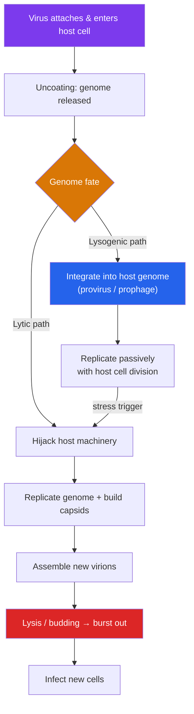

# 🧬 Viruses

> [!abstract] TL;DR
> Viruses are **acellular** infectious particles — a genome (DNA or RNA) packaged in a protein **capsid**, sometimes wrapped in a lipid **envelope** stolen from a host membrane. They are obligate intracellular parasites: they carry no ribosomes or metabolism of their own and can only replicate by hijacking a living host cell's machinery. This is why "are viruses alive?" has no clean answer — they sit on the border of life. Bacteriophages and some viruses can enter either a **lytic cycle** (replicate and burst the cell) or a **lysogenic cycle** (integrate quietly and lie dormant). **Retroviruses** like HIV reverse the usual flow of information, using **reverse transcriptase** to copy their RNA genome into DNA that inserts into the host chromosome. RNA viruses mutate fast (**antigenic drift**) and can reassort into dangerous new strains (**antigenic shift**), which is why influenza vaccines are reformulated yearly.

## Intuition — analogy first

A virus is a **pirated USB stick with no computer of its own**. On its own it is inert — a bit of code (the genome) in a protective case (the capsid). It cannot do anything until it is plugged into a working machine. But once inserted into a host computer (the cell), its code takes over: it commandeers the machine's processor, memory, and power supply to print thousands of copies of the USB stick, often crashing the computer in the process.

That analogy captures the deepest fact about viruses: they are pure information plus a delivery package. They contribute no factory, no energy, no metabolism. Everything a virus "does" is actually done by the host cell, tricked into building viral parts instead of its own. This is also why viruses are so hard to drug — attacking the virus often means attacking the host's own machinery.

---

## How It Works — Viral Replication and Its Two Fates

## Key Concepts

### Viral Structure

Every virion (a single virus particle) has at minimum two parts:

- **Genome** — the genetic payload. Unlike cells (always double-stranded DNA), viral genomes come in every flavor: dsDNA, ssDNA, dsRNA, positive-sense ssRNA, negative-sense ssRNA. This diversity, catalogued by the **Baltimore classification**, dictates how the virus must replicate.
- **Capsid** — a protein shell built from repeating subunits (**capsomeres**), giving common shapes: **helical** (rod-like, e.g., tobacco mosaic virus), **icosahedral** (roughly spherical, 20 faces), or **complex** (e.g., the head-and-tail bacteriophage).

Some viruses add a third layer:

- **Envelope** — a lipid membrane pinched from the host cell as the virus buds out, studded with viral **glycoprotein spikes** (like influenza's hemagglutinin or SARS-CoV-2's spike protein) that bind host receptors. Enveloped viruses are fragile outside the body (soap and drying destroy the membrane) but the spikes are the immune system's main target — and the basis of most vaccines. See [[Vaccines_and_Antibiotics]].

| Property | Typical range |
|---|---|
| Size | ~20–300 nm (10–100× smaller than a bacterium) |
| Genome | DNA *or* RNA, single- or double-stranded |
| Ribosomes / metabolism | **None** |
| Replication | Only inside a living host cell |
| Host range | Often narrow — determined by receptor matching |

### Are Viruses Alive?

Viruses straddle the definition of life. Arguments **against**: they have no cells, no metabolism, no independent energy production, and cannot reproduce on their own — an isolated virion is chemically inert and can even be crystallized like a mineral. Arguments **for**: they possess genomes, evolve by natural selection, and reproduce (with help). The mainstream view treats them as being **"at the edge of life"** — replicators that are biological but not fully alive. What is certain is that they are obligate **intracellular parasites** and utterly dependent on hosts.

### The Lytic and Lysogenic Cycles

Best characterized in **bacteriophages** (viruses that infect bacteria), two replication strategies exist:

**Lytic cycle** — the aggressive route:
1. **Attachment** to a specific host receptor.
2. **Entry / injection** of the genome.
3. **Biosynthesis** — the host is reprogrammed to churn out viral genomes and proteins.
4. **Assembly** of new virions.
5. **Release** by **lysis** (bursting the cell) or, for enveloped viruses, **budding**. One infected cell can release hundreds to thousands of new virions.

**Lysogenic cycle** — the stealth route:
- Instead of replicating immediately, the viral genome **integrates** into the host chromosome as a **prophage** (in bacteria) or **provirus** (in animals). It then replicates passively every time the host cell divides — silent, dormant, invisible to much of the immune response.
- A stress signal (UV, chemicals, host distress) can trigger the prophage to **excise and switch to the lytic cycle**. This latency explains recurrent diseases: herpes and chickenpox/shingles viruses hide in nerve cells for years, then reactivate.

### Retroviruses and Reverse Transcription

Most information in biology flows DNA → RNA → protein (the "central dogma"). **Retroviruses** run one step backwards. Their genome is RNA, and they carry an enzyme, **reverse transcriptase**, that transcribes that RNA *into DNA*. A second enzyme, **integrase**, splices the resulting DNA permanently into the host genome as a **provirus**.

**HIV** (human immunodeficiency virus) is the archetype:
- It targets **helper (CD4⁺) T cells** — the immune system's own coordinators (see [[The_Adaptive_Immune_System]]) — progressively crippling immunity and, untreated, leading to AIDS.
- Reverse transcriptase is **error-prone and lacks proofreading**, so HIV mutates extraordinarily fast, generating swarms of variants that evade antibodies and drugs. This is why HIV needs combination antiretroviral therapy (**ART**) hitting several targets at once, and why a sterilizing vaccine has been so hard to make.
- Modern ART suppresses HIV so effectively that **undetectable = untransmittable (U=U)** and life expectancy approaches normal — though the integrated provirus reservoir prevents cure.

### How Viruses Cause Disease and Evolve

Viruses damage the host by killing infected cells (lysis), triggering harmful immune responses (much COVID-19 lung damage is immune-driven), or transforming cells into cancers (HPV → cervical cancer; hepatitis B → liver cancer). **Tropism** — which tissues a virus infects — is set by which host receptors its surface proteins can bind.

Evolution of surface proteins drives the endless arms race with immunity:

| Mechanism | What happens | Consequence |
|---|---|---|
| **Antigenic drift** | Gradual point mutations in surface proteins | Slow escape from existing immunity; annual flu shot updates |
| **Antigenic shift** | Reassortment — two strains co-infect a cell and swap whole genome segments | Sudden novel surface proteins; **pandemic** potential (e.g., 2009 H1N1) |

RNA viruses drift fastest because their polymerases lack proofreading. This same mutability is why new viruses **emerge** by jumping from animal reservoirs (**zoonotic spillover**) — SARS, MERS, Ebola, and SARS-CoV-2 all crossed from wildlife into humans.

## Real-World Notes

- **Antivirals**, unlike antibiotics, must target virus-specific steps to spare the host — e.g., reverse-transcriptase and protease inhibitors for HIV, neuraminidase inhibitors (oseltamivir) for flu, polymerase inhibitors for hepatitis C (now curable).
- **Vaccines** are the primary defense: they present viral surface proteins to the immune system so memory forms before real infection. mRNA and viral-vector platforms made COVID-19 vaccines possible within a year. See [[Vaccines_and_Antibiotics]].
- **Phage therapy** — using bacteriophages to kill antibiotic-resistant bacteria — is a revived frontier against superbugs.
- **Bacteriophages** also drive bacterial evolution by transduction (moving genes between bacteria) — a link back to [[Bacteria_and_Archaea]].

## Common Pitfalls / Misconceptions

- **"Antibiotics treat viral infections."** They do not — antibiotics target bacterial structures viruses lack. Taking them for a cold is useless and fuels resistance.
- **"Viruses are just very small bacteria."** Viruses are acellular, have no ribosomes or metabolism, cannot reproduce independently, and are far smaller and simpler — a different category entirely.
- **"A virus mutating always makes it deadlier."** Mutations are random; many are neutral or weaken the virus. Selection usually favors *transmissibility*, which is not the same as lethality.
- **"Latent means gone."** A lysogenic/latent virus is integrated and dormant, not eliminated — it can reactivate years later (shingles, HIV reservoirs).
- **"Reverse transcriptase violates the central dogma."** It extends it — information can flow RNA → DNA. The dogma was always about the impossibility of protein → nucleic acid transfer, not RNA → DNA.

## Related Concepts

- [[_MOC_Microbiology_Immunology|↑ Section MOC]]
- [[Bacteria_and_Archaea]] — Hosts of bacteriophages; transduction links viruses to bacterial gene transfer
- [[The_Innate_Immune_System]] — Interferons and NK cells form the first antiviral response
- [[The_Adaptive_Immune_System]] — Cytotoxic T cells and antibodies clear viral infections; HIV attacks this system
- [[Vaccines_and_Antibiotics]] — How viral surface proteins become vaccine targets
- Cross-vault: [[Natural_Selection_and_Adaptation]] — Antigenic drift and shift are natural selection in fast motion

## Review Questions

1. Compare the lytic and lysogenic cycles. What advantage does lysogeny give a virus, and how does it explain the recurrence of diseases like shingles?
2. Explain how a retrovirus like HIV reverses the normal flow of genetic information. Why does the error-prone nature of reverse transcriptase make HIV so difficult to vaccinate against and treat with a single drug?
3. Distinguish antigenic drift from antigenic shift. Which is responsible for the need to reformulate the flu vaccine each year, and which poses the greater pandemic risk, and why?

## Sources

- Flint, S.J. et al. (2020). *Principles of Virology*, 5th ed. ASM Press
- Baltimore, D. (1971). "Expression of animal virus genomes." *Bacteriological Reviews*, 35(3)
- Lodish, H. et al. (2021). *Molecular Cell Biology*, 9th ed. — chapters on viruses and retroviruses. W.H. Freeman
- World Health Organization. "HIV/AIDS" and "Influenza (Seasonal)" fact sheets (who.int)

#biology #microbiology #virology #viruses #retroviruses #hiv
