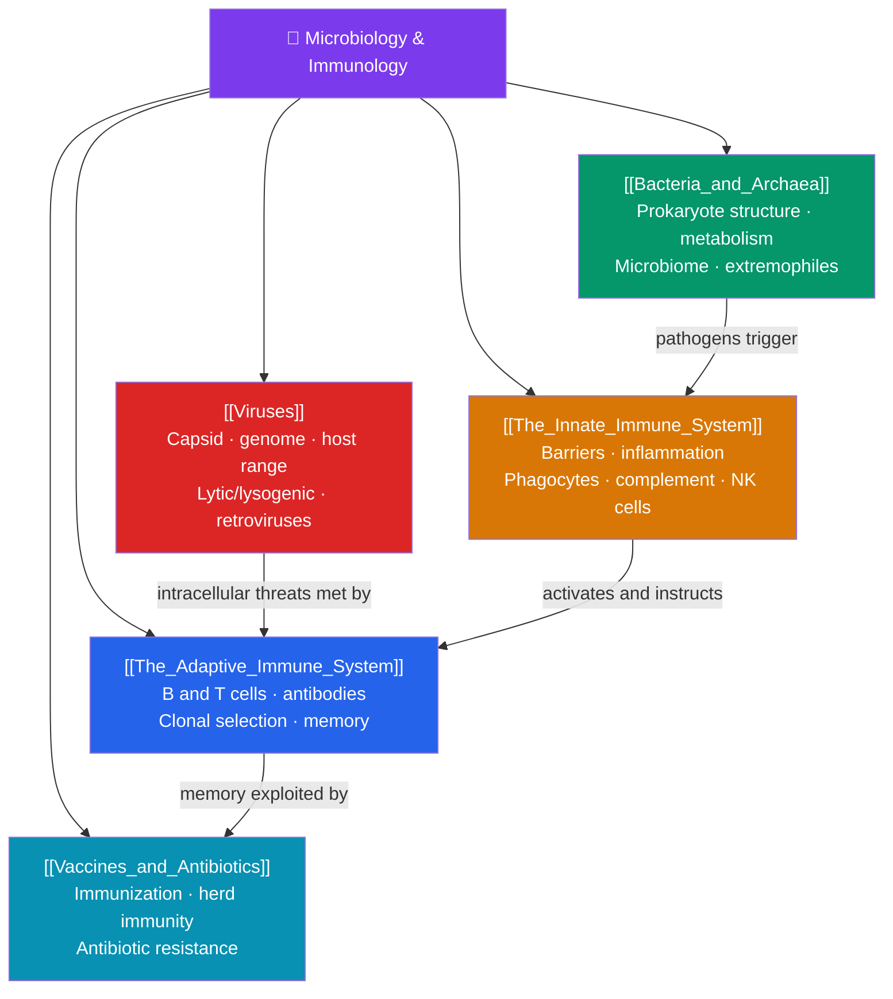

# 🦠 Microbiology and Immunology — Map of Content

> [!abstract] What This Section Covers
> The microbial world is vast, ancient, and inseparable from our own biology. This section surveys the two great microbial domains in **bacteria and archaea** — their cell structure, metabolic diversity, and the human microbiome — and then **viruses**, the acellular replicators, including their structure, the lytic and lysogenic cycles, and retroviruses like HIV. The other half is the immune system's response. **The innate immune system** provides the fast, general first line of defense: physical barriers, inflammation, and phagocytes. **The adaptive immune system** delivers the slower, specific response of B and T lymphocytes, antibodies, and immunological memory. Finally, **vaccines and antibiotics** show how we harness and augment these defenses — and how antibiotic resistance is evolving to defeat them.

## Concept Map

## Learning Path

1. [[Bacteria_and_Archaea]] — Prokaryotic cell structure, the diversity of bacterial metabolism, binary fission and horizontal gene transfer, extremophile archaea, and the human microbiome.
2. [[Viruses]] — Viral structure (capsid, envelope, genome), host specificity, the lytic and lysogenic replication cycles, and retroviruses and reverse transcription.
3. [[The_Innate_Immune_System]] — Physical and chemical barriers, the inflammatory response, phagocytes (neutrophils, macrophages), the complement system, and natural killer cells.
4. [[The_Adaptive_Immune_System]] — Humoral immunity (B cells and antibodies) and cell-mediated immunity (helper and cytotoxic T cells), clonal selection, and immunological memory.
5. [[Vaccines_and_Antibiotics]] — How vaccines train adaptive immunity, herd immunity, how antibiotics target bacteria, and the evolution of antibiotic resistance.

## All Notes at a Glance

| Note | Difficulty | What You'll Learn |
|------|------------|-------------------|
| [[Bacteria_and_Archaea]] | Beginner → Intermediate | Prokaryote structure, cell walls, metabolic modes, conjugation, biofilms, microbiome, archaea |
| [[Viruses]] | Intermediate | Capsids, envelopes, viral genomes, lytic/lysogenic cycles, retroviruses, HIV, emerging viruses |
| [[The_Innate_Immune_System]] | Intermediate | Barriers, inflammation, phagocytosis, complement, cytokines, natural killer cells, fever |
| [[The_Adaptive_Immune_System]] | Intermediate → Advanced | B/T cells, antibodies, antigens, MHC, clonal selection, primary/secondary response, memory |
| [[Vaccines_and_Antibiotics]] | Intermediate | Active/passive immunity, vaccine types, herd immunity, antibiotic mechanisms, resistance |

## Key Questions This Section Answers

- What makes bacteria and archaea structurally different from our own cells?
- Are viruses alive, and how do they hijack a host cell to replicate?
- What is the difference between the innate and adaptive branches of immunity?
- How does the immune system "remember" a pathogen it has seen before?
- How do vaccines work, and why is antibiotic resistance such a serious threat?

## Related Sections

- [[_MOC_Biology_Master|↑ Biology Master MOC]]
- [[_MOC_Plant_Biology|← Plant Biology]]
- [[_MOC_Developmental_Biology|→ Developmental Biology]]

#MOC #Biology #MicroImmuno
