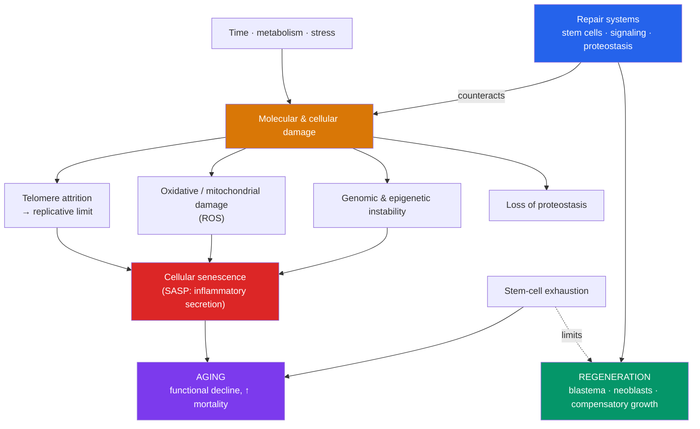

# ⏳ Aging and Regeneration

> [!abstract] TL;DR
> Development doesn't stop at birth — it runs at both ends of life. **Aging (senescence)** is the progressive, time-dependent decline in physiological function and rising probability of death. No single cause explains it; instead a set of interacting **hallmarks** — **telomere attrition**, genomic instability, **oxidative/mitochondrial damage**, epigenetic drift, loss of proteostasis, deregulated nutrient sensing, **cellular senescence**, and stem-cell exhaustion — accumulate over time. Evolutionary theory explains *why* aging exists: selection weakens with age, so genes that are beneficial early but harmful late are tolerated (**antagonistic pleiotropy**), and the body invests in reproduction over indefinite maintenance (**disposable soma**). At the other extreme, some animals **regenerate** spectacularly: planarians rebuild from a fragment, axolotls regrow entire limbs, and even the mammalian liver restores its mass. Regeneration re-deploys developmental signaling and stem cells, and understanding why humans regenerate so poorly — while some animals seemingly resist aging — is one of biology's great open questions.

## Intuition — analogy first

Think of your body as a fleet of delivery trucks that the company can either **maintain forever** or **run into the ground**, and compare it to a lizard's tail.

A rental company that expects each truck to be scrapped after a fixed lease has no reason to build it to last a century — it invests just enough to get through the lease profitably, then lets wear accumulate. That is the **disposable soma** logic of aging: evolution "cares" about a body only long enough to reproduce; maintenance beyond that yields diminishing evolutionary returns, so damage — worn parts, frayed cables (telomeres), corroded engines (mitochondria) — is allowed to pile up. Aging isn't a single broken part; it's the *sum* of unrepaired wear across the whole fleet.

Regeneration is the opposite bet. A salamander that loses its tail doesn't scrap the animal — it keeps a warehouse of blank, buildable parts (**stem cells / a blastema**) and a saved copy of the original assembly instructions (developmental signaling). Feed the fragment those instructions and it rebuilds the missing structure to spec. The deep puzzle is that *we* carry the same instruction manual buried in our genome — we just rarely open it.

---

## How It Works — the balance of damage and repair

## Key Concepts

### Why We Age: Evolutionary Theories

Aging is puzzling because natural selection seemingly "should" favor indefinite survival. The resolution: **the force of selection declines with age**, because organisms in the wild usually die of predation or accident before old age, so late-acting effects are barely "seen" by selection.

| Theory | Core idea |
|---|---|
| **Mutation accumulation** (Medawar) | Late-acting harmful mutations are weakly selected against and accumulate |
| **Antagonistic pleiotropy** (Williams) | Genes beneficial early in life (reproduction) but harmful late are still favored |
| **Disposable soma** (Kirkwood) | Finite energy is allocated between reproduction and somatic maintenance; perfect repair isn't worth it |

These explain **why** aging exists; the hallmarks below explain **how** it happens mechanistically.

### The Hallmarks of Aging

Aging has no single cause. López-Otín et al. (2013, updated 2023) catalog interacting **hallmarks** — each accumulates with age, and experimentally worsening it accelerates aging while ameliorating it can extend healthspan.

| Hallmark | What happens |
|---|---|
| **Genomic instability** | Accumulating DNA damage and mutations |
| **Telomere attrition** | Chromosome ends shorten each division → replicative limit |
| **Epigenetic alterations** | Drift in DNA methylation/chromatin (basis of "epigenetic clocks") |
| **Loss of proteostasis** | Misfolded protein aggregates (link to Alzheimer's, Parkinson's) |
| **Deregulated nutrient sensing** | Altered insulin/IGF-1, mTOR, AMPK, sirtuin signaling |
| **Mitochondrial dysfunction** | Failing energy production, more reactive oxygen species (ROS) |
| **Cellular senescence** | Irreversibly arrested cells accumulate and secrete inflammatory factors |
| **Stem-cell exhaustion** | Declining regenerative reserve |
| **Altered intercellular communication** | Chronic low-grade inflammation ("inflammaging") |

### Telomeres and the Hayflick Limit

- Because DNA polymerase cannot fully replicate chromosome ends, telomeres shorten each division — the **end-replication problem**.
- Once telomeres get critically short, cells stop dividing: the **Hayflick limit** (~40–60 divisions for human fibroblasts).
- The enzyme **telomerase** (reverse transcriptase) rebuilds telomeres and is active in germ cells, stem cells, and ~85–90% of cancers — which is why it is a double-edged target: too little limits regeneration, too much enables tumors. (Discovery of telomerase: Blackburn, Greider, Szostak, 2009 Nobel Prize.)

### Cellular Senescence and the SASP

**Cellular senescence** is a state of stable, irreversible cell-cycle arrest triggered by telomere shortening, DNA damage, or oncogene activation. It is protective in youth — it **blocks damaged cells from becoming cancerous** and aids wound healing — but harmful when senescent cells accumulate:

- Senescent cells secrete the **senescence-associated secretory phenotype (SASP)**: inflammatory cytokines, proteases, and growth factors that damage neighboring tissue and drive "inflammaging."
- **Senolytics** — drugs that selectively clear senescent cells — extend healthspan in mice and are in human trials, a leading translational strategy from aging biology.

### Regeneration: Three Modes and Model Organisms

Not all animals age or repair equally. **Regeneration** — regrowing lost structures — comes in distinct forms:

| Mode | Mechanism | Example |
|---|---|---|
| **Epimorphic** | Dedifferentiation → **blastema** (mass of progenitor cells) → rebuild | **Axolotl** limb; salamander tail |
| **Morphallaxis** | Existing tissue re-patterns with little new proliferation | **Hydra** |
| **Compensatory** | Remaining cells divide without dedifferentiating | Mammalian **liver** |

- **Planarians** rely on **neoblasts** — abundant adult pluripotent stem cells — letting a tiny fragment rebuild an entire worm, including a new brain. Positional cues (a body-wide Wnt gradient) tell the blastema *what* to rebuild — regeneration literally re-runs [[Morphogenesis_and_Pattern_Formation|positional information]].
- **Axolotls** regenerate limbs, jaws, spinal cord, and even parts of the heart, and are notably resistant to cancer and aging — a premier model for regenerative medicine.
- The **liver** is the standout mammalian example: it can restore its mass after losing up to ~70%, via compensatory proliferation of mature hepatocytes.

### Stem Cells and the Niche in Repair

Adult tissues maintain and repair themselves via **stem cells** housed in supportive microenvironments called **niches** (e.g., intestinal crypts, hair-follicle bulge, bone-marrow niche).

- Stem cells balance **self-renewal** vs **differentiation**; the niche's signals (Wnt, Notch — see [[Cell_Signaling_in_Development]]) set that balance.
- **Stem-cell exhaustion** — decline in number/function with age — is a core hallmark linking aging to failing regeneration. For a full treatment of potency, niches, and reprogramming, see [[Stem_Cells_and_Differentiation]].

### The Biology of Longevity

Interventions that extend lifespan across species converge on **nutrient-sensing** pathways:

- **Caloric restriction** reliably extends lifespan in many species; it downshifts **mTOR** and insulin/IGF-1 signaling and upshifts stress-resistance programs.
- The insulin/IGF-1 pathway is central: mutating *daf-2* (insulin receptor) in *C. elegans* **doubles** lifespan (Kenyon, 1993).
- **mTOR inhibition** (e.g., rapamycin) and **AMPK activation** (e.g., metformin) extend lifespan in model organisms; **sirtuins** couple metabolic state to chromatin maintenance.
- Some organisms show **negligible senescence** (certain rockfish, naked mole-rats, some turtles), showing that rapid aging is not biologically inevitable.

## Real-World Notes

- **Senolytics and geroscience**: rather than treating one age-related disease at a time, geroscience targets aging's shared mechanisms — clearing senescent cells or modulating mTOR to compress morbidity.
- **Regenerative medicine**: studying axolotl and planarian regeneration aims to unlock latent human regenerative capacity; understanding why mammals form scars instead of blastemas is a key barrier.
- **Cancer as the flip side**: the very telomerase and proliferative programs that would aid regeneration are what cancers exploit — anti-aging and anti-cancer goals can be in tension.
- **Epigenetic clocks**: DNA-methylation "clocks" now estimate biological (not chronological) age and serve as biomarkers in aging trials and forensic/health contexts.

## Common Pitfalls / Misconceptions

- **"Aging has one cause."** It is **multifactorial** — a network of interacting hallmarks; fixing any single one only partially slows the process.
- **"Cellular senescence is purely bad."** It is **protective against cancer** and aids wound healing early in life; the harm comes from **accumulation** and the SASP over time.
- **"Telomerase is the fountain of youth."** Unrestricted telomerase promotes **cancer**; longevity requires balancing telomere maintenance against tumor suppression.
- **"Aging is programmed like a self-destruct timer."** Mainstream evidence favors **accumulated damage under weak late-life selection**, not an adaptive death program.
- **"Humans can't regenerate at all."** We regenerate liver, blood, gut and skin epithelium, and fingertip tips in children — we just lack **epimorphic** limb-scale regeneration.
- **"Regeneration is just extra cell division."** It requires **re-establishing positional information** so the *correct* structure is rebuilt — a developmental, not merely proliferative, process.

## Related Concepts

- [[_MOC_Developmental_Biology|↑ Section MOC]]
- [[Cell_Signaling_in_Development]] — Wnt/Notch signaling and apoptosis that govern stem-cell niches and regeneration
- [[Morphogenesis_and_Pattern_Formation]] — Positional information that a regenerating blastema must re-read to rebuild correctly
- [[Embryonic_Development_and_Gastrulation]] — The developmental programs regeneration partially recapitulates
- [[Fertilization_and_Early_Development]] — Germ-cell telomerase and totipotency at life's start, contrasting with somatic aging
- Cross-vault: [[Stem_Cells_and_Differentiation]] — Potency, niches, and reprogramming that underpin repair and regeneration

## Review Questions

1. Aging has no single cause. Name three hallmarks of aging and explain how **telomere attrition** mechanistically links cell division to the Hayflick limit. Why is telomerase a therapeutic double-edged sword?
2. Explain the **disposable soma** and **antagonistic pleiotropy** theories. How do they account for the observation that the force of natural selection declines with age?
3. Compare **epimorphic** regeneration in the axolotl with **compensatory** regeneration in the mammalian liver. Why do biologists say regeneration must re-establish positional information rather than simply proliferate cells?

## Sources

- López-Otín, C., Blasco, M.A., Partridge, L., Serrano, M. & Kroemer, G. (2013, updated 2023). "The hallmarks of aging." *Cell*, 153(6), 1194–1217
- Kirkwood, T.B.L. (2005). "Understanding the odd science of aging." *Cell*, 120(4), 437–447
- Kenyon, C. (2010). "The genetics of ageing." *Nature*, 464, 504–512
- Tanaka, E.M. & Reddien, P.W. (2011). "The cellular basis for animal regeneration." *Developmental Cell*, 21(1), 172–185

#biology #developmental-biology #aging #senescence #regeneration
