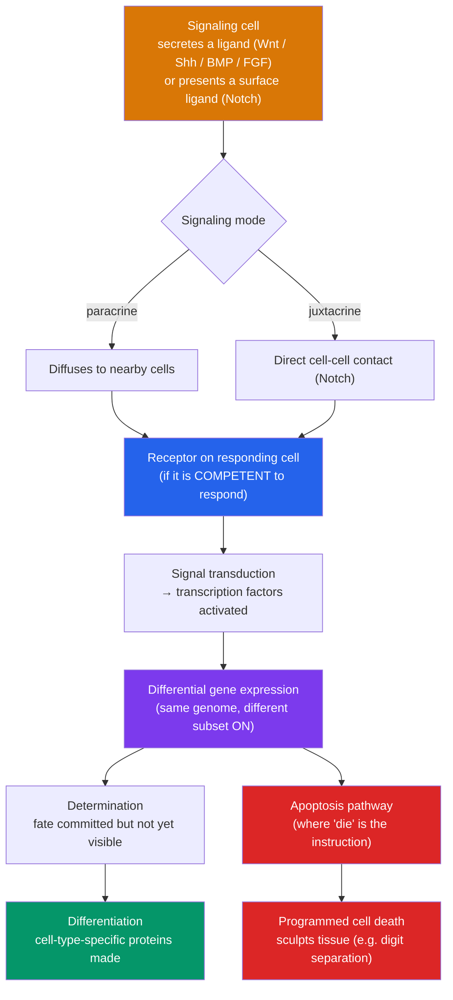

# 📡 Cell Signaling in Development

> [!abstract] TL;DR
> Every cell in your body carries the **same genome**, yet a neuron and a liver cell could hardly be more different. Development resolves this paradox through **cell signaling**: cells talk to their neighbors to decide what to become. **Induction** is one tissue instructing an adjacent tissue to adopt a fate — the classic case being Spemann and Mangold's **organizer**, which can induce a whole second body axis. A small toolkit of signaling pathways — **Notch, Wnt, Hedgehog, TGF-β/BMP, FGF** — is reused over and over to relay these instructions. The signals drive **differentiation**: progressive, largely irreversible commitment in which each cell type switches on a distinct subset of the shared genome. And development uses **apoptosis** — programmed cell death — not as failure but as a **sculpting tool**, carving fingers from a paddle-shaped hand and pruning surplus neurons. Same genome, different conversations, radically different cells.

## Intuition — analogy first

Imagine an orchestra where every musician has an **identical, complete score** for the entire symphony — every instrument's part bound into one thick book.

If they all played everything at once, the result would be noise. What makes it music is that each musician plays only *their* lines, and they take cues from a conductor and from the players around them: "the cellos entered, so now it's our turn." No musician needs a different book; they need to know *which page, which line, right now*. That knowing comes almost entirely from **listening to neighbors and cues**, not from having different sheet music.

Development works exactly this way. Every cell holds the same genomic "score." **Signaling** is how a cell learns which lines to play: a neighbor releases a molecule ("the notochord just signaled"), and the cell responds by switching on its neural part. And just as an editor cuts an overwritten passage, development deliberately **silences** some players entirely — apoptosis removes cells that were needed only temporarily, so the final performance has exactly the right shape.

---

## How It Works — from signal to committed cell fate

## Key Concepts

### Induction and Competence

**Induction** is the process by which one group of cells (the **inducer**) changes the developmental fate of an adjacent group (the **responder**).

- **Instructive induction**: the signal specifies *which* fate ("become lens"); different signals give different outcomes.
- **Permissive induction**: the signal merely *allows* an already-specified program to proceed (like providing a required substrate).
- **Competence**: the responder can only react if it is **competent** — expressing the right receptors and intracellular machinery at that moment. Competence is time-limited, which is why the *same* signal has different effects at different stages.

The landmark experiment is **Spemann & Mangold (1924)**: transplanting the dorsal blastopore lip of a newt embryo into a host induced a **second, complete body axis** built largely from *host* cells. That tissue — the **organizer** — is the archetype of an inducing center. (Its signals help pattern the axes described in [[Embryonic_Development_and_Gastrulation]].)

### Modes of Signaling

| Mode | Range | Example |
|---|---|---|
| **Autocrine** | Cell signals itself | Reinforcing a committed fate |
| **Juxtacrine** | Direct contact only | **Notch–Delta** lateral inhibition |
| **Paracrine** | Local diffusion | Most morphogens (Shh, Wnt, BMP, FGF) |
| **Endocrine** | Long-range via bloodstream | Hormones (e.g., thyroid hormone in metamorphosis) |

### The Developmental Signaling Toolkit

A striking feature of development is **economy**: a handful of conserved pathways, reused in countless contexts, account for most inductive events.

| Pathway | Core logic | Representative developmental roles |
|---|---|---|
| **Notch–Delta** | Juxtacrine; **lateral inhibition** sharpens differences between neighbors | Choosing neuron vs epidermis; boundary formation; salt-and-pepper fate decisions |
| **Wnt / β-catenin** | Ligand stabilizes β-catenin → enters nucleus → activates targets | Axis formation, stem-cell maintenance, segmentation |
| **Hedgehog (Shh)** | Ligand relieves Patched inhibition of Smoothened → Gli TFs | Neural tube D–V patterning, limb digit identity |
| **TGF-β / BMP** | Receptor kinases → **SMAD** transcription factors | Dorsal–ventral patterning, bone/mesoderm induction |
| **FGF (RTK)** | Receptor tyrosine kinase → RAS/MAPK cascade | Limb outgrowth, mesoderm induction, gastrulation movements |

**Lateral inhibition** via Notch is worth highlighting: a cell that starts to adopt a fate signals its neighbors *not* to — amplifying a tiny initial difference into a sharp, alternating pattern (used to space out sensory neurons and bristles).

### Determination vs Differentiation

Two distinct milestones:

- **Determination**: a cell becomes **committed** to a fate — its future is fixed even though it still looks unspecialized. Testable by transplantation: a determined cell keeps its fate in a new environment.
- **Differentiation**: the cell **manifests** that fate, expressing cell-type-specific proteins (hemoglobin in red cells, myosin in muscle, neurofilaments in neurons).

Commitment is generally **progressive and largely irreversible**, proceeding from broadly **specified** (reversible) to firmly **determined** (stable).

### One Genome, Many Cell Types

The central paradox — identical DNA, divergent cells — is resolved by **differential gene expression**:

- **Master transcription factors** (e.g., *MyoD* for muscle) can reprogram a cell's identity, showing that fate is encoded in *which genes are on*, not in DNA content.
- **Epigenetic mechanisms** — DNA methylation, histone modification, chromatin remodeling — **lock in** expression states so a differentiated cell (and its daughters) "remembers" its identity. See [[Gene_Regulation]].
- **Combinatorial control**: it is the *combination* of active transcription factors, not any single gene, that defines a cell type.
- **Reversibility exists in principle**: nuclear transfer (Gurdon's frog experiments) and **iPSC reprogramming** (Yamanaka factors) show the genome is intact and can be reset — the foundation of the stem-cell biology in [[Aging_and_Regeneration]].

### Apoptosis: Death as a Sculpting Tool

**Apoptosis** is **programmed cell death** — an orderly, genetically controlled dismantling of a cell (chromatin condensation, membrane blebbing, packaging into apoptotic bodies), distinct from messy necrosis.

- Executed by **caspases**, regulated by the **Bcl-2** family; mitochondrial cytochrome-c release is a key trigger.
- **Sculpting the body**: apoptosis of **interdigital webbing** separates fingers and toes — failure causes syndactyly (webbed digits).
- **Neural pruning**: roughly half of the neurons initially produced die back; those that fail to secure enough survival factor (**neurotrophins** like NGF) undergo apoptosis, matching neuron number to target size.
- **Model organism**: in *C. elegans*, exactly **131 of 1090** somatic cells die on a fixed, mapped schedule — the discovery of the core death genes (*ced-3, ced-4, ced-9*) won the 2002 Nobel Prize.

Development thus uses death as constructively as it uses division.

## Real-World Notes

- **Cancer**: the same pathways (Wnt, Hedgehog, Notch) that drive development are **hijacked in tumors** when reactivated inappropriately — many targeted cancer drugs (e.g., Smoothened inhibitors for basal cell carcinoma) are literally developmental-pathway blockers.
- **Regenerative medicine**: directing stem cells to a desired cell type means applying the right signals in the right order — recapitulating induction in a dish.
- **Birth defects**: mutations in Hedgehog signaling cause holoprosencephaly; failure of interdigital apoptosis causes syndactyly — clinical signatures of signaling errors.
- **Immune homeostasis**: apoptosis removes self-reactive lymphocytes; its dysregulation contributes to autoimmunity and to cancer cell survival.

## Common Pitfalls / Misconceptions

- **"Different cells have different DNA."** Nearly all somatic cells share an **identical genome**; differences come from **differential expression**, locked in epigenetically. (Notable exceptions: mature red blood cells lose their nucleus; lymphocytes rearrange antigen-receptor genes.)
- **"Determination and differentiation are the same."** Determination is invisible **commitment**; differentiation is the visible **expression** of that fate — a cell can be determined long before it differentiates.
- **"Apoptosis means something went wrong."** In development, programmed death is **essential and constructive** — it sculpts digits, prunes neurons, and hollows out tubes.
- **"There must be a unique pathway for every decision."** Development reuses a **small toolkit** of pathways combinatorially; context and competence, not new pathways, generate diversity.
- **"An inducing signal works on any nearby cell."** Only **competent** cells — with the right receptors at the right time — can respond, which is why timing is decisive.

## Related Concepts

- [[_MOC_Developmental_Biology|↑ Section MOC]]
- [[Morphogenesis_and_Pattern_Formation]] — The morphogens (Shh, Wnt, BMP) whose gradients these pathways transduce
- [[Embryonic_Development_and_Gastrulation]] — The organizer and notochord induction that drive gastrulation and neurulation
- [[Aging_and_Regeneration]] — Reprogramming, stem cells, and re-activating these signals to repair tissue
- [[Fertilization_and_Early_Development]] — Indeterminate blastomeres whose fates depend on this signaling
- Cross-vault: [[Gene_Regulation]] — Transcription-factor and epigenetic machinery that executes differentiation

## Review Questions

1. State the "one genome, many cell types" paradox and explain how it is resolved. Include the roles of transcription factors and epigenetic memory, and cite one experiment (nuclear transfer or iPSC reprogramming) showing the genome remains intact.
2. Distinguish **instructive** from **permissive** induction and explain why **competence** determines whether a signal has any effect. Use the Spemann–Mangold organizer to illustrate induction.
3. Explain how apoptosis contributes constructively to development, giving two concrete examples. Why is the *C. elegans* cell lineage such powerful evidence that programmed cell death is genetically controlled?

## Sources

- Gilbert, S.F. & Barresi, M.J.F. (2020). *Developmental Biology* (12th ed.). Sinauer/Oxford — induction and cell-fate chapters
- Spemann, H. & Mangold, H. (1924). "Induction of embryonic primordia by implantation of organizers from a different species." (reprinted transl. *Int. J. Dev. Biol.*, 2001)
- Perrimon, N., Pitsouli, C. & Shilo, B.-Z. (2012). "Signaling mechanisms controlling cell fate and embryonic patterning." *Cold Spring Harb. Perspect. Biol.*, 4(8)
- Fuchs, Y. & Steller, H. (2011). "Programmed cell death in animal development and disease." *Cell*, 147(4), 742–758

#biology #developmental-biology #cell-signaling #induction #differentiation
