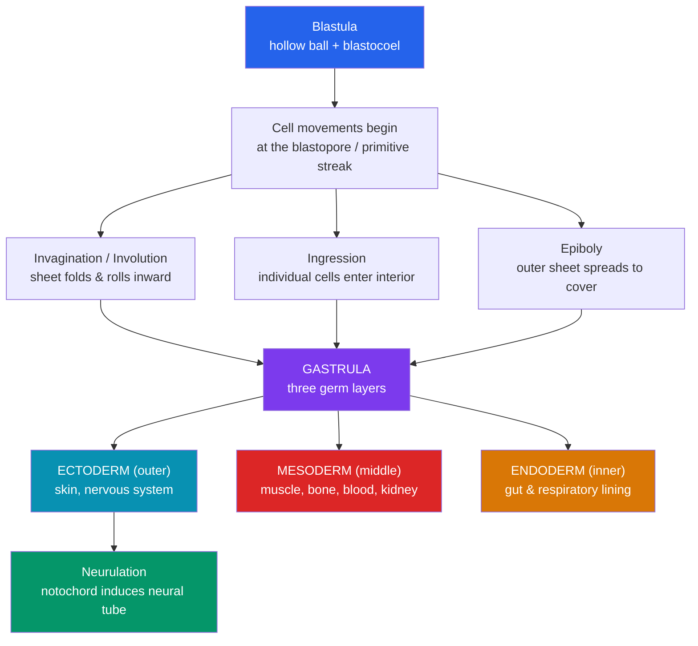

# 🧬 Embryonic Development and Gastrulation

> [!abstract] TL;DR
> **Gastrulation** is the most dramatic reorganization in an organism's life: a hollow ball of cells (the blastula) folds, migrates, and rearranges itself into a layered structure with an inside, an outside, and a middle. This produces the three **germ layers** — **ectoderm** (outer: skin and nervous system), **mesoderm** (middle: muscle, bone, blood, kidneys), and **endoderm** (inner: gut and respiratory lining) — each with a defined future. Gastrulation also establishes the primary body axes and the gut tube. It is immediately followed by **neurulation**, in which the notochord induces the ectoderm above it to roll into the **neural tube**, the forebearer of the brain and spinal cord. As embryologist Lewis Wolpert quipped, *"it is not birth, marriage, or death, but gastrulation which is truly the most important time in your life."*

## Intuition — analogy first

Imagine a hollow rubber ball, and you press one spot inward with your thumb until the dimple reaches the far wall.

You have just turned a one-layer ball into something with a distinct **outside surface**, an **inner tube** (where your thumb pushed in), and a **space between** the two. That single act of infolding is the essence of gastrulation: a sheet of cells tucks inward, and suddenly the embryo has topology it never had before — an inside and an outside that are made of *different* cells with *different* destinies.

Now extend the analogy. The outer surface will become your skin and, remarkably, your brain. The tube you pushed in becomes your gut, from mouth to anus. And the loose cells you dragged in between the two layers become everything structural — your heart, muscles, blood, and skeleton. From one repeated folding motion, the entire architectural plan of the animal body is laid down. Nothing is built yet, but every future organ now has a "starting neighborhood."

---

## How It Works — blastula to three-layered gastrula

## Key Concepts

### The Cell Movements of Gastrulation

Gastrulation is choreography, not growth — the same cells rearrange through a repertoire of coordinated movements:

- **Invagination**: an epithelial sheet buckles inward (like pressing the rubber ball).
- **Involution**: an outer sheet rolls under and spreads along the inner surface.
- **Ingression**: individual cells leave the sheet and migrate into the interior (they undergo an **epithelial-to-mesenchymal transition**, EMT).
- **Epiboly**: outer sheets thin and spread to enclose deeper layers.
- **Delamination**: a sheet splits into two parallel layers.

These movements are powered by changes in cell shape (apical constriction), cell adhesion (cadherin switching), and directed migration along molecular cues.

### The Blastopore: Protostomes vs Deuterostomes

The site where cells first tuck inward is the **blastopore** (or its equivalent). Its fate splits the animal kingdom:

| Feature | **Protostomes** | **Deuterostomes** |
|---|---|---|
| Meaning | "mouth first" | "mouth second" |
| Blastopore becomes | **Mouth** | **Anus** |
| Cleavage | Often spiral, determinate | Often radial, indeterminate |
| Coelom formation | Schizocoely (splitting) | Enterocoely (pouching) |
| Examples | Molluscs, annelids, arthropods | Echinoderms, chordates (incl. humans) |

In amniotes (birds, reptiles, mammals) the functional equivalent of the blastopore is the **primitive streak**, a groove through which cells ingress to form mesoderm and endoderm.

### The Three Germ Layers and Their Derivatives

Every tissue in the adult body traces back to one of three germ layers established at gastrulation. This is one of the most useful tables in all of biology:

| Germ Layer | Position | Major Derivatives |
|---|---|---|
| **Ectoderm** | Outer | Epidermis (skin, hair, nails); entire **nervous system** (brain, spinal cord, neurons); neural crest; lens of eye; tooth enamel |
| **Mesoderm** | Middle | Skeletal, cardiac & smooth **muscle**; bone & cartilage; **blood** & blood vessels; heart; kidneys & gonads; dermis; connective tissue |
| **Endoderm** | Inner | Lining of the **gut tube**; liver & pancreas; lining of lungs & respiratory tract; thyroid; bladder lining |

A memory aid: **ecto** = "attracto" (what touches the outside world — skin and the nervous system that senses it); **endo** = the innermost tube (gut and its outgrowths); **meso** = the "meat" in between (muscle, blood, bone).

### The Body Plan and Axes

Gastrulation lays down the primary **body axes** that all later patterning refers to:

- **Anterior–posterior (A–P)**: head to tail.
- **Dorsal–ventral (D–V)**: back to belly.
- **Left–right (L–R)**: bilateral symmetry, with subtle asymmetries (heart on the left) set up by cilia-driven fluid flow at the node.

The mesoderm subdivides along the D–V axis into **notochord** (midline rod), **somites** (segmented blocks → vertebrae and skeletal muscle), **intermediate mesoderm** (→ kidneys), and **lateral plate mesoderm** (→ heart, body-wall lining). How positional identity is assigned along these axes is the subject of [[Morphogenesis_and_Pattern_Formation]].

### Neurulation

Immediately after gastrulation, the nervous system is founded by **induction** (see [[Cell_Signaling_in_Development]]):

1. The **notochord** (dorsal mesoderm) signals to the ectoderm directly above it.
2. That ectoderm thickens into the **neural plate**.
3. The plate's edges rise as **neural folds** that fuse at the midline into the **neural tube** (primary neurulation) — the future brain (anterior) and spinal cord (posterior).
4. Cells pinch off the fold crests as **neural crest cells** — a uniquely vertebrate, highly migratory population that becomes peripheral neurons, glia, pigment cells, and much of the facial skeleton (sometimes called the "fourth germ layer").

Failure of the neural tube to close causes **neural tube defects** such as spina bifida and anencephaly — the clinical reason folate is recommended before and during early pregnancy.

### Organogenesis (Overview)

Once germ layers and axes exist, **organogenesis** builds organs from combinations of layers — e.g., the gut (endoderm lining + mesoderm muscle), limbs (mesoderm core + ectoderm skin), and the heart (mesoderm). The detailed signaling that drives these steps is covered in the pattern-formation and signaling notes.

## Real-World Notes

- **Stem cell science**: differentiating pluripotent stem cells into a therapeutic cell type usually means first pushing them toward the correct **germ layer** (definitive endoderm for pancreatic beta cells, mesoderm for cardiomyocytes) — germ-layer logic is a lab protocol, not just theory.
- **Gastrulation as an ethical/legal marker**: the appearance of the **primitive streak** (~day 14 in humans) has historically bounded permitted human embryo research, because it marks the point after which twinning can no longer occur and individual development begins.
- **Cancer and EMT**: the epithelial-to-mesenchymal transition that lets gastrulating cells migrate is re-deployed pathologically by metastasizing tumor cells — developmental biology directly informs cancer biology.
- **Teratology**: many birth defects arise from errors in gastrulation and neurulation windows, which is why the first trimester is so sensitive to teratogens.

## Common Pitfalls / Misconceptions

- **"The nervous system comes from a special tissue."** The brain and spinal cord are **ectoderm** — the same layer as skin — reflecting their shared surface origin.
- **"Gastrulation grows the embryo."** Like cleavage, gastrulation is mostly **rearrangement**; cells move and change shape far more than they multiply or enlarge.
- **"Mesoderm is a minor middle layer."** Mesoderm produces the bulk of body mass — all muscle, the skeleton, blood, heart, and kidneys.
- **"Humans are protostomes because the mouth is 'up top'."** Humans are **deuterostomes**: the blastopore becomes the anus and the mouth forms second.
- **"Germ layers = germ cells."** Germ *layers* are the three embryonic tissue layers; germ *cells* are the reproductive (sperm/egg) lineage, set aside separately.

## Related Concepts

- [[_MOC_Developmental_Biology|↑ Section MOC]]
- [[Fertilization_and_Early_Development]] — Produces the blastula that gastrulation reshapes
- [[Morphogenesis_and_Pattern_Formation]] — How positional identity is assigned along the axes set up here
- [[Cell_Signaling_in_Development]] — Induction (e.g., notochord → neural plate) that drives neurulation and organogenesis
- [[Aging_and_Regeneration]] — Whether adult tissues can re-run these developmental programs to repair themselves
- Cross-vault: [[Gene_Regulation]] — Differential gene expression that gives each germ layer its identity

## Review Questions

1. List the three germ layers and give two major adult derivatives of each. Explain why it is initially surprising — but developmentally logical — that skin and the brain share a germ-layer origin.
2. Compare protostomes and deuterostomes with respect to the fate of the blastopore, and place humans in the correct group with justification.
3. Describe the sequence of events in primary neurulation, naming the signaling tissue and the structures formed. What clinical condition results from failure of neural tube closure, and what preventive measure reduces its incidence?

## Sources

- Gilbert, S.F. & Barresi, M.J.F. (2020). *Developmental Biology* (12th ed.). Sinauer/Oxford — gastrulation chapters
- Wolpert, L. et al. (2019). *Principles of Development* (6th ed.). Oxford University Press
- Solnica-Krezel, L. & Sepich, D.S. (2012). "Gastrulation: making and shaping germ layers." *Annual Review of Cell and Developmental Biology*, 28, 687–717
- Stern, C.D. (ed.) (2004). *Gastrulation: From Cells to Embryo*. Cold Spring Harbor Laboratory Press

#biology #developmental-biology #gastrulation #germ-layers #neurulation
