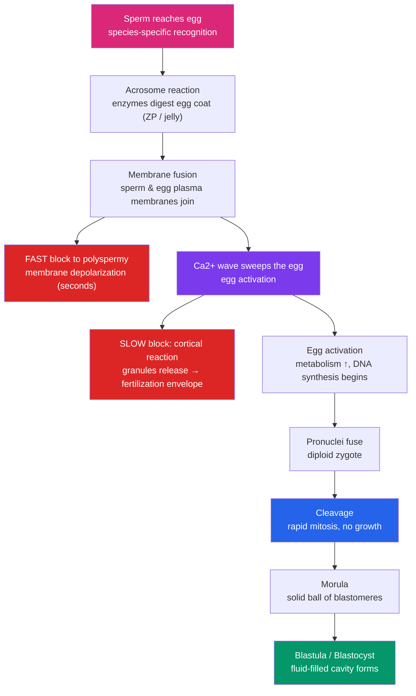

# 🥚 Fertilization and Early Development

> [!abstract] TL;DR
> Fertilization is the fusion of a haploid sperm and a haploid egg to form a diploid zygote, but it is far more than a merger of DNA — it is a tightly controlled recognition event that must admit **exactly one** sperm. Species-specific molecular handshakes ensure the right gametes meet; two sequential blocks (a fast electrical block and a slow cortical-reaction block) prevent **polyspermy**. The calcium wave that follows *activates* the egg, switching on metabolism and DNA synthesis. The zygote then undergoes **cleavage** — rapid mitotic divisions with no net growth — partitioning the large egg into many small cells and building a hollow **blastula** (a **blastocyst** in mammals). Whether early blastomeres have fixed fates (**determinate**) or interchangeable ones (**indeterminate**) distinguishes major animal lineages.

## Intuition — analogy first

Think of the egg as a fully stocked, single-story warehouse and the sperm as a courier delivering the one missing blueprint.

The warehouse is enormous compared to the courier — it already contains all the raw materials, machinery, and energy (yolk, mRNA, ribosomes, mitochondria) needed to run a construction project. What it lacks is the second half of the instructions and the "start" signal. When the courier arrives, two things must happen instantly: the door must slam shut so no second courier gets in (a rival blueprint would be catastrophic), and the alarm-clock (a wave of calcium) must ring to wake the whole facility.

Then comes the twist. Instead of the warehouse growing bigger, it gets **partitioned** — the single vast space is subdivided by walls into hundreds of small rooms, without adding any new floor area. That is cleavage: the giant zygote is carved into many small cells so that later on, individual cells can be assigned individual jobs. Only once the rooms are small enough does the building start to actually grow.

---

## How It Works — from contact to blastula

## Key Concepts

### Sperm–Egg Recognition

Fertilization begins with **species-specific recognition**, which prevents cross-species fusion — critical for external fertilizers like sea urchins that spawn into open water.

- **Chemotaxis**: the egg releases small peptides (e.g., *resact* in sea urchins) that guide sperm up a concentration gradient.
- **Acrosome reaction**: contact with the egg's outer coat triggers exocytosis of the sperm's **acrosome**, releasing hydrolytic enzymes that bore through the protective layer (the **jelly coat** in sea urchins, the **zona pellucida** in mammals).
- **Molecular handshake**: a protein on the exposed sperm surface binds a complementary receptor on the egg. In sea urchins this is **bindin**; in mammals sperm bind **ZP3** (and related proteins) in the zona pellucida. The lock-and-key specificity is the gatekeeper for species identity.
- **Membrane fusion**: only after recognition do the two plasma membranes fuse, delivering the sperm nucleus (and centriole, in most animals) into the egg cytoplasm.

### The Block to Polyspermy

If two sperm fuse, the resulting cell has three sets of chromosomes (triploid) and abnormal centrosome numbers — usually lethal. Eggs use a **two-tier defense**.

| Block | Speed | Mechanism | Duration |
|---|---|---|---|
| **Fast block** | ~1–3 seconds | Sperm entry triggers Na⁺ influx → membrane **depolarizes**; positively charged membrane repels additional sperm | Temporary (~1 min) |
| **Slow block (cortical reaction)** | ~20–60 seconds | Ca²⁺ wave triggers **cortical granules** to fuse with the membrane, releasing enzymes and osmotically active contents; water rushes in, lifting the vitelline layer into a hardened **fertilization envelope** | Permanent |

The **fast block** is well documented in sea urchins; mammals rely mainly on the **cortical reaction** (the "zona reaction"), which enzymatically alters ZP proteins so no further sperm can bind. The universal trigger for the slow block is a **wave of free calcium** that sweeps across the egg from the point of sperm entry.

### Egg Activation

The same Ca²⁺ wave that drives the cortical reaction also **activates** the metabolically dormant egg:

- Sperm delivers **PLCζ (phospholipase C zeta)**, which generates IP₃ and releases Ca²⁺ from the endoplasmic reticulum.
- Increased intracellular pH and Ca²⁺ switch on **protein synthesis** (using maternal mRNA stockpiled during oogenesis) and initiate **DNA replication**.
- The haploid sperm and egg nuclei — now called **pronuclei** — migrate together, and their chromosomes combine to restore the **diploid** number in the **zygote**. (For how haploidy is produced, see [[Meiosis_and_Genetic_Variation]].)

### Cleavage

**Cleavage** is a series of rapid mitotic divisions with **no cell growth between divisions** — the embryo stays the same total size while cell number rises exponentially.

- The cell cycle is stripped down to alternating **S and M phases** (skipping most of G1/G2), so divisions are extraordinarily fast.
- Each division increases the **nucleocytoplasmic ratio**, partitioning the huge egg into normal-sized cells called **blastomeres**.
- Control passes from maternal mRNA to the embryo's own genome at the **midblastula transition (MBT)**, when zygotic transcription switches on.

**Cleavage geometry** depends on how much yolk crowds the divisions:

| Pattern | Yolk | Example | Description |
|---|---|---|---|
| **Holoblastic** | Little/moderate | Sea urchin, frog, mammal | Furrows pass completely through the egg |
| **Meroblastic** | Heavy | Bird, reptile, fish | Furrows are restricted to a yolk-free disc atop the yolk |
| **Radial** | — | Echinoderms, chordates | Tiers of cells stacked directly above each other |
| **Spiral** | — | Molluscs, annelids | Cells offset at an angle (deuterostome vs protostome hallmark) |

### Determinate vs Indeterminate Cleavage

A defining early question: is a blastomere's fate already fixed?

| Feature | **Determinate (mosaic)** | **Indeterminate (regulative)** |
|---|---|---|
| Fate of early blastomeres | Fixed very early | Flexible / interchangeable |
| Isolate one blastomere | Yields a **partial** embryo | Can yield a **complete** embryo |
| Basis | Localized cytoplasmic determinants | Fate assigned later by cell–cell signals |
| Typical of | Many protostomes (molluscs, annelids) | Deuterostomes (echinoderms, vertebrates) |
| Consequence | — | Identical twins possible from split embryos |

Indeterminate cleavage is why splitting a mammalian embryo can produce **identical twins**, and why early cell fates depend heavily on [[Cell_Signaling_in_Development|induction]] rather than pre-loaded instructions.

### Morula, Blastula, and Blastocyst

- **Morula**: a solid ball of blastomeres (Latin *morula* = "mulberry").
- **Blastula**: a hollow ball formed as cells pump fluid into a central cavity, the **blastocoel**.
- **Blastocyst** (mammals): a specialized blastula with an outer **trophoblast** (becomes placenta) and an inner **inner cell mass / embryoblast** (becomes the embryo proper), surrounding the blastocoel. **Implantation** into the uterine wall follows.

## Real-World Notes

- **IVF and ICSI**: in *intracytoplasmic sperm injection*, a single sperm is injected directly into the egg, bypassing natural recognition and the acrosome reaction — which is why sperm-selection quality matters so much clinically.
- **Preimplantation genetic testing**: because early mammalian cleavage is **indeterminate**, one or a few cells can be biopsied from the blastocyst's trophoblast for genetic screening without harming the embryo.
- **Contraception research**: several approaches target sperm–egg recognition (e.g., anti-ZP3 strategies) precisely because it is a species-specific, essential bottleneck.
- **Polyspermy in agriculture/aquaculture**: in vitro fertilization of fish and shellfish must control sperm concentration carefully, because overwhelming the egg's blocks causes lethal polyspermy.

## Common Pitfalls / Misconceptions

- **"Fertilization is just DNA mixing."** The bigger events are the *blocks to polyspermy* and *egg activation* — fusion of nuclei is almost an afterthought relative to the calcium-driven cell biology.
- **"The fastest sperm wins."** Recognition is molecular, not a footrace; the acrosome reaction and correct ligand binding matter more than raw speed, and many sperm reach the egg together.
- **"Cleavage makes the embryo bigger."** Cleavage adds cells without adding mass — the embryo *subdivides* rather than grows until after the blastula stage.
- **"Blastula and blastocyst are the same word for the same thing."** The blastocyst is the *mammalian* form, distinguished by having two committed populations (trophoblast + inner cell mass) before implantation.
- **"Every animal has a fast block."** The fast electrical block is prominent in some invertebrates (e.g., sea urchins) but is minor or absent in mammals, which rely on the cortical/zona reaction.

## Related Concepts

- [[_MOC_Developmental_Biology|↑ Section MOC]]
- [[Embryonic_Development_and_Gastrulation]] — What the blastula does next: cell movements that build the three germ layers
- [[Cell_Signaling_in_Development]] — How indeterminate blastomeres get their fates assigned by induction
- [[Morphogenesis_and_Pattern_Formation]] — How positional identity is later layered onto these early cells
- [[Aging_and_Regeneration]] — The other end of the life cycle these divisions begin
- Cross-vault: [[Meiosis_and_Genetic_Variation]] — How the haploid gametes that fuse here are produced
- Cross-vault: [[_MOC_Cell_Division|Cell Division and Reproduction]] — Mitosis mechanics underlying cleavage

## Review Questions

1. An egg admits two sperm and becomes triploid, which is lethal. Describe the two sequential mechanisms that normally prevent this, noting which is fast and temporary versus slow and permanent, and identify the common upstream trigger for both effects.
2. You isolate a single blastomere from a 4-cell sea urchin embryo and it develops into a complete (if small) larva; the same experiment on a mollusc yields only a partial embryo. Name the two cleavage types this distinguishes and explain the underlying difference in how cell fate is specified.
3. Explain why cleavage divisions are unusually rapid and why the embryo does not increase in overall size during this period. What is the significance of the increasing nucleocytoplasmic ratio and the midblastula transition?

## Sources

- Gilbert, S.F. & Barresi, M.J.F. (2020). *Developmental Biology* (12th ed.). Sinauer/Oxford — chapters on fertilization and cleavage
- Wolpert, L. et al. (2019). *Principles of Development* (6th ed.). Oxford University Press
- Wassarman, P.M. (1999). "Mammalian fertilization: molecular aspects of gamete adhesion, exocytosis, and fusion." *Cell*, 96(2), 175–183
- Stein, K.K., Primakoff, P. & Myles, D. (2004). "Sperm–egg fusion: events at the plasma membrane." *Journal of Cell Science*, 117(26), 6269–6274

#biology #developmental-biology #fertilization #cleavage #blastula
