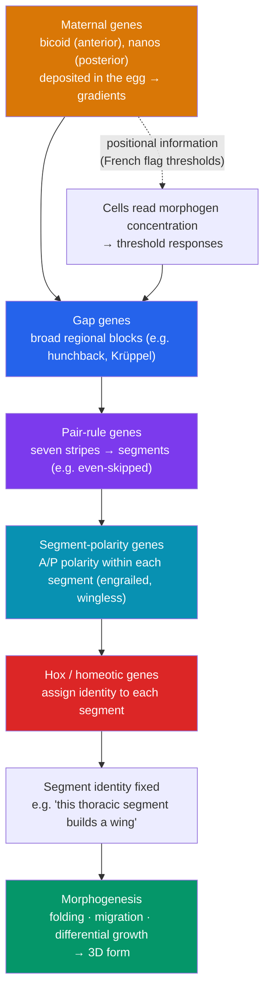

# 🧭 Morphogenesis and Pattern Formation

> [!abstract] TL;DR
> **Pattern formation** is how an initially uniform sheet of cells acquires a spatial organization — how a cell "knows" it belongs to a finger versus a wrist, a head versus a tail. The dominant idea is **positional information**: cells read their location from the concentration of a diffusible signal called a **morphogen**, then interpret different thresholds as different fates (Lewis Wolpert's **French flag model**). Superimposed on this are the **Hox genes** — an ancient, conserved cluster of transcription factors whose order along the chromosome mirrors their expression order along the head-to-tail axis (**colinearity**). They are the master addressing system for the body. When Hox genes misfire, one body part is built in the place of another — **homeotic transformations** like *Drosophila*'s legs-for-antennae (*Antennapedia*) or four wings (*bithorax*). **Morphogenesis** proper is the physical sculpting — folding, migration, and differential growth — that turns these genetic addresses into three-dimensional form.

## Intuition — analogy first

Picture a long row of thermostats in a hallway, all wired to a single furnace at one end.

The furnace pumps heat down the hall, so each thermostat reads a slightly lower temperature than the one before it. Now give every thermostat the same rule: "above 25°, paint the wall red; between 15° and 25°, paint it white; below 15°, paint it blue." Nobody told any individual thermostat *where* it is — yet the hallway ends up striped red, then white, then blue, in perfect order. Each cell inferred its position purely from how much "heat" (morphogen) it detected, and interpreted that number through a shared set of thresholds.

That is positional information, and it produces the **French flag**. But there is a second layer. Imagine each stripe also gets a **zip code** stamped on it — a label that says "this is thoracic segment 2, build a wing here" or "this is a head segment, build an antenna." Those zip codes are the **Hox genes**. Change the zip code and the cells dutifully build the *wrong but perfectly formed* structure in that location — an antenna where a leg should be. The gradient tells a cell *where* it is; the Hox code tells it *what to make there*.

---

## How It Works — the Drosophila patterning hierarchy

## Key Concepts

### Positional Information and the French Flag Model

Lewis Wolpert's **French flag model** (1969) proposes that cells acquire a **positional value** from their location in a signaling gradient, then **interpret** that value against genetically encoded thresholds.

- A **morphogen** is a signaling molecule that (1) is produced from a localized **source**, (2) forms a **concentration gradient**, and (3) elicits **distinct responses at distinct thresholds**.
- The same gradient produces multiple, sharply bounded fates ("blue / white / red") from smoothly graded input — a mechanism for turning analog position into digital identity.
- This model explains **regulation**: if part of the field is removed, remaining cells can re-read their positions and restore the pattern, as in the regulative embryos discussed in [[Fertilization_and_Early_Development]].

### Morphogens: Real Examples

| Morphogen | System | What it patterns |
|---|---|---|
| **Bicoid** | *Drosophila* egg (anterior) | Anterior–posterior axis; sets head/thorax fates by threshold |
| **Sonic hedgehog (Shh)** | Vertebrate neural tube, limb bud | Dorsal–ventral neural identity; digit number & identity (zone of polarizing activity) |
| **BMP / Dpp** | Neural tube, wing disc | Dorsal–ventral patterning |
| **Retinoic acid** | Vertebrate trunk | Anterior–posterior positioning; regulates Hox expression |
| **Wnt / Activin/Nodal** | Early axes, mesoderm induction | Body-axis specification, germ-layer dose responses |

**Bicoid** is the textbook case: a maternal mRNA anchored at the anterior of the egg produces a protein gradient; high Bicoid switches on head genes, intermediate levels switch on thoracic genes. The molecular readouts are executed by the transcription factors of [[Gene_Regulation]].

### The Segmentation Gene Hierarchy

In *Drosophila*, position is refined step by step, each tier of genes reading the previous one and sharpening the pattern:

1. **Maternal-effect genes** (*bicoid*, *nanos*) — establish the initial A–P gradients.
2. **Gap genes** (*hunchback*, *Krüppel*) — define broad regional blocks; mutants delete whole regions.
3. **Pair-rule genes** (*even-skipped*, *fushi tarazu*) — expressed in seven stripes, dividing the embryo into segments.
4. **Segment-polarity genes** (*engrailed*, *wingless/Wnt*, *hedgehog*) — set anterior/posterior polarity *within* each segment.
5. **Homeotic (Hox) genes** — assign a unique **identity** to each segment.

This is a beautiful example of a **combinatorial code**: a modest number of genes, expressed in overlapping domains, uniquely specify many positions.

### Hox Genes and Colinearity

**Hox genes** encode transcription factors sharing a 180-bp DNA-binding motif, the **homeobox** (which encodes the **homeodomain** protein). Their defining, near-magical property is **colinearity**:

- The **order of Hox genes along the chromosome** matches the **order of body regions they control along the anterior–posterior axis** (spatial colinearity).
- In vertebrates, chromosomal order also predicts **timing** of activation (temporal colinearity).
- Hox genes are deeply **conserved**: flies and humans use recognizably the same gene clusters to address the body axis — a cornerstone of **evo-devo** and the "**genetic toolkit**" concept. Vertebrates have four Hox clusters (HoxA–D) from ancestral duplications of the single arthropod-like cluster.

Hox proteins do not build structures themselves; they act as **selector genes** that switch on region-appropriate batteries of downstream target genes.

### Homeotic Mutations

A **homeotic** mutation transforms one body part into the likeness of another — the structure is well-formed but in the wrong place, a smoking gun for "identity" genes:

- **Antennapedia**: a dominant gain-of-function that expresses a thoracic (leg) Hox gene in the head → **legs grow where antennae should be**.
- **Bithorax complex (Ultrabithorax loss)**: converts the third thoracic segment toward a second → a fly with **two pairs of wings** instead of one.

These experiments (Edward Lewis, and Christiane Nüsslein-Volhard & Eric Wieschaus's saturation screens) won the 1995 Nobel Prize and revealed the modular, hierarchical logic of the body plan.

### Reaction–Diffusion and Self-Organization

Not all patterns need a pre-set source. **Alan Turing's reaction–diffusion** model (1952) shows that a slowly diffusing **activator** plus a fast-diffusing **inhibitor** can spontaneously generate periodic patterns — stripes, spots, spacing of hair follicles, digits, and even the ridges of the palate. This complements gradient models: gradients give **coordinates**, reaction–diffusion gives **repetition and spacing**.

### Morphogenesis: Turning Address into Form

**Morphogenesis** is the physical realization of the pattern — the cell behaviors that produce three-dimensional shape:

- **Differential adhesion** (cadherins) sorts cells into distinct tissues.
- **Apical constriction** and **convergent extension** fold and elongate sheets.
- **Directed cell migration** and **oriented cell division** shape structures.
- **Programmed cell death** ([[Cell_Signaling_in_Development|apoptosis]]) removes material — e.g., the webbing between digits.
- **Differential proliferation** grows some regions faster than others.

## Real-World Notes

- **Limb malformations**: mutations affecting **Shh** signaling in the limb bud cause **polydactyly** (extra digits); the Shh gradient literally sets digit number and identity.
- **Thalidomide and retinoids**: teratogens that disrupt morphogen signaling (retinoic acid pathways) produce catastrophic, patterned limb defects — a clinical demonstration of positional signaling.
- **Evo-devo**: changes in *where* and *when* Hox and toolkit genes are expressed — not new genes — underlie major morphological evolution (e.g., snake body elongation, loss of limbs, insect wing number).
- **Synthetic biology & organoids**: engineers now build artificial morphogen gradients to steer stem cells into patterned "organoids," directly applying French-flag logic.

## Common Pitfalls / Misconceptions

- **"Hox genes build organs."** Hox genes are **selectors of identity**; they tell a region *what* to become and delegate construction to downstream target genes.
- **"A morphogen is anything a cell secretes."** True morphogens must form a **gradient from a source** and produce **multiple threshold-dependent fates** — not every signaling molecule qualifies.
- **"Homeotic mutants are deformed/incomplete."** The transformed structure is usually **complete and functional** — just in the wrong location; that precision is the whole point.
- **"Flies and humans are too different to share body-plan genes."** The Hox system is **conserved across bilaterians**; the same genes and colinear logic pattern both.
- **"Gradients explain all patterns."** Periodic structures (stripes, digit spacing) often need **reaction–diffusion self-organization**, not just a single gradient.

## Related Concepts

- [[_MOC_Developmental_Biology|↑ Section MOC]]
- [[Embryonic_Development_and_Gastrulation]] — Establishes the axes and germ layers that morphogens then pattern
- [[Cell_Signaling_in_Development]] — The pathways (Shh, Wnt, BMP) that transmit morphogen signals; apoptosis in sculpting
- [[Fertilization_and_Early_Development]] — Maternal determinants deposited in the egg seed the earliest gradients
- [[Aging_and_Regeneration]] — Regeneration re-deploys positional information to rebuild the right structure
- Cross-vault: [[Gene_Regulation]] — Transcription-factor logic that interprets morphogen thresholds into gene expression

## Review Questions

1. Explain the French flag model. Define what qualifies a molecule as a morphogen, and using **Bicoid** or **Sonic hedgehog** as an example, describe how a smooth concentration gradient yields several sharply bounded cell fates.
2. Define **colinearity** for Hox genes and explain why it is considered strong evidence that the vertebrate and arthropod body plans share a deeply conserved genetic toolkit.
3. A mutant fly grows legs where its antennae should be. Name the phenomenon and the responsible class of gene, explain why the resulting legs are well-formed rather than deformed, and state what this reveals about how the body plan is encoded.

## Sources

- Wolpert, L. (1969). "Positional information and the spatial pattern of cellular differentiation." *Journal of Theoretical Biology*, 25(1), 1–47
- Gilbert, S.F. & Barresi, M.J.F. (2020). *Developmental Biology* (12th ed.). Sinauer/Oxford — axis specification and Hox chapters
- Carroll, S.B. (2005). *Endless Forms Most Beautiful: The New Science of Evo Devo*. W.W. Norton
- Lewis, E.B. (1978). "A gene complex controlling segmentation in Drosophila." *Nature*, 276, 565–570

#biology #developmental-biology #morphogenesis #hox-genes #pattern-formation
