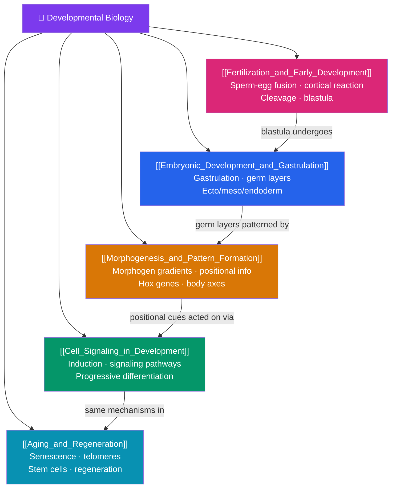

# 🐣 Developmental Biology — Map of Content

> [!abstract] What This Section Covers
> How does a single fertilized cell build an entire organism? This section follows development from beginning to end. **Fertilization and early development** covers the fusion of sperm and egg and the rapid cleavage divisions that produce the blastula. **Embryonic development and gastrulation** describes the dramatic cell movements that establish the three germ layers — ectoderm, mesoderm, and endoderm — and the body's basic layout. **Morphogenesis and pattern formation** explains how the body plan is specified by morphogen gradients and Hox genes that give cells positional identity. **Cell signaling in development** examines induction and the signaling pathways that drive progressive differentiation. Finally, **aging and regeneration** looks at the other end of the life cycle — cellular senescence, the biology of aging, and the remarkable regenerative powers of some organisms.

## Concept Map

## Learning Path

1. [[Fertilization_and_Early_Development]] — Gamete recognition and fusion, the fast and slow blocks to polyspermy, the cortical reaction, and cleavage into the blastula.
2. [[Embryonic_Development_and_Gastrulation]] — The cell migrations of gastrulation, formation of the three germ layers, and what tissues each layer gives rise to.
3. [[Morphogenesis_and_Pattern_Formation]] — Positional information, morphogen gradients, and how Hox genes establish the head-to-tail body plan.
4. [[Cell_Signaling_in_Development]] — Embryonic induction, key signaling pathways, and how cells commit progressively to their fates through differentiation.
5. [[Aging_and_Regeneration]] — Cellular senescence, telomeres, the hallmarks of aging, and the regenerative abilities of organisms like planarians and axolotls.

## All Notes at a Glance

| Note | Difficulty | What You'll Learn |
|------|------------|-------------------|
| [[Fertilization_and_Early_Development]] | Intermediate | Fertilization, polyspermy blocks, cortical reaction, cleavage, morula, blastula/blastocyst |
| [[Embryonic_Development_and_Gastrulation]] | Intermediate | Gastrulation, ectoderm/mesoderm/endoderm, primitive streak, neurulation, organogenesis overview |
| [[Morphogenesis_and_Pattern_Formation]] | Intermediate → Advanced | Positional information, morphogens, French flag model, Hox genes, body axes, segmentation |
| [[Cell_Signaling_in_Development]] | Intermediate → Advanced | Induction, competence, signaling pathways, determination, differentiation, apoptosis in development |
| [[Aging_and_Regeneration]] | Intermediate | Senescence, telomeres, hallmarks of aging, stem cell niches, regeneration, model organisms |

## Key Questions This Section Answers

- How does fertilization ensure exactly one sperm fuses with the egg?
- How do the three germ layers form, and what does each become?
- How does a cell "know" where it is in the embryo and what to become?
- What signals tell a cell to differentiate into a neuron rather than a muscle cell?
- Why do we age, and why can some animals regrow entire limbs while we cannot?

## Related Sections

- [[_MOC_Biology_Master|↑ Biology Master MOC]]
- [[_MOC_Microbiology_Immunology|← Microbiology and Immunology]]
- [[_MOC_Biotechnology|→ Biotechnology and Genomics]]
- Cross-vault: builds on [[_MOC_Cell_Division|Cell Division and Reproduction]]

#MOC #Biology #DevelopmentalBiology
