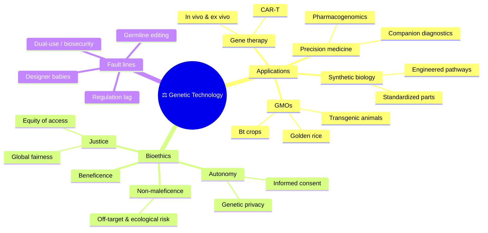

# ⚖️ Applications and Bioethics

> [!abstract] TL;DR
> Biotechnology's tools reach the real world as **GMOs** (Bt insect-resistant crops, vitamin-A-fortified **golden rice**), **gene therapy** (adding or fixing genes to treat disease — now several approved products after early tragedies and later triumphs), **personalized/precision medicine** (tailoring drugs to a person's genome), and **synthetic biology** (engineering organisms from standardized genetic parts). Each delivers real benefit and provokes real debate. **Bioethics** frames these through four principles — **autonomy, beneficence, non-maleficence, justice** — and confronts recurring tensions: consent and genetic privacy, ecological and safety risk, **equity of access**, the specter of "**designer babies**" via heritable editing, and the **dual-use** danger of the same tools enabling bioweapons. The science advances faster than the governance, which is precisely why the ethics matters.

## Intuition — analogy first

Think of genetic technology as **fire**.

Fire cooks food, forges metal, and heats homes — it made civilization possible. It also burns down cities. The fire itself has no ethics; the questions are all about *how, by whom, and for whom* it is used, and what guardrails keep a warming hearth from becoming a wildfire. You do not answer "is fire good or bad?" — you answer "who controls it, who benefits, who bears the risk, and what happens if it spreads?"

Every biotech application repeats this structure. Golden rice could prevent childhood blindness — or entrench dependence and unknown ecological effects. Gene therapy can cure a fatal disease for one child at a multimillion-dollar price only the wealthy reach. CRISPR can erase a hereditary illness — or, at the germline, quietly rewrite the human lineage for traits nobody consented to. The tool is neutral; the **distribution of benefit, risk, and consent** is where ethics lives.

---

## How It Works

## Key Concepts

### GMOs and the Debate

A **genetically modified organism (GMO)** has DNA altered by [[Recombinant_DNA_and_Cloning|recombinant]] or editing methods rather than by breeding alone. Flagship crops:

- **Bt crops** carry a gene from *Bacillus thuringiensis* encoding an insecticidal protein (Cry toxin) that kills specific pests but is harmless to mammals. Benefits: reduced chemical-insecticide use and higher yields. Concerns: pest resistance evolution (managed with "refuge" planting) and effects on non-target insects.
- **Herbicide-tolerant crops** (e.g. glyphosate-tolerant) simplify weed control but drive herbicide use and resistant "superweeds."
- **Golden rice** is engineered to produce **beta-carotene (provitamin A)** in the grain to combat vitamin-A deficiency, a leading cause of childhood blindness and death in parts of Asia and Africa. Approved in several countries after ~20 years of regulatory and advocacy conflict — a case study in how non-scientific factors gate humanitarian biotech.

**Scientific consensus** (major academies, WHO) holds approved GMOs are **as safe to eat** as conventional counterparts. The durable controversy is less about food toxicity than about **ecology** (gene flow, biodiversity, monoculture), **economics** (seed patents, farmer dependence on agribusiness), **labeling and autonomy**, and **trust** in institutions.

### Gene Therapy — Successes and Risks

**Gene therapy** treats disease by adding, silencing, or correcting genes in a patient's cells:

- **Ex vivo**: remove a patient's cells, edit them in the lab, reinfuse (e.g. blood stem cells for **sickle-cell disease**; **CAR-T** cells reprogrammed to attack cancer).
- **In vivo**: deliver the therapeutic gene directly, usually via an engineered **viral vector** (**AAV**, lentivirus) or **lipid nanoparticle**.

The field's arc is instructive:

| Milestone | Significance |
|---|---|
| **1999 — Jesse Gelsinger death** | Immune reaction to an adenoviral vector; halted the field and reset safety standards |
| **early 2000s — SCID-X1 trials** | Cured "bubble boy" immunodeficiency but some patients developed leukemia from **insertional mutagenesis** |
| **2017 — Luxturna** | First FDA-approved in vivo gene therapy (inherited retinal blindness) |
| **2019 — Zolgensma** | AAV therapy for spinal muscular atrophy; among the most expensive drugs (~$2M/dose) |
| **2023 — Casgevy** | First CRISPR-based therapy (sickle-cell, β-thalassemia) — see [[CRISPR_and_Genome_Editing]] |

Risks: **immune responses** to vectors, **insertional mutagenesis** (a vector landing in the wrong place activating an oncogene), **off-target edits**, durability, and above all **cost/access** — cures priced in the millions.

### Personalized / Precision Medicine

Cheap [[Genomics_and_Bioinformatics|genome sequencing]] enables medicine tailored to the individual:

- **Pharmacogenomics** — genotype predicts drug response and toxicity (e.g. *HLA-B*57:01* before abacavir; *TPMT* before thiopurines; *CYP2C19* and clopidogrel), so dosing is personalized.
- **Companion diagnostics** — a molecular test pairs a targeted therapy to patients whose tumors carry the matching driver mutation (e.g. **HER2** → trastuzumab; **BRAF V600E** → vemurafenib).
- **Polygenic risk scores** aggregate many small-effect variants to estimate disease risk — promising but with real accuracy and equity limits across ancestries.

### Synthetic Biology

**Synthetic biology** treats biology as engineering: standardized, interchangeable genetic **parts** (promoters, genes, terminators — "BioBricks") assembled into designed circuits and pathways. Landmarks and uses:

- **Artemisinic acid in yeast** — an engineered pathway produces a precursor of the antimalarial artemisinin.
- **Engineered insulin/therapeutic microbes**, biosensors, and biomanufactured materials.
- **Synthetic genomes** — Venter's team built a chemically synthesized bacterial genome (JCVI-syn) and later a minimal-gene cell, probing the limits of "essential" life.
- **Gene drives** — CRISPR-based systems that force a trait through a wild population (e.g. to suppress malaria mosquitoes), powerful and ecologically irreversible enough to be their own ethics case.

### Bioethics — Principles and Fault Lines

**Bioethics** analyzes these technologies through four widely used principles (Beauchamp & Childress):

| Principle | Question it forces |
|---|---|
| **Autonomy** | Did the person freely and knowingly consent? Who owns their genetic data? |
| **Beneficence** | Does it actually benefit the patient/society? |
| **Non-maleficence** | "First, do no harm" — are risks (off-target, ecological, immune) acceptable? |
| **Justice** | Are benefits and burdens fairly distributed? Who can afford it? |

Recurring fault lines:

- **Equity of access** — million-dollar cures and ancestry-biased genomic databases risk a "genetic divide" where benefits accrue to the wealthy and well-represented.
- **Consent and genetic privacy** — a genome is a permanent identifier that also exposes relatives; it cannot be truly anonymized. Uses include insurance/employment discrimination (partly addressed by laws like the US **GINA**) and forensic genealogy databases.
- **"Designer babies" and germline editing** — heritable edits alter future generations who cannot consent, blur therapy vs. enhancement, and could entrench inequality. The **2018 He Jiankui** case (CRISPR-edited babies) drew near-universal condemnation and calls for a moratorium on clinical germline editing.
- **Dual-use / biosecurity** — the same synthesis and editing tools that cure disease could engineer pathogens. "Gain-of-function" research and DNA-synthesis screening are active governance debates.
- **Regulation lag** — technical capability routinely outpaces law and oversight; governance is reactive, which is why anticipatory ethics and public deliberation matter. See cross-vault [[Applied_Ethics]] for the broader moral frameworks.

## Real-World Notes

- **Cost vs. cure**: Zolgensma and Casgevy *cure* devastating diseases but at ~$2M+, forcing health systems to invent new payment models (outcome-based, annuity) and confront rationing.
- **Regulatory divergence**: the EU regulates gene-edited crops largely like transgenic GMOs; several countries exempt small-indel edits indistinguishable from natural mutation — the same science, different rules.
- **Public trust is a variable**: GMO and vaccine hesitancy show that scientific safety consensus does not automatically produce public acceptance; transparency, labeling, and equitable benefit shape adoption.
- **Forensic genealogy**: uploading consumer-DNA data to genealogy databases helped solve cold cases (Golden State Killer) but exposed how one person's data implicates unconsenting relatives.
- **Governance bodies**: WHO, national bioethics commissions, and international summits (e.g. the International Summits on Human Genome Editing) try to set norms ahead of clinical use.

## Common Pitfalls / Misconceptions

- **"GMO food is dangerous to eat"** — the safety consensus of major scientific bodies is that approved GMOs are as safe as conventional foods; the substantive debates are ecological, economic, and social, not toxicological.
- **"Gene therapy is a simple one-time fix"** — durability, immune responses, insertional risk, and manufacturing complexity are real; some effects wane, and vectors have limits.
- **"Somatic and germline editing raise the same issues"** — somatic edits affect one consenting patient; germline edits are **heritable** and affect non-consenting descendants — an ethically distinct and far more contested category.
- **"Precision medicine works equally for everyone"** — polygenic scores and genomic databases are skewed toward European ancestry, so predictive accuracy is worse for under-represented populations — an equity, not just technical, problem.
- **"Ethics just slows down progress"** — bioethics and governance are what preserve public trust and prevent catastrophes (Gelsinger, He Jiankui) that would set the whole field back further than caution ever could.

## Related Concepts

- [[_MOC_Biotechnology|↑ Section MOC]]
- [[Recombinant_DNA_and_Cloning]] — The technique that creates transgenic GMOs and recombinant drugs
- [[CRISPR_and_Genome_Editing]] — Enables both today's therapies and the germline-editing controversy
- [[Genomics_and_Bioinformatics]] — Sequencing underpins precision medicine and raises genomic-privacy issues
- [[PCR_and_DNA_Sequencing]] — Diagnostics and companion tests that match patients to therapies
- Cross-vault: [[Applied_Ethics]] — Consequentialist, deontological, and virtue frameworks applied to these dilemmas
- Cross-vault: [[Vaccines_and_Antibiotics]] — Recombinant vaccines and the parallel public-trust dynamics

## Review Questions

1. GMO foods have a strong scientific safety consensus, yet the public debate persists. Identify **three non-toxicological** dimensions (ecological, economic, social) that legitimately drive the GMO controversy, and explain why "it's safe to eat" does not settle the argument.
2. Using the four bioethical principles (autonomy, beneficence, non-maleficence, justice), analyze the case of a **$2M gene therapy** that cures a fatal childhood disease. Which principle is most in tension, and why?
3. Explain why **germline** editing is treated as ethically distinct from **somatic** gene therapy. Reference consent, heritability, and the therapy-vs-enhancement boundary, and state why the 2018 He Jiankui case was condemned.

## Sources

- Beauchamp, T.L. & Childress, J.F. (2019). *Principles of Biomedical Ethics*, 8th ed. Oxford University Press.
- National Academies of Sciences, Engineering, and Medicine (2016). *Genetically Engineered Crops: Experiences and Prospects*.
- National Academies of Sciences, Engineering, and Medicine (2017). *Human Genome Editing: Science, Ethics, and Governance*.
- High-Level Ethics Commissions & WHO (2021). *Human Genome Editing: A Framework for Governance*.

#biology #biotechnology #bioethics #gmo #gene-therapy #precision-medicine
