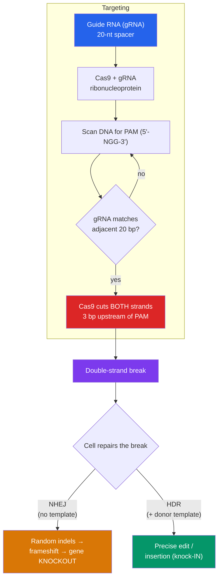

# ✂️ CRISPR and Genome Editing

> [!abstract] TL;DR
> **CRISPR-Cas9** is a programmable molecular scissors adapted from a bacterial immune system. A short **guide RNA (gRNA)** directs the **Cas9** nuclease to a matching 20-base DNA sequence sitting next to a **PAM** (a required `NGG` motif), where Cas9 makes a **double-strand break**. The cell's own repair then does the editing: error-prone **NHEJ** introduces small insertions/deletions that knock a gene out, while **homology-directed repair (HDR)** uses a supplied template to write in a precise change. Because targeting is set by an easily-swapped RNA (not a protein redesign), CRISPR made genome editing cheap, fast, and precise — earning **Jennifer Doudna and Emmanuelle Charpentier** the 2020 Nobel Prize in Chemistry. Newer **base** and **prime editors** rewrite DNA without cutting both strands. The technology powers approved therapies and crops — and forces a hard debate over **heritable germline editing**.

## Intuition — analogy first

Think of CRISPR-Cas9 as **find-and-replace with a GPS-guided cutter**.

Older editing tools (zinc fingers, TALENs) were like carving a *new custom key* for every lock — to target a new sequence you had to re-engineer a whole protein, which took months. CRISPR's breakthrough is that the "address" is written in **RNA**, not protein. Want to target a different gene? Just type a new 20-letter guide sequence and order the RNA — the same Cas9 protein reads whatever address you hand it. It is the difference between building a new machine for each job and simply reprogramming one machine with a new search string.

The PAM is the safety catch: Cas9 will not even inspect a site unless it sees the little `NGG` flag right next to it. This stops the bacterial system from cutting its *own* CRISPR memory bank (which lacks the adjacent PAM), and for us it constrains where edits can be placed.

---

## How It Works

## Key Concepts

### Bacterial Origin — Adaptive Immunity

**CRISPR** stands for **Clustered Regularly Interspaced Short Palindromic Repeats** — arrays of repeated DNA separated by "spacers" found in bacterial and archaeal genomes. In 2007 (Barrangou & Horvath, working on *Streptococcus* used in yogurt cultures) these were shown to be a **prokaryotic adaptive immune system**:

1. **Adaptation** — when a phage infects, the cell captures a snippet of viral DNA and stores it as a new spacer in the CRISPR array — a genetic memory of the invader.
2. **Expression** — the array is transcribed and processed into short **CRISPR RNAs (crRNAs)**, each matching a stored invader.
3. **Interference** — a crRNA guides a Cas nuclease to any DNA matching that memory and cleaves it, destroying the returning phage.

This is a rare biological example of **heritable, sequence-specific acquired immunity**.

### The CRISPR-Cas9 Mechanism

The 2012 breakthrough (Jinek, Charpentier, Doudna et al.) showed the *S. pyogenes* system could be **reduced to two components and reprogrammed**:

- **Cas9** — a large nuclease with two cutting domains (**RuvC** and **HNH**), each nicking one DNA strand.
- **Single guide RNA (sgRNA)** — the engineers fused the natural crRNA and a helper **tracrRNA** into one chimeric RNA. Its first ~20 nucleotides (the **spacer**) define the target by base-pairing.
- **PAM (Protospacer Adjacent Motif)** — a short sequence (`5'-NGG-3'` for SpCas9) that *must* sit immediately 3' of the target. No PAM, no cut. It is not part of the guide-matching region.

Mechanistically: Cas9 loaded with its sgRNA scans DNA for a PAM, locally unwinds the helix, and checks whether the adjacent 20 bp match the guide. A match triggers a **blunt double-strand break ~3 bp upstream of the PAM**. Swap the 20-nt spacer and you retarget the same protein anywhere with an adjacent PAM.

| Component | Role | Notes |
|---|---|---|
| **Cas9** | double-strand nuclease | RuvC + HNH domains; ~1368 aa (SpCas9) |
| **sgRNA spacer (20 nt)** | sets the target | reprogrammable — the key advantage |
| **PAM (NGG)** | licensing signal | recognized by Cas9, not the RNA; constrains sites |
| **tracrRNA** | scaffold | naturally separate; fused into sgRNA for tools |

### Repair Determines the Edit

Cas9 only breaks DNA — the *edit* comes from how the cell fixes it, drawing on the same pathways covered in [[Mutations_and_DNA_Repair]]:

- **Non-Homologous End Joining (NHEJ)** — the default, template-free pathway. It re-ligates the ends but often adds or deletes a few bases (**indels**). An indel that is not a multiple of 3 causes a **frameshift**, destroying the protein — an efficient **gene knockout**.
- **Homology-Directed Repair (HDR)** — if a **donor DNA template** with homology arms is supplied, the cell can copy in a precise sequence: correct a point mutation, insert a tag, or add a whole gene (**knock-in**). HDR is much less efficient than NHEJ and mostly active in dividing cells (S/G2 phase), which is a central practical limitation.

### Beyond Cutting — Base and Prime Editing

Double-strand breaks are risky (unpredictable indels, large deletions, chromosomal rearrangements). Newer editors avoid them by using a **catalytically impaired Cas9** as a programmable DNA-binding chaperone:

- **Base editing** (David Liu lab, 2016) — a **nickase Cas9** fused to a deaminase chemically converts one base to another without a double-strand break. **Cytosine base editors (CBE)** make C→T; **adenine base editors (ABE)** make A→G. Ideal for correcting single-nucleotide point mutations.
- **Prime editing** (2019) — Cas9 nickase fused to a **reverse transcriptase**, guided by a **pegRNA** that both targets and carries the edit as an RNA template. It can install substitutions, small insertions, and deletions with no double-strand break and no donor template — a versatile "search-and-replace."
- **CRISPR interference/activation (CRISPRi/a)** — **dead Cas9 (dCas9)** with no cutting activity, fused to repressor or activator domains, tunes gene *expression* without changing the sequence.
- **Other nucleases** — **Cas12a (Cpf1)** uses a T-rich PAM and makes staggered cuts; **Cas13** targets **RNA**, enabling transcript knockdown and diagnostics (e.g. **SHERLOCK**).

### Doudna and Charpentier

**Emmanuelle Charpentier** and **Jennifer Doudna** received the **2020 Nobel Prize in Chemistry** for developing CRISPR-Cas9 into a programmable genome-editing tool. **Feng Zhang** and **George Church** independently demonstrated editing in mammalian cells in 2013, and a high-profile patent dispute followed over the mammalian application. **Francisco Mojica** first characterized and named CRISPR arrays; **Barrangou and Horvath** established their immune function.

## Real-World Notes

- **Approved therapy**: **Casgevy (exagamglogene autotemcel)** — the first CRISPR-based medicine, approved in the UK (2023) and US (2023) for **sickle-cell disease** and **β-thalassemia**. It edits a patient's own blood stem cells *ex vivo* to reactivate fetal hemoglobin, then reinfuses them.
- **In vivo editing**: clinical programs deliver CRISPR directly into the body (e.g. lipid-nanoparticle delivery to the liver for **transthyretin amyloidosis**), and *ex vivo* editing engineers **CAR-T** cells for cancer.
- **Agriculture**: CRISPR-edited crops (non-browning mushrooms, high-GABA tomatoes, disease-resistant rice) often carry only small indels indistinguishable from natural mutations, prompting lighter regulation than transgenic [[Applications_and_Bioethics|GMOs]] in some jurisdictions.
- **Delivery is the bottleneck**: getting Cas9 + guide into the *right* cells efficiently and safely (AAV, lipid nanoparticles, electroporation of ribonucleoprotein) remains the hardest part of therapeutic editing.
- **Off-target effects**: guides can tolerate mismatches and cut similar sequences elsewhere. High-fidelity Cas9 variants, careful guide design, and whole-genome off-target screening mitigate this — and [[PCR_and_DNA_Sequencing|PCR and NGS]] confirm on- and off-target outcomes.

## Common Pitfalls / Misconceptions

- **"CRISPR does the editing"** — Cas9 only *cuts*; the cell's repair machinery makes the change. NHEJ (knockout) vs. HDR (precise) determines the outcome, and HDR's low efficiency is a major hurdle.
- **"You can edit anywhere"** — a target needs an adjacent **PAM**, so accessible sites are constrained (mitigated by using Cas variants with different PAMs).
- **"Edits are always precise"** — classic Cas9 produces **random indels** at the cut site; large deletions and rearrangements can occur. Base/prime editors were invented largely to avoid the double-strand break.
- **"CRISPR changes your whole body/heirs"** — *somatic* edits affect only treated cells and are **not** heritable. Only **germline** editing (embryos, gametes) passes to offspring — which is exactly the ethically fraught line.
- **"He Jiankui's 2018 experiment was accepted science"** — the birth of CRISPR-edited babies was **globally condemned** as unethical and medically unjustified; he was imprisoned. It triggered calls for a moratorium on clinical germline editing.

## Related Concepts

- [[_MOC_Biotechnology|↑ Section MOC]]
- [[Mutations_and_DNA_Repair]] — NHEJ and HDR are the endogenous repair pathways that convert a Cas9 cut into an edit
- [[Recombinant_DNA_and_Cloning]] — The earlier, insertion-based way to add genes; CRISPR edits in place instead
- [[PCR_and_DNA_Sequencing]] — Amplify and sequence the target locus to confirm edits and screen for off-targets
- [[Genomics_and_Bioinformatics]] — Guide design and off-target prediction are computational, genome-scale problems
- [[Applications_and_Bioethics]] — Germline editing, equity, and "designer babies" are the ethical frontier
- Cross-vault: [[Viruses]] — CRISPR evolved as bacterial defense against phages; viral vectors (AAV) deliver editors

## Review Questions

1. A researcher targets Cas9 to a gene and consistently gets **knockouts** but struggles to make a **precise single-base correction**. Explain the two repair pathways responsible for each outcome and why the precise correction is so much less efficient. What editing approach could avoid the double-strand break entirely?
2. What is the **PAM**, why is it required, and how does its role explain why the bacterial CRISPR system does not destroy its own stored spacer memory?
3. Distinguish **somatic** from **germline** genome editing. Why is the somatic editing in an approved therapy like Casgevy broadly accepted, while the 2018 germline-edited-baby case was condemned? Frame your answer around heritability, consent, and medical justification.

## Sources

- Jinek, M., Chylinski, K., Fonfara, I., Hauer, M., Doudna, J.A., Charpentier, E. (2012). "A programmable dual-RNA-guided DNA endonuclease in adaptive bacterial immunity." *Science*, 337(6096), 816–821.
- Doudna, J.A. & Charpentier, E. (2014). "The new frontier of genome engineering with CRISPR-Cas9." *Science*, 346(6213).
- Anzalone, A.V., Koblan, L.W., Liu, D.R. (2020). "Genome editing with CRISPR-Cas nucleases, base editors, transposases and prime editors." *Nature Biotechnology*, 38, 824–844.
- The Royal Swedish Academy of Sciences (2020). Nobel Prize in Chemistry — Charpentier & Doudna, scientific background.

#biology #biotechnology #crispr #genome-editing #cas9 #gene-therapy
