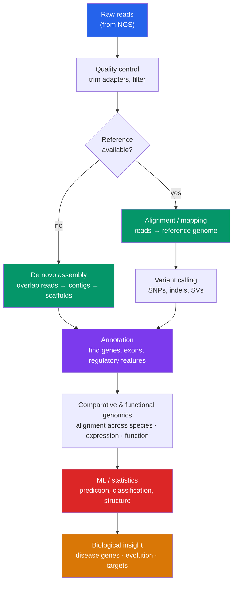

# 🧮 Genomics and Bioinformatics

> [!abstract] TL;DR
> **Genomics** studies whole genomes rather than single genes — sequencing every base, assembling the fragments, and reading the biological meaning. The **Human Genome Project (1990–2003)** produced the first near-complete human reference (~3.2 billion base pairs, ~20,000 protein-coding genes) at a cost of ~$3 billion; the final gaps were closed by the **T2T (telomere-to-telomere) consortium in 2022**. Making sense of that data is **bioinformatics** — computational biology. Core tasks are **sequence alignment** (**BLAST** to find similar sequences, read mapping to a reference), **assembly** (stitching short reads into contigs), **annotation** (locating genes and features), and **variant calling**. **Comparative genomics** reads evolution by aligning genomes across species; **functional genomics** (transcriptomics, epigenomics) asks what the genome *does*. Modern biology is now a data science, and **machine learning** — from variant callers to **AlphaFold's** protein-structure prediction — is central to it.

## Intuition — analogy first

Think of a genome as a **3-billion-letter book with no spaces, no punctuation, and no page numbers — shredded into confetti**.

Sequencing hands you tens of millions of tiny overlapping snippets. **Assembly** is reconstructing the book by matching overlapping edges of the confetti — like solving a jigsaw with a billion pieces where many pieces look identical (repetitive DNA is the puzzle's blue-sky region). Once reassembled, you still have raw letters with no meaning; **annotation** is going through and marking "this stretch is a chapter (gene), this is a heading (promoter), this is filler." And **comparative genomics** is laying the human book beside the mouse and chimp books to see which passages evolution kept word-for-word (they must matter) and which drifted freely (they probably don't).

The reason this is a *computing* problem, not a *reading* problem, is scale: no human could align millions of reads or scan a database of billions of sequences. **BLAST** is essentially a search engine for biological sequences — "find me everything in the world that resembles this snippet, ranked by significance."

---

## How It Works

## Key Concepts

### Sequencing Whole Genomes — The Human Genome Project

The **Human Genome Project (HGP)** (1990–2003), an international public consortium led in part by the NIH under **Francis Collins**, produced the first reference human genome. A parallel private effort by **Craig Venter's Celera** used **whole-genome shotgun sequencing** — shear the genome, sequence millions of random fragments, and reassemble computationally — which accelerated the field. Key outcomes:

- **~3.2 billion base pairs**, but only **~1–2% protein-coding**; there are only **~20,000 protein-coding genes** (far fewer than the 100,000 once guessed).
- Most of the genome is regulatory, structural, repetitive, or of unknown function — dismantling the "one gene, one function" and "junk DNA" oversimplifications.
- The "finished" 2003 sequence still had gaps in repetitive regions; the **Telomere-to-Telomere (T2T) Consortium** closed them in **2022** using long-read sequencing, and the **pangenome** effort now represents human diversity as many genomes rather than one reference.

### Genome Assembly

Turning short reads into a genome:

- **De novo assembly** (no reference) builds **contigs** from overlapping reads, then orders them into **scaffolds** using paired-end/long-read information. **De Bruijn graph** methods handle the huge volume of short reads.
- **Reference-guided assembly / mapping** aligns reads to an existing genome — far cheaper and the norm for resequencing individuals of a known species.
- **Repeats and structural variation** are the hard part: identical repeated regions collapse or misassemble with short reads. **Long reads** (PacBio, Nanopore) span repeats and resolve them, which is why T2T completion required them.
- **Coverage/read depth** (e.g. 30×) governs confidence; low coverage misses variants, and uneven coverage biases assembly.

### Sequence Alignment and BLAST

**Alignment** finds the correspondence between sequences to measure similarity and infer homology.

- **Pairwise alignment**: **Needleman–Wunsch** (global, whole-length) and **Smith–Waterman** (local, best sub-region) are the classic dynamic-programming algorithms — optimal but slow.
- **BLAST (Basic Local Alignment Search Tool)** (Altschul et al., 1990) is the fast heuristic that made database search practical: seed short exact matches, extend them, and report hits ranked by an **E-value** (the number of hits of that quality expected by chance — lower is more significant). BLAST is the everyday tool for "what is this sequence and what is it related to?"
- **Multiple sequence alignment** (Clustal, MUSCLE, MAFFT) aligns many sequences at once to reveal **conserved regions** and build phylogenies.
- **Read mapping** (**BWA**, **Bowtie2**) aligns millions of short reads to a reference using **FM-index/Burrows–Wheeler** compression for speed and memory efficiency.

### Databases and File Formats

Genomics runs on public infrastructure:

| Resource / format | What it holds |
|---|---|
| **GenBank / ENA / DDBJ** | primary DNA sequence archives (INSDC) |
| **UniProt** | curated protein sequences and functional annotation |
| **Ensembl / UCSC Genome Browser** | annotated reference genomes, visualization |
| **NCBI RefSeq** | curated reference sequences |
| **PDB** | experimentally determined 3-D protein structures |
| **FASTA** | plain sequence (header + letters) |
| **FASTQ** | reads + per-base quality scores |
| **SAM/BAM** | read alignments to a reference |
| **VCF** | called variants (SNPs, indels) |
| **GFF/GTF** | gene/feature annotation coordinates |

### Annotation, Comparative, and Functional Genomics

- **Annotation** identifies where genes and features are (gene finding via ORFs, splice signals, and homology) and what they do (functional annotation via **Gene Ontology** terms, protein domains).
- **Comparative genomics** aligns genomes across species. **Conserved sequences** flag functional importance (purifying selection preserves what matters); **synteny** (conserved gene order) traces chromosomal evolution; it also reconstructs **phylogenies** and dates divergences.
- **Functional genomics** asks what the genome *does*, genome-wide: **transcriptomics (RNA-seq)** measures which genes are expressed and how much; **epigenomics** (ChIP-seq, ATAC-seq, methylation) maps regulation; **GWAS (genome-wide association studies)** links genetic variants to traits and disease across populations.

### The Role of Computation and Machine Learning

Biology is now a **data science**: a single sequencing run yields terabytes, and interpretation is computational.

- **ML in the pipeline**: deep-learning base callers (Nanopore), **DeepVariant** (a CNN-based variant caller), gene- and regulatory-element predictors, and splice-site models.
- **AlphaFold** (DeepMind, 2021) predicts protein 3-D structure from sequence at near-experimental accuracy — a landmark that produced structures for nearly all known proteins and reshaped structural biology.
- **Language models on sequence** ("genomic/protein LLMs" such as ESM) learn representations of DNA/protein that predict function, variant effects, and structure.
- **Scale demands engineering**: cloud pipelines, workflow managers (Nextflow, Snakemake), and standardized formats make analyses reproducible. The overlap with the broader ML toolkit is deep — see the cross-vault link below.

## Real-World Notes

- **Clinical genomics**: whole-exome/genome sequencing diagnoses rare Mendelian diseases by finding the causal variant among millions; oncology sequences tumors to match [[Applications_and_Bioethics|targeted therapies]] to driver mutations.
- **Pathogen genomics**: real-time sequencing tracked **SARS-CoV-2 variants** globally (GISAID), and metagenomics identifies unculturable microbes directly from samples.
- **Precision at population scale**: biobanks (UK Biobank, All of Us) pair genomes with health records so GWAS and **polygenic risk scores** can be computed on hundreds of thousands of people.
- **Reference bias**: aligning everyone to a single (historically European-skewed) reference misses variation in under-represented populations — the motivation for the **human pangenome**.
- **Storage and privacy**: genomic data is enormous and maximally personal; it cannot be truly anonymized (your genome *is* an identifier), raising the consent and equity issues covered in the bioethics note.

## Common Pitfalls / Misconceptions

- **"Most of the genome is genes"** — protein-coding sequence is only ~1–2%; much of the rest is regulatory or structurally important, so "junk DNA" is a misnomer.
- **"Sequencing gives you the answer"** — raw reads are meaningless without assembly, alignment, annotation, and statistics. The bottleneck moved from *generating* data to *interpreting* it.
- **"A high BLAST score means significance"** — significance depends on the **E-value** (expectation given database size), not raw score; a good score in a huge database can still arise by chance.
- **"One reference genome represents humanity"** — a single reference under-represents global diversity and biases variant calling; pangenomes address this.
- **"Correlation from GWAS = causation"** — associated variants are usually markers in linkage with the true cause, often in non-coding regulatory regions; mechanism requires follow-up.
- **"AlphaFold solved biology"** — it predicts *static* structures superbly but does not fully capture dynamics, complexes, or function; it is a powerful tool, not an endpoint.

## Related Concepts

- [[_MOC_Biotechnology|↑ Section MOC]]
- [[PCR_and_DNA_Sequencing]] — Produces the reads that are the raw input to every genomics pipeline
- [[CRISPR_and_Genome_Editing]] — Guide design and off-target prediction are genome-scale computational tasks
- [[Recombinant_DNA_and_Cloning]] — BAC/YAC libraries provided the tiled clones for the original Human Genome Project
- [[Applications_and_Bioethics]] — Personalized medicine, genomic privacy, and data equity flow directly from genomics
- Cross-vault: [[_MOC_AI_ML_Master]] — Alignment, variant calling, and structure prediction rely on the algorithms and deep learning covered there
- Cross-vault: [[Phylogenetics_and_the_Tree_of_Life]] — Comparative genomics and molecular sequence data build modern phylogenies

## Review Questions

1. The human genome is ~3.2 billion bp but encodes only ~20,000 protein-coding genes occupying ~1–2% of the sequence. Explain why this overturned earlier expectations and what the remaining ~98% is understood to contain.
2. Contrast **de novo assembly** with **reference-guided mapping**. Why do highly **repetitive regions** break short-read assembly, and how did long-read sequencing enable the 2022 telomere-to-telomere completion?
3. What does BLAST's **E-value** measure, and why is it a better indicator of a hit's significance than the raw alignment score? How does database size affect it?

## Sources

- International Human Genome Sequencing Consortium (2001). "Initial sequencing and analysis of the human genome." *Nature*, 409, 860–921.
- Nurk, S. et al. / T2T Consortium (2022). "The complete sequence of a human genome." *Science*, 376(6588), 44–53.
- Altschul, S.F. et al. (1990). "Basic local alignment search tool." *Journal of Molecular Biology*, 215(3), 403–410.
- Jumper, J. et al. (2021). "Highly accurate protein structure prediction with AlphaFold." *Nature*, 596, 583–589.

#biology #biotechnology #genomics #bioinformatics #sequence-alignment #human-genome-project
