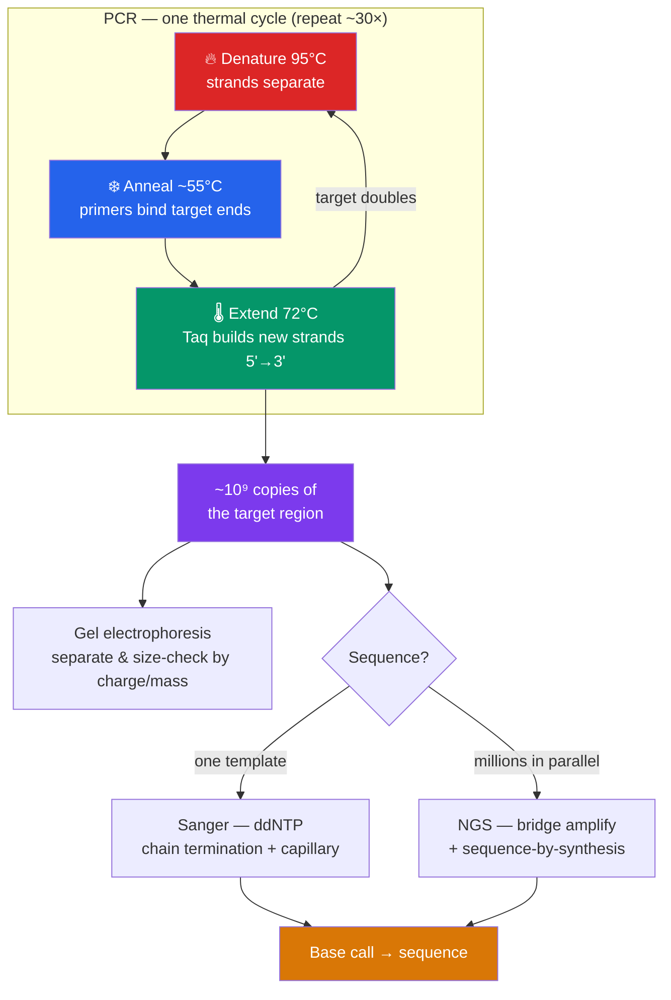

# 🔬 PCR and DNA Sequencing

> [!abstract] TL;DR
> **PCR (polymerase chain reaction)** copies a specific DNA region exponentially by cycling a reaction through three temperatures — **denature** (95 °C, split strands), **anneal** (~55 °C, primers bind), **extend** (72 °C, heat-stable **Taq polymerase** synthesizes new strands) — doubling the target each cycle so ~30 cycles yield a billionfold amplification. **Gel electrophoresis** separates DNA by size to check products. **Sanger sequencing** reads a sequence base-by-base using chain-terminating dideoxynucleotides; **next-generation sequencing (NGS)** reads millions of fragments in parallel, collapsing genome costs from billions of dollars to hundreds. **qPCR** measures amplification in real time to quantify starting DNA/RNA. Together these tools underpin forensics, clinical diagnostics, and all of genomics.

## Intuition — analogy first

Think of PCR as a **chain letter that doubles every round**, and sequencing as **reading a word by tagging where each letter lands**.

For PCR: you write one letter and send it to two friends; each of them copies it and sends to two more. After one round there are 2, then 4, 8, 16 — exponential. The "primers" are the address labels that tell the copier *exactly which paragraph* to reproduce and nothing else. Heat is the trick: raise the temperature and the double helix falls apart into two templates; lower it and copying resumes. Because the copier (Taq) survives boiling, you never have to add fresh enzyme — just cycle the temperature and walk away.

For Sanger sequencing: imagine copying a word but randomly gluing a *colored, dead-end* letter into some copies. A copy that got its dead-end "A" stops right there; another stops at a later "T". Sort all the truncated copies by length and read the color of the terminal letter at each length — the colors, in order of length, spell out the sequence.

---

## How It Works

## Key Concepts

### The Polymerase Chain Reaction

A PCR reaction mixes: **template DNA**, two **primers** (short ~18–25 nt oligos flanking the target, one for each strand), **dNTPs** (the A/T/G/C building blocks), a **thermostable DNA polymerase**, and Mg²⁺-buffer. A **thermal cycler** repeats three steps:

1. **Denaturation (~95 °C)** — hydrogen bonds break; the double helix separates into single-stranded templates.
2. **Annealing (~50–65 °C)** — primers base-pair to their complementary sequences at the target's edges. The **melting temperature (Tm)** of the primers sets this — too low gives non-specific binding, too high gives no binding.
3. **Extension (~72 °C)** — the polymerase adds nucleotides to each primer's 3' end, synthesizing a new complementary strand 5'→3'.

Each cycle **doubles** the number of target copies, so *n* cycles give ~2ⁿ (30 cycles ≈ 10⁹). Amplification is not infinite — reagents deplete and enzyme fatigues, so the curve **plateaus**. Only the region *between the primers* is amplified exponentially, which is what makes PCR specific.

**Taq polymerase**, isolated from the hot-spring bacterium *Thermus aquaticus*, is the key enabler: it survives the 95 °C denaturation step, so you add it once. Its trade-off is no proofreading (error ~1 in 10⁴); **high-fidelity** polymerases (Pfu, Q5, Phusion) have 3'→5' exonuclease proofreading for cloning and sequencing prep.

| Variant | What it adds | Use |
|---|---|---|
| **RT-PCR** | reverse transcriptase makes cDNA from RNA first | detect/quantify RNA (e.g. viral genomes, gene expression) |
| **qPCR (real-time PCR)** | fluorescent dye/probe measures product each cycle | *quantify* starting template |
| **Nested PCR** | two primer pairs, inner set re-amplifies | boost specificity for scarce targets |
| **Multiplex PCR** | many primer pairs at once | detect several targets in one tube |
| **Colony/diagnostic PCR** | template straight from a colony | verify cloned inserts |

### qPCR — Quantitative, Real-Time PCR

**qPCR** watches amplification happen. A fluorescent reporter (intercalating **SYBR Green**, or a sequence-specific **TaqMan probe**) emits signal proportional to product. The cycle at which signal crosses a threshold — the **Cq / Ct value** — is *inversely* related to starting amount: more template → threshold reached sooner → lower Cq. A standard curve converts Cq to copy number. This is how viral loads are measured and how **RT-qPCR** became the standard confirmatory test for **SARS-CoV-2**.

### Gel Electrophoresis

DNA carries a uniform negative charge (its phosphate backbone), so in an electric field it migrates toward the **positive** electrode. Run through a sieving **agarose gel**, smaller fragments travel faster and farther; larger ones lag. Comparing bands to a **DNA ladder** (size standard) reveals fragment sizes. A fluorescent stain (e.g. SYBR Safe, historically ethidium bromide) makes bands visible under UV. Uses: confirm PCR product size, check restriction digests, and separate fragments for extraction. **Capillary electrophoresis** — the same principle in a thin capillary with single-base resolution — is what reads out Sanger reactions.

### Sanger (Chain-Termination) Sequencing

Developed by **Frederick Sanger (1977)**, this method sequences one template at a time:

- The reaction includes normal **dNTPs** plus a small fraction of **dideoxynucleotides (ddNTPs)**, which lack the 3'-OH needed to add the next base — so incorporation **terminates** the growing chain.
- Each of the four ddNTPs carries a **different fluorescent dye**. Termination happens randomly at every position, producing a nested set of fragments of every length, each ending in a labeled base.
- **Capillary electrophoresis** sorts fragments by size to single-base resolution; a laser reads the terminal dye of each, and the ordered colors give the sequence as a **chromatogram** (a trace of colored peaks).

Sanger reads are long (up to ~800–1000 bp) and highly accurate — still the **gold standard** for validating single genes, confirming CRISPR edits, and clinical variant confirmation.

### Next-Generation Sequencing (NGS)

**NGS** (massively parallel sequencing) reads millions to billions of fragments **simultaneously**, trading read length for staggering throughput. The dominant chemistry, **Illumina sequencing-by-synthesis**:

1. **Library prep** — genomic DNA is fragmented and ligated to **adapters**.
2. **Cluster generation** — fragments bind a flow cell and **bridge-amplify** into clonal clusters.
3. **Sequencing** — reversible-terminator nucleotides with removable dyes are added one base per cycle; the flow cell is imaged, the dye cleaved, and the cycle repeats. Reads are typically 100–300 bp, paired-end.

**Read depth (coverage)** — how many reads overlap each position — determines confidence; ~30× is standard for a human genome. **Long-read platforms** (**PacBio HiFi**, **Oxford Nanopore**) read tens of kilobases in one pass, resolving repeats and structural variants that short reads miss; Nanopore threads DNA through a protein pore and reads base-specific changes in ionic current.

| Method | Read length | Throughput | Accuracy | Typical use |
|---|---|---|---|---|
| **Sanger** | 800–1000 bp | very low (1 read) | very high (~99.99%) | single-gene, edit/variant confirmation |
| **Illumina (SBS)** | 100–300 bp | very high | high (~99.9%) | genomes, exomes, RNA-seq, panels |
| **PacBio HiFi** | 10–25 kb | moderate | high (~99.9%) | genome assembly, phasing |
| **Oxford Nanopore** | 10 kb–Mb | high, portable | improving (~99%+) | field/real-time, structural variants |

### From Reads to Answers

Raw reads feed the [[Genomics_and_Bioinformatics|bioinformatics]] pipeline: quality filtering, **alignment** to a reference (or *de novo* **assembly**), and **variant calling**. The falling cost — a human genome dropped from ~$3 billion (Human Genome Project) to well under $1000 — is what turned sequencing from a moonshot into a routine assay.

## Real-World Notes

- **Forensics**: **STR (short tandem repeat) profiling** amplifies ~20 variable loci by multiplex PCR; the pattern of repeat lengths gives a near-unique DNA "fingerprint" used for identification and paternity. Trace samples are viable because PCR amplifies tiny inputs.
- **Clinical diagnostics**: RT-qPCR detects pathogens (SARS-CoV-2, HIV viral load, HPV); NGS panels screen tumor DNA for actionable mutations (guiding [[Applications_and_Bioethics|precision oncology]]); **non-invasive prenatal testing (NIPT)** sequences fetal DNA fragments in maternal blood.
- **Contamination is the enemy**: because PCR amplifies a single molecule a billionfold, a stray aerosol of a previous product can produce false positives. Physical separation of pre- and post-PCR areas, filter tips, and no-template controls are mandatory.
- **Primer design is half the battle**: poor primers give primer-dimers, non-specific bands, or no product. Tools check Tm matching, avoid self-complementarity, and ensure target specificity.

## Common Pitfalls / Misconceptions

- **"PCR sequences DNA"** — PCR *amplifies* a known region using primers you designed; it does not read unknown sequence. Sequencing (Sanger/NGS) reads the order of bases.
- **"More cycles = more product"** — amplification plateaus as reagents deplete and byproducts accumulate; excess cycles amplify errors and artifacts, not signal. qPCR quantification uses the *exponential* phase, not the plateau.
- **"Taq is high fidelity"** — Taq has no proofreading (~1 error per 10⁴ bases); for cloning or sequencing templates use a proofreading polymerase.
- **"A negative PCR means the target is absent"** — inhibitors, degraded template, or primer mismatch can cause false negatives; internal controls are needed to distinguish true absence from failed amplification.
- **"NGS reads whole chromosomes end-to-end"** — short-read NGS reads tiny fragments that must be computationally reassembled; long-read platforms are what resolve full-length structure.

## Related Concepts

- [[_MOC_Biotechnology|↑ Section MOC]]
- [[Recombinant_DNA_and_Cloning]] — PCR products are amplified inserts; colony PCR verifies clones
- [[CRISPR_and_Genome_Editing]] — Edits are confirmed by PCR + Sanger/NGS of the target locus
- [[Genomics_and_Bioinformatics]] — Sequencing reads are the raw input to genome assembly and analysis
- [[Applications_and_Bioethics]] — PCR/NGS diagnostics enable personalized medicine and prenatal screening
- [[DNA_Structure_and_Replication]] — PCR is in-vitro replication; primers, 5'→3' synthesis, and antiparallel strands all carry over
- Cross-vault: [[Viruses]] — RT-qPCR detection of RNA viruses depends on reverse transcription of the viral genome

## Review Questions

1. Explain why PCR amplification is **exponential** in early cycles but **plateaus** later. Why does qPCR quantify starting template using the exponential phase rather than the endpoint amount of product?
2. In Sanger sequencing, what is the chemical role of a **dideoxynucleotide (ddNTP)**, and how does the combination of random chain termination plus size separation let you read the sequence one base at a time?
3. A lab needs to (a) confirm a single CRISPR edit at a known locus and (b) screen 500 tumor samples for mutations across a 50-gene panel. Recommend Sanger vs. NGS for each task and justify the choice in terms of read length, throughput, and cost.

## Sources

- Mullis, K.B. (1990). "The unusual origin of the polymerase chain reaction." *Scientific American*, 262(4), 56–65.
- Sanger, F., Nicklen, S., Coulson, A.R. (1977). "DNA sequencing with chain-terminating inhibitors." *PNAS*, 74(12), 5463–5467.
- Shendure, J. et al. (2017). "DNA sequencing at 40: past, present and future." *Nature*, 550, 345–353.
- Green, M.R. & Sambrook, J. (2012). *Molecular Cloning: A Laboratory Manual*, 4th ed. Cold Spring Harbor.

#biology #biotechnology #pcr #dna-sequencing #ngs #diagnostics
