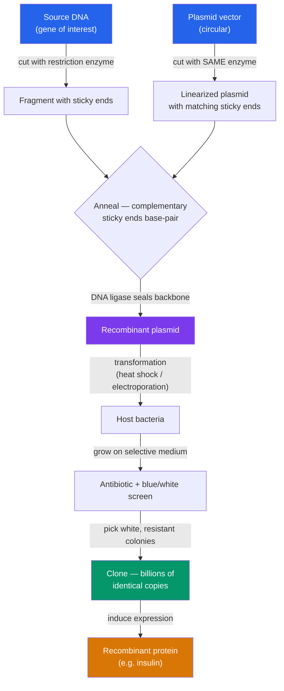

# 🧬 Recombinant DNA and Cloning

> [!abstract] TL;DR
> Recombinant DNA technology joins DNA fragments from different sources into a single molecule that can be copied inside a living host. The core toolkit is three enzymes and a vector: **restriction enzymes** cut DNA at specific palindromic sequences (often leaving "sticky ends"), **DNA ligase** seals a target fragment into a **plasmid vector**, and **bacterial transformation** delivers the construct into cells that clone it billions of times as they divide. Selectable markers (usually antibiotic resistance) let you isolate the cells that took up the insert. This is how bacteria were engineered in 1978 to mass-produce human **insulin** — the founding application of the biotech industry.

## Intuition — analogy first

Think of molecular cloning as **copy-paste with programmable scissors**.

You have a document (the source genome) containing one paragraph you want (the gene). You need a way to cut *exactly* around that paragraph without shredding the rest — that is the restriction enzyme, a pair of scissors that only cuts at one specific phrase. You need a clipboard to hold the paragraph while you move it — that is the plasmid vector, a small circular DNA that bacteria happily carry and replicate. You need glue to paste the paragraph into the clipboard so it stays — that is DNA ligase. Finally you need a photocopier that runs for free: put the clipboard inside a bacterium and let it divide overnight, and one construct becomes billions of identical copies by morning.

The genius of the sticky-end system is that the scissors leave *matching frayed edges*. Any two pieces cut by the same enzyme snap together like puzzle pieces with complementary tabs — so the paragraph fits the clipboard automatically, no manual alignment needed.

---

## How It Works

## Key Concepts

### Restriction Enzymes and Sticky Ends

**Restriction endonucleases** are bacterial enzymes that cut double-stranded DNA at specific **recognition sequences**, usually 4–8 bp **palindromes** (the sequence reads the same 5'→3' on both strands). In nature they are a bacterial immune defense — they "restrict" invading phage DNA, while the host protects its own genome by methylating those sites.

- **Sticky (cohesive) ends**: enzymes like **EcoRI** cut off-center, leaving single-stranded overhangs. EcoRI recognizes `GAATTC` and cuts between G and A, leaving a `5'-AATT` overhang on each fragment. Any two EcoRI fragments have complementary overhangs and re-anneal spontaneously.
- **Blunt ends**: enzymes like **SmaI** (`CCCGGG`) cut in the middle, leaving no overhang. Blunt ligation works with any two blunt fragments but is less efficient and non-directional.

| Enzyme | Recognition site | Cut product | Source |
|---|---|---|---|
| **EcoRI** | G^AATTC | 5' AATT overhang (sticky) | *E. coli* |
| **BamHI** | G^GATCC | 5' GATC overhang (sticky) | *Bacillus amyloliquefaciens* |
| **HindIII** | A^AGCTT | 5' AGCT overhang (sticky) | *Haemophilus influenzae* |
| **SmaI** | CCC^GGG | blunt | *Serratia marcescens* |
| **NotI** | GC^GGCCGC | 5' GGCC overhang; 8-bp cutter (rare) | *Nocardia otitidis* |

**Directional cloning** uses *two different* enzymes to cut both insert and vector, giving two non-matching ends. This forces the gene to ligate in only one orientation — essential when the gene must sit downstream of a promoter to be expressed.

### DNA Ligase

**DNA ligase** catalyzes the formation of a **phosphodiester bond** between the 3'-hydroxyl of one strand and the 5'-phosphate of the adjacent strand, sealing the nicks left after annealing. **T4 DNA ligase** (from bacteriophage T4) is the workhorse — it ligates both sticky and blunt ends and uses ATP as its energy source. This is the same chemistry that [[DNA_Structure_and_Replication|the replication machinery]] uses to join Okazaki fragments on the lagging strand.

### Plasmids and Vectors

A **cloning vector** is a DNA molecule that carries a foreign insert into a host and replicates it. **Plasmids** — small circular, extrachromosomal bacterial DNAs — are the classic vector. A good plasmid vector has:

- **Origin of replication (ori)** — lets the host replicate it independently of the chromosome; controls **copy number** (high-copy vectors like pUC give hundreds of copies per cell).
- **Multiple cloning site (MCS / polylinker)** — a short stretch packed with unique restriction sites for inserting the gene.
- **Selectable marker** — typically an **antibiotic-resistance gene** (e.g. *ampR*, *kanR*) so only transformed cells survive on selective plates.
- **Screening feature** — e.g. *lacZ* for **blue/white screening** (see below), or a fluorescent reporter.

Other vector types scale to larger inserts or different hosts:

| Vector | Typical insert size | Host / use |
|---|---|---|
| **Plasmid** | up to ~10 kb | routine gene cloning in bacteria |
| **Bacteriophage λ** | ~15–20 kb | genomic/cDNA libraries |
| **Cosmid** | ~30–45 kb | larger genomic fragments |
| **BAC** (bacterial artificial chromosome) | ~100–300 kb | genome sequencing projects |
| **YAC** (yeast artificial chromosome) | up to ~1–2 Mb | very large eukaryotic regions |
| **Expression vector** | gene + promoter | protein production (adds promoter, RBS, tags) |

### Transformation and Selection

**Transformation** is the uptake of exogenous DNA by a host cell. Bacteria are made **competent** (permeable to DNA) by chemical treatment (CaCl₂) followed by **heat shock**, or by **electroporation** (a brief high-voltage pulse). Uptake is inefficient — only a tiny fraction of cells take up plasmid — so **selection** is essential:

1. **Antibiotic selection**: plate on medium containing the antibiotic the plasmid's marker defeats. Only cells carrying the plasmid grow.
2. **Blue/white screening**: the MCS sits inside the *lacZ* α-fragment. An empty (re-ligated) plasmid makes functional β-galactosidase → colonies turn **blue** on X-gal. An insert *disrupts* *lacZ* → **white** colonies carry your gene. Pick white.
3. **Insert verification**: colony PCR, restriction digest ("diagnostic digest"), or Sanger sequencing confirm the correct construct.

### Molecular Cloning and Libraries

Beyond single genes, cloning builds **libraries** — collections of clones covering an entire genome or transcriptome:

- **Genomic library**: total genomic DNA fragmented and cloned; represents all sequences including introns and regulatory regions.
- **cDNA library**: made by reverse-transcribing **mRNA** into complementary DNA. It captures only expressed, spliced genes (no introns) — the form you want when expressing a eukaryotic gene in bacteria, which cannot splice.

### Producing Recombinant Proteins — Insulin

The archetype: in 1978 Genentech scientists synthesized the DNA for human insulin's A and B chains, inserted them into *lacZ*-fusion **expression vectors**, and transformed *E. coli*. The bacteria produced the chains, which were purified and combined into functional insulin — marketed as **Humulin** (1982), the first recombinant-DNA drug approved for humans. Before this, insulin was extracted from pig and cow pancreases; recombinant insulin is chemically identical to the human hormone, avoids animal-supply limits, and reduces immune reactions. The same pipeline now makes **human growth hormone**, **clotting factors**, **erythropoietin**, and antibody drugs (often in mammalian **CHO cells** when human-like glycosylation is required).

## Real-World Notes

- **Industrial biomanufacturing**: recombinant enzymes (e.g. chymosin for cheese, detergent proteases, amylases) are produced in engineered bacteria and fungi at ton scale, replacing animal- or plant-extracted equivalents.
- **Host choice matters**: *E. coli* is fast and cheap but cannot perform eukaryotic post-translational modifications (glycosylation, disulfide folding). Yeast (*Pichia*), insect (baculovirus), and mammalian (CHO, HEK293) systems trade cost for authenticity.
- **Modern assembly methods** have largely displaced classic cut-and-paste for complex constructs: **Gibson Assembly** (2009) joins multiple fragments with overlapping ends in a single isothermal reaction; **Golden Gate** uses Type IIS enzymes (BsaI) that cut *outside* their recognition site for scarless, modular assembly.
- **Verification is cheaper than failure**: sequencing a construct before scaling up costs a few dollars and prevents wasting weeks expressing a frameshifted or mutated gene.

## Common Pitfalls / Misconceptions

- **"Cloning" means making a whole organism** — in molecular biology, cloning means making identical copies of a *DNA fragment* (or cells carrying it). Dolly-the-sheep "reproductive cloning" is a different, unrelated technique.
- **Sticky ends guarantee correct assembly** — they only guarantee *compatible* joining. A plasmid cut with one enzyme can re-ligate on itself (self-ligation) with no insert; that is exactly why blue/white screening and directional (two-enzyme) cloning exist.
- **Any gene works in bacteria as-is** — a raw eukaryotic gene contains **introns** bacteria cannot splice, and may lack a bacterial ribosome-binding site or use rare codons. You need cDNA, an expression vector, and often codon optimization.
- **More copies is always better** — very high-copy plasmids and strong promoters can overload the host, causing toxicity, plasmid loss, or inclusion-body aggregation of misfolded protein.

## Related Concepts

- [[_MOC_Biotechnology|↑ Section MOC]]
- [[PCR_and_DNA_Sequencing]] — Amplifies and verifies cloned inserts; PCR products are common cloning fragments
- [[CRISPR_and_Genome_Editing]] — The precise, in-place successor to random insertion; edits the genome rather than adding a plasmid
- [[Genomics_and_Bioinformatics]] — BAC/YAC libraries were the backbone of early genome-sequencing projects
- [[Applications_and_Bioethics]] — Recombinant organisms (GMOs) and drugs raise the safety and regulatory debates
- [[DNA_Structure_and_Replication]] — The antiparallel double helix and phosphodiester backbone that ligase seals and enzymes cut
- Cross-vault: [[Bacteria_and_Archaea]] — Restriction enzymes and plasmids originate as bacterial defense and gene-transfer systems

## Review Questions

1. You want to clone a gene downstream of a promoter so that it is transcribed in the correct orientation. Explain why cutting both the insert and the vector with **two different** restriction enzymes (rather than one) solves the orientation problem, and what other advantage this gives over single-enzyme cloning.
2. A colleague transforms bacteria with a ligation reaction, plates on ampicillin + X-gal, and gets mostly blue colonies with a few white ones. Interpret what the blue and white colonies represent, and explain which ones to pick and why.
3. Why must a eukaryotic gene generally be cloned as **cDNA** rather than genomic DNA when the goal is to express its protein in *E. coli*? Name two features of the gene that would otherwise cause failure.

## Sources

- Alberts, B. et al. (2022). *Molecular Biology of the Cell*, 7th ed. — Chapter on recombinant DNA and gene manipulation.
- Watson, J.D. et al. (2013). *Recombinant DNA: Genes and Genomes*, 3rd ed. Cold Spring Harbor.
- Cohen, S.N., Chang, A.C.Y., Boyer, H.W., Helling, R.B. (1973). "Construction of biologically functional bacterial plasmids in vitro." *PNAS*, 70(11), 3240–3244.
- Goeddel, D.V. et al. (1979). "Expression in *Escherichia coli* of chemically synthesized genes for human insulin." *PNAS*, 76(1), 106–110.

#biology #biotechnology #recombinant-dna #cloning #plasmids #restriction-enzymes
