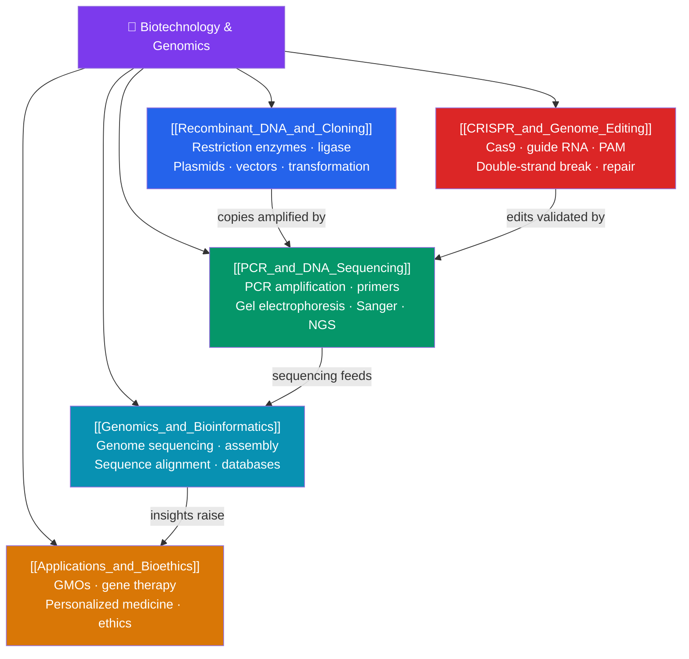

# 🧫 Biotechnology and Genomics — Map of Content

> [!abstract] What This Section Covers
> Biotechnology is applied molecular biology — the toolkit for reading, cutting, copying, and rewriting DNA. This section begins with **recombinant DNA and cloning**: restriction enzymes, plasmid vectors, and how genes are moved between organisms. **PCR and DNA sequencing** cover the amplification and reading technologies — the polymerase chain reaction, gel electrophoresis, and Sanger and next-generation sequencing — that made the genomic era possible. **CRISPR and genome editing** explains the Cas9 system that turned gene editing into a precise, programmable technology. **Genomics and bioinformatics** scales up to whole-genome sequencing and the computational analysis of the resulting data. Finally, **applications and bioethics** surveys the real-world uses — GMOs, gene therapy, personalized medicine — and the ethical questions they raise. This is where biology becomes engineering.

## Concept Map

## Learning Path

1. [[Recombinant_DNA_and_Cloning]] — Restriction enzymes and sticky ends, DNA ligase, plasmid and viral vectors, bacterial transformation, and selecting recombinant clones.
2. [[PCR_and_DNA_Sequencing]] — The polymerase chain reaction and thermal cycling, primers, gel electrophoresis for size separation, and Sanger vs. next-generation sequencing.
3. [[CRISPR_and_Genome_Editing]] — The bacterial CRISPR-Cas9 system, guide RNA targeting and the PAM, double-strand breaks, and repair by NHEJ or homology-directed repair.
4. [[Genomics_and_Bioinformatics]] — Whole-genome sequencing and assembly, sequence alignment, genome annotation, and the computational tools and databases behind genomic analysis.
5. [[Applications_and_Bioethics]] — GMO crops and organisms, gene and cell therapies, personalized medicine, and the ethical, ecological, and social debates they provoke.

## All Notes at a Glance

| Note | Difficulty | What You'll Learn |
|------|------------|-------------------|
| [[Recombinant_DNA_and_Cloning]] | Intermediate | Restriction enzymes, sticky/blunt ends, ligase, plasmids, vectors, transformation, cloning, libraries |
| [[PCR_and_DNA_Sequencing]] | Intermediate | PCR steps, primers, Taq polymerase, gel electrophoresis, Sanger sequencing, NGS, read depth |
| [[CRISPR_and_Genome_Editing]] | Intermediate → Advanced | CRISPR origins, Cas9, guide RNA, PAM, DSB repair, knockouts, base/prime editing, applications |
| [[Genomics_and_Bioinformatics]] | Intermediate → Advanced | Genome sequencing, assembly, alignment, annotation, comparative genomics, computational analysis |
| [[Applications_and_Bioethics]] | Intermediate | GMOs, transgenic organisms, gene therapy, CAR-T, personalized medicine, bioethics, regulation |

## Key Questions This Section Answers

- How do you cut out a gene from one organism and insert it into another?
- How can a single DNA molecule be copied into billions in a couple of hours?
- What makes CRISPR-Cas9 so much easier and more precise than earlier editing tools?
- Once a genome is sequenced, how do computers make sense of billions of base pairs?
- What ethical lines does genetic engineering force us to confront?

## Related Sections

- [[_MOC_Biology_Master|↑ Biology Master MOC]]
- [[_MOC_Developmental_Biology|← Developmental Biology]]
- Cross-vault: [[_MOC_AI_ML_Master]] — computation behind bioinformatics; [[Applied_Ethics]] — the ethics of engineering life

#MOC #Biology #Biotechnology
