# 🧬 Biology — Master Map of Content

> [!abstract] About This Vault
> The science of life, from molecules to ecosystems: **~65 notes across 13 sections**. It builds from the **chemistry of life** and **cell biology** up through **metabolism** and the **molecular biology of the gene**, then into **genetics**, **cell division**, and **development**; the two great unifying frameworks of **evolution** and **ecology**; the biology of **organisms** (human physiology, plants, microbes and the immune system); and finally **biotechnology and genomics**. Every note pairs an intuition-first analogy with real mechanisms, key experiments, diagrams, and review questions. Cross-linked to the (upcoming) Chemistry vault, [[_MOC_Psychology_Master]] (neuroscience), [[_MOC_AI_ML_Master]] (bioinformatics), and [[_MOC_Philosophy_of_Science|philosophy of science]] (bioethics). Start at the bottom of the ladder (molecules) or jump to a system.

> [!success] Vault complete
> All **13 sections** and **65 concept notes** are fully written — plus the master map and all 13 section maps. Every note is built from the `Technical_Concept` template with a Mermaid diagram, key mechanisms and experiments, and review questions. Completed 2026-07-30. See [[_Vault_Expansion_Roadmap]].

## Vault Architecture

```mermaid
graph TD
    Master["🧬 Biology Master"]

    Master --> A["<b>MOLECULES & CELLS</b>"]
    Master --> B["<b>GENETICS &<br/>REPRODUCTION</b>"]
    Master --> C["<b>EVOLUTION &<br/>ECOLOGY</b>"]
    Master --> D["<b>ORGANISMS</b>"]
    Master --> E["<b>APPLICATIONS</b>"]

    A --> S01["01 · Chemistry of Life"]
    A --> S02["02 · Cell Structure & Function"]
    A --> S03["03 · Metabolism & Bioenergetics"]
    A --> S04["04 · Molecular Biology of the Gene"]

    B --> S05["05 · Genetics & Heredity"]
    B --> S06["06 · Cell Division & Reproduction"]
    B --> S12["12 · Developmental Biology"]

    C --> S07["07 · Evolution"]
    C --> S08["08 · Ecology"]

    D --> S09["09 · Human Physiology & Anatomy"]
    D --> S10["10 · Plant Biology"]
    D --> S11["11 · Microbiology & Immunology"]

    E --> S13["13 · Biotechnology & Genomics"]

    style Master fill:#7c3aed,color:#fff
    style A fill:#2563eb,color:#fff
    style B fill:#059669,color:#fff
    style C fill:#b45309,color:#fff
    style D fill:#dc2626,color:#fff
    style E fill:#0891b2,color:#fff
```

## Sections at a Glance

| # | Section | Notes | Entry Point | Level |
|---|---------|:-----:|-------------|-------|
| 01 | Chemistry of Life | 5 | [[_MOC_Chemistry_of_Life]] | Beginner |
| 02 | Cell Structure & Function | 5 | [[_MOC_Cell_Structure]] | Beginner |
| 03 | Metabolism & Bioenergetics | 5 | [[_MOC_Metabolism]] | Intermediate |
| 04 | Molecular Biology of the Gene | 5 | [[_MOC_Molecular_Biology]] | Intermediate |
| 05 | Genetics & Heredity | 5 | [[_MOC_Genetics]] | Beginner → Intermediate |
| 06 | Cell Division & Reproduction | 5 | [[_MOC_Cell_Division]] | Intermediate |
| 07 | Evolution | 5 | [[_MOC_Evolution]] | Intermediate |
| 08 | Ecology | 5 | [[_MOC_Ecology]] | Intermediate |
| 09 | Human Physiology & Anatomy | 5 | [[_MOC_Human_Physiology]] | Intermediate |
| 10 | Plant Biology | 5 | [[_MOC_Plant_Biology]] | Intermediate |
| 11 | Microbiology & Immunology | 5 | [[_MOC_Microbiology_Immunology]] | Intermediate → Advanced |
| 12 | Developmental Biology | 5 | [[_MOC_Developmental_Biology]] | Advanced |
| 13 | Biotechnology & Genomics | 5 | [[_MOC_Biotechnology]] | Intermediate → Advanced |

---

## Learning Paths

### Path 1 — The Foundations Ladder (Molecules → Cells → Genes)

> Best for: building biology bottom-up the way it's taught in an intro course.

[[_MOC_Chemistry_of_Life]] → [[Proteins_and_Amino_Acids]] → [[Enzymes_and_Catalysis]] → [[_MOC_Cell_Structure]] → [[The_Cell_Membrane_and_Transport]] → [[_MOC_Metabolism]] → [[Bioenergetics_and_ATP]] → [[_MOC_Molecular_Biology]] → [[DNA_Structure_and_Replication]] → [[Transcription]] → [[Translation_and_the_Genetic_Code]]

---

### Path 2 — Genetics & Evolution

> Best for: understanding heredity and the central theory that unifies all of biology.

[[Mendelian_Genetics]] → [[Chromosomal_Basis_of_Inheritance]] → [[The_Cell_Cycle_and_Mitosis]] → [[Meiosis_and_Genetic_Variation]] → [[Population_Genetics]] → [[Natural_Selection_and_Adaptation]] → [[Evidence_for_Evolution]] → [[Speciation_and_Macroevolution]] → [[Phylogenetics_and_the_Tree_of_Life]]

---

### Path 3 — Physiology & Health

> Best for: how organisms (especially humans) actually work, and the microbes and immunity that shape health.

[[Homeostasis_and_the_Nervous_System]] → [[The_Circulatory_and_Respiratory_Systems]] → [[The_Endocrine_System_and_Hormones]] → [[Bacteria_and_Archaea]] → [[Viruses]] → [[The_Innate_Immune_System]] → [[The_Adaptive_Immune_System]] → [[Vaccines_and_Antibiotics]]

---

### Path 4 — Modern Molecular & Applied Biology

> Best for: readers from the CS/AI vaults — the tools reshaping biology.

[[DNA_Structure_and_Replication]] → [[Gene_Regulation]] → [[Recombinant_DNA_and_Cloning]] → [[PCR_and_DNA_Sequencing]] → [[CRISPR_and_Genome_Editing]] → [[Genomics_and_Bioinformatics]] → [[Applications_and_Bioethics]]

---

## Cross-Vault Links

- **Chemistry** (upcoming) — [[_MOC_Chemistry_of_Life]] is where biology meets organic and physical chemistry.
- **[[_MOC_Psychology_Master]]** — [[Homeostasis_and_the_Nervous_System]] connects to the biological-psychology section (neurons, neurotransmitters).
- **[[_MOC_AI_ML_Master]]** — [[Genomics_and_Bioinformatics]] is computational biology: sequence alignment, structure prediction, ML on omics data.
- **[[_MOC_Evolutionary_Psychology|Evolutionary Psychology]]** — [[Natural_Selection_and_Adaptation]] is the engine behind evolutionary accounts of mind and behavior.
- **[[Applied_Ethics]]** (Philosophy) — [[Applications_and_Bioethics]] tackles CRISPR, gene therapy, and GMOs.

---

## Section MOC Index

- [[_MOC_Chemistry_of_Life]] — Water, macromolecules, and enzymes: the molecular substrate of life.
- [[_MOC_Cell_Structure]] — The cell: membranes, organelles, the endomembrane system, and the cytoskeleton.
- [[_MOC_Metabolism]] — Energy and life: ATP, glycolysis, the citric acid cycle, oxidative phosphorylation, and photosynthesis.
- [[_MOC_Molecular_Biology]] — The central dogma: DNA replication, transcription, translation, gene regulation, and repair.
- [[_MOC_Genetics]] — Heredity: Mendel, chromosomes, non-Mendelian patterns, human genetics, and population genetics.
- [[_MOC_Cell_Division]] — Making more cells: mitosis, meiosis, cancer, reproduction, and stem cells.
- [[_MOC_Evolution]] — The unifying theory: natural selection, evidence, speciation, phylogeny, and the history of life.
- [[_MOC_Ecology]] — Life in context: populations, communities, ecosystems, biogeochemical cycles, and biodiversity.
- [[_MOC_Human_Physiology]] — How the body works: the nervous, circulatory, digestive, endocrine, and musculoskeletal systems.
- [[_MOC_Plant_Biology]] — The green world: plant structure, transport, nutrition, growth, and reproduction.
- [[_MOC_Microbiology_Immunology]] — Microbes and defense: bacteria, viruses, and the innate and adaptive immune systems.
- [[_MOC_Developmental_Biology]] — From one cell to many: fertilization, gastrulation, morphogenesis, signaling, and aging.
- [[_MOC_Biotechnology]] — Reading and writing life: recombinant DNA, PCR, sequencing, CRISPR, genomics, and bioethics.

#MOC #Biology #MasterMOC
