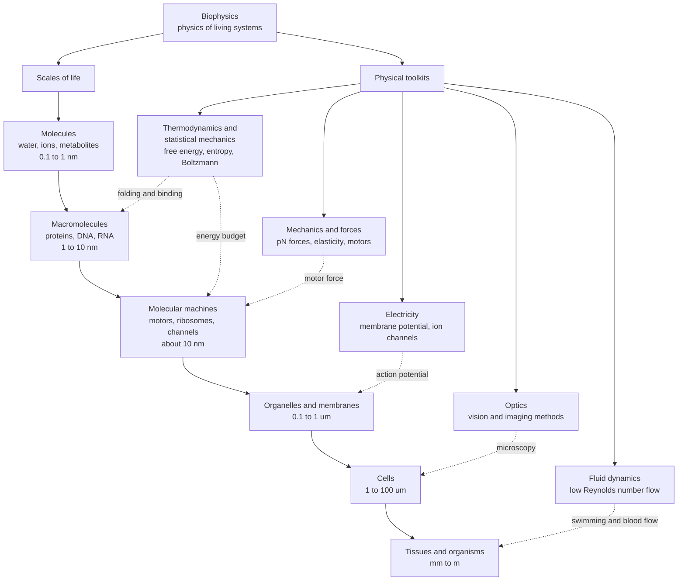

# 🧬 Biophysics: The Physics of Living Systems

> [!abstract] TL;DR
> **Biophysics** applies the concepts and methods of physics — thermodynamics, statistical mechanics, mechanics, electromagnetism, optics, and fluid dynamics — to understand living systems **quantitatively**, from single molecules to whole organisms. Its central question is how the *same* physical laws that govern inert matter give rise to the ordered, self-replicating, energy-processing phenomenon we call **life**. Where biology often describes *what* happens and gives mechanism qualitatively, biophysics asks *how much* — the forces, energies, rates, and physical limits — and it built the instruments (X-ray crystallography, cryo-EM, NMR, super-resolution and single-molecule microscopy) that gave molecular biology its eyes. The unifying idea: life is not exempt from physics but is its most spectacular expression, a self-organizing machine assembled from molecules that obey thermodynamics and mechanics.

## Intuition

**Analogy:** Watch what a living cell does and it looks like a magic trick that cheats physics. Out of a warm, disordered soup it builds exquisite molecular order; a muscle lifts a weight against gravity; a migrating bird reads the Earth's magnetic field to cross a continent. Every one of these *looks* like a violation of the tendency of things to run down and fall apart. It is not. Each one obeys thermodynamics, statistical mechanics, and electromagnetism down to the last decimal — the cell simply pays for its order by burning energy and dumping disorder into its surroundings, the same way a refrigerator makes ice by heating the kitchen.

Biophysics is physics with the lab bench replaced by a living cell. It takes the everyday toolkit of the physicist — energy budgets, force balances, random walks, circuit equations — and points it at the most sophisticated machine physics has ever been asked to study. The question is never "does life break the rules?" (it does not) but "given the rules, how does a bag of molecules at body temperature manage to swim, sense, replicate, and think?"

---

## How It Works

### Core Mechanics

Biophysics is organized along two axes: the **scales** of biological structure and the **physical toolkits** appropriate to each scale.

1. **Molecular and macromolecular scale.** Proteins fold, DNA bends and unzips, and ligands bind — all governed by **free energy** and the competition between energy and entropy. A protein finds its native shape because that conformation minimizes free energy, not because a blueprint places each atom; folding is a search down an energy landscape (the companion note *Protein_Structure_and_Folding*). The relevant energy unit is not the joule or the electron-volt but $k_BT$ — the thermal energy, about **4.1 pN·nm / 25 meV / 0.6 kcal·mol⁻¹** at body temperature — because that is the size of the random kicks every molecule feels from its neighbors (see *Statistical_Mechanics_of_Biomolecules* and *Energy_Entropy_and_Free_Energy_in_Biology*).

2. **Molecular machines.** Kinesin walks along a microtubule, the ribosome translates mRNA, ATP synthase spins like a turbine. These are **mechanochemical** engines that convert the ~20 $k_BT$ released by ATP hydrolysis into directed motion, generating forces of a few **piconewtons** — precisely the scale where a chemical step can out-muscle thermal noise (*Molecular_Motors_and_Mechanochemistry*).

3. **Membrane and cellular scale.** A cell membrane is a capacitor separating charged ion reservoirs. Ion pumps and channels set up a voltage of tens of millivolts across it; when channels open, that voltage collapses and regenerates as a travelling **action potential** — a wave of electricity described by circuit equations (*Membrane_Potential_and_the_Nernst_Equation*, *The_Hodgkin_Huxley_Model_and_Action_Potentials*). Inside the cell, transport is dominated not by inertia but by **diffusion** and viscous drag: molecules explore space by random walks, and diffusion time scales as $t \sim x^2/D$ (*Diffusion_and_Brownian_Motion_in_Cells*).

4. **Systems and organism scale.** Blood flows through branching vessels, hearts and lungs move fluid, and microorganisms swim in a world where **viscosity crushes inertia** — a bacterium lives at Reynolds number $\ll 1$, where coasting is impossible and swimming feels like moving through honey. Bodies obey **allometric scaling laws** that tie metabolic rate, lifespan, and vessel geometry to body mass (*Allometry_and_Scaling_Laws_in_Biology*).

The **Physical Biology of the Cell** perspective ties these together: think in **orders of magnitude** first. Know that $k_BT$ is the energy currency, the piconewton is the force unit, and the nanometre-to-micrometre is the length scale, and you can *estimate* whether a proposed mechanism is even physically possible before touching an experiment. Resources like the **BioNumbers** database exist precisely so biologists can reason this way — dimensional analysis and back-of-the-envelope estimation are as central to biophysics as any equation.

Biophysics also gave the life sciences their **instruments**. X-ray crystallography revealed the double helix and the first protein structures; NMR, cryo-electron microscopy, fluorescence and super-resolution microscopy, and single-molecule methods (optical tweezers, FRET) now let us watch individual molecules work (*Single_Molecule_Biophysics*). Every "picture" of a molecule in a biology textbook is a physics measurement.

The great **themes** recur at every scale: life is a **non-equilibrium**, energy-dissipating system that maintains order by exporting entropy; structure arises by **molecular self-assembly** rather than external construction; **information** (in genes, in signalling, in neural spikes) is physical and subject to physical limits; and **physical constraints** — diffusion times, thermal noise, viscosity, the finite energy of a bond — shape what evolution can and cannot build. At the frontier sit **quantum effects** in photosynthesis, magnetoreception, and enzyme catalysis (*Quantum_Biology*) and the open program of finding genuine *principles* rather than mere descriptions (*The_Reach_and_Future_of_Biophysics*).

### Flow / Architecture



---

## Key Concepts

### Secondary Level

- **Life obeys physics.** A cell is a machine, not an exception to the laws of nature. It builds order by spending energy and releasing waste heat — like a refrigerator, not like magic.
- **Energy currency.** Cells run on ATP; the natural energy "coin" at the molecular scale is the thermal energy $k_BT$, the size of the random jostling every molecule feels.
- **Everything is small and jiggling.** Biology happens at nanometre-to-micrometre sizes, with forces of a few piconewtons, in a world where molecules move by random bumping (diffusion), not by being aimed.

### Undergraduate Level

- **Free energy governs shape and binding.** $\Delta G = \Delta H - T\Delta S$: proteins fold, ligands bind, and membranes assemble to minimize free energy, balancing energetic gain against entropic cost.
- **The Boltzmann distribution.** A state of energy $E$ is occupied with probability $\propto e^{-E/k_BT}$; this single factor explains ion-channel gating, receptor occupancy, and conformational equilibria.
- **Random walks and diffusion.** Brownian motion gives $\langle x^2\rangle = 2Dt$, so diffusion time grows as $x^2/D$ — the reason cells are microscopic and organisms need circulatory systems.
- **Bioelectricity.** The **Nernst equation** sets a resting membrane potential from ion gradients; the **Hodgkin–Huxley** picture treats the neuron as an RC circuit with voltage-gated conductances.
- **Life at low Reynolds number.** For a swimming bacterium $Re \ll 1$: viscosity dominates inertia, so it cannot coast and must use non-reciprocal strokes (Purcell's scallop theorem).
- **Molecular motors and single-molecule methods.** Motors take ~8 nm steps producing ~5 pN of force; optical tweezers and FRET measure these one molecule at a time.

### Graduate Level

- **Non-equilibrium thermodynamics.** Living systems are open, dissipative, and steadily fed; **fluctuation theorems** (Jarzynski, Crooks) relate irreversible work to free-energy differences and are tested directly with single-molecule pulling.
- **Statistical mechanics of biomolecules.** Partition functions, cooperativity, and allostery (the **MWC model**) quantitatively predict hemoglobin binding curves and transcription-factor logic.
- **Polymer physics of DNA.** The **worm-like chain** model captures DNA's entropic elasticity, persistence length, and force–extension response measured by magnetic and optical tweezers.
- **Reaction–diffusion and pattern formation.** **Turing instabilities** show how diffusion plus reaction can spontaneously break symmetry to generate stripes, spots, and body plans.
- **Stochastic gene expression and physical limits.** Low copy numbers make gene expression noisy; **information theory** bounds how accurately a cell can sense concentration (the Berg–Purcell limit).
- **Energy landscapes and rate theory.** **Kramers** theory and folding funnels connect molecular potential-energy surfaces to measurable kinetic rates.

---

## Python Demo

```python
# An orders-of-magnitude tour of biophysics.
# Everything is anchored to kT, the thermal energy that sets the "currency" of the cell.
# Requires: numpy, matplotlib
import numpy as np
import matplotlib.pyplot as plt

# --- Fundamental constants (SI) ---
kB = 1.380649e-23      # Boltzmann constant, J/K
NA = 6.02214076e23     # Avogadro's number, 1/mol
qe = 1.602176634e-19   # elementary charge, C
T  = 310.0             # human body temperature, K (37 C)

# --- The universal currency: thermal energy kT ---
kT_J    = kB * T                 # joules
kT_pNnm = kT_J / 1e-21           # 1 pN*nm = 1e-21 J
kT_meV  = kT_J / qe * 1e3        # milli-electron-volts
kT_kcal = kT_J * NA / 4184.0     # kcal/mol

print("=== kT at body temperature (T = 310 K) ===")
print(f"kT = {kT_J:.2e} J")
print(f"   = {kT_pNnm:.2f} pN*nm   (force x distance at the molecular scale)")
print(f"   = {kT_meV:.1f} meV")
print(f"   = {kT_kcal:.2f} kcal/mol")

# --- Panel A: energy ladder, expressed in units of kT ---
labels_E = ["Thermal\nkT", "Hydrogen\nbond", "ATP\nhydrolysis", "Covalent\nC-C bond"]
E_kcal   = np.array([kT_kcal, 2.0, 12.5, 83.0])   # characteristic energies, kcal/mol
E_kT     = E_kcal / kT_kcal
print("\n=== Energies in units of kT ===")
for name, e in zip(labels_E, E_kT):
    print(f"{name.replace(chr(10),' '):20s}: {e:7.1f} kT")

# --- Panel B: diffusion time vs distance,  t ~ x^2 / (2D) ---
D = 1e-9                           # m^2/s, small molecule in water
x = np.logspace(-9, -1, 300)       # 1 nm to 10 cm
t = x**2 / (2*D)                   # 1D diffusion time (s)

# --- Panel C: Reynolds number across swimmers,  Re = rho*v*L/eta ---
rho, eta = 1000.0, 1e-3            # water density and viscosity (SI)
swimmers = {
    "E. coli":       (1e-6, 3e-5),
    "Sperm cell":    (5e-5, 2e-4),
    "Paramecium":    (2e-4, 1e-3),
    "Tadpole":       (1e-2, 2e-2),
    "Goldfish":      (0.10, 0.50),
    "Human swimmer": (2.0,  1.5),
}
names_Re = list(swimmers.keys())
Re = np.array([rho*v*L/eta for (L, v) in swimmers.values()])
print("\n=== Reynolds numbers ===")
for name, r in zip(names_Re, Re):
    print(f"{name:15s}: Re = {r:.1e}")

# --- Panel D: characteristic forces, in piconewtons ---
labels_F = ["Thermal\nkT/nm", "Myosin", "Kinesin", "RNA pol", "DNA\noverstretch"]
F_pN     = np.array([kT_pNnm, 4.0, 6.0, 25.0, 65.0])

# ----------------------------- plotting -----------------------------
fig, ax = plt.subplots(2, 2, figsize=(12, 9))
fig.suptitle("The Biophysical Landscape: energies, distances, flow, forces", fontsize=14, fontweight="bold")

# A: energy ladder
axA = ax[0, 0]
axA.bar(labels_E, E_kT, color=["#4a9eff", "#51cf66", "#ffa94d", "#ff6b6b"])
axA.axhline(1.0, ls="--", color="gray", lw=1)
axA.set_yscale("log")
axA.set_ylabel("energy  (units of kT)")
axA.set_title("A. Energy is measured in kT\n(ATP ~ 20 kT, bonds ~ 100 kT)")
for i, e in enumerate(E_kT):
    axA.text(i, e*1.15, f"{e:.0f}", ha="center", va="bottom", fontsize=9)

# B: diffusion time vs distance
axB = ax[0, 1]
axB.loglog(x*1e6, t, color="#4a9eff", lw=2)   # x in micrometres
for xm, lab in [(1.0, "cell ~1 um"), (1e4, "tissue ~1 cm")]:
    axB.axvline(xm, ls=":", color="gray")
    axB.text(xm, t.min()*3, lab, rotation=90, va="bottom", fontsize=8)
axB.set_xlabel("distance  (um)")
axB.set_ylabel("diffusion time  (s)")
axB.set_title("B. Why cells are small\nt ~ x^2 / D")

# C: Reynolds number
axC = ax[1, 0]
axC.barh(names_Re, Re, color="#845ef7")
axC.axvline(1.0, ls="--", color="k", lw=1)
axC.set_xscale("log")
axC.set_xlabel("Reynolds number  (log scale)")
axC.set_title("C. A bacterium lives at Re << 1\n(viscosity beats inertia)")

# D: forces
axD = ax[1, 1]
axD.bar(labels_F, F_pN, color=["#4a9eff", "#51cf66", "#51cf66", "#ffa94d", "#ff6b6b"])
axD.axhline(kT_pNnm, ls="--", color="gray", lw=1)
axD.set_ylabel("force  (pN)")
axD.set_title("D. Molecular forces are piconewtons\n(set by the thermal scale kT/nm)")
for i, f in enumerate(F_pN):
    axD.text(i, f+1, f"{f:.0f}", ha="center", va="bottom", fontsize=9)

plt.tight_layout(rect=[0, 0, 1, 0.96])
plt.show()
```

Running this prints the numbers that define life at the molecular scale — $k_BT \approx 4.1$ pN·nm $\approx 25$ meV $\approx 0.6$ kcal/mol — and plots four panels: energy is naturally measured in $k_BT$ (ATP $\approx 20$, covalent bonds $\approx 100$); diffusion time explodes as $x^2$, so cells stay microscopic; a bacterium swims at $Re \sim 10^{-5}$; and the forces that move molecules are a handful of piconewtons, exactly the scale set by $k_BT$ over a nanometre.

---

## Real-World Applications

> **Example:** **Cryo-electron microscopy (cryo-EM)** is biophysics in daily production use. It flash-freezes molecules in vitreous ice, images tens of thousands of individual copies with an electron beam, and reconstructs a 3-D structure from the noisy 2-D projections — a direct application of electron optics, statistical image averaging, and diffraction physics. The 2017 Nobel Prize in Chemistry recognized it, and it now solves near-atomic structures of ribosomes, membrane channels, and virus spike proteins that resisted crystallography.

- **Rational drug design.** Structure-based design fits candidate molecules into a protein's binding pocket using free-energy calculations grounded in statistical mechanics.
- **Neural engineering and pacemakers.** The Hodgkin–Huxley circuit model of excitable membranes underlies how we stimulate nerves and pace hearts.
- **Optical tweezers in biotech.** Single-molecule force spectroscopy measures how motors, polymerases, and DNA respond to piconewton loads, informing everything from sequencing to synthetic biology.
- **Medical imaging.** MRI (nuclear magnetic resonance), ultrasound, and optical coherence tomography are physics instruments turned onto living tissue.

---

## Common Pitfalls

- **Ignoring thermal noise ("the cell is not a clean-room robot").** At $k_BT$, molecules are constantly kicked; any proposed mechanism that needs sub-thermal precision or forces far below a piconewton is likely swamped by noise. Always compare your energy scale to $k_BT$.
- **Assuming inertia matters at the cellular scale.** Newtonian "coasting" intuition fails at low Reynolds number — a bacterium stops in nanometres the instant its flagellum halts. Reciprocal (back-and-forth) motions produce zero net displacement.
- **Confusing kinetics with thermodynamics.** A large negative $\Delta G$ says a reaction *can* proceed, not that it *will* quickly; the rate is set by the activation barrier, which is why enzymes matter even when the free-energy drop is huge.
- **Mistaking correlation for mechanism.** Biophysics demands numbers: a story that cannot survive a back-of-the-envelope estimate of energies, forces, and timescales is not yet a physical explanation.
- **Treating the cell as an equilibrium system.** Life is driven and dissipative; equilibrium formulas apply only locally and instantaneously, and the interesting biology lives in the steady non-equilibrium flux.

---

## Related Concepts

**Physics foundations**
- [[Classical_Statistical_Mechanics]] — the Boltzmann distribution and partition functions that govern folding, binding, and molecular machines
- [[Entropy_and_Second_Law]] — why maintaining biological order requires continuous energy dissipation
- [[Laws_of_Thermodynamics]] — the energy accounting every living process must obey
- [[Thermodynamic_Potentials]] — Gibbs free energy, the master variable for reactions in the cell
- [[Viscous_Fluids_and_Navier_Stokes]] — the fluid physics behind low-Reynolds-number swimming and blood flow
- [[Geometric_and_Wave_Optics]] — the optics behind vision and behind biological imaging methods

**Biology and chemistry it quantifies**
- [[Bioenergetics_and_ATP]] — the ~20 $k_BT$ per ATP that powers molecular machines
- [[Proteins_and_Amino_Acids]] — the molecules whose folding biophysics explains from first principles
- [[The_Cell_Membrane_and_Transport]] — the capacitor-and-channels system behind membrane potentials
- [[The_Cytoskeleton_and_Cell_Motility]] — tracks and filaments on which molecular motors generate force
- [[Chemical_Thermodynamics]] — free energy and equilibrium at the reaction level
- [[Water_and_Lifes_Chemistry]] — the solvent whose hydrophobic effect drives self-assembly

**Bioelectricity and imaging**
- [[Action_Potentials_and_Resting_Membrane_Potential]] — the travelling electrical wave described by circuit physics
- [[Ion_Channels_and_Receptor_Pharmacology]] — voltage-gated conductances as Boltzmann-governed switches
- [[Hodgkin_Huxley_Model_and_Computational_Neurons]] — the RC-circuit model of the excitable membrane
- [[NMR_Spectroscopy]] — magnetic resonance as both a structural and a clinical imaging tool
- [[X_Ray_Diffraction_and_Braggs_Law]] — the diffraction physics that revealed the double helix and protein structures

**Soft matter and mathematics**
- [[Nanofabrication_and_Self_Assembly]] — the same self-assembly physics that builds membranes and viral capsids
- [[Liquid_Crystals_and_Colloids]] — soft-matter phases that model membranes and the crowded cytoplasm
- [[Systems_of_ODEs]] — the dynamical framework for reaction kinetics and neural models
- [[Probability_Theory]] — the mathematics of random walks, diffusion, and molecular noise

---

## Review Questions

**Secondary**
1. A cell builds highly ordered structures out of a disordered soup of molecules. Explain why this does not violate the second law of thermodynamics, using the refrigerator analogy.

**Undergraduate**
2. A signalling protein must "decide" between two shapes whose energies differ by $2\,k_BT$. Using the Boltzmann factor, estimate the ratio of molecules in each shape, and explain why a difference of only a few $k_BT$ is enough for the cell to use as a switch. Then estimate how long it takes a small protein to diffuse across a 10 µm cell given $D \approx 10^{-10}\,\text{m}^2\text{s}^{-1}$.

**Graduate**
3. A bacterium and a human both swim in water, yet one lives at $Re \sim 10^{-5}$ and the other at $Re \sim 10^{6}$. Explain how this six-orders-of-magnitude difference changes the *strategy* of propulsion (invoke the scallop theorem), and describe one experimental technique you would use to measure the piconewton-scale forces a flagellar motor produces.

---

## Sources

- Phillips, Kondev, Theriot & Garcia — *Physical Biology of the Cell*, 2nd ed. (Garland Science, 2012)
- Philip Nelson — *Biological Physics: Energy, Information, Life* (updated ed., Chiliagon/Freeman, 2020)
- William Bialek — *Biophysics: Searching for Principles* (Princeton University Press, 2012)
- E. M. Purcell — "Life at Low Reynolds Number," *American Journal of Physics* 45, 3–11 (1977)
- Milo & Phillips — *Cell Biology by the Numbers* (Garland, 2015) and the BioNumbers database, bionumbers.hms.harvard.edu

---

#biophysics #physics-of-life #thermodynamics #statistical-mechanics #interdisciplinary
