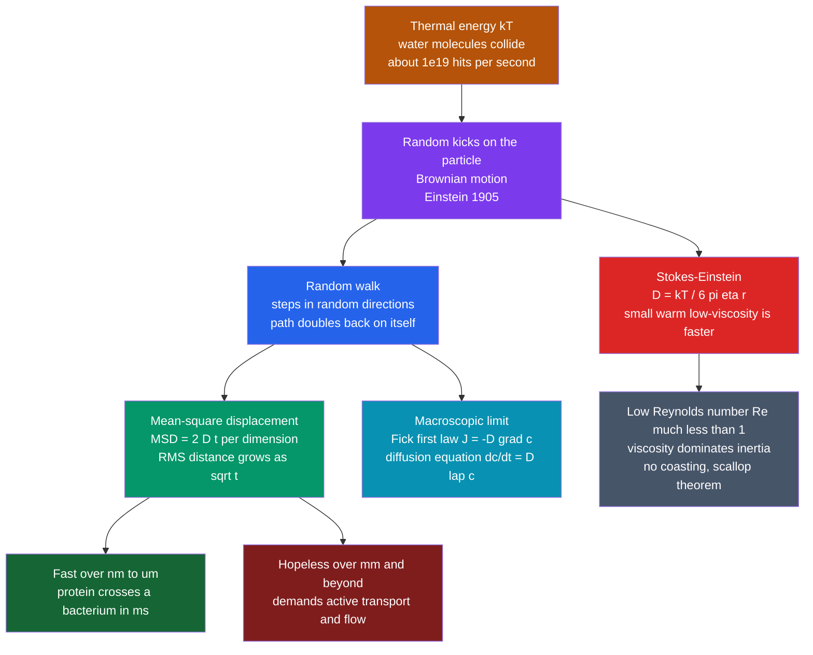

# 🌫️ Diffusion and Brownian Motion in Cells

> [!abstract] TL;DR
> Every molecule in a cell is kicked ceaselessly by colliding water molecules — **Brownian motion**, thermal energy made visible. Averaged over billions of kicks this random walk becomes **diffusion**, whose single most consequential fact is that mean-square displacement grows only **linearly with time** ($\langle x^2\rangle = 2Dt$ per dimension), so the distance travelled grows as $\sqrt{t}$. That $\sqrt{t}$ scaling makes diffusion supremely fast over nanometres-to-microns and hopelessly slow over millimetres — which is *why cells are small*, why life invented molecular motors and circulatory systems, why reaction and sensing rates are capped, and why microbes swim in the strange viscosity-dominated world of **low Reynolds number**.

---

## Intuition

**Analogy:** Imagine a blindfolded drunkard staggering away from a lamppost. Each step lands in a random direction, and because his path constantly doubles back on itself he drifts away only *slowly* — after 100 steps he is roughly 10 step-lengths from the post, not 100. Every molecule inside a cell does exactly this, jostled without pause by the water molecules slamming into it. There are no delivery trucks in the cytoplasm; there is just relentless jiggling.

That jiggling is **astonishingly effective over tiny distances and hopelessly slow over large ones** — and this single asymmetry, hidden in the drunkard's doubling-back, is one of the deepest physical reasons that cells are microscopic. A protein can cross a bacterium in a millisecond by pure random walk, yet the *same* protein would need decades to diffuse the length of a nerve cell's axon. Biology's response to that gap is the entire machinery of active transport.

---

## How It Works

### Core Mechanics

1. **Thermal collisions.** A micron-scale particle suspended in water is struck by roughly $10^{19}$ water molecules per second. The strikes never perfectly cancel; the residual imbalance nudges the particle in a random direction each instant. This is **Brownian motion** — observed by botanist Robert Brown in 1827 (pollen grains jittering in water) and explained by **Einstein in 1905**, who realised the jitter was *direct visible evidence for the reality of atoms* and thermal motion. Perrin's experiments then measured Avogadro's number from it.

2. **The random walk.** Model each nudge as an independent step of length $\ell$ in a random direction. After $N$ steps the displacement $\vec{R}=\sum_i \vec{\ell}_i$ has zero mean (no preferred direction), but its **mean-square displacement** is
$$\langle R^2\rangle = \Big\langle \sum_i \vec{\ell}_i \cdot \sum_j \vec{\ell}_j\Big\rangle = N\ell^2 ,$$
because the cross-terms average to zero. Since $N \propto t$, we get $\langle R^2\rangle \propto t$, and the **RMS distance grows as $\sqrt{t}$** — the famous square-root law.

3. **The diffusion coefficient.** Writing $\langle x^2 \rangle = 2Dt$ in one dimension defines the **diffusion coefficient** $D$ (units m²/s). In $d$ dimensions $\langle R^2\rangle = 2dDt$ — so $4Dt$ in 2D and $6Dt$ in 3D. Everything about "how fast diffusion is" lives in this one number.

4. **Fick's laws (the macroscopic view).** Zoom out from single walkers to a concentration field $c(\vec{x},t)$. Random motion carries more particles *out* of crowded regions than into them, so net flux runs *down* the gradient — **Fick's first law**:
$$\vec{J} = -D\,\nabla c .$$
Combined with mass conservation $\partial c/\partial t = -\nabla\!\cdot\!\vec{J}$, this gives the **diffusion equation** (Fick's second law), identical in form to the heat equation:
$$\boxed{\dfrac{\partial c}{\partial t} = D\,\nabla^2 c}.$$
Gradients relax; sharp spikes broaden as a Gaussian whose width spreads as $\sqrt{Dt}$.

5. **Stokes-Einstein — microscopic meets macroscopic.** Balancing the thermal driving energy $k_BT$ against the viscous drag on a sphere of radius $r$ in a fluid of viscosity $\eta$ (Stokes drag $6\pi\eta r$) yields
$$\boxed{D = \dfrac{k_B T}{6\pi\eta r}}.$$
Diffusion is faster for **small** particles, **warm** solvent, and **low-viscosity** solvent. This is the **fluctuation-dissipation theorem** in action: the same molecular collisions that *randomly kick* the particle (fluctuation) also *dissipate* its momentum as drag — so drag and diffusion are two faces of one process.

6. **Life at low Reynolds number.** The **Reynolds number** $\mathrm{Re}=\rho v L/\eta$ compares inertia to viscosity. For a swimming bacterium ($L\sim1\,\mu\text{m}$, $v\sim30\,\mu\text{m/s}$) $\mathrm{Re}\sim10^{-4}$ — inertia is utterly negligible. As Purcell explained in *"Life at Low Reynolds Number"*, such a swimmer cannot coast, feels no turbulence, and stops instantly when it stops pushing. Time-reversible ("reciprocal") strokes produce zero net motion — the **scallop theorem** — which is why flagella must rotate helically and cilia beat with non-reciprocal power/recovery strokes.

### Flow / Architecture



---

## Key Concepts

### Secondary (intuitive)
- **Brownian motion** is the never-ending random jiggling of tiny particles, caused by invisible molecules bumping into them. It is *thermal energy you can see under a microscope*.
- **Diffusion** is what happens when this jiggling spreads many particles out — like a drop of dye slowly colouring a glass of water — always from crowded to empty regions, with no pump or energy needed.
- Smaller, lighter things diffuse faster; warmer, thinner fluids let things diffuse faster; thick syrup slows everything down.
- Diffusion is quick across a cell but painfully slow across your body — the reason you have a heart and blood vessels rather than waiting for oxygen to jiggle its way to your toes.

### Undergraduate (quantitative)
- **The $\sqrt{t}$ law:** $\langle x^2\rangle = 2Dt$ (1D), $4Dt$ (2D), $6Dt$ (3D). Invert it for a **diffusion timescale** $\tau \sim L^2/D$ — quadratic in distance, the crux of everything.
- **Orders of magnitude:** small ion $D\!\approx\!2000\,\mu\text{m}^2/\text{s}$; globular protein $D\!\approx\!100\,\mu\text{m}^2/\text{s}$ in water (roughly $10\,\mu\text{m}^2/\text{s}$ in crowded cytoplasm); organelle $D\!\lesssim\!1\,\mu\text{m}^2/\text{s}$.
- **Fick's laws** and the diffusion/heat equation $\partial_t c = D\nabla^2 c$; Gaussian spreading solution with width $\sigma=\sqrt{2Dt}$.
- **Stokes-Einstein** $D = k_BT/6\pi\eta r$ — connects a measurable $D$ to molecular size, a workhorse for estimating hydrodynamic radii.
- **Diffusion-limited reaction rate:** the fastest a reaction can go if every encounter reacts, the **Smoluchowski rate** $k \approx 4\pi D R N_A \sim 10^8\text{–}10^9\,\text{M}^{-1}\text{s}^{-1}$ — a hard ceiling on enzyme and signalling speed.
- **Reynolds number** $\mathrm{Re}=\rho v L/\eta$; for microbes $\mathrm{Re}\ll1$, so inertia vanishes and the **scallop theorem** forbids reciprocal swimming.

### Graduate (advanced)
- **Langevin equation** $m\ddot{x}=-\gamma\dot{x}+\xi(t)$ with white-noise force $\langle\xi(t)\xi(t')\rangle=2\gamma k_BT\,\delta(t-t')$; in the overdamped ($\mathrm{Re}\to0$) limit inertia drops out and Stokes-Einstein $D=k_BT/\gamma$ emerges as the **fluctuation-dissipation theorem**.
- **Fokker-Planck / Smoluchowski equation** as the deterministic PDE for the probability density underlying the Langevin trajectories; first-passage-time analysis for capture and escape problems.
- **Anomalous subdiffusion:** in the crowded cytoplasm (macromolecular crowding, obstacles, binding) $\langle x^2\rangle \sim t^{\alpha}$ with $\alpha<1$; probed by FRAP, single-particle tracking, and FCS.
- **Facilitated diffusion / target search:** proteins find DNA sites faster than the 3D diffusion limit by alternating 3D excursions with 1D sliding along DNA (Berg-von Hippel), optimizing the search.
- **Reaction-diffusion patterning:** Turing instabilities and morphogen gradients arise when diffusion couples to reaction kinetics — diffusion sets the spatial scale of developmental patterns.

These threads are developed further in the sibling notes *Statistical_Mechanics_of_Biomolecules* (the $k_BT$ energy scale and fluctuation-dissipation), *Molecular_Motors_and_Mechanochemistry* (how motors beat the $\sqrt{t}$ diffusion limit), *Fluid_Dynamics_in_Biology* (low-Reynolds swimming and internal flows), *Enzyme_Kinetics_and_Catalysis_Physics* (the diffusion-limited reaction ceiling), and *Scales_Units_and_Orders_of_Magnitude_in_Biophysics* (the number sense that makes all of this quantitative).

---

## Python Demo

```python
# Simulate 2D Brownian motion, verify MSD = 4 D t, and show the sqrt-scaling
# that makes diffusion fast in a bacterium but hopeless along an axon.
import numpy as np
import matplotlib.pyplot as plt

rng = np.random.default_rng(42)

# ----------------------------------------------------------------------
# PART A - Simulate 2D random walkers and recover D from the MSD
# ----------------------------------------------------------------------
# Each step is a Gaussian displacement with variance 2*D*dt per axis
# (the discrete Einstein relation). Target: a protein in water.
D_true    = 100e-12          # m^2/s  (~100 um^2/s, globular protein in water)
dt        = 1e-4             # s per step
n_steps   = 2000
n_walkers = 3000

sigma = np.sqrt(2 * D_true * dt)                       # step std-dev per axis
steps = rng.normal(0.0, sigma, size=(n_walkers, n_steps, 2))
pos   = np.cumsum(steps, axis=1)                       # positions, start at 0
pos   = np.concatenate([np.zeros((n_walkers, 1, 2)), pos], axis=1)
t     = np.arange(n_steps + 1) * dt

# Mean-square displacement averaged over all walkers: <x^2 + y^2>
msd   = np.mean(np.sum(pos**2, axis=2), axis=0)
slope = np.polyfit(t, msd, 1)[0]                       # MSD = 4 D t  ->  slope = 4D
D_fit = slope / 4.0
print(f"True D = {D_true*1e12:6.1f} um^2/s")
print(f"Fit  D = {D_fit*1e12:6.1f} um^2/s   (from MSD = 4 D t)")

# ----------------------------------------------------------------------
# PART B - The sqrt-scaling:  diffusion time  tau ~ L^2 / (6 D)  in 3D
# ----------------------------------------------------------------------
def diffusion_time(L, D):
    return L**2 / (6 * D)

t_bact = diffusion_time(1e-6, D_true)   # cross a 1 um bacterium
t_axon = diffusion_time(1.0,  D_true)   # cross a 1 m motor-neuron axon
print(f"\nAcross 1 um bacterium : {t_bact:.3e} s  (~{t_bact*1e3:.2f} ms)")
print(f"Across 1 m  axon      : {t_axon:.3e} s  (~{t_axon/3.15e7:.0f} years!)")
print("=> pure diffusion is fine in a cell, impossible along an axon "
      "-> motors and axonal transport are mandatory.")

# ----------------------------------------------------------------------
# PART C - Stokes-Einstein: D shrinks with particle radius
# ----------------------------------------------------------------------
kB, Temp, eta = 1.380649e-23, 310.0, 1.0e-3            # J/K, body temp K, Pa.s
radii = np.logspace(-10, -7, 100)                      # 0.1 nm ... 100 nm
D_SE  = kB * Temp / (6 * np.pi * eta * radii)          # m^2/s

# ----------------------------------------------------------------------
# Plots
# ----------------------------------------------------------------------
fig, ax = plt.subplots(2, 2, figsize=(12, 9))

for i in range(12):                                    # (1) sample trajectories
    ax[0, 0].plot(pos[i, :, 0]*1e6, pos[i, :, 1]*1e6, lw=0.8, alpha=0.8)
ax[0, 0].set_title("2D Brownian trajectories")
ax[0, 0].set_xlabel("x (um)"); ax[0, 0].set_ylabel("y (um)")
ax[0, 0].set_aspect("equal"); ax[0, 0].grid(alpha=0.3)

te, tl = 100, n_steps                                  # (2) spreading cloud
ax[0, 1].scatter(pos[:, te, 0]*1e6, pos[:, te, 1]*1e6, s=3, alpha=0.3,
                 label=f"t = {t[te]*1e3:.0f} ms")
ax[0, 1].scatter(pos[:, tl, 0]*1e6, pos[:, tl, 1]*1e6, s=3, alpha=0.3,
                 label=f"t = {t[tl]*1e3:.0f} ms")
ax[0, 1].set_title("3000 walkers spreading as a Gaussian cloud")
ax[0, 1].set_xlabel("x (um)"); ax[0, 1].set_ylabel("y (um)")
ax[0, 1].legend(); ax[0, 1].set_aspect("equal"); ax[0, 1].grid(alpha=0.3)

ax[1, 0].plot(t*1e3, msd*1e12, lw=2, label="simulated MSD")     # (3) MSD linearity
ax[1, 0].plot(t*1e3, 4*D_true*t*1e12, "k--", label="4 D t (theory)")
ax[1, 0].set_title(f"MSD linear in time  ->  D = {D_fit*1e12:.1f} um^2/s")
ax[1, 0].set_xlabel("time (ms)"); ax[1, 0].set_ylabel("MSD (um^2)")
ax[1, 0].legend(); ax[1, 0].grid(alpha=0.3)

ax[1, 1].loglog(radii*1e9, D_SE*1e12, lw=2)                     # (4) Stokes-Einstein
ax[1, 1].set_title("Stokes-Einstein:  D = kT / 6 pi eta r")
ax[1, 1].set_xlabel("particle radius (nm)"); ax[1, 1].set_ylabel("D (um^2/s)")
ax[1, 1].grid(alpha=0.3, which="both")

plt.tight_layout()
plt.show()
```

**What you should see:** the fitted $D$ lands within a few percent of the true $100\,\mu\text{m}^2/\text{s}$; the walker cloud spreads with radius growing as $\sqrt{t}$; MSD is a straight line through the origin (slope $=4D$); and Part B prints the punchline — **~1.7 ms to cross a bacterium versus ~50 years to cross a 1 m axon**, the quantitative reason evolution built molecular motors.

---

## Real-World Applications

> **Example — synaptic transmission.** When a neuron fires, vesicles dump neurotransmitter into the ~20 nm synaptic cleft. Diffusion carries those molecules across in tens of microseconds because $\tau\sim L^2/D$ is tiny at 20 nm — fast enough for millisecond neural signalling. The cleft is *narrow by design*: widen it to a micron and the signal would smear and slow catastrophically.

- **Oxygen delivery.** O₂ diffuses efficiently over the ~1 µm from a capillary into a cell, but *not* over centimetres — hence lungs, haemoglobin, and a circulatory system to do the long-haul bulk transport that diffusion cannot.
- **Morphogen gradients.** In development, a source secretes a signalling protein that diffuses and decays, forming a concentration gradient cells read to learn their position (French-flag model) — reaction-diffusion turning chemistry into body plan.
- **Axonal & vesicle transport.** Because diffusion is hopeless over a neuron's length, **kinesin and dynein motors** actively haul cargo along microtubules — beating the $\sqrt{t}$ wall by burning ATP for directed motion.
- **Bacterial chemotaxis.** *E. coli* cannot simply "sense a gradient across its body" (diffusion smears it) so it swims and compares concentrations *over time*, biasing its low-Reynolds run-and-tumble toward food.
- **Drug and nanoparticle delivery.** Stokes-Einstein sizing predicts how fast a therapeutic diffuses through tissue and mucus, guiding nanoparticle design.

---

## Common Pitfalls

- **Expecting linear distance-vs-time.** Diffusion covers distance as $\sqrt{t}$, not $\propto t$. Doubling the distance quadruples the time; a 10× larger cell diffuses 100× slower. Reasoning about diffusion "speed" as a velocity is the single most common mistake.
- **Forgetting the dimensionality factor.** $\langle R^2\rangle = 2dDt$: it is $2Dt$ in 1D, $4Dt$ in 2D, $6Dt$ in 3D. Fitting 2D-tracking data with a 1D or 3D formula misestimates $D$ by 2×–3×.
- **Using water viscosity inside a cell.** The cytoplasm is crowded and viscoelastic; effective $D$ is often ~10× lower than the dilute-water Stokes-Einstein estimate, and motion is frequently **subdiffusive** ($\alpha<1$), not simple Fickian.
- **Assuming reactions can be arbitrarily fast.** The diffusion-limited (Smoluchowski) rate $\sim10^{8\text{–}9}\,\text{M}^{-1}\text{s}^{-1}$ caps bimolecular kinetics; a proposed mechanism that needs a faster encounter rate is physically impossible without special tricks (electrostatic steering, 1D+3D search).
- **Applying macroscale fluid intuition to microbes.** At $\mathrm{Re}\ll1$ there is no coasting, no turbulence, and no propulsion from reciprocal strokes (scallop theorem). Designing a micro-swimmer with a back-and-forth paddle produces exactly zero net displacement.

---

## Related Concepts

- [[Brownian_Motion]] — the rigorous mathematics (Wiener process, independent Gaussian increments) whose physics this note grounds in the cell.
- [[Introduction_to_PDEs]] — the diffusion/heat equation $\partial_t c = D\nabla^2 c$ is the canonical parabolic PDE; solution methods carry over directly.
- [[Diffusion_in_Solids_and_Ficks_Laws]] — the same Fick's laws and random-walk origin, applied to atoms hopping in a crystal lattice.
- [[Classical_Statistical_Mechanics]] — supplies the $k_BT$ thermal-energy scale and the fluctuation-dissipation theorem behind Stokes-Einstein.
- [[Kinetic_Theory_of_Gases]] — the molecular-collision picture that makes Brownian kicks quantitative.
- [[Viscous_Fluids_and_Navier_Stokes]] — defines the Reynolds number and the viscosity-dominated regime microbes inhabit.
- [[Fluid_Statics_and_Properties]] — the viscosity $\eta$ that sets Stokes drag and hence the diffusion coefficient.
- [[The_Cell_Membrane_and_Transport]] — simple and facilitated diffusion across membranes are direct biological instances of this physics.
- [[The_Cytoskeleton_and_Cell_Motility]] — molecular motors and cytoskeletal tracks are biology's answer to the diffusion limit over long distances.
- [[Morphogenesis_and_Pattern_Formation]] — morphogen gradients arise from diffusion coupled to reaction, patterning the embryo.
- [[Chemical_Kinetics]] — the diffusion-limited (Smoluchowski) rate sets the upper bound on reaction speed.
- [[Enzymes_and_Catalysis]] — the fastest enzymes operate near the diffusion-controlled encounter limit.

---

## Review Questions

1. **(Conceptual)** Why does the mean-square displacement grow *linearly* with time even though the walker's path constantly reverses direction? Show how the cross-terms in $\langle(\sum_i \vec{\ell}_i)^2\rangle$ vanish, and explain in words why RMS distance therefore scales as $\sqrt{t}$.
2. **(Scenario)** A signalling protein has $D\approx50\,\mu\text{m}^2/\text{s}$. Estimate the time to diffuse across (a) a 2 µm bacterium and (b) a 1 mm distance. What does the ratio tell you about whether a cell can rely on diffusion for each, and what mechanism must it use for the longer one?
3. **(Trade-off)** A bioengineer wants to build a 5 µm artificial micro-swimmer. Explain why a simple oscillating paddle will not work at $\mathrm{Re}\approx10^{-4}$, invoke the scallop theorem, and propose a propulsion strategy that a real bacterium uses instead. What changes if you scaled the same design up to a 5 cm robot in water?

---

## Sources

- Howard C. Berg, *Random Walks in Biology*, Princeton University Press (rev. ed. 1993).
- Edward M. Purcell, "Life at Low Reynolds Number," *American Journal of Physics* 45, 3 (1977).
- Rob Phillips, Jane Kondev, Julie Theriot & Hernan Garcia, *Physical Biology of the Cell*, 2nd ed., Garland Science (2012).
- Albert Einstein, "Über die von der molekularkinetischen Theorie der Wärme geforderte Bewegung...," *Annalen der Physik* 17 (1905).
- Philip Nelson, *Biological Physics: Energy, Information, Life*, W. H. Freeman (2013).

---

#biophysics #diffusion #brownian-motion #low-reynolds-number #stokes-einstein
