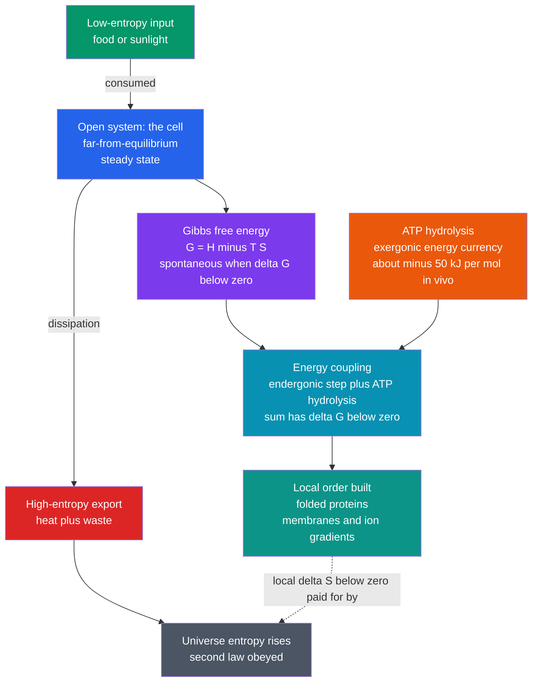

# 🧬 Energy, Entropy, and Free Energy in Biology

> [!abstract] TL;DR
> Life is governed by thermodynamics, not exempt from it. The **first law** says a cell only *transforms* energy (light or chemical fuel into chemical, then mechanical, electrical, and osmotic work) and never creates it. The **second law** seems to forbid the exquisite order a cell builds — until you notice the cell is an **open system**: it imports low-entropy energy and exports even more high-entropy heat and waste, so the universe's entropy still rises. The master variable is the **Gibbs free energy** $G = H - TS$: a process is spontaneous exactly when $\Delta G < 0$, set by a tug-of-war between enthalpy (bonds, interactions) and entropy (disorder, including water's). Cells drive "impossible" **endergonic** reactions by **coupling** them to the exergonic hydrolysis of **ATP** (about $-30.5$ kJ/mol standard, roughly $-50$ kJ/mol or $\sim 20\,k_BT$ in a real cell because the ATP/ADP ratio is held far from equilibrium). Sustained order is not a state but a *flow*: life is a dissipative, far-from-equilibrium steady state — equilibrium is death.

## Intuition — analogy FIRST

How can a living cell build breathtaking order — folded proteins, layered membranes, an entire organism — when the second law of thermodynamics says the universe relentlessly slides toward disorder?

The trick is that **a cell is not a closed box**. It is like a tidy room maintained only by constantly throwing garbage out the window. The room (the cell) gets more ordered, but the street outside (the surroundings) gets far messier. Tally the whole neighborhood and the mess always grows. A cell pays for its internal order by dumping *even more* disorder — heat and low-value waste molecules — into its environment.

So life does **not** break the second law. It **obeys** it by *exporting entropy*. Erwin Schrödinger, in his 1944 book *What Is Life?*, called this feeding on "negative entropy" (negentropy); in modern language, an organism survives by continuously drawing in **free energy** and discarding **entropy**. Stop the flow — seal the box — and the system slides to equilibrium, which for a cell means death.

---

## How It Works

**First law in biology (energy conservation).** A cell is an energy transducer. Chloroplasts convert photons into chemical bonds; mitochondria convert food into the electrochemical proton gradient and then into ATP; motor proteins convert ATP into motion; ion pumps convert ATP into voltage. At every step energy is conserved — the cell's "energy budget" is bookkeeping, not magic. A resting human turns over roughly their body weight in ATP per day, all of it recycled.

**Second law and the apparent paradox.** The second law demands $\Delta S_{univ} \geq 0$. A cell lowers *its own* entropy while building structure, so $\Delta S_{sys} < 0$ locally. This is allowed only because the surroundings gain more: $\Delta S_{surr} = -\Delta H_{sys}/T$ from the heat dumped out, plus the entropy of excreted waste. The books always balance in the universe's favor.

**Gibbs free energy — the master variable.** At constant temperature and pressure (a cell's world), the relevant potential is

$$\Delta G = \Delta H - T\Delta S, \qquad \boxed{\text{spontaneous} \iff \Delta G < 0}$$

$\Delta G$ folds the entropy of *both* system and surroundings into one system-only quantity, because $\Delta G = -T\,\Delta S_{univ}$. Enthalpy $\Delta H$ counts bond and interaction energies; the $-T\Delta S$ term counts disorder — including the decisive **hydrophobic effect**, where releasing ordered water from around nonpolar surfaces raises entropy and drives folding and membrane assembly.

**Chemical potential and the reaction quotient.** Real cells never sit at standard concentrations, so the actual driving force uses the reaction quotient $Q$:

$$\Delta G = \Delta G^{\circ} + RT\ln Q$$

At equilibrium $\Delta G = 0$ and $Q = K$, giving $\Delta G^{\circ} = -RT\ln K$. Cells win by **holding $Q$ far from $K$** — keeping substrates high and products low so $\Delta G$ stays strongly negative.

**Energy coupling — the central trick.** An endergonic reaction ($\Delta G > 0$) is driven by *chemically coupling* it to ATP hydrolysis so the **sum** is exergonic. Coupling works through a **shared intermediate** (ATP phosphorylates the substrate), not by releasing heat nearby — heat cannot power a specific reaction, a chemical intermediate can.

**Non-equilibrium steady state.** Life is a **dissipative structure**: order sustained by a continuous throughput of energy and matter, far from equilibrium. Order here is a *flux*, not a *state* — it requires sustained energy dissipation and entropy production.



---

## Key Concepts / Details

### Secondary Level

- **Energy is conserved (first law).** Cells transform energy between forms — light to chemical, chemical to mechanical/electrical — but never create or destroy it. "Where does the energy go?" always has an answer.
- **Entropy is a measure of disorder / number of accessible arrangements.** Left alone, systems drift toward the most probable (highest-entropy) state.
- **The paradox and its resolution.** A cell builds order, which looks like *falling* entropy. It is allowed because the cell is **open**: it eats low-entropy food or light and excretes high-entropy heat and waste, so total entropy still rises.
- **Exergonic vs. endergonic.** $\Delta G < 0$ releases usable energy (spontaneous); $\Delta G > 0$ requires an input. ATP hydrolysis is the workhorse exergonic reaction.

### Undergraduate Level

- **Gibbs free energy.** $\Delta G = \Delta H - T\Delta S$. The four sign quadrants: $(\Delta H<0,\ \Delta S>0)$ spontaneous at all $T$; $(\Delta H>0,\ \Delta S<0)$ never; the two mixed cases switch at the crossover temperature $T_{cross} = \Delta H/\Delta S$.
- **Reaction quotient and equilibrium.** $\Delta G = \Delta G^{\circ} + RT\ln Q$; $\Delta G^{\circ} = -RT\ln K$. A reaction with $\Delta G^{\circ} > 0$ can still run if $Q \ll K$.
- **ATP as the universal currency.** Standard $\Delta G^{\circ\prime} \approx -30.5$ kJ/mol, but in a cell the high ATP/ADP ratio and low $[P_i]$ push it to about $-50$ kJ/mol ($\sim 20\,k_BT$ per molecule at body temperature). ATP sits at an *intermediate* rung on the phosphate-transfer ladder, so it can accept phosphate from higher-energy donors and hand it to lower-energy acceptors.
- **Energy coupling.** Endergonic biosynthesis, transport, and motion are made spontaneous by summing them with ATP hydrolysis through a shared phosphorylated intermediate.
- **The hydrophobic effect.** A largely **entropic** force: burying nonpolar groups frees the ordered "clathrate" water cage around them, raising $\Delta S$ and lowering $\Delta G$. This governs protein folding and lipid self-assembly (the theme of the future sibling notes *Intermolecular_Forces_and_the_Aqueous_Environment* and *Protein_Structure_and_Folding*).

### Graduate Level

- **Chemical potential.** For a species $i$, $\mu_i = (\partial G/\partial n_i)_{T,P,n_{j\neq i}} = \mu_i^{\circ} + RT\ln a_i$. Reactions run down gradients of $\mu$; transport runs down the **electrochemical potential** $\tilde\mu_i = \mu_i^{\circ} + RT\ln a_i + z_iF\psi$, the quantity mitochondria store as the proton-motive force.
- **Statistical-mechanical bridge.** Free energy is a log partition function, $A = -k_BT\ln Z$; the Boltzmann factor $e^{-\Delta G/k_BT}$ sets occupancy and binding probabilities. This is where thermodynamics meets the microscopic ensemble picture developed in the future sibling *Statistical_Mechanics_of_Biomolecules*.
- **Non-equilibrium thermodynamics.** A living cell is a **dissipative structure** (Prigogine) at a **non-equilibrium steady state**: constant fluxes with constant internal entropy, sustained by a positive **entropy production rate** $\sigma = \sum_k J_k X_k \geq 0$ (fluxes $J_k$ times thermodynamic forces $X_k$). Near equilibrium, Onsager reciprocity links coupled flows; far from it, energy dissipation is what *buys* the order.
- **Entropic forces beyond "disorder."** Entropy drives the hydrophobic effect, membrane self-assembly, **polymer/entropic elasticity** (an ideal chain resists stretching purely because extension reduces conformational entropy, giving a restoring force $f = -T\,\partial S/\partial x$), and **depletion interactions** between large particles in crowded cytoplasm. These entropic forces power much of the mechanics explored in the future siblings *Molecular_Motors_and_Mechanochemistry* and *Enzyme_Kinetics_and_Catalysis_Physics*.
- **Information link.** Schrödinger's "negentropy" prefigures the deep tie between thermodynamic and Shannon entropy; Landauer's bound ($k_BT\ln 2$ per erased bit) sets a physical floor on the cost of the cell's information processing.

---

## Python Demo

```python
# Quantifying the thermodynamics of biological processes:
#   (a) delta G = delta H - T delta S  -> sign & temperature set spontaneity
#   (b) delta G = delta G0 + RT ln Q    -> a held-far-from-equilibrium ATP/ADP
#                                          ratio makes hydrolysis far more favorable
#   (c) energy coupling: an endergonic step + ATP hydrolysis -> net exergonic
import numpy as np
import matplotlib.pyplot as plt

R  = 8.314        # J/(mol K), gas constant
T  = 310.0        # K, body temperature (37 C)
kT_kJ = R * T / 1000.0   # kJ/mol per unit of k_B T (per mole)

fig, ax = plt.subplots(1, 3, figsize=(16, 5))

# ---- (a) Entropy-driven association (hydrophobic-effect-like) ----
# Enthalpy slightly UNfavorable (+), entropy strongly favorable (+):
dH = 10.0e3        # J/mol
dS = 60.0          # J/(mol K)
Tr = np.linspace(250, 400, 300)
dG = dH - Tr * dS
Tcross = dH / dS
ax[0].plot(Tr, dG / 1000, lw=2, color='navy')
ax[0].axhline(0, color='k', lw=1)
ax[0].axvline(Tcross, ls='--', color='crimson', label=f'T_cross = {Tcross:.0f} K')
ax[0].fill_between(Tr, dG / 1000, 0, where=(dG < 0), color='green', alpha=0.2)
ax[0].text(300, 4, 'spontaneous\nwhen dG < 0', color='green', fontsize=9)
ax[0].set_title('(a)  dG = dH - T dS\nentropy-driven association')
ax[0].set_xlabel('Temperature (K)'); ax[0].set_ylabel('dG (kJ/mol)')
ax[0].legend(); ax[0].grid(alpha=0.3)

# ---- (b) ATP hydrolysis vs the cellular ATP/ADP ratio ----
dG0 = -30.5e3       # J/mol, standard free energy of hydrolysis
Pi  = 5.0e-3        # M, ~5 mM inorganic phosphate
ratio = np.logspace(-2, 4, 300)   # [ATP]/[ADP]
Q  = Pi / ratio                   # Q = [ADP][Pi]/[ATP]
dG_hyd = dG0 + R * T * np.log(Q)
cell_ratio = 10.0                 # typical cytosolic [ATP]/[ADP]
dG_cell = (dG0 + R * T * np.log(Pi / cell_ratio)) / 1000.0
ax[1].plot(ratio, dG_hyd / 1000, lw=2, color='darkorange')
ax[1].axhline(dG0 / 1000, ls=':', color='gray', label='standard  -30.5 kJ/mol')
ax[1].plot(cell_ratio, dG_cell, 'o', color='red', ms=9,
           label=f'cell:  {dG_cell:.1f} kJ/mol')
ax[1].set_xscale('log')
ax[1].set_title('(b)  ATP hydrolysis vs [ATP]/[ADP]\nQ held far from equilibrium')
ax[1].set_xlabel('[ATP] / [ADP]   (log scale)')
ax[1].set_ylabel('dG of hydrolysis (kJ/mol)')
ax[1].legend(); ax[1].grid(alpha=0.3, which='both')

# ---- (c) Energy coupling: uphill step rescued by ATP hydrolysis ----
dG_endo     = +14.0     # kJ/mol  (e.g. glutamate + NH3 -> glutamine)
dG_atp_cell = -50.0     # kJ/mol  (in vivo hydrolysis)
uncoupled = np.array([0, dG_endo])                       # stalls uphill
coupled   = np.array([0, dG_endo, dG_endo + dG_atp_cell]) # net downhill
ax[2].plot([0, 1], uncoupled, 'o-', lw=2, color='crimson',
           label=f'uncoupled: net {dG_endo:+.0f} kJ/mol (stalls)')
ax[2].plot([0, 1, 2], coupled, 's-', lw=2, color='green',
           label=f'coupled to ATP: net {dG_endo + dG_atp_cell:+.0f} kJ/mol')
ax[2].axhline(0, color='k', lw=1)
ax[2].set_xticks([0, 1, 2])
ax[2].set_xticklabels(['substrate', 'intermediate', 'product'])
ax[2].set_title('(c)  Energy coupling\nendergonic step driven by ATP')
ax[2].set_ylabel('cumulative dG (kJ/mol)')
ax[2].legend(); ax[2].grid(alpha=0.3)

plt.tight_layout()
plt.show()

# ---- Console summary ----
print(f"(a) crossover T       = {Tcross:.0f} K  (below it, association is non-spontaneous)")
print(f"(b) standard dG(ATP)  = {dG0/1000:.1f} kJ/mol  = {abs(dG0/1000)/kT_kJ:.1f} k_B*T/molecule")
print(f"    in-cell dG(ATP)   = {dG_cell:.1f} kJ/mol  = {abs(dG_cell)/kT_kJ:.1f} k_B*T/molecule")
print(f"(c) uncoupled net dG  = {dG_endo:+.1f} kJ/mol (reaction stalls)")
print(f"    coupled  net dG   = {dG_endo + dG_atp_cell:+.1f} kJ/mol (reaction proceeds)")
```

Panel (a) shows how the enthalpy–entropy balance plus temperature fixes spontaneity; panel (b) shows why a cell that pins its ATP/ADP ratio near 10 (with millimolar $P_i$) extracts about $-50$ kJ/mol — roughly $20\,k_BT$ — from each ATP instead of the textbook $-30.5$ kJ/mol; panel (c) makes the coupling logic visible: an uphill $+14$ kJ/mol step stalls alone but runs when its free-energy landscape is summed with ATP hydrolysis.

---

## Real-World Applications

- **Oxidative phosphorylation.** Mitochondria store catabolic free energy as an electrochemical proton gradient (a $\tilde\mu_{H^+}$ battery), then let protons fall through ATP synthase — a rotary molecular motor — to phosphorylate ADP. Pure energy coupling at the membrane scale.
- **Active transport.** The Na⁺/K⁺-ATPase spends one ATP to pump 3 Na⁺ out and 2 K⁺ in against their gradients, maintaining the resting potential that powers nerve and muscle. The uphill ion flux is coupled to downhill ATP hydrolysis.
- **Protein folding and drug binding.** Which fold or ligand pose wins is decided by $\Delta G = \Delta H - T\Delta S$, with the hydrophobic (entropic) term often dominant. Isothermal titration calorimetry measures $\Delta H$ and $\Delta S$ separately so chemists can tune enthalpy–entropy compensation in drug design.
- **Cold-blooded vs. warm-blooded energetics.** Basal metabolic rate is literally the rate of free-energy throughput and heat (entropy) export needed to hold a body far from equilibrium; it never drops to zero in life.
- **Origin-of-life and dissipative structures.** Hydrothermal vents supply sustained redox and pH gradients — exactly the free-energy flux a proto-metabolism needs to build and maintain order before enzymes existed.

---

## Common Pitfalls

- **"Life violates the second law."** It does not. The cell is *open*; count the surroundings and $\Delta S_{univ} > 0$ always. Local order is bought by larger global disorder.
- **"Energy is stored in the ATP bond."** Breaking any bond *costs* energy. ATP releases free energy because the products (ADP + $P_i$) are collectively more stable — charge relief, resonance, solvation — not because a bond hoards energy.
- **Using $\Delta G^{\circ}$ where $\Delta G$ is needed.** The standard value assumes 1 M everything. Cells operate far from that; always apply $\Delta G = \Delta G^{\circ} + RT\ln Q$. This is exactly why in-cell ATP hydrolysis beats its textbook number.
- **Confusing spontaneous with fast.** $\Delta G < 0$ says a reaction *can* go, not *how fast*. Glucose oxidation is hugely exergonic yet sugar is stable for years; enzymes supply the rate (see the future *Enzyme_Kinetics_and_Catalysis_Physics*).
- **Treating entropy as only "messiness."** Entropy exerts real *forces* — the hydrophobic effect, polymer elasticity, and depletion attraction are entropic, and they build structure rather than destroy it.
- **Equilibrium = stability = good.** For a cell, thermodynamic equilibrium is death. Living order is a non-equilibrium steady state that must keep dissipating energy.

---

## Related Concepts

- [[Bioenergetics_and_ATP]] — the biology companion: ATP currency, redox carriers, catabolism vs. anabolism
- [[Chemical_Thermodynamics]] — the chemistry parent: full derivation of $G=H-TS$, Hess's law, and $\Delta G^{\circ}=-RT\ln K$
- [[Chemical_Equilibrium]] — the reaction quotient $Q$, equilibrium constant $K$, and van 't Hoff behavior
- [[Entropy_and_Second_Law]] — the physics of $\Delta S_{univ}\geq 0$ that the "export entropy" argument rests on
- [[Laws_of_Thermodynamics]] — first-law energy conservation and the physics sign conventions
- [[Thermodynamic_Potentials]] — $G$, $A$, $H$ as Legendre transforms of internal energy $U$
- [[Classical_Statistical_Mechanics]] — the partition-function origin of free energy and Boltzmann factors
- [[Metabolism_and_Bioenergetics]] — biochemistry view of coupled metabolic pathways
- [[Oxidative_Phosphorylation]] — proton-motive force and ATP synthase as a coupling machine
- [[Water_and_Lifes_Chemistry]] — the aqueous environment behind the hydrophobic effect
- [[Enzyme_Kinetics_and_Catalysis]] — why favorable reactions still need catalysts to be fast
- [[Entropy_in_Thermodynamics_and_Statistical_Mechanics]] — the shared entropy concept across physics and information
- [[Maxwell_Demon_and_the_Physics_of_Information]] — the information–entropy link Schrödinger's "negentropy" anticipated

---

## Review Questions

1. **Secondary:** A crystal spontaneously assembling from solution looks like a *decrease* in entropy. Explain, using the idea of an open system exporting entropy, why this does not violate the second law. What must happen in the surroundings?
2. **Undergraduate:** ATP hydrolysis has $\Delta G^{\circ\prime} \approx -30.5$ kJ/mol, yet cells extract about $-50$ kJ/mol. Using $\Delta G = \Delta G^{\circ} + RT\ln Q$, explain quantitatively how a high $[ATP]/[ADP]$ ratio and low $[P_i]$ produce this, and why the cell works hard to keep $Q$ far from $K$.
3. **Graduate:** A biosynthetic step has $\Delta G^{\circ} = +14$ kJ/mol. (a) Show how coupling to ATP hydrolysis through a shared phosphorylated intermediate makes the net reaction spontaneous, and (b) argue why simply releasing the same energy as heat next to the reaction could *not* drive it. Then (c) relate your answer to the requirement that a living steady state maintains a positive entropy production rate $\sigma = \sum_k J_k X_k$.

---

## Sources

- Schrödinger, E. (1944). *What Is Life? The Physical Aspect of the Living Cell.* Cambridge University Press — origin of the "negative entropy" / free-energy argument.
- Nelson, D.L. & Cox, M.M. (2021). *Lehninger Principles of Biochemistry*, 8th ed., Ch. 13 (Bioenergetics and Biochemical Reaction Types).
- Phillips, R., Kondev, J., Theriot, J. & Garcia, H. (2012). *Physical Biology of the Cell*, 2nd ed. — free energy, $k_BT$ scale, and entropic forces.
- Atkins, P. & de Paula, J. (2011). *Physical Chemistry for the Life Sciences*, 2nd ed. — Gibbs energy, chemical potential, and coupled reactions.
- Kondepudi, D. & Prigogine, I. (2014). *Modern Thermodynamics: From Heat Engines to Dissipative Structures*, 2nd ed. — non-equilibrium thermodynamics and entropy production.

---

#biophysics #thermodynamics #free-energy #entropy #ATP
