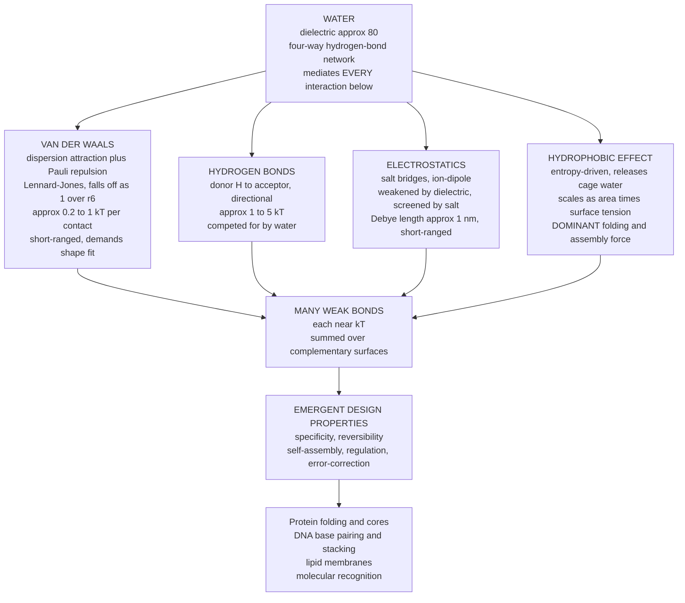

# 🧲 Intermolecular Forces and the Aqueous Environment

> [!abstract] TL;DR
> Life is built and run not by strong covalent bonds but by **weak, reversible, noncovalent forces** — van der Waals attractions, hydrogen bonds, screened electrostatics, and above all the entropy-driven **hydrophobic effect** — every one of them mediated by **water**. Each interaction is individually feeble, only a few times the thermal energy $k_BT$, so it makes and breaks constantly at body temperature. Biology's design trick is to sum **many weak bonds over shape-complementary surfaces**, which buys the specificity, reversibility, and self-assembly that folding, base pairing, membranes, and molecular recognition all depend on. Water's high dielectric constant (~80) and dense hydrogen-bond network dominate the energetics: it weakens and screens charges, competes for hydrogen bonds, and expels oily surfaces. These forces are the physical foundation of every downstream Biophysics topic.

## Intuition

**Analogy — Velcro, not superglue.** A single strand of Velcro hook is pathetically weak; you could not hang a coat from one. But a Velcro patch has *thousands* of hooks, and together they grip firmly — yet you can still peel them apart with a deliberate tug and re-stick them a moment later. That is exactly how biology holds itself together. A single hydrogen bond barely survives the thermal jostling of body heat, but a protein zips shut with hundreds of them at once. The structure is stable, and it is still **reversible** — enzymes release products, antibodies let go, DNA strands unzip for copying. Superglue (a covalent bond) would be far too strong; it could never come apart, so the cell could never regulate, turn over, or repair anything.

The unsung hero is **water**. Molecules do not fold and assemble mainly because their parts attract each other — they fold because water *desperately wants to exclude the oily bits*. Drop oil into water and the droplets coalesce, not because oil is sticky but because water reorganizes to shove them together and reclaim its freedom. That expulsion — the **hydrophobic effect** — is the single largest force squeezing a protein into shape and snapping a membrane into a sheet.

---

## How It Works

### Core Mechanics

Every noncovalent interaction in biology sits within a narrow energy window: a few $k_BT$, where $k_BT \approx 2.6\ \text{kJ/mol}$ at body temperature (310 K). That is the whole point — forces near $k_BT$ are strong enough to bias structure but weak enough to be undone by ordinary thermal collisions.

1. **Van der Waals forces.** Even neutral atoms have fluctuating electron clouds that induce transient dipoles in their neighbors, creating a universal, always-attractive **dispersion** force that falls off as $1/r^6$. At very short range, the Pauli exclusion principle forbids electron clouds from overlapping, producing a steep repulsive wall (modeled as $1/r^{12}$). Their sum is the **Lennard-Jones potential**. Each atom-pair contact is worth only a fraction of $k_BT$, but van der Waals contacts are ubiquitous and demand **shape complementarity** — surfaces that fit snugly like a hand in a glove maximize the number of close contacts. This is the physical meaning of "lock and key."

2. **Hydrogen bonds.** A partially positive hydrogen covalently bound to an electronegative donor (N–H, O–H) is attracted to a lone pair on an acceptor (O, N): the directional **donor–H···acceptor** bond, worth a few $k_BT$ and partly covalent in character. Hydrogen bonds build the α-helix and β-sheet of protein secondary structure and glue the Watson–Crick base pairs of DNA. The crucial subtlety: in the cell they are **competed for by water**, which can donate and accept hydrogen bonds itself, so the *net* stabilization of an internal protein hydrogen bond over its water-exposed alternative is much smaller than the raw bond strength.

3. **Electrostatics and screening.** Charged groups — salt bridges, ion–ion, ion–dipole — attract or repel by Coulomb's law. But in water two things weaken them dramatically. First, water's **high dielectric constant** ($\varepsilon_r \approx 80$) reorients its dipoles around each charge and cuts the bare force ~80-fold. Second, dissolved **salt screens** charges: mobile counter-ions cluster around each charge and cloak it. **Debye–Hückel theory** shows the potential decays not as $1/r$ but as $e^{-r/\lambda_D}/r$, with the **Debye length** $\lambda_D \approx 1\ \text{nm}$ at physiological salt. Beyond about a nanometer, one charged group essentially cannot "see" another — electrostatics in the cell is **short-ranged**.

4. **Water — the matrix of life.** Water is not a passive background. Its polarity, its four-way hydrogen-bond network, its high dielectric constant, and its high heat capacity make it *the* biological solvent. Every solute wears a **hydration shell** of ordered water, and the thermodynamics of any biological process is really the thermodynamics of solute *and* its rearranged water.

5. **The hydrophobic effect.** This is the dominant force in folding and assembly, and it is **entropic**. Nonpolar (oily) groups are not expelled because they repel water; they are expelled because water molecules around a nonpolar surface cannot hydrogen-bond outward and must arrange into a partially ordered "cage" (clathrate-like) shell. Clustering the nonpolar groups together **shrinks the total exposed surface and releases that ordered cage water**, raising the entropy of the system. The free energy gained scales roughly as $\Delta G \approx \gamma \times A$ (buried nonpolar **area** times an effective surface tension). Because it is driven by $+\Delta S$, the effect actually *strengthens* with temperature over the physiological range. It buries the hydrophobic core of a folded protein, self-assembles the lipid bilayer, and pre-organizes molecular recognition — the deep link to [[Entropy_and_Second_Law]] and the sibling note *Energy_Entropy_and_Free_Energy_in_Biology*.

6. **Other interactions.** π-stacking of aromatic rings stabilizes stacked DNA bases; cation–π interactions bind positively charged side chains to aromatic faces; and entropic **depletion forces** crowd macromolecules together in the packed interior of the cell.

7. **Molecular recognition — the payoff.** No single weak force is specific. But **summed over two complementary surfaces**, dozens of small, tunable contributions add up to a binding free energy that is both *strong enough to be useful* and *weak enough to be reversible*. Enzyme–substrate, antibody–antigen, and protein–DNA binding are all this same trick: many weak, water-mediated interactions over shape- and chemistry-matched surfaces. That is the physical basis of biological **specificity**.

### Flow / Architecture



---

## Key Concepts

**Secondary (high-school level).**
- Biology uses **weak, reversible bonds** so structures can both form and come apart at body temperature.
- **Hydrogen bonds** hold DNA's two strands together and shape proteins; they are strong enough to matter but weak enough to unzip.
- **Oil and water do not mix** — the hydrophobic effect — and this is what folds a protein's greasy parts inward.
- Water is the **universal solvent** of life because it is polar and hydrogen-bonds to itself and to solutes.

**Undergraduate.**
- The **Lennard-Jones potential** $V(r)=4\varepsilon\left[(\sigma/r)^{12}-(\sigma/r)^{6}\right]$ captures van der Waals attraction plus hard-core repulsion; well depth $\varepsilon$ is only a few $k_BT$.
- **Coulomb interactions in water** are cut ~80-fold by the dielectric constant and further **screened** by dissolved salt.
- **Debye length** $\lambda_D \approx 0.3\ \text{nm}/\sqrt{I[\text{M}]}$ sets the electrostatic range; at physiological ionic strength (~0.15 M) it is ~0.8 nm.
- The **hydrophobic effect is entropy-driven**: $\Delta G = \Delta H - T\Delta S$ with a dominant positive $\Delta S$ from released ordered water; free energy of burial scales with nonpolar surface **area**.
- **Many weak bonds** deliver specificity and reversibility that a single strong bond could not.

**Graduate.**
- **Debye–Hückel theory** linearizes the Poisson–Boltzmann equation: $\nabla^2 \phi = \kappa^2 \phi$, with $\kappa^2 = \dfrac{e^2 \sum_i n_i z_i^2}{\varepsilon_0 \varepsilon_r k_B T}$ and $\lambda_D = 1/\kappa$; the screened (Yukawa) potential is $\phi(r)\propto e^{-r/\lambda_D}/r$.
- The **Bjerrum length** $\ell_B = e^2/(4\pi\varepsilon_0\varepsilon_r k_BT) \approx 0.7\ \text{nm}$ in water marks where electrostatic energy equals $k_BT$ — the crossover between order and thermal disorder.
- The hydrophobic effect has a **length-scale crossover** (Chandler): for small solutes it is entropy-dominated with intact water hydrogen bonds, while for surfaces larger than ~1 nm water dewets and the effect becomes enthalpy/interface-dominated, scaling as area.
- Binding free energies are best treated with **statistical mechanics** — potentials of mean force integrate out solvent degrees of freedom — the subject of the sibling note *Statistical_Mechanics_of_Biomolecules*.

---

## Python Demo

```python
# Models the intermolecular forces of biology:
#   (a) Lennard-Jones potential: vdW attraction + hard-core repulsion, well ~ kT
#   (b) Debye-Huckel screened Coulomb: salt screens charge over the Debye length
#   (c) Debye length shrinking as salt (ionic strength) rises
#   (d) Hydrophobic effect: entropy-driven free energy ~ buried area x surface tension
import numpy as np
import matplotlib.pyplot as plt

# ---- physical constants (SI) ----
kB   = 1.380649e-23       # Boltzmann constant, J/K
T    = 310.0              # body temperature, K
NA   = 6.02214076e23      # Avogadro's number, 1/mol
e    = 1.602176634e-19    # elementary charge, C
eps0 = 8.8541878128e-12   # vacuum permittivity, F/m
eps_r = 80.0              # dielectric constant of water

kT_kJmol = kB * T * NA / 1e3      # thermal energy per mole, kJ/mol
print(f"Thermal energy kT at {T:.0f} K = {kT_kJmol:.2f} kJ/mol")

fig, ax = plt.subplots(2, 2, figsize=(12, 9))

# ---------------------------------------------------------------
# (a) Lennard-Jones: van der Waals well is only a few kT -> easily broken
# ---------------------------------------------------------------
sigma   = 0.34                       # contact distance, nm (~carbon)
epsilon = 1.0                        # well depth, kJ/mol (a single vdW contact ~ kT)
r = np.linspace(0.30, 1.0, 500)      # separation, nm
V_lj = 4 * epsilon * ((sigma / r)**12 - (sigma / r)**6)

ax[0, 0].plot(r, V_lj, lw=2, color="navy")
ax[0, 0].axhline(0, color="gray", lw=0.8)
ax[0, 0].axhline(-epsilon, ls="--", color="crimson",
                 label=f"well depth epsilon = {epsilon:.1f} kJ/mol")
ax[0, 0].axhspan(-kT_kJmol, kT_kJmol, color="orange", alpha=0.25,
                 label=f"+/- kT = {kT_kJmol:.1f} kJ/mol")
ax[0, 0].set_ylim(-2, 3)
ax[0, 0].set_xlabel("separation r (nm)")
ax[0, 0].set_ylabel("potential V (kJ/mol)")
ax[0, 0].set_title("(a) Lennard-Jones: vdW well near kT (breaks thermally)")
ax[0, 0].legend(fontsize=8)

# ---------------------------------------------------------------
# Debye length for a 1:1 salt at ionic strength I (mol/L)
# ---------------------------------------------------------------
def debye_length_nm(I_molar):
    n = 2.0 * I_molar * 1e3 * NA                 # sum n_i z_i^2 for 1:1 salt, per m^3
    kappa2 = (e**2 * n) / (eps0 * eps_r * kB * T)
    return 1e9 / np.sqrt(kappa2)                 # nm

# ---------------------------------------------------------------
# (b) Screened Coulomb: mobile salt ions cloak charge over ~1 nm
# ---------------------------------------------------------------
r2 = np.linspace(0.3, 3.0, 500)                  # nm
pref = e**2 / (4 * np.pi * eps0 * eps_r * (r2 * 1e-9)) * NA / 1e3   # kJ/mol
ax[0, 1].plot(r2, pref, "k--", lw=1.3, label="unscreened (in water)")
for I, col in [(0.001, "green"), (0.010, "blue"), (0.150, "red")]:
    lamD = debye_length_nm(I)
    V = pref * np.exp(-r2 / lamD)
    ax[0, 1].plot(r2, V, color=col, lw=2,
                  label=f"I = {I*1000:.0f} mM, lambda_D = {lamD:.2f} nm")
ax[0, 1].set_ylim(0, 6)
ax[0, 1].set_xlabel("separation r (nm)")
ax[0, 1].set_ylabel("repulsion V (kJ/mol)")
ax[0, 1].set_title("(b) Debye-Huckel: salt screens electrostatics")
ax[0, 1].legend(fontsize=8)

# ---------------------------------------------------------------
# (c) Debye length shrinks as salt rises -> electrostatics gets shorter-ranged
# ---------------------------------------------------------------
I_range = np.logspace(-3, 0, 200)                # 1 mM to 1 M
lamD = np.array([debye_length_nm(I) for I in I_range])
ax[1, 0].loglog(I_range * 1000, lamD, lw=2, color="purple")
ax[1, 0].axvline(150, ls="--", color="gray",
                 label=f"physiological ~150 mM (lambda_D = {debye_length_nm(0.15):.2f} nm)")
ax[1, 0].set_xlabel("ionic strength I (mM)")
ax[1, 0].set_ylabel("Debye length lambda_D (nm)")
ax[1, 0].set_title("(c) Debye length vs salt: cells are salty for a reason")
ax[1, 0].legend(fontsize=8)

# ---------------------------------------------------------------
# (d) Hydrophobic effect: entropy-driven free energy of burial ~ area x tension
# ---------------------------------------------------------------
gamma = 0.025                                    # effective surface tension, J/m^2
A_nm2 = np.linspace(0, 20, 200)                  # buried nonpolar area, nm^2
dG = -gamma * (A_nm2 * 1e-18) * NA / 1e3         # kJ/mol; negative = favorable on burial
ax[1, 1].plot(A_nm2, dG, lw=2, color="teal")
ax[1, 1].axvline(12, ls="--", color="gray", label="typical protein core ~12 nm^2")
dG12 = -gamma * (12e-18) * NA / 1e3
ax[1, 1].annotate(f"burying 12 nm^2\n= {dG12:.0f} kJ/mol\n(mostly +T*dS)",
                  xy=(12, dG12), xytext=(4, dG12 + 40),
                  arrowprops=dict(arrowstyle="->"), fontsize=8)
ax[1, 1].set_xlabel("buried nonpolar area A (nm^2)")
ax[1, 1].set_ylabel("hydrophobic free energy dG (kJ/mol)")
ax[1, 1].set_title("(d) Hydrophobic effect: entropy-driven association")
ax[1, 1].legend(fontsize=8)

plt.tight_layout()
plt.savefig("intermolecular_forces_aqueous.png", dpi=130)
print("Saved figure. lambda_D(150 mM) =", round(debye_length_nm(0.15), 3), "nm")
```

Running this prints $k_BT \approx 2.58$ kJ/mol, a Debye length of ~0.79 nm at physiological salt, and shows the four defining behaviors: a shallow Lennard-Jones well straddling the $\pm k_BT$ band (broken by thermal energy), a Coulomb repulsion that collapses to nothing beyond ~1 nm once salt is added, a Debye length that falls off as $1/\sqrt{I}$, and a hydrophobic free energy that grows linearly with buried area to hundreds of kJ/mol for a real protein core.

---

## Real-World Applications

> **Protein folding and drug design.** A folded globular protein buries ~10–20 nm² of hydrophobic side chains in its core; that hydrophobic burial supplies most of the folding free energy, while surface salt bridges and internal hydrogen bonds fine-tune stability and specificity — the substance of the sibling note *Protein_Structure_and_Folding* and of [[Proteins_and_Amino_Acids]]. Structure-based drug design explicitly counts van der Waals contacts, hydrogen-bond donors/acceptors, and buried nonpolar surface when scoring a candidate ligand.

> **DNA structure and PCR.** Watson–Crick base pairs are held by two or three hydrogen bonds, and the double helix is further stabilized by π-stacking of the bases and screened by counter-ions that neutralize the phosphate backbone — the subject of the sibling *The_Physics_of_DNA_and_RNA* and of [[DNA_Structure_and_Replication]]. PCR works precisely because these bonds are weak enough to melt at ~95 °C and re-anneal on cooling; the salt concentration in the buffer tunes the Debye screening and thus the melting temperature.

> **Membranes and self-assembly.** Phospholipids spontaneously form bilayers because their oily tails are expelled from water while their polar heads stay hydrated — a pure hydrophobic-effect construction, extended in the sibling *Membranes_and_Lipid_Bilayers* and in [[The_Cell_Membrane_and_Transport]]. The same bottom-up logic drives engineered [[Nanofabrication_and_Self_Assembly]] and colloidal assembly in [[Nanoparticles_and_Colloidal_Systems]].

> **The salty cell.** Cytoplasm is held near ~150 mM salt in part so that electrostatic interactions are screened to ~1 nm, keeping charged macromolecules from either sticking or repelling indiscriminately across the crowded interior — a direct consequence of Debye–Hückel screening.

---

## Common Pitfalls

- **"The hydrophobic effect is a force between oil molecules."** It is not a direct attraction; it is water's entropy reasserting itself. Nonpolar groups associate because doing so *releases* ordered water. Treating it as a van der Waals-style attraction gets the temperature dependence backward.
- **Forgetting water in the energy balance.** A hydrogen bond "worth" 20 kJ/mol in vacuum contributes far less *net* stabilization in the cell because the alternative state has that group hydrogen-bonded to water. Always compare the folded/bound state to the water-solvated reference, not to vacuum.
- **Using bare Coulomb's law in the cell.** Ignoring the dielectric constant (~80) and salt screening overestimates electrostatic ranges and energies by one to two orders of magnitude. Beyond ~1 nm, charges are effectively invisible to one another.
- **Confusing strength with stability.** Individual noncovalent bonds are weak *by design*. Stability comes from summing many; reversibility comes from each one being near $k_BT$. Wanting stronger individual bonds would destroy the reversibility that regulation and turnover require.
- **Assuming higher salt always weakens binding.** It screens *electrostatic* attraction and repulsion, but hydrophobic and van der Waals contributions are largely unaffected (and salting-out effects can even strengthen association). The net effect depends on which force dominates a given interface.

---

## Related Concepts

- [[Water_and_Lifes_Chemistry]] — the polar, hydrogen-bonding solvent whose high dielectric and network properties mediate every force in this note.
- [[Chemical_Bonding_and_Molecular_Geometry]] — the *strong* covalent bonds these weak noncovalent forces are deliberately contrasted against, plus the standard intermolecular-force taxonomy.
- [[Electric_Fields_and_Coulombs_Law]] — the bare Coulomb interaction that water's dielectric and dissolved salt then screen via Debye–Hückel theory.
- [[Gauss_Law_and_Electric_Potential]] — the electrostatics framework underlying the Poisson–Boltzmann treatment of ionic screening.
- [[Entropy_and_Second_Law]] — the thermodynamic engine of the hydrophobic effect, which is driven by an increase in system entropy.
- [[Classical_Statistical_Mechanics]] — the Boltzmann framework that turns $k_BT$ into the natural energy scale for "weak" biological bonds.
- [[Proteins_and_Amino_Acids]] — hydrophobic cores, hydrogen-bonded secondary structure, and salt bridges are the direct application of these forces.
- [[DNA_Structure_and_Replication]] — base-pair hydrogen bonds and π-stacking realized in the double helix.
- [[The_Cell_Membrane_and_Transport]] — lipid bilayers as a canonical hydrophobic-effect self-assembly.
- [[Membranes_and_Cell_Signaling]] — biochemical counterpart on membrane structure and recognition.
- [[Enzymes_and_Catalysis]] — molecular recognition and transition-state binding built from summed weak interactions.
- [[Nanofabrication_and_Self_Assembly]] — engineered bottom-up assembly governed by the same noncovalent, entropy-driven principles.
- [[Nanoparticles_and_Colloidal_Systems]] — colloidal stability set by the competition of van der Waals attraction and screened electrostatic (DLVO) repulsion.

*Not-yet-written Biophysics siblings referenced above: Energy_Entropy_and_Free_Energy_in_Biology, Protein_Structure_and_Folding, The_Physics_of_DNA_and_RNA, Membranes_and_Lipid_Bilayers, and Statistical_Mechanics_of_Biomolecules.*

---

## Review Questions

1. **(Conceptual)** Explain why the hydrophobic effect can be *stronger* at 37 °C than at 5 °C, even though most attractive forces weaken as temperature rises. What does this reveal about whether the effect is enthalpic or entropic?
2. **(Scenario)** You are designing a protein–protein binding interface that must be both highly specific *and* reversible under cellular conditions. Would you rely on a single strong covalent linkage, a handful of salt bridges, or a broad complementary patch of van der Waals and hydrogen-bond contacts plus buried hydrophobic area? Justify your choice in terms of specificity, reversibility, and the ~$k_BT$ energy scale.
3. **(Trade-off)** A colleague measures that a protein–DNA complex binds tightly at 20 mM salt but falls apart at 500 mM salt. Using the Debye length and the distinction between electrostatic and hydrophobic contributions, explain the salt dependence — and predict what would happen to a purely hydrophobic interface under the same salt change.

---

## Sources

- Ken A. Dill & Sarina Bromberg, *Molecular Driving Forces: Statistical Thermodynamics in Biology, Chemistry, Physics, and Nanoscience*, 2nd ed. (Garland Science, 2010) — chapters on electrostatics, hydrogen bonds, and the hydrophobic effect.
- Rob Phillips, Jane Kondev, Julie Theriot & Hernan Garcia, *Physical Biology of the Cell*, 2nd ed. (Garland Science, 2012) — energy scales of the cell and $k_BT$ reasoning.
- Jacob N. Israelachvili, *Intermolecular and Surface Forces*, 3rd ed. (Academic Press, 2011) — van der Waals, Debye–Hückel, and hydration/hydrophobic forces.
- David Chandler, "Interfaces and the driving force of hydrophobic assembly," *Nature* 437, 640–647 (2005). [DOI:10.1038/nature04162](https://doi.org/10.1038/nature04162)
- Charles Tanford, *The Hydrophobic Effect: Formation of Micelles and Biological Membranes*, 2nd ed. (Wiley, 1980).

---

#biophysics #intermolecular-forces #hydrophobic-effect #hydrogen-bonds #water
