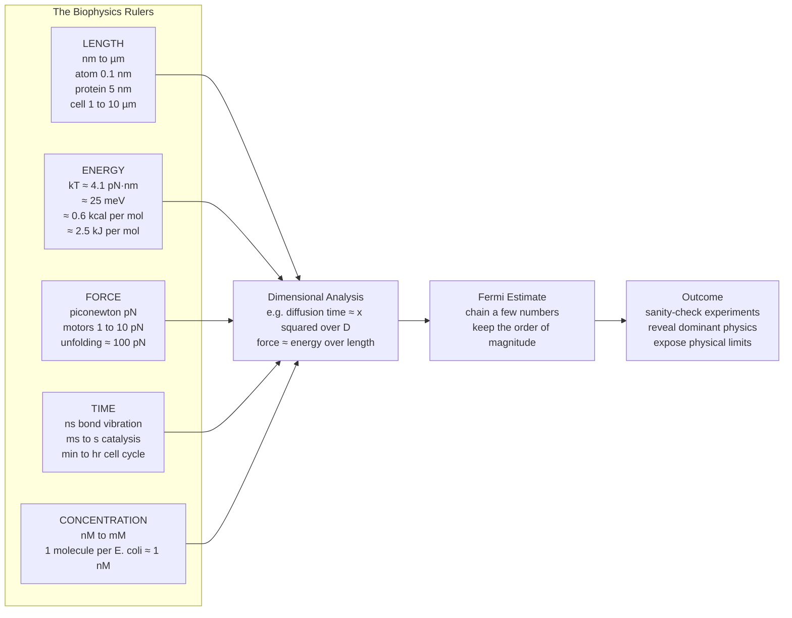

# 🔬 Scales, Units, and Orders of Magnitude in Biophysics

> [!abstract] TL;DR
> The single most portable skill in biophysics is fluency in the natural scales of life — length from **nm** (molecules) to **µm** (cells), energy measured in units of the thermal quantum **kT ≈ 4.1 pN·nm ≈ 25 meV ≈ 0.6 kcal/mol ≈ 2.5 kJ/mol**, force in **piconewtons (pN)**, time from **ns** to **hours**, and concentration in **nM–mM**. With just a handful of these "rulers" and dimensional analysis, you can estimate almost any cellular quantity to the right order of magnitude on the back of an envelope, sanity-check experiments, and expose the physical limits that constrain how life is built.

---

## Intuition

**Analogy:** A physicist dropped into biology's jungle survives by carrying a few rulers: the energy of a single thermal kick (**kT**), the size of an atom, and the force a molecule can pull. With just these three tools you can estimate almost anything — how many proteins are packed into a cell, how fast a bacterium divides, whether a pull can rip DNA apart — often landing on the right *order of magnitude* on the back of an envelope. Learning to "think in numbers" is the biophysicist's most powerful and most portable skill.

Where biology often describes mechanisms qualitatively ("the motor walks along the filament"), biophysics insists on asking *how much*: how far, how hard, how fast, how many? The remarkable thing is that you rarely need precise data. A protein is "a few nm," a bond is "a few kT," a motor pulls "a few pN" — and chaining these coarse facts through dimensional reasoning almost always gives an answer within a factor of ten of the truth. This estimation-first mindset is the philosophy behind *Cell Biology by the Numbers* and the BioNumbers database, and it is the foundation on which the rest of biophysics is built. (The companion note **Biophysics_Overview** places this skill in the wider map of the field.)

---

## How It Works

### Core Mechanics

1. **Pick the natural unit for each dimension.** Life happens at scales where SI base units are clumsy. Nobody says a protein is "0.000000005 metres"; they say **5 nm**. The natural units are: length **nm–µm**, energy **kT**, force **pN**, time **ns–s**, concentration **nM–mM**. Choosing these units means the numbers you juggle are of order 1–1000, which is exactly where human intuition works best.

2. **Adopt kT as the energy currency.** At body/room temperature the thermal energy is $k_BT \approx 4.1 \times 10^{-21}$ J. Every molecule is constantly buffeted by kicks of this size (see [[Kinetic_Theory_of_Gases]] and [[Classical_Statistical_Mechanics]]). So the meaningful question about any interaction is not "how many joules" but "how many kT". The rule of thumb:
   - **Energy ≫ kT** (say tens of kT): the structure is *stable* — thermal noise cannot undo it. Covalent bonds (~100–200 kT) live here.
   - **Energy ~ kT** (a few kT): the state is *marginal* and *thermally switchable* — it flips back and forth spontaneously. Individual hydrogen bonds and weak binding live here, which is exactly why biology uses them for reversible recognition.
   - **ATP hydrolysis ≈ 20 kT** sits deliberately in between: large enough to drive a conformational change reliably, small enough to be affordable in bulk (see [[Bioenergetics_and_ATP]]).

3. **Use force in piconewtons.** Multiply the energy ruler by the length ruler: $k_BT / \text{nm} \approx 4.1\ \text{pN}$. So the *thermal force scale* on a nanometre object is a few pN — and, not coincidentally, that is exactly the force molecular motors generate and single-molecule tweezers apply. Unfolding a protein takes ~100 pN; snapping a covalent bond takes ~1000 pN (1 nN).

4. **Chain the rulers with dimensional analysis.** Units carry physics. A diffusion coefficient $D$ has units $\text{length}^2/\text{time}$, so the only way to build a time from a distance $x$ is $\tau \sim x^2/D$ — you get the *scaling* of diffusive transport for free, without solving any equation. Getting scalings right (even without exact prefactors) is often enough to decide whether a mechanism is plausible. This is developed further in **Diffusion_and_Brownian_Motion_in_Cells**.

5. **Estimate, then check.** Combine a few remembered numbers (Avogadro's number, cell size, protein mass) into a prediction, round aggressively, and compare to reality. If your estimate is off by many orders of magnitude, either your model is wrong or you have caught an experimental error — either way you have learned something.

### Flow / Architecture



---

## Key Concepts

### Secondary Level

- **Order of magnitude** means the power of ten: $5 \times 10^{-9}$ m and $8 \times 10^{-9}$ m are the "same order of magnitude" (both ~$10^{-8}$ m, i.e. nm). Biophysics happily accepts answers correct to within a factor of ~3–10.
- **The everyday ladder of life's sizes:** atom (0.1 nm) → small molecule (1 nm) → protein (5 nm) → virus (100 nm) → bacterium (1 µm) → animal cell (10 µm) → human (1 m). Each big jump is roughly a factor of 10.
- **Fermi problems** (named after Enrico Fermi, who estimated the Trinity blast yield from scraps of falling paper): break an impossible-looking question into pieces you *can* guess, multiply, and trust the powers of ten to survive even if the details wobble.
- Understanding logarithmic scales is essential here — see [[Exponential_and_Logarithmic_Functions]]. Every scale map in this note is plotted on a log axis so that ten orders of magnitude fit on one line.

### Undergraduate Level

- **kT as the reference energy.** $k_BT = 4.14 \times 10^{-21}$ J at $T = 300$ K. Memorise its many faces: **4.1 pN·nm**, **25 meV**, **0.6 kcal/mol**, **2.5 kJ/mol**. Multiplying by Avogadro's number is the bridge from single-molecule to molar energies (see [[Stoichiometry_and_the_Mole]]).
- **Comparing interactions to kT:**

  | Interaction | Energy | In kT |
  |---|---|---|
  | Thermal kick | $k_BT$ | 1 |
  | Weak / hydrogen bond in water | ~2–5 kJ/mol effective | ~1–2 |
  | ATP hydrolysis (cellular) | ~50 kJ/mol | ~20 |
  | C–C covalent bond | ~350 kJ/mol | ~140 |

- **The force scale.** $F \sim k_BT / \ell$. On a nm, that is ~4 pN — the currency of molecular motors (kinesin ~5–7 pN, myosin ~3–5 pN). Single-molecule pulling reads out these forces directly (developed in **Single_Molecule_Biophysics**).
- **Characteristic numbers to keep in your head** (E. coli as the reference organism): volume ~1 µm³ ≈ 1 fL, ~3 million proteins, ~10,000–70,000 ribosomes, ~4600 genes, dry mass ~0.3 pg, doubling time ~30–60 min.
- **The concentration bridge:** one molecule inside a 1 µm³ E. coli is a concentration of $\frac{1}{N_A \cdot 10^{-15}\,\text{L}} \approx 1.7$ nM. So "a single copy per cell" ≈ **~1 nM** — an indispensable conversion.

### Graduate Level

- **Dimensional analysis and scaling laws.** From units alone: diffusion time $\tau \sim x^2/D$; bending energy of a rod scales as $E_{\text{bend}} \sim \kappa L / R^2$ with $\kappa$ (units J·m) the bending stiffness; the persistence length of a polymer is $\ell_p = \kappa / k_BT$. Getting the *scaling exponents* right often matters more than the prefactor. Cross-organism scaling (metabolic rate vs body mass) is the subject of **Allometry_and_Scaling_Laws_in_Biology**.
- **Physical limits exposed by the numbers.** The scales reveal hard constraints:
  - **Diffusion limit on reaction rate:** the fastest a molecule can find a target of size $a$ by diffusion is $k_{\text{diff}} \sim 4\pi D a N_A \approx 10^{9}$–$10^{10}$ M⁻¹s⁻¹. No enzyme beats this without special tricks.
  - **Concentration-sensing accuracy (Berg–Purcell).** A receptor averaging over time $T$ has a fractional error $\delta c / c \sim 1/\sqrt{D a c T}$ — a fundamental floor set by the discreteness of molecules arriving by diffusion.
  - **Energy cost of information.** Erasing one bit costs at least $k_BT \ln 2$ (Landauer); real signaling and proofreading spend far more kT per decision to suppress errors.
- **Why life occupies the size range it does.** Below ~nm, thermal noise destroys any structure weaker than a covalent bond; above ~mm–cm, diffusion becomes hopelessly slow ($\tau \sim x^2/D$ grows quadratically) so bulk transport (blood, xylem) becomes mandatory. Life's characteristic nm–µm machinery is precisely the window where kT-scale physics is both usable and controllable.
- The connection to [[Classical_Statistical_Mechanics]] and [[Entropy_and_Second_Law]] is deep: kT is the quantum of thermal fluctuation, and much of biophysics is the study of machines that harvest order against a background of kT-scale noise. The energetics side is developed in **Energy_Entropy_and_Free_Energy_in_Biology**.

---

## Python Demo

```python
# A "feel for the numbers" toolkit:
#   (a) log-scale maps of biological LENGTH, ENERGY (in kT), and FORCE scales
#   (b) two Fermi estimates a la "Cell Biology by the Numbers":
#       - number of proteins in an E. coli cell
#       - number of ATP molecules consumed per second to build the cell
import numpy as np
import matplotlib.pyplot as plt

# --- Fundamental constants ---
kB   = 1.380649e-23      # Boltzmann constant, J/K
T    = 300.0             # temperature, K (~27 C, near room/body scale)
NA   = 6.02214076e23     # Avogadro's number, 1/mol
eV   = 1.602176634e-19   # joule per electron-volt

kT_J      = kB * T                       # thermal energy in joules  ~4.14e-21 J
kT_pN_nm  = kT_J / 1e-21                 # 1 pN*nm = 1e-21 J  -> ~4.14 pN*nm
kT_meV    = kT_J / eV * 1e3              # ~25.7 meV
kT_kJ_mol = kT_J * NA / 1e3             # ~2.49 kJ/mol
kT_kcal   = kT_kJ_mol / 4.184           # ~0.596 kcal/mol
print("=== kT, the energy currency (T = %.0f K) ===" % T)
print("kT = %.3e J = %.2f pN*nm = %.1f meV = %.2f kJ/mol = %.3f kcal/mol"
      % (kT_J, kT_pN_nm, kT_meV, kT_kJ_mol, kT_kcal))

# --- (a) Scale maps ---
lengths = {  # metres
    "atom\n0.1 nm": 1e-10, "amino acid\n1 nm": 1e-9, "protein\n5 nm": 5e-9,
    "ribosome\n25 nm": 2.5e-8, "virus\n100 nm": 1e-7, "E. coli\n1 um": 1e-6,
    "animal cell\n10 um": 1e-5, "human\n1 m": 1.0,
}
energies_kT = {  # in units of kT
    "thermal kT\n1": 1.0, "H-bond\n~2": 2.0, "ATP\n~20": 20.0, "C-C bond\n~140": 140.0,
}
forces_pN = {  # in piconewtons
    "thermal\n~4 pN": kT_pN_nm / 1.0, "motor\n~6 pN": 6.0,
    "unfold protein\n~150 pN": 150.0, "break C-C\n~1500 pN": 1500.0,
}

# --- (b) Fermi estimate 1: proteins per E. coli cell ---
dry_mass_g      = 0.3e-12          # E. coli dry mass ~0.3 pg
protein_frac    = 0.55            # protein ~55% of dry mass
avg_protein_kDa = 30.0            # average protein ~30 kDa
avg_protein_g   = avg_protein_kDa * 1e3 * (1.0 / NA)   # kDa -> g/mol -> g/molecule
n_proteins      = dry_mass_g * protein_frac / avg_protein_g
print("\n=== Fermi 1: proteins per E. coli ===")
print("N_proteins ~ %.1e  (literature ~3e6)" % n_proteins)

# --- (b) Fermi estimate 2: ATP consumed per second to build the cell ---
aa_per_protein  = 300                        # residues per average protein
n_amino_acids   = n_proteins * aa_per_protein
atp_per_aa      = 4                           # ~4 ATP to add one residue
atp_biosynth    = n_amino_acids * atp_per_aa  # ATP just for protein synthesis
atp_total_cycle = atp_biosynth * 10           # x10 for all other biosynthesis/maintenance
doubling_s      = 40 * 60                     # ~40 min doubling time in seconds
atp_per_sec     = atp_total_cycle / doubling_s
print("\n=== Fermi 2: ATP per second in a growing E. coli ===")
print("ATP per cell cycle ~ %.1e, doubling %.0f s -> %.1e ATP/s (literature ~1e7)"
      % (atp_total_cycle, doubling_s, atp_per_sec))

# --- (b) bonus dimensional-analysis check: does diffusion suffice? ---
D_small = 1e-9        # small-molecule diffusion coeff in water, m^2/s
for label, x in [("across E. coli, 1 um", 1e-6), ("across neuron, 1 mm", 1e-3),
                 ("along axon, 1 m", 1.0)]:
    tau = x**2 / D_small          # tau ~ x^2 / D
    print("Diffusion %-22s x^2/D = %.2e s" % (label, tau))

# --- Plots ---
fig, ax = plt.subplots(2, 2, figsize=(13, 9))

# Length map (log x)
axL = ax[0, 0]
for name, val in lengths.items():
    axL.scatter(val, 1, s=90, color="#4a9eff", zorder=3)
    axL.annotate(name, (val, 1), textcoords="offset points", xytext=(0, 12),
                 ha="center", fontsize=8, rotation=30)
axL.set_xscale("log"); axL.set_xlim(1e-11, 1e1); axL.set_ylim(0.5, 1.8)
axL.set_yticks([]); axL.set_xlabel("length (m)")
axL.set_title("Length scales of biology  (nm -> m)")
axL.axhline(1, color="0.7", lw=1, zorder=1)

# Energy map (log y, in kT)
axE = ax[0, 1]
names = list(energies_kT.keys()); vals = list(energies_kT.values())
axE.bar(range(len(vals)), vals, color="#ff6b6b")
axE.set_yscale("log"); axE.set_xticks(range(len(names)))
axE.set_xticklabels(names, fontsize=8)
axE.axhline(1, color="k", ls="--", lw=1, label="kT (thermal)")
axE.set_ylabel("energy (units of kT)"); axE.legend()
axE.set_title("Energy scales measured against kT")

# Force map (log y, in pN)
axF = ax[1, 0]
names = list(forces_pN.keys()); vals = list(forces_pN.values())
axF.bar(range(len(vals)), vals, color="#51cf66")
axF.set_yscale("log"); axF.set_xticks(range(len(names)))
axF.set_xticklabels(names, fontsize=8)
axF.set_ylabel("force (pN)")
axF.set_title("Force scales  (thermal -> covalent)")

# Fermi estimates (log y)
axB = ax[1, 1]
est_names = ["proteins\nper cell", "amino acids\nper cell",
             "ATP per\ncell cycle", "ATP per\nsecond"]
est_vals  = [n_proteins, n_amino_acids, atp_total_cycle, atp_per_sec]
axB.bar(range(len(est_vals)), est_vals, color="#9775fa")
axB.set_yscale("log"); axB.set_xticks(range(len(est_names)))
axB.set_xticklabels(est_names, fontsize=8)
axB.set_ylabel("count"); axB.set_title("Back-of-envelope estimates for E. coli")
for i, v in enumerate(est_vals):
    axB.annotate("%.0e" % v, (i, v), textcoords="offset points",
                 xytext=(0, 4), ha="center", fontsize=8)

plt.tight_layout()
plt.savefig("biophysics_scales.png", dpi=130)
print("\nSaved figure to biophysics_scales.png")
```

Running this prints kT in all its unit disguises, recovers **~3 × 10⁶ proteins** and **~10⁷ ATP/s** for E. coli (both matching the literature to well within an order of magnitude), shows that diffusion crosses a bacterium in ~1 ms but would take ~30 years to cross a 1 m axon (hence active transport must exist), and draws the three log-scale rulers plus the estimate bars.

---

## Real-World Applications

> **Example — designing a single-molecule optical-tweezers experiment.** Before touching the hardware, a biophysicist estimates the expected signal: a kinesin motor pulls ~6 pN and steps 8 nm, so its work per step is $6\ \text{pN} \times 8\ \text{nm} \approx 48\ \text{pN·nm} \approx 12\ kT$ — comfortably above thermal noise, meaning the steps *will* be resolvable against the ~4 pN thermal force floor. The same kT-versus-signal comparison tells you the trap stiffness and averaging time you need. This estimate-first workflow, drawn straight from *Physical Biology of the Cell*, is how real single-molecule labs decide whether an experiment is even feasible.

Other everyday uses: sanity-checking a reported binding constant (does the implied concentration make sense given ~1 nM per molecule?), deciding whether a signaling molecule can reach its target by diffusion or needs a motor, estimating how many fluorophores a super-resolution image should contain, and screening proposed mechanisms — if a model requires forces of nanonewtons from a single protein, the numbers immediately flag it as impossible.

---

## Common Pitfalls

- **Confusing energy per molecule with energy per mole.** ATP hydrolysis is ~20 kT *per molecule* but ~50 kJ *per mole*. Forgetting the factor of Avogadro's number ($N_A$) produces errors of $10^{23}$. Always track whether you are counting single molecules or moles (see [[Stoichiometry_and_the_Mole]]).
- **Dropping the square in diffusion.** Diffusion time scales as $x^2/D$, not $x/D$. Halving a distance quarters the time; doubling it quadruples it. Treating diffusion as linear transport is the classic beginner scaling error.
- **Chasing prefactors you do not have.** Arguing whether the answer is $2.7 \times 10^6$ or $3.4 \times 10^6$ proteins misses the point — the estimate is only trustworthy to a factor of a few. Report orders of magnitude, not false precision.
- **Comparing energies to the wrong reference.** An interaction is "strong" or "weak" only relative to kT *at the relevant temperature*. The same hydrogen bond that is decisive in the cold vacuum of a protein core is marginal when exposed to water, because water competes for it.
- **Unit-salad in force and energy.** Mixing pN·nm, kJ/mol, and kcal/mol without converting is the fastest route to a wrong answer. Keep the conversion $1\ kT \approx 4.1\ \text{pN·nm} \approx 2.5\ \text{kJ/mol} \approx 0.6\ \text{kcal/mol}$ pinned to your desk.
- **Ignoring what the units are telling you.** If a derived quantity comes out with impossible units, the physics is wrong. Dimensional analysis is a free error-checker — use it before trusting any number.

---

## Related Concepts

- [[Classical_Statistical_Mechanics]] — supplies the Boltzmann factor $e^{-E/k_BT}$ that makes kT *the* reference energy; the whole "compare to kT" heuristic is statistical mechanics in disguise.
- [[Kinetic_Theory_of_Gases]] — the microscopic origin of thermal energy $\tfrac{3}{2}k_BT$ per particle and the ~kT-scale kicks that set the biophysical noise floor.
- [[Entropy_and_Second_Law]] — kT is the quantum of thermal fluctuation against which biological machines must fight to build and maintain order.
- [[Exponential_and_Logarithmic_Functions]] — the mathematics of the log scales on which every orders-of-magnitude map and Fermi estimate is drawn.
- [[Stoichiometry_and_the_Mole]] — Avogadro's number is the bridge that converts single-molecule energies and counts into molar quantities and concentrations.
- [[The_Cell_Theory_and_Cell_Types]] — provides the reference cell sizes (bacterium ~1 µm, animal cell ~10 µm) that anchor the length ruler.
- [[Bioenergetics_and_ATP]] — the source of the ~20 kT ATP energy quantum that powers most cellular estimates.

---

## Review Questions

1. **(Conceptual)** Why is kT, rather than the joule or the kilojoule per mole, the "natural" energy unit of biophysics? Explain what the rules "energy ≫ kT means stable" and "energy ~ kT means switchable" tell you about why cells use covalent bonds for storage but hydrogen bonds for recognition.
2. **(Scenario / estimation)** A protein target sits 10 µm across a large eukaryotic cell from where its partner is made. Using $\tau \sim x^2/D$ with $D \approx 10^{-10}$ m²/s for a protein in cytoplasm, estimate the diffusion time. Is passive diffusion adequate, or does the cell need directed (motor-driven) transport? Now redo the estimate for a 1 m motor neuron axon and explain the qualitative change.
3. **(Trade-off / limits)** A single copy of a transcription factor in an E. coli cell corresponds to ~1 nM. Given the Berg–Purcell result $\delta c/c \sim 1/\sqrt{D a c T}$, discuss the trade-off a cell faces between sensing a low-abundance signal accurately and responding quickly. What fundamental physical limit does this expose, and how might a cell partly evade it?

---

## Sources

- Milo, R. & Phillips, R. *Cell Biology by the Numbers* (Garland Science, 2015) — [book.bionumbers.org](https://book.bionumbers.org/)
- BioNumbers database, Harvard — [bionumbers.hms.harvard.edu](https://bionumbers.hms.harvard.edu/)
- Phillips, R., Kondev, J., Theriot, J. & Garcia, H. *Physical Biology of the Cell*, 2nd ed. (Garland Science, 2012)
- Milo, R. et al. "BioNumbers—the database of key numbers in molecular and cell biology," *Nucleic Acids Research* 38, D750 (2010) — [doi.org/10.1093/nar/gkp889](https://doi.org/10.1093/nar/gkp889)
- Nelson, P. *Biological Physics: Energy, Information, Life* (W. H. Freeman, 2013)

---

#biophysics #orders-of-magnitude #estimation #biological-scales #dimensional-analysis
