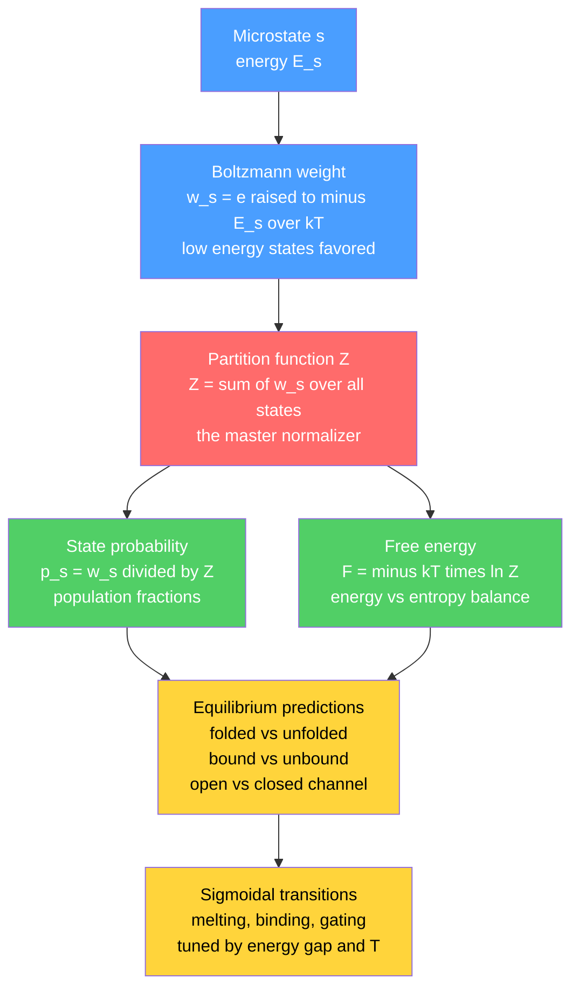

# 🎲 Statistical Mechanics of Biomolecules

> [!abstract] TL;DR
> Biomolecules live in a warm, wet, jiggling world where thermal energy $k_BT$ (about $4.1$ pN·nm at body temperature) is comparable to the bond and binding energies holding them together — so their behavior is inherently *probabilistic*. Statistical mechanics is the engine that converts this thermal chaos into precise predictions: the **Boltzmann distribution** ($p \propto e^{-E/k_BT}$) gives the probability of each state, and the **partition function** ($Z = \sum e^{-E/k_BT}$) is the master object from which free energy $F = -k_BT\ln Z$ and every equilibrium population follow. From these two ideas you get melting temperatures, ligand-binding curves, ion-channel open probabilities, and allosteric cooperativity — all from energies and $k_BT$.

---

## Intuition

**Analogy:** A single protein is *never* sitting still in one fixed shape. Picture a test tube as a stadium holding trillions of copies of that protein, each one jittering and flickering among many conformations, ceaselessly buffeted by thermal kicks from the surrounding water. To predict what the biomolecule *does*, you don't track one molecule and follow its erratic trajectory — you act like a **pollster**: you ask what *fraction* of the population is in each state right now. Statistical mechanics is that pollster. It turns the disorder of thermal motion into exact probabilities through one master rule: **states cost energy, and low-energy states are exponentially more popular.**

Two forces pull against each other at temperature $T$. **Energy** wants everything to fall into the lowest-energy state (a folded protein, a ligand snug in its pocket). **Entropy** — the sheer number of high-energy, disordered arrangements — wants to spread the population out. The winner is decided by $k_BT$: raise the temperature and entropy's many disordered options increasingly overrun the single tidy ground state. This tug-of-war is why proteins melt, why binding weakens when you heat a sample, and why every biomolecular equilibrium is a competition between $E$ and $T$.

---

## How It Works

### Core Mechanics

1. **Enumerate the states.** A biomolecule (plus its ligands, ions, and water) can occupy discrete states $s$ — folded vs unfolded, bound vs unbound, channel open vs closed. Each state $s$ has an energy $E_s$ (more precisely a free energy, since we coarse-grain over solvent).

2. **Weight each state by its Boltzmann factor.** The unnormalized statistical weight of state $s$ is $e^{-E_s/k_BT}$. A state one $k_BT$ higher in energy is $e^{-1}\approx 0.37$ times as likely; ten $k_BT$ higher is $e^{-10}\approx 5\times10^{-5}$ times as likely. Energy differences of a few $k_BT$ already decide almost everything.

3. **Sum the weights into the partition function.** $Z = \sum_s e^{-E_s/k_BT}$. This single number is the normalizer *and* the master object: it counts the "thermally accessible" states, weighted by how favorable each is.

4. **Read off probabilities.** The probability of finding a molecule in state $s$ is $p_s = \dfrac{e^{-E_s/k_BT}}{Z}$. The whole population's behavior is now a set of fractions — exactly the pollster's answer.

5. **Get thermodynamics for free.** The free energy is $F = -k_BT\ln Z$. Average quantities are derivatives of $\ln Z$ (for example $\langle E\rangle = -\partial \ln Z/\partial\beta$ with $\beta = 1/k_BT$). Differences in $F$ between coarse-grained macrostates give the equilibrium constants biologists measure — dissociation constants, folding stabilities, channel open probabilities.

6. **Predict the transition.** Because populations depend on $e^{-\Delta E/k_BT}$, tuning either the energy gap $\Delta E$ (via mutation, ligand, voltage) or the temperature $T$ sweeps the population smoothly from one state to the other — a **sigmoidal** transition. That sigmoid is the melting curve, the binding curve, and the channel activation curve all at once.

This coarse-grained, two-state-friendly view is the working machinery behind the sibling notes *Energy_Entropy_and_Free_Energy_in_Biology* (where $F = -k_BT\ln Z$ is unpacked), *Protein_Structure_and_Folding* (folded/unfolded as a two-state Boltzmann problem), *Enzyme_Kinetics_and_Catalysis_Physics* (barrier crossing weighted by $e^{-\Delta E^{\ddagger}/k_BT}$), *Ion_Channels_and_Transport* (open probability from a Boltzmann gate), and *Single_Molecule_Biophysics* (where you finally watch one molecule sample the ensemble the pollster summarizes).

### Flow / Architecture



---

## Key Concepts

### Secondary Level

- **Everything jiggles.** At room and body temperature, molecules carry random thermal energy of order $k_BT$. This constant buffeting means a biomolecule is a moving, flickering object, not a frozen statue.
- **Low energy is popular, but not guaranteed.** The most stable shape is the most common, yet thermal kicks always push some fraction of molecules into higher-energy shapes. You describe the crowd by *percentages*, not certainties.
- **Two-state thinking.** Many biological switches are usefully described as "either/or": folded or unfolded, oxygen bound or not, gate open or closed. Statistical mechanics predicts what fraction sits in each.

### Undergraduate Level

- **The Boltzmann distribution.** $p_s = e^{-E_s/k_BT}/Z$. The exponential means small energy differences (a few $k_BT$) produce large population differences. $k_BT \approx 4.1\times10^{-21}$ J $\approx 0.6$ kcal/mol $\approx 4.1$ pN·nm at $310$ K.
- **The partition function.** $Z = \sum_s e^{-E_s/k_BT}$. For a **two-state** system with gap $\Delta E = E_2 - E_1$, $Z = 1 + e^{-\Delta E/k_BT}$ and the fraction in state 2 is $\dfrac{e^{-\Delta E/k_BT}}{1 + e^{-\Delta E/k_BT}}$ — a sigmoid in $\Delta E/k_BT$.
- **Free energy and equilibrium constants.** $F = -k_BT\ln Z$. A difference in free energy between two macrostates sets their population ratio: $\dfrac{p_A}{p_B} = e^{-(F_A - F_B)/k_BT}$. This is the microscopic origin of the equilibrium constant used in [[Chemical_Equilibrium]].
- **Ligand binding (Langmuir isotherm).** Treat a receptor site as two-state — empty or occupied. The grand partition function with ligand concentration $c$ and dissociation constant $K_d$ gives fractional occupancy $\theta = \dfrac{c}{K_d + c} = \dfrac{c/K_d}{1 + c/K_d}$. Half-saturation occurs at $c = K_d$.
- **Temperature and entropy.** Folding free energy $\Delta G = \Delta H - T\Delta S$. At the melting temperature $T_m$, $\Delta G = 0$ and the protein is half-folded — the balance point of the energy-entropy tug-of-war.

### Graduate Level

- **Grand canonical treatment.** For binding, particles (ligands) are exchanged with a reservoir at chemical potential $\mu$, so the grand partition function $\Xi = \sum_N e^{-(E_N - \mu N)/k_BT}$ is the right object. Each independent site contributes a factor $\left(1 + e^{(\mu - \varepsilon)/k_BT}\right)$; occupancy is $\partial\ln\Xi/\partial(\beta\mu)$, recovering the Langmuir curve with $c/K_d = e^{(\mu-\varepsilon)/k_BT}$.
- **Cooperativity — MWC and Hill.** When binding at one site changes the affinity of others (hemoglobin, allosteric enzymes), the response steepens into a switch. The **Monod-Wyman-Changeux** model posits a global tense/relaxed ($T$/$R$) equilibrium; ligand preferentially stabilizes $R$, shifting the whole ensemble. The phenomenological **Hill** form $\theta = \dfrac{c^n}{K^n + c^n}$ captures the steepness via the Hill coefficient $n$ ($n>1$ = positive cooperativity, $n<1$ = negative). Hemoglobin has $n \approx 2.8$–$3.0$ despite four sites — cooperativity is partial.
- **Conformational ensembles and energy landscapes.** A protein is not one structure but a Boltzmann-weighted *ensemble* of conformations on a rugged free-energy landscape. Its configurational entropy is $S = -k_B\sum_s p_s\ln p_s$; the "native state" is a basin, not a point.
- **Fluctuations and fluctuation-dissipation.** Equilibrium fluctuations have magnitude set by $k_BT$: energy fluctuations relate to heat capacity ($\langle\Delta E^2\rangle = k_BT^2 C_V$), and the response of a molecule to a small perturbation is governed by its spontaneous fluctuations (the fluctuation-dissipation theorem). These thermal fluctuations *drive* binding encounters, catalytic barrier crossing, and the stochastic stepping of molecular machines.
- **Free-energy differences from simulation.** Because $F=-k_BT\ln Z$ and $Z$ is rarely computable directly, methods such as umbrella sampling, free-energy perturbation, and the Jarzynski equality extract $\Delta F$ from biased or nonequilibrium ensembles.

---

## Python Demo

```python
# Statistical mechanics of biomolecules: Boltzmann distribution + partition function.
# (a) Two-state folding/binding -> sigmoidal transition vs energy gap and temperature
# (b) Ligand binding from the (grand) partition function -> Langmuir & Hill curves (cooperativity)
# (c) A small conformational ensemble -> Boltzmann-weighted populations
import numpy as np
import matplotlib.pyplot as plt

# --- Physical constants (molar units are convenient for biology) ---
R = 8.314e-3           # kJ / (mol K)  -- gas constant (molar Boltzmann)
# kT reference at body temperature, for intuition:
kT_body = R * 310.0    # ~2.58 kJ/mol  (~0.62 kcal/mol ~ 4.1 pN*nm per molecule)

# =====================================================================
# (a) TWO-STATE SYSTEM: fraction in each state from Z = 1 + exp(-dE/kT)
# =====================================================================
# Generic sigmoid vs energy gap (in units of kT). p_state2 = e^-x / (1 + e^-x)
x = np.linspace(-8, 8, 400)                 # dE / kT
p_state2 = np.exp(-x) / (1.0 + np.exp(-x))  # fraction in the higher-energy state

# Protein melting: dG_unfold(T) = dH - T*dS ; fraction folded = 1/(1+exp(-dG/RT))
dH = 250.0    # kJ/mol  (enthalpy of unfolding)
dS = 0.800    # kJ/(mol K) (entropy of unfolding) -> Tm = dH/dS
Tm = dH / dS
T = np.linspace(280, 345, 400)              # Kelvin
dG = dH - T * dS                            # dG of unfolding
frac_folded = 1.0 / (1.0 + np.exp(-dG / (R * T)))

# =====================================================================
# (b) LIGAND BINDING from the partition function: Langmuir + Hill cooperativity
# =====================================================================
# Single site, grand partition function Xi = 1 + c/Kd -> theta = (c/Kd)/(1 + c/Kd)
Kd = 1.0                                     # micromolar (arbitrary units)
c = np.logspace(-3, 3, 400)                  # ligand concentration
theta_langmuir = (c / Kd) / (1.0 + c / Kd)   # n = 1 (non-cooperative)

# Hill model: theta = c^n / (K^n + c^n). Higher n -> steeper, switch-like binding.
hill_ns = [1, 2, 4]                          # n~2.8 is hemoglobin-like
theta_hill = {n: c**n / (Kd**n + c**n) for n in hill_ns}

# =====================================================================
# (c) CONFORMATIONAL ENSEMBLE: Boltzmann-weighted populations of 5 conformers
# =====================================================================
conf_labels = ["Native", "Loop-open", "Intermediate", "Misfolded", "Extended"]
conf_energy = np.array([0.0, 2.0, 4.0, 6.0, 10.0])   # kJ/mol relative to native
T_ens = 310.0
weights = np.exp(-conf_energy / (R * T_ens))
Z_ens = weights.sum()                                 # partition function
pops = weights / Z_ens                                # Boltzmann populations
S_conf = -R * np.sum(pops * np.log(pops))             # ensemble entropy (kJ/mol/K)

# =====================================================================
# PLOTS
# =====================================================================
fig, ax = plt.subplots(2, 2, figsize=(12, 9))

# (a1) generic two-state sigmoid vs energy gap
ax[0, 0].plot(x, p_state2, color="crimson", lw=2)
ax[0, 0].axvline(0, ls="--", color="gray")
ax[0, 0].axhline(0.5, ls=":", color="gray")
ax[0, 0].set_xlabel("Energy gap  dE / kT")
ax[0, 0].set_ylabel("Fraction in higher-energy state")
ax[0, 0].set_title("(a) Two-state Boltzmann transition")

# (a2) protein melting curve
ax[0, 1].plot(T, frac_folded, color="navy", lw=2, label="folded")
ax[0, 1].plot(T, 1 - frac_folded, color="orange", lw=2, label="unfolded")
ax[0, 1].axvline(Tm, ls="--", color="gray", label=f"Tm = {Tm:.0f} K")
ax[0, 1].set_xlabel("Temperature (K)")
ax[0, 1].set_ylabel("Population fraction")
ax[0, 1].set_title("(a) Protein melting curve")
ax[0, 1].legend()

# (b) binding curves with cooperativity
ax[1, 0].semilogx(c, theta_langmuir, "k--", lw=2, label="Langmuir (n=1)")
for n in hill_ns:
    ax[1, 0].semilogx(c, theta_hill[n], lw=2, label=f"Hill n={n}")
ax[1, 0].axvline(Kd, ls=":", color="gray")
ax[1, 0].axhline(0.5, ls=":", color="gray")
ax[1, 0].set_xlabel("Ligand concentration / Kd")
ax[1, 0].set_ylabel("Fractional occupancy  theta")
ax[1, 0].set_title("(b) Binding: cooperativity sharpens the switch")
ax[1, 0].legend()

# (c) conformational ensemble populations
bars = ax[1, 1].bar(conf_labels, pops, color="teal")
ax[1, 1].set_ylabel("Boltzmann population")
ax[1, 1].set_title(f"(c) Conformational ensemble (T={T_ens:.0f} K)")
ax[1, 1].tick_params(axis="x", rotation=25)
for b, e, p in zip(bars, conf_energy, pops):
    ax[1, 1].text(b.get_x() + b.get_width()/2, p + 0.01,
                  f"{p*100:.0f}%", ha="center", fontsize=9)

plt.tight_layout()
plt.savefig("stat_mech_biomolecules.png", dpi=130)

# --- Console summary ---
print(f"kT at 310 K = {kT_body:.2f} kJ/mol (~0.62 kcal/mol)")
print(f"Protein melting temperature Tm = {Tm:.1f} K")
print(f"Ensemble partition function Z  = {Z_ens:.3f}")
print("Conformer populations:")
for lbl, e, p in zip(conf_labels, conf_energy, pops):
    print(f"  {lbl:13s}  E={e:4.1f} kJ/mol  ->  {p*100:5.1f}%")
print(f"Ensemble configurational entropy S = {S_conf*1000:.2f} J/(mol K)")
```

Running this prints that $k_BT\approx 2.58$ kJ/mol at body temperature, a melting temperature $T_m\approx 313$ K, and the Boltzmann populations of the five conformers (the native basin dominates, but excited conformers are measurably populated). The four panels show: a generic two-state sigmoid in $\Delta E/k_BT$; a protein melting curve crossing $50\%$ at $T_m$; binding curves that sharpen dramatically as the Hill coefficient rises from $1$ (hyperbolic Langmuir) to $4$ (switch-like); and the ensemble's Boltzmann-weighted populations.

---

## Real-World Applications

> **Example — Hemoglobin oxygen transport.** Hemoglobin's oxygen-binding curve is the textbook triumph of biomolecular statistical mechanics. A non-cooperative carrier would follow a hyperbolic Langmuir curve and could never load oxygen efficiently in the lungs while unloading it in tissues. Instead, cooperative binding (Hill coefficient $\approx 2.8$) produces a *steep sigmoid*: the MWC tense/relaxed equilibrium means the first $\text{O}_2$ shifts the whole tetramer toward the high-affinity relaxed state, so binding accelerates. The partition function of the four-site tetramer predicts this curve quantitatively — and the same math, tuned by pH and $\text{CO}_2$ (the Bohr effect), explains oxygen release where it is needed.

Other production-scale uses:

- **Drug discovery and affinity ($K_d$).** Every reported binding constant, $\text{IC}_{50}$, and dose-response curve is a statistical-mechanical occupancy read from a partition function; SPR and ITC experiments are fit with exactly these models.
- **Ion-channel gating.** Voltage-gated channel open probability follows a Boltzmann sigmoid in membrane voltage, $P_{\text{open}} = 1/(1 + e^{-zF(V-V_{1/2})/RT})$ — the foundation for interpreting electrophysiology.
- **Protein folding thermodynamics.** Differential scanning calorimetry and thermal/chemical denaturation melts are fit with two-state $F=-k_BT\ln Z$ models to extract $\Delta H$, $\Delta S$, and stability $\Delta G$.
- **Gene regulation (thermodynamic models).** Promoter occupancy by transcription factors and RNA polymerase is modeled as a lattice of binding states weighted by Boltzmann factors, predicting gene-expression input-output curves.
- **Molecular dynamics free energies.** Alchemical free-energy perturbation and metadynamics compute binding and folding $\Delta G$ from simulated ensembles — the computational backbone of modern structure-based design.

---

## Common Pitfalls

- **Confusing energy with free energy.** In the cell you almost always want *free* energy $F$ (or $G$), which folds in solvent and configurational entropy. Plugging bare bond energies into $e^{-E/k_BT}$ ignores the huge entropic contributions of water and chain flexibility, and gives wrong populations.
- **Forgetting degeneracy / multiplicity.** The unfolded state is *not one state* — it is an enormous ensemble of conformations. Its Boltzmann weight is (number of states) $\times e^{-E/k_BT}$, i.e. an entropy term. Treating it as a single microstate over-predicts folding.
- **Misreading the Hill coefficient.** A Hill coefficient is an *effective* steepness, not the literal number of binding sites. Hemoglobin has four sites but $n\approx 2.8$; using $n=4$ overstates cooperativity. Never infer stoichiometry directly from $n$.
- **Assuming equilibrium when the system is driven.** Boltzmann populations describe *equilibrium*. Molecular motors, active transport, and ATP-driven pumps operate far from equilibrium; using $p\propto e^{-E/k_BT}$ there is simply wrong — you need nonequilibrium statistical mechanics.
- **Ignoring the $k_BT$ yardstick.** Energy differences much smaller than $k_BT$ ($\sim0.6$ kcal/mol) are washed out by thermal noise; differences of many $k_BT$ make the disfavored state effectively invisible. Always compare $\Delta E$ to $k_BT$ before reasoning about populations.
- **Two-state tunnel vision.** Real proteins have intermediates and rugged landscapes. A two-state fit can hide populated intermediates; check for baseline slopes and non-two-state signatures before trusting the extracted thermodynamics.

---

## Related Concepts

- [[Classical_Statistical_Mechanics]] — the parent physics framework: canonical ensemble, partition function $Z$, and $F=-k_BT\ln Z$ that this note specializes to warm, wet biomolecules.
- [[Entropy_and_Second_Law]] — the entropy side of the energy-vs-entropy tug-of-war that decides folding and binding at temperature $T$.
- [[Thermodynamic_Potentials]] — free energy as the quantity that governs biomolecular equilibria, connecting $F=-k_BT\ln Z$ to measurable $\Delta G$.
- [[Chemical_Equilibrium]] — the equilibrium constant and dissociation constant $K_d$ are the macroscopic face of Boltzmann population ratios.
- [[Enzyme_Kinetics_and_Catalysis]] — allosteric enzymes and cooperativity (Hill, MWC) build directly on the binding statistics developed here.
- [[Protein_Structure_and_Function]] — hemoglobin's quaternary allostery is the canonical cooperative-binding application of this framework.
- [[Proteins_and_Amino_Acids]] — the folded/unfolded transition modeled here is the physical basis of protein stability.
- [[Enzymes_and_Catalysis]] — biological catalysis viewed through Boltzmann-weighted barrier crossing and conformational selection.
- [[The_Cell_Membrane_and_Transport]] — ion-channel open probability as a voltage-dependent Boltzmann gate.
- [[Probability_Theory]] — the probability foundations (distributions, normalization, expectation) underneath the Boltzmann distribution.
- [[Chemical_Thermodynamics]] — the $\Delta G = \Delta H - T\Delta S$ decomposition used to model melting and binding vs temperature.

---

## Review Questions

1. **(Conceptual)** Two conformations of a protein differ in free energy by $\Delta G = 2\,k_BT$. Without a calculator, roughly what fraction of molecules sit in the higher-energy conformation, and why does the answer depend on the *ratio* $\Delta G/k_BT$ rather than $\Delta G$ alone? What happens to that fraction as you heat the sample?
2. **(Scenario)** You are engineering a biosensor and need it to flip from "off" to "on" over as narrow a range of analyte concentration as possible. Given a choice between a single non-cooperative binding site and a four-site cooperative module, which do you pick, what does the partition function say about the steepness of each response, and what is the cost of high cooperativity?
3. **(Trade-off)** A colleague fits a protein denaturation curve with a clean two-state model and reports $\Delta H$ and $T_m$. Under what circumstances is this two-state assumption dangerous, how would a populated folding intermediate distort the extracted thermodynamics, and what experimental signature would reveal that the two-state picture has broken down?

---

## Sources

- Phillips, R., Kondev, J., Theriot, J., & Garcia, H. — *Physical Biology of the Cell*, 2nd ed. (Garland Science, 2012) — the definitive statistical-mechanics-first biophysics text; "states and weights" formalism.
- Dill, K. A., & Bromberg, S. — *Molecular Driving Forces*, 2nd ed. (Garland Science, 2010) — Boltzmann distribution, partition functions, binding, and cooperativity from first principles.
- Nelson, P. — *Biological Physics: Energy, Information, Life* (updated ed., W. H. Freeman, 2013) — $k_BT$ as the natural energy scale of the cell.
- Monod, J., Wyman, J., & Changeux, J.-P. (1965). "On the nature of allosteric transitions: a plausible model." *Journal of Molecular Biology*, 12(1), 88–118 — the MWC cooperativity model.
- Bialek, W. — *Biophysics: Searching for Principles* (Princeton University Press, 2012) — statistical-mechanics reasoning applied across molecular and cellular biophysics.

---

#biophysics #statistical-mechanics #boltzmann-distribution #partition-function #ligand-binding
