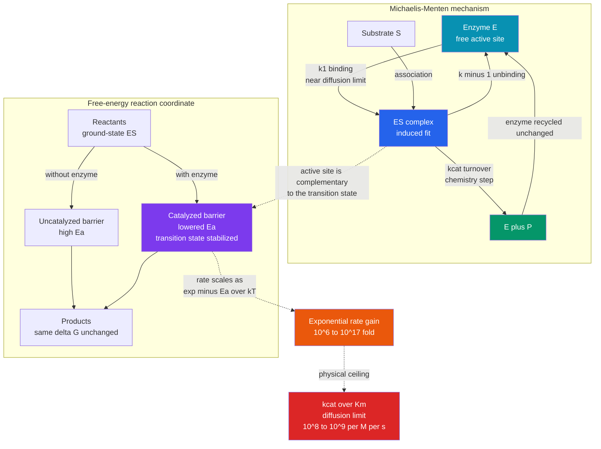

# 🧬 Enzyme Kinetics and Catalysis Physics

> [!abstract] TL;DR
> Enzymes are **catalysts** — proteins (and some RNAs, the *ribozymes*) that accelerate biochemical reactions by staggering factors of $10^6$ to $10^{17}$ **without being consumed and without changing the equilibrium**. They change only the *rate*. The physics is beautifully compact: reaction rate scales as $\propto e^{-E_a/k_BT}$ (the Arrhenius/transition-state law), so an enzyme that **lowers the activation free energy** $\Delta G^{\ddagger}$ by a modest amount buys an *exponentially* large speed-up. Crucially, it does this by being complementary to the **transition state**, not the substrate (Pauling), reinforced by proximity/orientation, electrostatic preorganization, acid–base and covalent catalysis, and strain/desolvation. The steady-state rate law is **Michaelis–Menten**, $v = V_{max}[S]/(K_M+[S])$, with $V_{max}=k_{cat}[E]_{tot}$, $K_M$ the half-saturation concentration (roughly an inverse affinity), $k_{cat}$ the turnover number, and $k_{cat}/K_M$ the **specificity constant**. The best enzymes are "catalytically perfect": their $k_{cat}/K_M$ approaches the **diffusion limit** ($\sim 10^8$–$10^9\ \mathrm{M^{-1}s^{-1}}$) — they react essentially every time they meet a substrate. Life runs on catalysis because uncatalyzed biochemistry is simply far too slow.

## Intuition

**Analogy:** A chemical reaction that would take a *thousand years* in a test tube can happen a *thousand times a second* inside an enzyme. How? An enzyme does **not** change *where* a reaction ends up — the equilibrium, the destination valley, is untouched. It changes *how fast* you get there by lowering the **mountain pass** (the activation-energy barrier) between reactants and products. Think of the enzyme as a **molecular matchmaker**: it grips the reacting molecules and twists them into exactly the strained, half-reacted pose — the transition state — that makes the final step almost effortless. Once the product leaves, the matchmaker is unchanged and immediately grabs the next pair, thousands of times per second.

Two consequences follow immediately and define everything below. First, because the enzyme is *recycled*, a pinch of it processes a mountain of substrate. Second, because catalysis lowers a barrier whose effect enters *exponentially* ($e^{-E_a/k_BT}$), even a small, targeted reduction of the pass height translates into a colossal multiplication of speed. This is why enzymes can be a *trillion*-fold faster than the same reaction left alone — and why the same $k_BT$-scale physics that governs [[Energy_Entropy_and_Free_Energy_in_Biology|free energy in cells]] governs their rates.

---

## How It Works

### Core Mechanics

An enzyme does **not** push reactants uphill or supply energy to the reaction. Thermodynamics fixes the destination; the enzyme only re-routes the *kinetics*. It carves a lower-barrier path in four linked moves.

1. **Bind the substrate in an active site.** The substrate $S$ diffuses into a precisely shaped pocket on the enzyme $E$, forming the enzyme–substrate complex $ES$. Binding is not a rigid "lock and key" but **induced fit**: the pocket reshapes around the substrate, pre-paying the entropic cost of arranging the reactants correctly.
2. **Stabilize the transition state, not the substrate.** Linus Pauling's key insight: the active site is *most* complementary to the fleeting, high-energy **transition state** $\ddagger$, not to the resting substrate. Binding energy released on reaching that strained geometry is spent *paying down the barrier* $\Delta G^{\ddagger}$. If the enzyme bound the substrate too tightly, it would only deepen the starting well and slow things down.
3. **Apply the physical strategies of catalysis.** Barrier reduction comes from a toolkit: **proximity and orientation** (holding two reactants in the reactive alignment, converting a costly translational/rotational entropy loss into a one-time binding event); **electrostatic preorganization** (the active site is pre-arranged to solvate the transition state's charge distribution far better than water can — Warshel's central thesis); **acid–base catalysis** (residues donate/accept protons); **covalent catalysis** (a transient covalent intermediate splits a hard step into two easier ones); and **strain/desolvation** (distorting bonds toward the product geometry and stripping away stabilizing water).
4. **Release product and recycle.** The complex passes to $E + P$; the enzyme emerges chemically unchanged and turns over again.

### The rate law and the parameters

The canonical model is
$$E + S \underset{k_{-1}}{\overset{k_{1}}{\rightleftharpoons}} ES \xrightarrow{\ k_{cat}\ } E + P.$$
Applying the **steady-state approximation** ($d[ES]/dt \approx 0$) gives the **Michaelis–Menten** rate law
$$v = \frac{V_{max}\,[S]}{K_M + [S]}, \qquad V_{max} = k_{cat}[E]_{tot}, \qquad K_M = \frac{k_{-1}+k_{cat}}{k_1}.$$
- $V_{max}$ — the saturating rate when every active site is occupied.
- $K_M$ — the $[S]$ giving half-maximal rate; roughly an *inverse affinity* (small $K_M$ = tight binding). Exactly, $K_M$ is a kinetic ratio, not a pure dissociation constant.
- $k_{cat}$ — the **turnover number**: reactions completed per enzyme per second (carbonic anhydrase: $\sim 10^6\ \mathrm{s^{-1}}$).
- $k_{cat}/K_M$ — the **specificity constant** or catalytic efficiency, the effective second-order rate constant at low $[S]$. Its physical ceiling is the **diffusion limit** ($\sim 10^8$–$10^9\ \mathrm{M^{-1}s^{-1}}$): the fastest an enzyme and substrate can *find* each other. Enzymes at this ceiling (triosephosphate isomerase, catalase, acetylcholinesterase) are called **catalytically perfect** — chemistry is no longer rate-limiting, encounter is.

### The barrier is what matters (Arrhenius / transition-state view)

Transition-state theory writes the rate constant as $k \propto e^{-\Delta G^{\ddagger}/k_BT}$. Because $\Delta G^{\ddagger}$ sits in an exponent, **the rate responds exponentially to barrier height**. At body temperature $RT \approx 2.6\ \mathrm{kJ/mol}$, so lowering the barrier by just $\sim 5.7\ \mathrm{kJ/mol}$ multiplies the rate by $\sim 10$; by $\sim 34\ \mathrm{kJ/mol}$, by $\sim 10^6$; by $\sim 68\ \mathrm{kJ/mol}$, by $\sim 10^{12}$. Enzymes routinely achieve barrier reductions that give a *million*- to *trillion*-fold acceleration, and orotidine-5'-monophosphate decarboxylase famously reaches $\sim 10^{17}$.



---

## Key Concepts

### Secondary Level

- **Enzymes are catalysts.** They speed reactions by huge factors and come out unchanged, so a tiny amount works over and over. Names usually end in **-ase** (lactase, DNA polymerase).
- **They lower the activation energy, not the equilibrium.** An enzyme changes *how fast*, never *how far* — it cannot make an unfavorable reaction favorable. Glucose is stable on a shelf for years yet oxidizes in seconds inside a cell.
- **Active site and specificity.** A precisely shaped pocket binds one substrate (or class), giving enzymes their selectivity.
- **Saturation.** Raise substrate and the rate rises — then *plateaus* once every active site is busy. That plateau is $V_{max}$, the signature of catalysis by a limited number of catalysts.

### Undergraduate Level

- **Michaelis–Menten kinetics.** $v = V_{max}[S]/(K_M+[S])$ traces a rectangular hyperbola. $V_{max}=k_{cat}[E]_{tot}$; $K_M$ is the $[S]$ at half $V_{max}$.
- **The three parameters.** $k_{cat}$ (turnover number, $\mathrm{s^{-1}}$), $K_M$ (half-saturation, M), and $k_{cat}/K_M$ (specificity constant, $\mathrm{M^{-1}s^{-1}}$). Compare enzymes by $k_{cat}/K_M$, not $k_{cat}$ alone.
- **Linearizations.** The **Lineweaver–Burk** double-reciprocal plot $1/v = (K_M/V_{max})(1/[S]) + 1/V_{max}$ turns the hyperbola into a straight line (intercept $1/V_{max}$, slope $K_M/V_{max}$). Handy for teaching and for classifying inhibitors, though nonlinear fitting is statistically superior.
- **Inhibition — the basis of most drugs.** **Competitive** inhibitors bind the active site and raise apparent $K_M$ (out-competed by excess $[S]$, $V_{max}$ unchanged). **Noncompetitive** inhibitors bind elsewhere and lower $V_{max}$ ($K_M$ unchanged). **Uncompetitive** inhibitors bind only $ES$ and lower both. **Irreversible** inhibitors bind covalently (aspirin on COX, penicillin on transpeptidase).
- **Cofactors and conditions.** Metal ions ($\mathrm{Mg^{2+}}, \mathrm{Zn^{2+}}$) and coenzymes ($\mathrm{NAD^+}$, FAD, from vitamins) enable catalysis; activity has temperature and pH optima and collapses on denaturation.

### Graduate Level

- **Transition-state theory.** $k = \kappa\,(k_BT/h)\,e^{-\Delta G^{\ddagger}/k_BT}$. Catalysis $=$ lowering $\Delta G^{\ddagger}$ by preferentially binding the transition state; the ideal rate enhancement equals $K_S/K_{TS}$, the ratio of substrate to transition-state dissociation constants (transition-state analogs make the tightest-binding inhibitors and drugs, e.g. statins, oseltamivir).
- **Electrostatic preorganization.** Warshel's work argues the dominant catalytic contribution is a pre-organized active-site dipole/charge field that solvates the transition state without the entropic reorganization cost water pays — a folded-in electrostatic environment.
- **The diffusion limit and beating it.** The encounter rate $4\pi D R N_A$ caps $k_{cat}/K_M$ at $\sim 10^8$–$10^9\ \mathrm{M^{-1}s^{-1}}$. Strategies to push against or around it: **electrostatic steering** (superoxide dismutase funnels charged substrate in), **substrate channeling** (tunnels hand intermediates between active sites, as in tryptophan synthase), and **metabolic compartments/metabolons** that raise local concentration — themes for the future sibling note *Diffusion_and_Brownian_Motion_in_Cells*.
- **Allostery and cooperativity.** Regulatory enzymes replace the hyperbola with a **sigmoidal** curve (Hill coefficient $n_H>1$). Effectors binding remote sites shift activity (MWC/concerted and KNF/sequential models); **feedback inhibition** by a pathway's end product and **covalent modification** (phosphorylation) make enzymes the control points of metabolism.
- **Enzyme dynamics and modern views.** Beyond the static picture, conformational **"breathing"** and loop motions gate turnover; there are live debates about the contribution of protein dynamics and **hydrogen tunneling** to catalysis. **Single-molecule enzymology** reveals turnover-time fluctuations and **"dynamic disorder"** — a single enzyme's $k_{cat}$ wanders as its conformation does — territory for the future siblings *Single_Molecule_Biophysics*, *Protein_Structure_and_Folding*, and the ensemble treatment in *Statistical_Mechanics_of_Biomolecules*.

---

## Python Demo

```python
# Enzyme kinetics from three angles:
#   (a) the Michaelis-Menten saturation curve v vs [S] (Vmax, Km)
#   (b) an ODE simulation of E + S <=> ES -> E + P confirming the MM steady-state rate
#   (c) Lineweaver-Burk linearization to extract Km and Vmax from data
#   (d) the Arrhenius / transition-state view: rate ~ exp(-Ea/kT), so a small
#       barrier drop multiplies the rate by huge factors (toward the diffusion limit)
import numpy as np
import matplotlib.pyplot as plt

# ---- Rate constants of a fast, specific enzyme ----
k1   = 1.0e6     # M^-1 s^-1   association  E + S -> ES
k_1  = 1.0e3     # s^-1        dissociation ES -> E + S
kcat = 1.0e2     # s^-1        turnover     ES -> E + P
E0   = 1.0e-9    # M           total enzyme (1 nM)

Km   = (k_1 + kcat) / k1       # Michaelis constant (M)
Vmax = kcat * E0               # saturating velocity (M/s)
print(f"Km        = {Km*1e3:.3f} mM")
print(f"Vmax      = {Vmax*1e9:.3f} nM/s")
print(f"kcat/Km   = {kcat/Km:.2e} M^-1 s^-1   (diffusion limit ~1e8-1e9)")

fig, ax = plt.subplots(2, 2, figsize=(13, 10))

# ---- (a) Michaelis-Menten saturation curve ----
S = np.linspace(0, 10*Km, 400)
v = Vmax * S / (Km + S)
ax[0,0].plot(S*1e3, v*1e9, lw=2.5, color='navy')
ax[0,0].axhline(Vmax*1e9,      ls='--', color='gray',    label='Vmax (saturation)')
ax[0,0].axhline(0.5*Vmax*1e9,  ls=':',  color='crimson')
ax[0,0].axvline(Km*1e3,        ls=':',  color='crimson', label='Km at half-Vmax')
ax[0,0].set_xlabel('substrate [S]  (mM)')
ax[0,0].set_ylabel('rate v  (nM/s)')
ax[0,0].set_title('(a) Michaelis-Menten curve')
ax[0,0].legend(); ax[0,0].grid(alpha=0.3)

# ---- (b) ODE simulation of the elementary mechanism (explicit Euler) ----
S0 = Km                         # start at [S] = Km  ->  expect v = Vmax/2
dt, Tend = 1e-5, 0.03
n  = int(Tend/dt)
t  = np.linspace(0, Tend, n)
E  = np.zeros(n); ES = np.zeros(n); Sc = np.zeros(n); P = np.zeros(n)
E[0], Sc[0] = E0, S0
for i in range(n-1):
    r_on, r_off, r_cat = k1*E[i]*Sc[i], k_1*ES[i], kcat*ES[i]
    E[i+1]  = E[i]  + (-r_on + r_off + r_cat)*dt
    ES[i+1] = ES[i] + ( r_on - r_off - r_cat)*dt
    Sc[i+1] = Sc[i] + (-r_on + r_off)*dt
    P[i+1]  = P[i]  + ( r_cat)*dt

v_sim = kcat * ES[-1]              # simulated steady-state velocity
v_mm  = Vmax * S0/(Km + S0)        # Michaelis-Menten prediction
ax[0,1].plot(t*1e3, ES*1e9, lw=2, color='darkorange', label='ES complex')
ax[0,1].axhline(E0*S0/(Km+S0)*1e9, ls='--', color='gray',
                label='ES steady state (theory)')
axp = ax[0,1].twinx()
axp.plot(t*1e3, P*1e9, lw=2, color='green', label='product P')
axp.set_ylabel('[P]  (nM)', color='green')
ax[0,1].set_xlabel('time (ms)')
ax[0,1].set_ylabel('[ES]  (nM)', color='darkorange')
ax[0,1].set_title(f'(b) ODE steady state:  v_sim={v_sim*1e9:.2f}  vs  MM={v_mm*1e9:.2f} nM/s')
ax[0,1].legend(loc='center right'); ax[0,1].grid(alpha=0.3)

# ---- (c) Lineweaver-Burk double-reciprocal fit ----
rng   = np.random.default_rng(0)
S_pts = np.array([0.2, 0.35, 0.6, 1.0, 2.0, 4.0]) * Km
v_pts = Vmax * S_pts/(Km + S_pts)
v_pts = v_pts * (1 + 0.03*rng.standard_normal(v_pts.size))   # 3% measurement noise
x, y  = 1.0/S_pts, 1.0/v_pts
slope, intercept = np.polyfit(x, y, 1)
Vmax_fit = 1.0/intercept
Km_fit   = slope*Vmax_fit
xx = np.linspace(0, x.max()*1.1, 100)
ax[1,0].plot(x/1e3, y/1e9, 'o', color='navy', label='noisy data')
ax[1,0].plot(xx/1e3, (slope*xx + intercept)/1e9, '-', color='crimson',
             label=f'fit: Km={Km_fit*1e3:.2f} mM, Vmax={Vmax_fit*1e9:.1f} nM/s')
ax[1,0].axhline(0, color='k', lw=0.8); ax[1,0].axvline(0, color='k', lw=0.8)
ax[1,0].set_xlabel('1/[S]   (1/mM)')
ax[1,0].set_ylabel('1/v     (s/nM)')
ax[1,0].set_title('(c) Lineweaver-Burk: recover Km & Vmax')
ax[1,0].legend(); ax[1,0].grid(alpha=0.3)

# ---- (d) Barrier lowering -> exponential rate enhancement ----
R, T_K = 8.314, 310.0
dEa = np.linspace(0, 100e3, 300)         # J/mol of barrier REDUCTION
enh = np.exp(dEa/(R*T_K))                # rate multiplier
ax[1,1].semilogy(dEa/1e3, enh, lw=2.5, color='purple')
for lab, dG in [('~5.7 kJ -> 10x', 5.7e3),
                ('~34 kJ -> 1e6',  34e3),
                ('~68 kJ -> 1e12', 68e3)]:
    ax[1,1].plot(dG/1e3, np.exp(dG/(R*T_K)), 'o', color='crimson')
    ax[1,1].annotate(lab, (dG/1e3, np.exp(dG/(R*T_K))),
                     textcoords='offset points', xytext=(-12, 8), fontsize=8)
ax[1,1].set_xlabel('barrier reduction  delta-Ea  (kJ/mol)')
ax[1,1].set_ylabel('rate enhancement  exp(delta-Ea / RT)')
ax[1,1].set_title('(d) A small barrier drop -> a huge rate gain')
ax[1,1].grid(alpha=0.3, which='both')

plt.tight_layout(); plt.show()
```

Panel (a) draws the hyperbola and marks $V_{max}$ and $K_M$. Panel (b) integrates the *elementary* reactions and shows the simulated turnover velocity ($k_{cat}[ES]$) converging on the Michaelis–Menten prediction $V_{max}/2$ once $[ES]$ reaches its quasi-steady state within a millisecond — the rate law is not assumed, it *emerges*. Panel (c) recovers $K_M$ and $V_{max}$ from noisy data by linear fitting. Panel (d) makes the exponential leverage of the barrier concrete: shaving off a few $RT$ of activation energy multiplies the rate by orders of magnitude, and a truly perfect enzyme runs until $k_{cat}/K_M$ hits the diffusion ceiling.

---

## Real-World Applications

- **Drug design (most drugs are enzyme inhibitors).** Statins competitively inhibit HMG-CoA reductase; ACE inhibitors lower blood pressure; the flu drug oseltamivir is a neuraminidase **transition-state analog** — designed to mimic the very geometry enzymes bind best. $K_M$/$k_{cat}$ shifts diagnose the inhibition mechanism and set dosing.
- **Diagnostics and metabolism.** $K_M$ and $k_{cat}$ values define which enzyme is rate-limiting in a pathway; clinical panels measure enzyme activities (ALT, AST, troponin release) to read tissue damage.
- **Industrial biocatalysis.** Proteases and lipases in detergents, glucose isomerase for high-fructose syrup, and engineered enzymes for greener synthesis are optimized by pushing $k_{cat}/K_M$ and stability — the goal of directed evolution and computational enzyme design.
- **Molecular biology tools.** Heat-stable Taq polymerase (high $k_{cat}$, processive) makes PCR possible; restriction enzymes and CRISPR nucleases cut DNA with kinetically tuned specificity.
- **Catalytically perfect enzymes.** Carbonic anhydrase ($k_{cat}\sim 10^6\ \mathrm{s^{-1}}$) buffers blood CO$_2$ fast enough to keep pace with respiration; catalase and triosephosphate isomerase operate at the diffusion limit, showing biology has, in places, hit the physical ceiling.

---

## Common Pitfalls

- **"Enzymes change the equilibrium / make reactions favorable."** They lower $\Delta G^{\ddagger}$ and speed *both* directions equally; $\Delta G$ and $K_{eq}$ are untouched. Catalysts change kinetics, not thermodynamics.
- **"$K_M$ is the dissociation constant / the binding affinity."** $K_M=(k_{-1}+k_{cat})/k_1$ equals $K_d$ only when $k_{cat}\ll k_{-1}$. In fast enzymes $k_{cat}$ inflates $K_M$ above the true $K_d$.
- **"Compare enzymes by $k_{cat}$."** At physiological (sub-saturating) $[S]$, the relevant figure of merit is $k_{cat}/K_M$, not $k_{cat}$ alone. A high $k_{cat}$ with a huge $K_M$ can be a poor catalyst in the cell.
- **"Tighter substrate binding means better catalysis."** Over-stabilizing the *substrate* deepens the starting well and *raises* the barrier. Enzymes optimize binding of the **transition state**, not the ground-state substrate.
- **"Lineweaver–Burk is the right way to fit."** Its reciprocal transform distorts errors, over-weighting low-$[S]$ points. Use it for intuition and inhibitor classification; fit $V_{max}$/$K_M$ by nonlinear regression.
- **"More substrate is always faster."** Only until saturation ($V_{max}$); beyond that, adding substrate does nothing, and for some enzymes excess substrate is *inhibitory*.
- **"Steady state means equilibrium."** The Michaelis–Menten derivation assumes $[ES]$ is at a *steady state* (constant, with flux through it), not at equilibrium — a distinction the ODE panel makes visible.

---

## Related Concepts

- [[Energy_Entropy_and_Free_Energy_in_Biology]] — the sibling that supplies $\Delta G$, the $k_BT$ energy scale, and why favorable reactions still need catalysts to be *fast*
- [[Enzymes_and_Catalysis]] — the biology companion: active sites, induced fit, inhibition types, cofactors, and temperature/pH optima
- [[Enzyme_Kinetics_and_Catalysis]] — the biochemistry parent with full inhibition math, allostery, and the Hill equation
- [[Chemical_Kinetics]] — the physical-chemistry foundation: rate laws, Arrhenius equation, and transition-state theory that enzymes exploit
- [[Chemical_Equilibrium]] — why the destination valley ($K_{eq}$) is fixed while the enzyme only moves the pass
- [[Chemical_Thermodynamics]] — $\Delta G^{\ddagger}$, activation free energy, and the enthalpy/entropy split of the barrier
- [[Classical_Statistical_Mechanics]] — the Boltzmann factor $e^{-\Delta G^{\ddagger}/k_BT}$ behind the exponential rate law
- [[Kinetic_Theory_of_Gases]] — collision and diffusion rates that set the physical ceiling $k_{cat}/K_M$ approaches
- [[Protein_Structure_and_Function]] — how the fold builds the active site and the electrostatics of catalysis
- [[Proteins_and_Amino_Acids]] — the catalytic residues (acid/base, nucleophile, metal ligands) that do the chemistry
- [[Bioenergetics_and_ATP]] — the ATP-coupled reactions that most metabolic enzymes catalyze
- [[Biophysics_Overview]] — the vault's map of physics applied to living systems

---

## Review Questions

1. **Secondary:** Using the mountain-pass analogy, explain what an enzyme changes and what it leaves alone about a reaction. Why can a tiny amount of enzyme process an enormous amount of substrate, and why does the reaction rate eventually stop increasing no matter how much substrate you add?
2. **Undergraduate:** You measure an enzyme with and without an unknown inhibitor and find $V_{max}$ unchanged but the apparent $K_M$ higher. (a) Which inhibition type is this and where does the inhibitor bind? (b) Why can excess substrate overcome it? (c) On a Lineweaver–Burk plot, how do the slope and intercepts move, and how would the plot differ for a *noncompetitive* inhibitor?
3. **Graduate:** An enzyme has $k_{cat}/K_M = 3\times10^{8}\ \mathrm{M^{-1}s^{-1}}$. (a) What does this number tell you about which step is rate-limiting, and what physical process caps it? (b) Name two mechanisms an enzyme can use to approach or effectively exceed this ceiling. (c) Using $k \propto e^{-\Delta G^{\ddagger}/k_BT}$ at $T=310\ \mathrm{K}$, estimate the barrier reduction (in kJ/mol) needed for a $10^{12}$-fold rate enhancement, and comment on why binding the transition state — rather than the substrate — is the way to achieve it.

---

## Sources

- Fersht, A. (1999). *Structure and Mechanism in Protein Science: A Guide to Enzyme Catalysis and Protein Folding.* W. H. Freeman — the definitive kinetics/mechanism text.
- Nelson, D. L. & Cox, M. M. (2021). *Lehninger Principles of Biochemistry*, 8th ed., Ch. 6 (Enzymes) — Michaelis–Menten, $k_{cat}/K_M$, inhibition, allostery.
- Warshel, A. et al. (2006). "Electrostatic Basis for Enzyme Catalysis." *Chemical Reviews* 106(8), 3210–3235 — electrostatic preorganization.
- Wolfenden, R. & Snider, M. J. (2001). "The Depth of Chemical Time and the Power of Enzymes as Catalysts." *Accounts of Chemical Research* 34(12), 938–945 — the $10^{17}$ enhancement and uncatalyzed half-lives.
- Phillips, R., Kondev, J., Theriot, J. & Garcia, H. (2012). *Physical Biology of the Cell*, 2nd ed. — the biophysical, $k_BT$-scale treatment of rates and diffusion limits.

---

#biophysics #enzyme-kinetics #michaelis-menten #catalysis #transition-state
