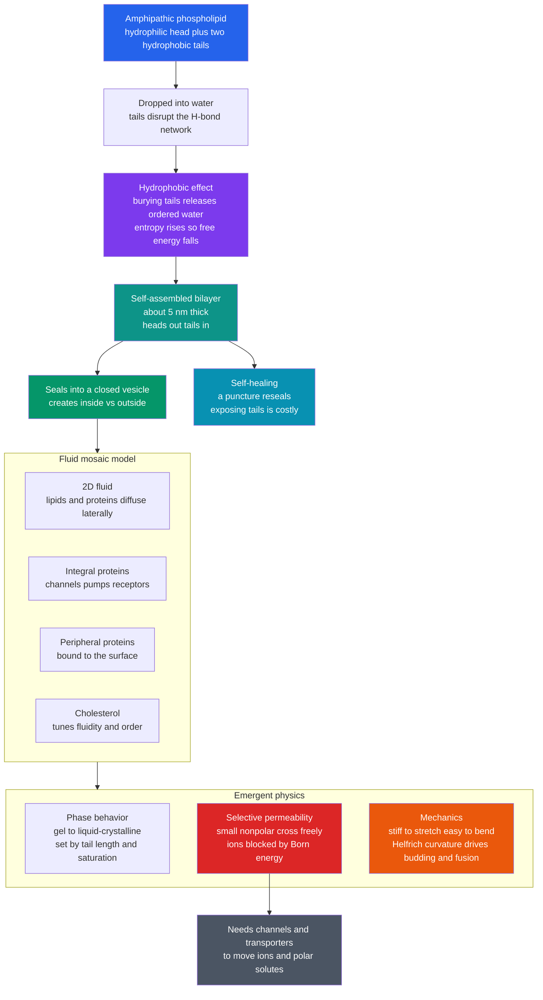

# 🧫 Membranes and Lipid Bilayers

> [!abstract] TL;DR
> Every cell and organelle is bounded by a **lipid bilayer** — a sheet only about **5 nm** (two molecules) thick that no one designed. It **self-assembles** from **amphipathic lipids** (a water-loving head, two oily tails) purely because water squeezes the greasy tails together to get them out of the way: the **hydrophobic effect**, an *entropic* force. Because the free-energy gain of burying two long tails is huge, the **critical aggregation concentration is vanishingly small** (sub-nanomolar), which makes the membrane robust and **self-healing** — a puncture reseals rather than exposing tails to water. Once closed into a vesicle it creates "inside vs. outside," the precondition for maintaining gradients and therefore for life. The **fluid-mosaic model** (Singer–Nicolson, 1972) describes it as a **2D fluid** in which lipids and embedded proteins diffuse laterally; **cholesterol** and tail saturation tune its **fluidity** and **gel ↔ liquid-crystalline** phase behavior. Its oily core makes it **selectively permeable**: small nonpolar molecules ($\text{O}_2$, $\text{CO}_2$) cross freely, but **ions face a ~50–100 $k_BT$ Born-energy wall** and are excluded — which is exactly *why* cells need channels and transporters. Mechanically the bilayer is **stiff to stretch but easy to bend** (Helfrich curvature energy), and that asymmetry drives vesicle budding, fusion, and endocytosis.

## Intuition — analogy FIRST

Drop a little oil into a glass of water and it spontaneously beads up. Nothing pushes it; the oil "hides" from the water. The reason is subtle and important: water molecules near an oily surface can't form their usual hydrogen-bond network, so they lock into an ordered cage — and *ordered water is low-entropy water*. The system escapes that penalty by shrinking the oil–water contact area, which lets the caged water break free and roam. Hiding the oil **raises entropy**, and higher entropy means lower free energy. This is the **hydrophobic effect**.

Now imagine molecules that are **half water-loving and half oil-loving** — a phospholipid, with a charged head and two greasy tails. Dropped into water, they can't fully hide (the heads *like* water) but they can hide the *tails*. The optimal compromise is astonishing: they self-organize, **oily tails pointing inward and water-loving heads facing outward**, into a **two-molecule-thick sheet** that then curls around and **seals itself into a bubble**.

That sheet is the **cell membrane** — a self-assembling, self-healing, fluid barrier that arose not from a blueprint but from physics. It is the boundary that made "inside" and "outside" — and therefore life — possible.

---

## How It Works

**1. Amphipathic lipids are the building block.** A phospholipid has a polar/charged **headgroup** (phosphate + choline, serine, etc.) and two long **hydrocarbon tails**. "Amphipathic" means it simultaneously loves and hates water. That dual nature is the entire molecular basis for self-assembly (the aqueous-solvent physics behind it is the subject of the sibling note *Intermolecular_Forces_and_the_Aqueous_Environment*).

**2. Self-assembly is driven by the hydrophobic effect, and it is spontaneous.** Burying the tails away from water releases ordered "clathrate" water, raising entropy and *lowering* free energy (see [[Energy_Entropy_and_Free_Energy_in_Biology]]). Because a lipid has **two** tails, the buried hydrophobic surface per molecule is large, so the transfer free energy from water to the aggregate is strongly negative — tens of $k_BT$ per lipid. The equilibrium structure for *double-tailed* lipids is not a spherical micelle (that geometry suits *single*-tailed surfactants) but a **flat bilayer**, dictated by the molecular "packing parameter" $v/(a_0 l)$.

**3. The critical aggregation concentration is tiny, so membranes are robust and self-healing.** At the critical aggregation concentration (CAC/CMC), monomer and aggregate chemical potentials balance: $X_\text{cmc}\approx e^{\Delta G_\text{transfer}/k_BT}$. For a double-tailed phospholipid $\Delta G_\text{transfer}$ is so negative that the CMC is **sub-nanomolar** — essentially the bilayer *never* dissolves. The same energetics make it **self-heal**: a hole exposes tails to water at high cost, so the edge spontaneously reseals.

**4. Fluid-mosaic: it is a 2D fluid, not a wall.** Lipids and many proteins **diffuse laterally** within each leaflet (lateral diffusion coefficient $\sim 1\ \mu\text{m}^2/\text{s}$), while flip-flop across leaflets is rare. **Integral** proteins (channels, pumps, receptors) span the bilayer; **peripheral** proteins bind the surface. The membrane is a dynamic **mosaic** floating in a lipid sea.

**5. Fluidity and phase behavior.** Below a characteristic temperature the tails freeze into an ordered **gel** phase; above it they melt into the **liquid-crystalline** phase (a genuine phase transition — see [[Phase_Transitions_and_Critical_Phenomena]]). The transition temperature rises with **longer** and **more saturated** tails (straight chains pack tightly) and falls with **unsaturation** (kinks disrupt packing). **Cholesterol** buffers fluidity — stiffening fluid membranes and fluidizing gel ones — and helps form ordered **lipid rafts**. Cells actively retune tail composition to hold fluidity roughly constant as temperature changes (**homeoviscous adaptation**).

**6. Selective permeability and the Born wall.** By the **Overton solubility–diffusion** rule, permeability $P = K_p D / d$ (partition coefficient × diffusion / thickness). Small **nonpolar** molecules partition into the oily core and cross fast; small uncharged **polars** (water, urea) trickle through; **ions and large charged molecules are excluded** because moving a charge from water ($\varepsilon\approx 80$) into the low-dielectric core ($\varepsilon\approx 2$) costs a huge **Born energy** ($\sim 50$–$100\ k_BT$). This exclusion is *why* cells evolved channels and transporters, and why the membrane can hold a voltage (developed in *Membrane_Potential_and_the_Nernst_Equation* and *Ion_Channels_and_Transport*).

**7. Mechanics: stiff to stretch, easy to bend.** As an elastic sheet the bilayer has a large **area-stretch modulus** ($K_A\sim 0.2$–$0.3\ \text{N/m}$; it ruptures at only a few percent strain) but a modest **bending rigidity** ($\kappa\sim 20\ k_BT$). The **Helfrich** curvature energy $E=\tfrac12\kappa\!\int(2H-c_0)^2\,dA + \bar\kappa\!\int K\,dA$ means bending is cheap while stretching is expensive — so cells reshape membranes by **curving** them. Closing a flat patch into a vesicle costs a radius-independent $8\pi\kappa\approx 500\ k_BT$, supplied by curvature-generating proteins (**BAR domains**, coats) and by lipid asymmetry. This governs **remodeling**: vesicle budding/fission, **fusion**, exocytosis, and endocytosis in trafficking.

**8. Why it is the foundation of cell physiology.** The same selectively-permeable, chargeable sheet hosts the **proton-motive force** of chemiosmosis (see [[Oxidative_Phosphorylation]]), the resting and action potentials of nerve and muscle, and the receptor platforms of **signal transduction**. The membrane is where much of life's energy conversion and information processing physically happens; its dynamic coupling to the cortex underlies shape change and crawling (the sibling *Cell_Motility_and_Adhesion*).



---

## Key Concepts / Details

### Secondary Level

- **Amphipathic lipid.** Two-faced molecule: a **water-loving head** and **water-hating (oily) tails**. This split is what lets it self-organize.
- **The bilayer.** In water the lipids line up **tails-in, heads-out**, forming a double sheet about **5 nm** thick that curls into a closed bubble — the cell membrane.
- **Self-assembly and self-healing.** No blueprint builds it; **water pushing the tails together** does. A small hole reseals on its own because exposing tails to water is costly.
- **Selective barrier.** Tiny greasy molecules ($\text{O}_2$, $\text{CO}_2$) slip through; **ions and big polar molecules cannot** and need protein gates.
- **Fluid, not solid.** Lipids and proteins **drift sideways** like boats on a pond — the *fluid mosaic*.

### Undergraduate Level

- **Hydrophobic effect is entropic.** Burying tails frees ordered water; $\Delta S>0$ dominates $\Delta G=\Delta H-T\Delta S<0$. Assembly is *driven by disorder*, not by "lipid–lipid attraction."
- **Packing parameter** $p=v/(a_0 l)$ predicts geometry: $p\approx 1$ (double tails) ⇒ **bilayer**; $p\lesssim 1/3$ (single tail, big head) ⇒ **spherical micelle**.
- **CMC / CAC.** $X_\text{cmc}\approx e^{\Delta G_\text{transfer}/k_BT}$. Double tails ⇒ very negative $\Delta G$ ⇒ **sub-nanomolar** CMC ⇒ effectively permanent, self-healing membrane.
- **Fluid-mosaic model** (Singer & Nicolson, 1972): integral vs. peripheral proteins; lateral diffusion fast, **transverse flip-flop slow**; leaflet **asymmetry** is maintained.
- **Phase transition** $T_m$: **↑ tail length**, **↑ saturation** ⇒ higher $T_m$ (tighter packing); **unsaturation kinks** ⇒ lower $T_m$. **Cholesterol** broadens/buffers the transition (the *liquid-ordered* phase).
- **Overton's rule.** $P=K_pD/d$; permeability tracks the oil/water **partition coefficient**. Ions are the dramatic exception.

### Graduate Level

- **Israelachvili aggregation thermodynamics.** Monomer chemical potential $\mu_N=\mu_\infty+\alpha k_BT/N^{\,p}$; equating monomer and aggregate $\mu$ gives the CMC. The **line tension** of an open bilayer edge sets the self-sealing driving force and the pore-nucleation barrier.
- **Born energy of ion partitioning.** $\Delta G_\text{Born}=\dfrac{z^2 e^2}{8\pi\varepsilon_0 r}\!\left(\dfrac{1}{\varepsilon_\text{mem}}-\dfrac{1}{\varepsilon_\text{water}}\right)$. For $r\!\sim\!0.2$ nm, $z\!=\!1$ this is $\sim 65\ k_BT$ — a partition coefficient $\sim e^{-65}$. This single term explains why membranes are electrical insulators and why channels (which shield/hydrate the ion) are essential.
- **Helfrich elasticity.** Bending energy density $\tfrac12\kappa(2H-c_0)^2+\bar\kappa K$ with mean curvature $H$, Gaussian curvature $K$, spontaneous curvature $c_0$. A vesicle costs $8\pi\kappa$ (Gauss–Bonnet makes the Gaussian term a topological constant). Fluctuation spectrum $\langle |h_q|^2\rangle = k_BT/(\kappa q^4 + \sigma q^2)$ links flicker microscopy to $\kappa$ and tension $\sigma$.
- **Mechanics moduli.** Area-stretch modulus $K_A\sim 0.24$ N/m; lysis at $\sim 2$–$4\%$ areal strain; $\kappa$ and $K_A$ are related through bilayer thickness ($\kappa\approx K_A d^2/48$ for a coupled-monolayer plate).
- **Lateral diffusion & rafts.** Saffman–Delbrück: $D\sim \dfrac{k_BT}{4\pi\mu_m h}\!\left[\ln\!\dfrac{\mu_m h}{\mu_w a}-\gamma\right]$ — only **logarithmically** dependent on protein radius (a 2D-hydrodynamics signature). **Liquid-ordered rafts** are cholesterol-/sphingolipid-enriched microdomains.
- **Homeoviscous & curvature machinery.** Cells adjust unsaturation/chain length to hold fluidity constant; **BAR-domain** proteins and coat proteins impose $c_0$ to bud and tubulate membranes; SNARE/fusion machinery pays the hydration and bending penalty of merging two bilayers.

---

## Python Demo

```python
# Membrane biophysics from first principles:
#   (a) SELF-ASSEMBLY: transfer free energy per lipid -> a vanishing critical
#       aggregation concentration (CMC) => bilayers form spontaneously & self-heal.
#   (b) PERMEABILITY: Overton solubility-diffusion model vs real molecules,
#       and the Born-energy "wall" that excludes ions.
#   (c) FLUIDITY: 2D lateral-diffusion random walk -> the membrane is a 2D fluid.
import numpy as np
import matplotlib.pyplot as plt

# ---- constants ----
R    = 8.314           # J/(mol K)
T    = 310.0           # K  (body temperature)
RT   = R * T / 1000.0  # kJ/mol  (~2.577)
kB   = 1.380649e-23    # J/K
e    = 1.602176634e-19 # C
eps0 = 8.8541878128e-12
kT_J = kB * T          # J

fig, ax = plt.subplots(1, 3, figsize=(17, 5))

# ---------------------------------------------------------------
# (a) SELF-ASSEMBLY: dG_transfer per lipid and the resulting CMC
# ---------------------------------------------------------------
dg_CH2  = -3.0   # kJ/mol hydrophobic gain per buried methylene (effective)
dg_head = +14.0  # kJ/mol headgroup hydration/repulsion penalty per lipid
nC = np.arange(8, 37)                      # total hydrophobic carbons
dG_transfer = nC * dg_CH2 + dg_head        # kJ/mol (negative => favors aggregate)
X_cmc = np.exp(dG_transfer / RT)           # mole fraction at CMC
cmc_M = X_cmc * 55.5                        # convert to molar (55.5 M water)

axb = ax[0].twinx()
l1, = ax[0].plot(nC, dG_transfer, color='navy', lw=2)
ax[0].axhline(0, color='k', lw=0.8)
l2, = axb.semilogy(nC, cmc_M, color='crimson', lw=2)
for x, name in [(12, 'soap\nsingle C12'), (32, 'phospholipid\ndouble C16')]:
    ax[0].axvline(x, ls='--', color='gray', alpha=0.6)
    ax[0].text(x, 6, name, fontsize=8, ha='center')
ax[0].set_xlabel('total hydrophobic carbons')
ax[0].set_ylabel('dG transfer per lipid (kJ/mol)', color='navy')
axb.set_ylabel('critical aggregation conc. (M)', color='crimson')
ax[0].set_title('(a) Self-assembly is spontaneous\nmore buried carbons -> vanishing CMC')
ax[0].legend([l1, l2], ['dG transfer', 'CMC'], loc='lower left', fontsize=8)
ax[0].grid(alpha=0.3)

# ---------------------------------------------------------------
# (b) PERMEABILITY: Overton model + real molecules + ion Born wall
# ---------------------------------------------------------------
logKp   = np.linspace(-8, 2, 200)          # log10 oil/water partition coeff
D_over_d = 1e-2                            # cm/s prefactor (D / thickness)
P_model  = D_over_d * 10.0 ** logKp        # cm/s
ax[1].plot(logKp, P_model, color='teal', lw=2, label='Overton model  P ~ Kp')

# (name, log10 partition coeff [approx], measured P [cm/s], category)
mols = [
    ("O2",       1.0, 1e0,  'nonpolar'),
    ("CO2",      0.5, 3e-1, 'nonpolar'),
    ("H2O",     -2.0, 3e-3, 'small polar'),
    ("urea",    -3.0, 4e-6, 'small polar'),
    ("glycerol",-3.5, 1e-6, 'small polar'),
    ("glucose", -5.0, 1e-10,'large polar'),
    ("Cl-",     -7.0, 1e-11,'ion'),
    ("K+",      -7.5, 1e-12,'ion'),
    ("Na+",     -8.0, 1e-14,'ion'),
]
col = {'nonpolar':'green', 'small polar':'orange', 'large polar':'purple', 'ion':'red'}
for name, lk, P, cat in mols:
    ax[1].scatter(lk, P, color=col[cat], s=60, zorder=5, edgecolor='k')
    ax[1].annotate(name, (lk, P), textcoords='offset points', xytext=(4, 4), fontsize=8)
ax[1].axhspan(1e-16, 1e-11, color='red', alpha=0.08)
ax[1].text(-7.6, 3e-14, 'ion exclusion\n(Born wall)', color='red', fontsize=8)
ax[1].set_yscale('log')
ax[1].set_ylim(1e-16, 1e2)
ax[1].set_xlabel('hydrophobicity  log10(partition coeff)')
ax[1].set_ylabel('permeability P (cm/s)')
ax[1].set_title('(b) Selective permeability\nnonpolar cross; ions excluded (~14 orders)')
ax[1].legend(loc='lower right', fontsize=8)
ax[1].grid(alpha=0.3, which='both')

# ---------------------------------------------------------------
# (c) FLUIDITY: 2D lateral-diffusion random walk of lipids
# ---------------------------------------------------------------
D_lipid = 1.0      # um^2/s  typical fluid-phase lateral diffusion
dt, nsteps, nlipid = 1e-3, 4000, 6
rng   = np.random.default_rng(0)
sigma = np.sqrt(2 * D_lipid * dt)          # per-axis step std (um)
traj  = np.cumsum(rng.normal(0, sigma, size=(nlipid, nsteps, 2)), axis=1)
for i in range(nlipid):
    ax[2].plot(traj[i, :, 0], traj[i, :, 1], lw=0.8, alpha=0.85)
ax[2].scatter([0], [0], color='k', zorder=5, label='start')
ax[2].set_aspect('equal')
ax[2].set_xlabel('x (um)'); ax[2].set_ylabel('y (um)')
ax[2].set_title(f'(c) Membrane is a 2D fluid\nlipids diffuse, D = {D_lipid} um^2/s')
ax[2].legend(fontsize=8); ax[2].grid(alpha=0.3)

plt.tight_layout(); plt.show()

# ---------- console: CMC contrast, Born energy, Helfrich bending ----------
def cmc_for(n):
    return np.exp((n * dg_CH2 + dg_head) / RT) * 55.5

print("SELF-ASSEMBLY (why bilayers are permanent & self-healing)")
print(f"  single-tail soap  (12 C): CMC ~ {cmc_for(12):.2e} M  (millimolar-ish)")
print(f"  double-tail lipid (32 C): CMC ~ {cmc_for(32):.2e} M  (vanishing -> self-healing)")

def born_kT(r_nm, z=1, eps_mem=2.0, eps_wat=80.0):
    r = r_nm * 1e-9
    dG = (z**2 * e**2) / (8 * np.pi * eps0 * r) * (1/eps_mem - 1/eps_wat)  # J
    return dG / kT_J

print("\nION EXCLUSION (Born energy of moving a charge into the oily core)")
for r in [0.10, 0.15, 0.20]:
    g = born_kT(r)
    print(f"  ion radius {r} nm: dG_Born ~ {g:5.0f} kT  -> partition ~ {np.exp(-g):.1e}")

kappa     = 20 * kT_J          # bending rigidity ~ 20 kT
E_vesicle = 8 * np.pi * kappa  # curvature energy of a sphere (radius-independent)
print("\nMEMBRANE MECHANICS (Helfrich: stiff to stretch, easy to bend)")
print(f"  bending rigidity kappa ~ {kappa/kT_J:.0f} kT")
print(f"  energy to bend a flat patch into a vesicle = 8*pi*kappa ~ {E_vesicle/kT_J:.0f} kT")
```

**What the demo shows.** Panel **(a)**: as buried carbons increase, $\Delta G_\text{transfer}$ plunges and the CMC drops many orders of magnitude — a single-tailed soap (12 C) has a millimolar CMC, but a double-tailed phospholipid (32 C) has a **picomolar** CMC, so its bilayer effectively never dissolves and **reseals** after damage. Panel **(b)**: permeability tracks hydrophobicity over ~14 orders of magnitude (Overton), but ions sit far below the trend in the shaded **Born-exclusion** zone — motivating channels and transporters. Panel **(c)**: lipids execute a 2D random walk, making the membrane a genuine **fluid**. The console prints the ~65 $k_BT$ Born wall for a small ion and the radius-independent $\approx 500\ k_BT$ Helfrich cost of closing a vesicle.

---

## Real-World Applications

- **Drug design via Lipinski / Overton.** Whether an oral drug crosses membranes to reach its target is largely set by its lipid partition coefficient (logP) and size — the same physics as panel (b). Too polar and it can't cross; too greasy and it never leaves the membrane.
- **Liposomes and lipid nanoparticles (LNPs).** Self-assembly is exploited to package cargo: doxorubicin liposomes for chemotherapy and the **ionizable-lipid LNPs** that delivered the mRNA COVID-19 vaccines. LNP design tunes headgroup charge and tail saturation to control fusion and endosomal escape (kin to [[Nanomedicine_and_Drug_Delivery_Systems]]).
- **Anesthetics and membrane fluidity.** Volatile anesthetics partition into and perturb the bilayer and its embedded channels; the historical Meyer–Overton correlation ties anesthetic potency directly to lipid solubility.
- **Cold adaptation / food science.** Fish and bacteria in cold water enrich **unsaturated** tails to stay fluid (homeoviscous adaptation) — the same chemistry that keeps olive oil liquid but butter solid at room temperature.
- **Chemiosmosis and energy.** The inner mitochondrial membrane's impermeability to protons is what lets it store the **proton-motive force** that ATP synthase discharges (see [[Oxidative_Phosphorylation]]). A leaky membrane would short-circuit the cell's battery.
- **Origin-of-life research.** Fatty-acid **protocells** self-assemble, grow, and divide without proteins — evidence that a self-healing bilayer could bootstrap the first "inside vs. outside" (echoing [[Liquid_Crystals_and_Colloids]] and self-assembling soft matter).

---

## Common Pitfalls

- **"The bilayer is held together by chemical bonds."** No covalent or even strong non-covalent bonds link the lipids — it is held by the **hydrophobic effect** (an entropic, water-driven force). That is precisely why it is fluid and self-healing rather than rigid.
- **"Self-assembly lowers entropy, so it can't be spontaneous."** The *lipids* order, but the released **water** disorders far more; total entropy rises. Confusing the subsystem's entropy with the universe's is the classic error (see [[Energy_Entropy_and_Free_Energy_in_Biology]]).
- **"Micelles and bilayers are interchangeable."** Geometry follows the **packing parameter**: single-tail surfactants make micelles; double-tail lipids make bilayers. Using a soap to model a membrane gets the CMC and structure wrong.
- **"Ions are blocked because they're big."** Small ions ($\text{Na}^+$, $\text{K}^+$) are *tiny*. They're excluded by the **Born energy** of dehydrating a charge into a low-dielectric core, not by size — that's why panel (b) puts them far below the size trend.
- **"The membrane is a passive wall."** It is a **2D fluid** hosting diffusing proteins, phase domains (rafts), and active remodeling. Treating it as a static barrier misses fluidity, curvature, and signaling.
- **"Stretching and bending are the same stiffness."** They differ by orders of magnitude: the bilayer ruptures at a few percent **stretch** but **bends** readily ($\kappa\sim 20\,k_BT$). Cell shape change exploits cheap bending, not stretching.
- **Ignoring leaflet asymmetry.** The two leaflets differ in lipid composition and are actively maintained (flippases/scramblases); collapsing them into one symmetric sheet mis-predicts spontaneous curvature and apoptotic signaling.

---

## Related Concepts

- [[Energy_Entropy_and_Free_Energy_in_Biology]] — the thermodynamic engine of the hydrophobic effect: $\Delta G=\Delta H-T\Delta S$ and entropic forces
- [[The_Cell_Membrane_and_Transport]] — the biology companion: passive/active transport, osmosis, tonicity, and the pumps the Born wall makes necessary
- [[Membranes_and_Cell_Signaling]] — the biochemistry view: receptors, second messengers, and the transmembrane voltage
- [[Carbohydrates_and_Lipids]] — the molecular chemistry of the phospholipids and glycolipids that build the sheet
- [[Water_and_Lifes_Chemistry]] — the hydrogen-bonded solvent whose entropy drives assembly and excludes ions
- [[Liquid_Crystals_and_Colloids]] — the soft-matter parent: amphiphile self-assembly, mesophases, and colloidal stability
- [[Nanofabrication_and_Self_Assembly]] — self-assembly as an engineering principle beyond biology
- [[Nanomedicine_and_Drug_Delivery_Systems]] — liposomes and lipid nanoparticles that co-opt bilayer self-assembly
- [[Phase_Transitions_and_Critical_Phenomena]] — the physics of the gel ↔ liquid-crystalline transition and $T_m$
- [[Fluid_Statics_and_Properties]] — surface tension and the interfacial energetics underlying the hydrophobic effect
- [[Stress_Strain_and_Elastic_Moduli]] — the continuum-elasticity language behind area-stretch modulus and bending rigidity
- [[Oxidative_Phosphorylation]] — chemiosmosis: why an ion-tight membrane can store a proton-motive force
- [[Mitochondria_and_Chloroplasts]] — organelle membranes as the site of energy transduction
- [[Statistical_Mechanics_of_Biomolecules]] — Boltzmann factors and partition functions behind CMC, permeation, and fluctuation spectra

---

## Review Questions

1. **Secondary:** Oil beads up in water, and phospholipids form a bilayer — both "spontaneously." In plain language, what is the single physical reason, and why does it also explain why a small puncture in a membrane heals itself?
2. **Undergraduate:** A single-tailed surfactant has a CMC near $10^{-3}$ M, while a double-tailed phospholipid has one near $10^{-10}$ M. Using $X_\text{cmc}\approx e^{\Delta G_\text{transfer}/k_BT}$ and the idea that each buried methylene contributes a fixed favorable increment, explain the ten-orders-of-magnitude gap and what it implies for membrane robustness. Separately, why does the same molecule prefer a *bilayer* rather than a *micelle*?
3. **Graduate:** (a) Using the Born expression $\Delta G_\text{Born}=\dfrac{z^2 e^2}{8\pi\varepsilon_0 r}\big(\tfrac{1}{\varepsilon_\text{mem}}-\tfrac{1}{\varepsilon_\text{water}}\big)$, estimate the free-energy cost (in $k_BT$) of moving a monovalent ion of radius $0.15$ nm into a core of $\varepsilon_\text{mem}=2$, and convert it to a partition coefficient. (b) Contrast this with the modest bending cost $8\pi\kappa$ of forming a vesicle, and explain why cells solve the *permeability* problem with protein channels but the *shape* problem with curvature-generating proteins — i.e., why the two challenges have completely different physical remedies.

---

## Sources

- Israelachvili, J. N. (2011). *Intermolecular and Surface Forces*, 3rd ed. — packing parameter, self-assembly thermodynamics, and the CMC.
- Phillips, R., Kondev, J., Theriot, J. & Garcia, H. (2012). *Physical Biology of the Cell*, 2nd ed. — bilayer energetics, Helfrich mechanics, and permeation at the $k_BT$ scale.
- Singer, S. J. & Nicolson, G. L. (1972). "The Fluid Mosaic Model of the Structure of Cell Membranes." *Science* 175(4023): 720–731.
- Alberts, B. et al. (2022). *Molecular Biology of the Cell*, 7th ed., Ch. 10 (Membrane Structure). — lipids, asymmetry, fluidity, and rafts.
- Helfrich, W. (1973). "Elastic Properties of Lipid Bilayers: Theory and Possible Experiments." *Z. Naturforsch. C* 28(11): 693–703. — the curvature-elasticity energy.

---

#biophysics #lipid-bilayer #membranes #self-assembly #fluid-mosaic
