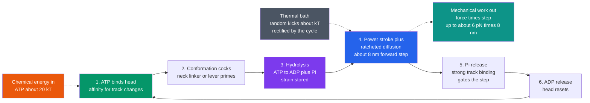

# 🧬 Molecular Motors and Mechanochemistry

> [!abstract] TL;DR
> **Molecular motors** are proteins that convert the chemical energy of **ATP hydrolysis** (about $20\,k_BT$, or roughly $-50$ kJ/mol in the cell) into directed **mechanical motion and force** — they are the cell's engines. **Linear motors** walk hand-over-hand along cytoskeletal tracks: **myosin** on actin (muscle, cargo), **kinesin** toward microtubule plus-ends (~8 nm steps, ~5–7 pN stall force), and **dynein** toward minus-ends (transport, cilia/flagella beating). **Rotary motors** spin: **ATP synthase** turns the proton-motive force into ATP (and runs in reverse), and the **bacterial flagellar motor** spins a corkscrew for swimming. **Nucleic-acid motors** — polymerases, helicases, the ribosome, and viral packaging motors — track along and process DNA/RNA. All of them run a **mechanochemical cycle**: ATP binding, hydrolysis, and product release drive **conformational changes** that are coupled to a mechanical step. The deep puzzle is that they operate in a *thermal hurricane* where random kicks of energy $\sim k_BT$ are comparable to the work per step — so real motors do not merely push (a "power stroke") but also **rectify Brownian noise** using ATP to gate an asymmetric energy landscape (a "Brownian ratchet"). The result: nanoscale machines of near-optimal thermodynamic efficiency.

## Intuition

**Analogy:** Inside every one of your cells, armies of two-legged protein machines literally **walk** along molecular tracks — hauling cargo, one nanometer-scale step at a time, burning ATP as fuel like a hiker eating trail mix. Others spin like microscopic rotary engines, and still others reel themselves along strands of DNA. What is astonishing is the *conditions* they work in. A walking motor is not strolling down a calm path; it is being sandbagged from every direction by water molecules that slam into it as hard as its own footstep. It lives in a permanent hurricane of thermal noise.

A human-scale machine would be shaken to pieces. But these motors do something clever: rather than *fighting* the noise, they **harness** it. They use ATP not to brute-force each step against the storm, but to set up a lopsided, one-way landscape — a **Brownian ratchet** — so that the random jiggling, which would otherwise go nowhere, gets biased into forward motion. The motor lets thermal chaos do much of the moving and spends its ATP mainly to make sure the chaos only ever pays off in one direction. Directed motion, wrung from randomness.

---

## How It Works

### Chemistry coupled to shape change

A molecular motor is a **mechanochemical transducer**: it turns a *chemical cycle* into a *mechanical cycle*, with the two locked together. The fuel is almost always **ATP**, whose hydrolysis to ADP + inorganic phosphate ($P_i$) releases about $20\,k_BT$ of free energy in the cell (see [[Energy_Entropy_and_Free_Energy_in_Biology]] and [[Bioenergetics_and_ATP]]). Crucially, the energy does **not** come out as a puff of heat that shoves the motor. Instead, each chemical event — ATP *binding*, *hydrolysis*, $P_i$ *release*, ADP *release* — changes which protein **conformation** is most stable. The motor is engineered so that this sequence of preferred shapes marches around a cycle that can only be traversed one way, and that asymmetry is what produces net displacement.

1. **ATP binding** changes the shape of the motor head, altering its affinity for the track and cocking a lever-like element (in kinesin, the **neck linker** docks; in myosin, the **lever arm** primes).
2. **Hydrolysis** ($\text{ATP} \rightarrow \text{ADP} + P_i$) traps energy in a strained conformation.
3. **$P_i$ release** triggers the **power stroke** — the lever swings — and/or gates a diffusive search that is then trapped forward.
4. **ADP release** resets the head, ready to bind fresh ATP.

Because each forward cycle consumes (ideally) **one ATP per mechanical step**, the motor is **tightly coupled**. Loosely coupled motors slip — spending ATP without always stepping, or stepping without always spending — which lowers efficiency.

### Three families of motor

- **Linear motors on cytoskeletal tracks** (the cell's freight system; see [[The_Cytoskeleton_and_Cell_Motility]]):
  - **Myosin** walks on **actin** filaments. Muscle myosin-II works in huge cooperative arrays to slide filaments (the *sliding-filament model* of contraction); myosin-V processively carries vesicles.
  - **Kinesin** walks toward the **plus-end** of **microtubules** (typically cell periphery) in **~8 nm hand-over-hand steps**, is highly **processive** (many steps before letting go), and **stalls at ~5–7 pN** of opposing load.
  - **Dynein** walks toward the **minus-end** (cell center), drives retrograde transport, and powers the beating of **cilia and flagella** via the axonemal 9+2 array.
  - Key descriptors: **step size**, **processivity** (steps per encounter), **directionality** (which track polarity), and **stall force**.
- **Rotary motors** (turbines, not walkers):
  - **ATP synthase** is a reversible rotary machine. Protons falling down the **proton-motive force** across the inner mitochondrial membrane spin the $F_o$ rotor, which cranks the $F_1$ head to *synthesize* ATP; driven backward by ATP hydrolysis, it pumps protons (see [[Oxidative_Phosphorylation]] and [[Mitochondria_and_Chloroplasts]]). It is one of the most efficient machines known.
  - The **bacterial flagellar motor** is a proton- (or Na⁺-) driven rotary engine, hundreds of nm in scale, that spins a helical flagellum at hundreds of Hz to swim.
- **Nucleic-acid motors** (they move *along* and *process* DNA/RNA; see [[DNA_Structure_and_Replication]] and [[Translation_and_the_Genetic_Code]]):
  - **RNA/DNA polymerases** translocate base-by-base while synthesizing; **helicases** unwind duplex DNA/RNA; the **ribosome** ratchets along mRNA one codon at a time; **viral packaging motors** cram genomes into capsids against enormous internal pressure and are **among the strongest motors known** (tens of pN).

### Power stroke vs Brownian ratchet — one mechanism, two limits

Two historical pictures compete, and real motors sit between them:

- **Power stroke:** a *deterministic* conformational swing (a lever arm rotating) that pushes the motor forward like an oar. Emphasizes the mechanical stroke.
- **Brownian ratchet:** the motor's head **diffuses** freely, and ATP is spent to raise and lower an **asymmetric, gated energy landscape** that lets forward-diffused positions be *captured* and backward ones be rejected. Emphasizes rectified thermal noise.

The synthesis: because the work per step (tens of $pN\cdot nm$) is only a small multiple of $k_BT$ (about $4.1\ pN\cdot nm$), **thermal fluctuations cannot be ignored** — the motor is bombarded by kicks comparable to its own effort. Efficient motors therefore *use* ATP to bias thermal motion, combining a genuine conformational stroke with ratcheting of noise. Directed motion emerges from **coupling chemistry to an asymmetric potential**, not from overpowering the storm.

### Force, velocity, and efficiency

Under an opposing load $F$, a motor slows; the **force–velocity relation** falls to zero at the **stall force** $F_{stall}$. The maximum mechanical work per step is $F_{stall}\cdot d$; comparing this to the $\sim 20\,k_BT$ delivered per ATP gives the **thermodynamic efficiency**. For kinesin, $F_{stall}\,d \approx 6\ \text{pN} \times 8\ \text{nm} = 48\ pN\cdot nm \approx 12\,k_BT$ against about $20\,k_BT$ of fuel — well over half, and ATP synthase does even better, approaching the reversible limit. We know these numbers because **single-molecule** methods — **optical tweezers** and single-molecule **fluorescence** — resolve individual 8-nm steps, measure piconewton forces, and time the mechanochemical cycle in real time (the subject of the forthcoming sibling *Single_Molecule_Biophysics*).



---

## Key Concepts

### Secondary Level

- **Motors are protein machines.** They burn ATP (chemical energy) to produce movement and force — the way a car burns fuel to turn its wheels, but a billion times smaller.
- **Walkers and spinners.** Some motors (kinesin, myosin, dynein) *walk* along tracks and carry cargo or contract muscle; others (ATP synthase, the flagellar motor) *spin* like tiny engines.
- **Muscle is molecular motors in bulk.** A muscle contracts because vast arrays of myosin motors pull on actin filaments and slide them past one another (see [[The_Musculoskeletal_System]]).
- **They work in a storm.** At the nanoscale, water molecules constantly jostle everything. Motors do not fight this randomness — they *use* it, biasing random wobble into forward steps.

### Undergraduate Level

- **Mechanochemical cycle.** A fixed sequence of chemical states — ATP binding, hydrolysis, $P_i$ release, ADP release — each favoring a different conformation, so the protein cycles one way and steps. **Tight coupling** means one ATP per step.
- **Kinesin specifics.** ~8 nm step (the tubulin dimer spacing), hand-over-hand gait, high processivity (~100 steps), velocity ~800 nm/s at saturating ATP, stall force ~5–7 pN.
- **Directionality is built in.** Kinesin → plus-end, dynein → minus-end, on the same microtubule; myosins split by isoform. Directionality comes from the asymmetry of the track and the gated cycle, not from a "steering wheel."
- **Force–velocity relation.** $v(F)$ decreases with opposing load and vanishes at $F_{stall}$. Load raises the energy barrier for the forward transition and lowers it for the backward one.
- **Energy scale.** Work per step $\sim 10\text{–}50\ pN\cdot nm$ is only a few times $k_BT \approx 4.1\ pN\cdot nm$, so thermal noise is a first-class player, not a nuisance.

### Graduate Level

- **Ratchet models.** A motor is often modeled as an overdamped particle in a periodic, asymmetric (**ratchet**) potential that is switched between states by the chemical cycle — a **flashing** or **rocking** ratchet. Directed current arises from breaking both spatial symmetry and detailed balance; the second law is respected because ATP hydrolysis supplies the free-energy flux.
- **Load-distribution factor $\delta$.** The load dependence of forward/backward rates, $k_\pm(F) = k_\pm^0 \exp(\mp \delta_\pm F d / k_BT)$, encodes *where* along the reaction coordinate the transition state sits; fitting $\delta$ to single-molecule force–velocity data dissects the mechanochemical landscape (Fisher–Kolomeisky formalism).
- **Stall thermodynamics.** At stall, $v=0$ and mechanical power is zero, but the motor still hydrolyzes ATP (futile at stall unless it is reversible). The reversible ideal is ATP synthase: near stall it can run backward and *synthesize* ATP from mechanical/electrochemical input, approaching unit efficiency.
- **Fluctuation theorems.** Non-equilibrium relations (Jarzynski, Crooks) connect the *distribution* of work in stochastic stepping to free-energy differences, and have been tested directly with optical-tweezers single-molecule data.
- **Randomness parameter.** The ratio of variance to mean of the step-number distribution (the **randomness** $r$) reveals the number of rate-limiting hidden states per cycle — a purely statistical probe of the mechanism.

---

## Python Demo

```python
# Modeling a molecular motor (kinesin-like) three ways:
#   (a) STEPPING: a biased random walk / Brownian ratchet of ~8 nm steps,
#       forward-biased by ATP with occasional backsteps -> processive motion + mean velocity
#   (b) FORCE-VELOCITY: rates depend on opposing load; motor stalls near ~6 pN;
#       compare work per step to the ~20 kT of ATP -> near-optimal efficiency
#   (c) ENERGY SCALES: thermal kT is comparable to the mechanical work per step,
#       so the motor must ratchet noise rather than overpower it
import numpy as np
import matplotlib.pyplot as plt

rng = np.random.default_rng(0)

# --- constants (biophysics units: pN, nm; energy in pN*nm) ---
kT  = 4.1          # pN*nm, thermal energy at room temperature
d   = 8.0          # nm, kinesin step (tubulin dimer spacing)
ATP = 20.0 * kT    # pN*nm, in-cell free energy per ATP (~82 pN*nm)

fig, ax = plt.subplots(1, 3, figsize=(17, 5))

# ---- (a) Stepping trajectories: biased random walk (Brownian ratchet) ----
k_step = 100.0     # 1/s, stepping-attempt rate at saturating ATP
p_fwd  = 0.90      # per attempt: forward probability (ATP bias); 1-p_fwd = backstep
dt, T  = 1.0e-3, 0.6
n      = int(T / dt)
t      = np.arange(n + 1) * dt
n_mot  = 6
traj   = np.zeros((n_mot, n + 1))
for m in range(n_mot):
    x = 0.0
    for i in range(n):
        r = rng.random()
        if   r < k_step * dt * p_fwd:      x += d      # forward step
        elif r < k_step * dt:              x -= d      # occasional backstep
        traj[m, i + 1] = x
v_sim   = traj[:, -1].mean() / T                       # nm/s from simulation
v_theory = k_step * (2 * p_fwd - 1) * d               # nm/s expected

for m in range(n_mot):
    ax[0].step(t, traj[m], where='post', alpha=0.7, lw=1.3)
ax[0].plot(t, traj.mean(0), 'k--', lw=2.5, label=f'mean  v = {v_sim:.0f} nm/s')
ax[0].set_title('(a) Processive stepping\n8 nm steps, forward-biased + backsteps')
ax[0].set_xlabel('time (s)'); ax[0].set_ylabel('position (nm)')
ax[0].legend(); ax[0].grid(alpha=0.3)

# ---- (b) Force-velocity relation with a stall force ~6 pN ----
kf0     = 105.0                          # 1/s, zero-load forward rate
F_stall = 6.0                            # pN, target stall force
kb0     = kf0 * np.exp(-F_stall * d / kT)  # backstep rate set so v(F_stall)=0
delta   = 0.65                           # load-distribution factor (curve shape)
F       = np.linspace(0, 7, 300)
kf      = kf0 * np.exp(-delta * F * d / kT)
kb      = kb0 * np.exp((1 - delta) * F * d / kT)
v       = d * (kf - kb)                   # nm/s
F_stall_calc = (kT / d) * np.log(kf0 / kb0)

ax[1].plot(F, v, lw=2.5, color='navy')
ax[1].axhline(0, color='k', lw=1)
ax[1].axvline(F_stall_calc, ls='--', color='crimson',
              label=f'stall = {F_stall_calc:.1f} pN')
ax[1].fill_between(F, v, 0, where=(v > 0), color='green', alpha=0.15)
ax[1].set_title('(b) Force-velocity: motor slows under load,\nstalls at ~6 pN')
ax[1].set_xlabel('opposing load F (pN)'); ax[1].set_ylabel('velocity (nm/s)')
ax[1].legend(); ax[1].grid(alpha=0.3)

# ---- (c) Energy scales: thermal kT vs work per step vs ATP fuel ----
work_stall = F_stall_calc * d            # pN*nm, max mechanical work per step
labels = ['thermal\nkT', 'work/step\nat stall', 'ATP\nfuel']
vals   = [kT, work_stall, ATP]
colors = ['#4b5563', '#2563eb', '#ea580c']
bars = ax[2].bar(labels, vals, color=colors)
for b, val in zip(bars, vals):
    ax[2].text(b.get_x() + b.get_width()/2, val + 1.5,
               f'{val:.0f}\n({val/kT:.0f} kT)', ha='center', fontsize=9)
ax[2].set_title('(c) Energy scales (pN*nm)\nkT is only a few-fold below the step work')
ax[2].set_ylabel('energy (pN*nm)')
ax[2].grid(alpha=0.3, axis='y')

plt.tight_layout(); plt.show()

# ---- Console summary ----
eff = work_stall / ATP
print(f"(a) simulated mean velocity = {v_sim:.0f} nm/s   (theory {v_theory:.0f} nm/s)")
print(f"(b) stall force             = {F_stall_calc:.2f} pN")
print(f"    zero-load velocity      = {v[0]:.0f} nm/s")
print(f"(c) kT                      = {kT:.1f} pN*nm")
print(f"    max work per step       = {work_stall:.0f} pN*nm  = {work_stall/kT:.1f} kT")
print(f"    ATP free energy         = {ATP:.0f} pN*nm  = {ATP/kT:.0f} kT")
print(f"    thermodynamic efficiency at stall = {eff*100:.0f} %")
```

Panel (a) shows six motors executing a forward-biased random walk of discrete 8-nm steps: they march processively upward while occasionally slipping back, and the dashed mean recovers a velocity near the analytic $k_{step}(2p_{fwd}-1)d$. Panel (b) shows the force–velocity curve collapsing to zero at the ~6 pN stall force as opposing load exponentially suppresses the forward rate and boosts backsteps. Panel (c) makes the central biophysical point concrete: the thermal quantum $k_BT$ is only a few-fold smaller than the mechanical work per step, and both are the same order of magnitude as the $\sim 20\,k_BT$ delivered by ATP — so the motor cannot simply overpower thermal noise, it must **rectify** it, and it still achieves better-than-50% efficiency.

---

## Real-World Applications

- **Muscle contraction and heart function.** Billions of myosin-II motors in sarcomere arrays slide actin filaments (the sliding-filament model), producing everything from a heartbeat to a sprint (see [[The_Musculoskeletal_System]] and the forthcoming sibling *Biomechanics_of_Movement*). Mutations in cardiac myosin cause hypertrophic cardiomyopathy.
- **Intracellular logistics.** Kinesin and dynein run bidirectional "freight" along microtubule highways — delivering vesicles, mitochondria, and mRNA. In neurons, axons a meter long depend entirely on these motors; their failure is implicated in ALS, Alzheimer's, and Huntington's disease.
- **ATP production.** ATP synthase in every mitochondrion is a rotary motor turning the proton-motive force into the cell's ATP (see [[Oxidative_Phosphorylation]]). A resting human's synthases collectively spin to regenerate roughly one body-weight of ATP per day.
- **Bacterial motility and chemotaxis.** The flagellar rotary motor lets *E. coli* swim up nutrient gradients by switching rotation sense to "run" and "tumble."
- **Genome machinery and antivirals.** Helicases, polymerases, and the ribosome are motors targeted by drugs (e.g., helicase inhibitors, ribosome-targeting antibiotics). Viral packaging motors inspire synthetic **DNA nanotechnology** and molecular machines (Nobel Prize in Chemistry, 2016).

---

## Common Pitfalls

- **"ATP hydrolysis kicks the motor forward like an explosion."** Energy is not delivered as heat that shoves the protein; heat cannot do targeted work. It biases the *conformational landscape* so the cycle proceeds one way. Thinking of it as a thermal blast is the classic error.
- **Ignoring thermal noise.** At this scale $k_BT$ is comparable to the per-step work; a model that treats the motor as a deterministic clockwork machine, with no diffusion or backsteps, misses why it exists at all. Motors are stochastic.
- **Confusing speed with force.** A motor is fastest at zero load and produces the most force at stall — where its velocity (and mechanical power) is zero. Peak *power* is at intermediate load. Reporting "the motor's force" without stating the load is meaningless.
- **Assuming one ATP always equals one step.** Only tightly coupled motors obey this. Slipping (futile hydrolysis or unpowered diffusion) is real and lowers efficiency; some motors are deliberately loose.
- **Treating the power stroke and Brownian ratchet as rival truths.** They are limiting descriptions of one mechanism. Real motors combine a conformational stroke with rectified diffusion; insisting on only one picture is a false dichotomy.
- **Forgetting directionality is physical, not teleological.** Kinesin does not "know" where the plus-end is; the asymmetric track plus the gated cycle make forward steps overwhelmingly more probable. No homunculus, no steering.

---

## Related Concepts

- [[Energy_Entropy_and_Free_Energy_in_Biology]] — the free-energy source: why ATP hydrolysis yields ~20 kT and how coupling drives uphill work
- [[The_Cytoskeleton_and_Cell_Motility]] — the tracks (actin, microtubules) and the biology of kinesin, dynein, and myosin
- [[Bioenergetics_and_ATP]] — ATP as the universal energy currency the motors consume
- [[Oxidative_Phosphorylation]] — ATP synthase as a rotary motor driven by the proton-motive force
- [[Mitochondria_and_Chloroplasts]] — where ATP synthase lives and spins
- [[The_Musculoskeletal_System]] — collective myosin action and the sliding-filament model of muscle
- [[Proteins_and_Amino_Acids]] — the conformational-change machinery that couples chemistry to mechanics
- [[DNA_Structure_and_Replication]] — the substrate for helicases and polymerases, the nucleic-acid motors
- [[Translation_and_the_Genetic_Code]] — the ribosome as a motor that translocates along mRNA
- [[Enzyme_Kinetics_and_Catalysis]] — the rate-and-transition-state framework underlying mechanochemical cycles
- [[Work_Energy_and_Conservation]] — force times distance: the physics of work a motor performs per step
- [[Rotational_Dynamics]] — torque and rotation for the rotary motors (ATP synthase, flagellum)
- [[Entropy_and_Second_Law]] — why rectifying noise still obeys the second law given ATP's free-energy flux
- [[Classical_Statistical_Mechanics]] — Boltzmann factors and the kT energy scale governing stochastic stepping
- [[Chemical_Kinetics]] — rate constants and Arrhenius/Kramers barriers that set stepping rates
- [[Strength_Resistance_Training_and_Muscle]] — the applied, whole-muscle consequence of myosin arrays at work

---

## Review Questions

1. **Secondary:** A kinesin motor walks steadily along a microtubule while being constantly battered by water molecules that hit it as hard as its own footstep. In plain terms, how does it still make progress in one direction instead of just wobbling in place? Why is "it just pushes harder than the noise" the wrong answer?
2. **Undergraduate:** Kinesin takes 8-nm steps and stalls at about 6 pN, while one ATP delivers roughly $20\,k_BT \approx 82\ pN\cdot nm$. (a) Compute the maximum mechanical work per step and the thermodynamic efficiency at stall. (b) Explain why the motor's velocity — and therefore its mechanical power — is zero exactly at the stall force, and at roughly what load its power output peaks.
3. **Graduate:** Contrast the "power stroke" and "Brownian ratchet" descriptions of a linear motor. Using the load-dependent rate form $k_\pm(F)=k_\pm^0\exp(\mp\delta_\pm F d/k_BT)$, explain what the load-distribution factor $\delta$ reveals about the mechanochemical transition state, and how one would extract it from single-molecule optical-tweezers force–velocity data. Why does directed motion in a flashing-ratchet model require breaking both spatial symmetry and detailed balance, and how is the second law preserved?

---

## Sources

- Howard, J. (2001). *Mechanics of Motor Proteins and the Cytoskeleton.* Sinauer — the standard biophysics reference on motor mechanics, forces, and step sizes.
- Phillips, R., Kondev, J., Theriot, J. & Garcia, H. (2012). *Physical Biology of the Cell*, 2nd ed. — motors, the kT/piconewton scale, and ratchet models.
- Alberts, B. et al. (2022). *Molecular Biology of the Cell*, 7th ed., Ch. 16 — cytoskeleton and motor proteins (kinesin, dynein, myosin, ATP synthase).
- Fisher, M.E. & Kolomeisky, A.B. (2001). "Simple mechanochemistry describes the dynamics of kinesin molecules." *PNAS* 98(14):7748–7753 — load-dependent stepping and force–velocity theory.
- Bustamante, C., Keller, D. & Oster, G. (2001). "The physics of molecular motors." *Accounts of Chemical Research* 34(6):412–420 — single-molecule forces, ratchets, and efficiency.

---

#biophysics #molecular-motors #kinesin #ATP-synthase #brownian-ratchet
