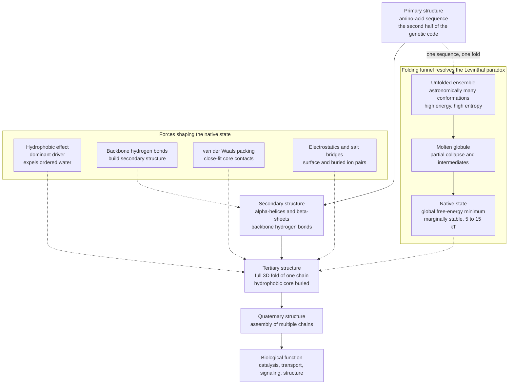

# 🧬 Protein Structure and Folding

> [!abstract] TL;DR
> A protein is a **one-dimensional string of amino acids** that reliably folds into **one precise three-dimensional shape** — and that shape is its function. The physics puzzle is stark: a chain has astronomically many possible conformations (**Levinthal's paradox**), so folding cannot be a blind random search, yet it completes in **microseconds to milliseconds**. The resolution is the **folding funnel** — a free-energy landscape biased toward the native state, so the chain rolls *downhill* along many parallel paths like a marble spiraling into a drain. The dominant driving force is the **hydrophobic effect** (burying greasy residues, expelling ordered water), fine-tuned by backbone **hydrogen bonds**, **van der Waals** packing, and **electrostatics**. The native state is only **marginally stable** (~5–15 kT). When folding fails, chains **aggregate into amyloid** — the biophysics behind Alzheimer's, Parkinson's, and prion disease. And predicting the fold from sequence — "the second half of the genetic code" — was cracked by **AlphaFold**, transforming biology and drug discovery.

---

## Intuition

**Analogy:** Imagine a long, floppy string of beads. You drop it into water and — reliably, every single time, in a few millionths of a second — it snaps into one exact, intricate 3D knot. If that string tried every possible shape one at a time before settling, it would take **longer than the age of the universe** to find the right one. That is Levinthal's paradox. The escape hatch: folding is not a blind search across a flat field of equal options. Instead the string rolls down a **funnel-shaped landscape**, gently guided from all directions toward its single functional form — like a marble spiraling down a drain rather than randomly hopping across a golf course hoping to fall in one hole.

Technically, that "funnel" is the protein's **free-energy landscape**. Height is energy, and the funnel's *width* at any level is the number of shapes available (conformational entropy). The chain starts wide and high (many disordered shapes), and every step that buries a greasy residue or forms a good hydrogen bond drops it lower and narrows its options, until countless downhill trajectories converge on the same **native state** at the bottom.

---

## How It Works

### Core Mechanics

1. **Four levels of structure.** The **primary** structure is the linear amino-acid sequence — the only information written into the chain. Local backbone hydrogen bonding folds stretches into **secondary** structure (**α-helices** and **β-sheets**). The whole chain packs into a compact **tertiary** fold, and several folded chains may assemble into a **quaternary** complex (hemoglobin's α₂β₂). **Structure determines function**: the fold builds the active site, the binding pocket, the channel.

2. **The folding problem.** How does a 1D sequence reliably reach its *unique* 3D native structure? **Anfinsen's dogma** (1961–73) established that for many small proteins the sequence alone encodes the fold — denatured ribonuclease refolds spontaneously to full activity. This is often called *"the second half of the genetic code"*: the genetic code maps DNA to sequence; folding maps sequence to shape.

3. **Levinthal's paradox.** A 100-residue chain with even 3 backbone states per residue has ~3¹⁰⁰ ≈ 5×10⁴⁷ conformations. Sampling each in ~10⁻¹³ s would take ~10³⁴ s — vastly longer than the universe's ~4×10¹⁷ s. Yet folding happens in µs–ms. **Conclusion: folding cannot be a random search.**

4. **The energy landscape / folding funnel.** The resolution (Bryngelson, Wolynes, Onuchic) is that the free-energy landscape is **funnel-shaped**, globally biased toward the native state. Many *different* downhill paths all drain to the same global minimum. **Minimal frustration** — the idea that evolution selected sequences whose interactions cooperate rather than conflict — makes the funnel smooth. Random polymers have rugged, glassy landscapes and do *not* fold; foldable proteins are a special, evolved subset.

5. **The forces.** The **hydrophobic effect** is the dominant driver: burying nonpolar residues in a core releases ordered water shells into bulk solvent, a large favorable *solvent-entropy* gain (see the sibling *Intermolecular_Forces_and_the_Aqueous_Environment*). Backbone **hydrogen bonds** build secondary structure; **van der Waals** contacts pack the core tightly; **electrostatics and salt bridges** add specificity. The native state is a **marginally stable** free-energy minimum, only ~5–15 kT below the unfolded ensemble — stable enough to work, loose enough to flex, be regulated, and be recycled.

6. **Two-state folding and cooperativity.** Many small single-domain proteins fold **all-or-none**: essentially only fully folded or fully unfolded is populated, with negligible intermediates. Thermodynamics is captured by **ΔG_fold** and a **melting temperature Tₘ**, measured by heating or adding denaturant (urea, GuHCl) and watching a sharp, cooperative sigmoidal transition — the statistical-mechanics view developed in the sibling *Statistical_Mechanics_of_Biomolecules*.

7. **Kinetics, intermediates, and chaperones.** Larger proteins pass through **molten globules** (collapsed but fluid) and folding intermediates, crossing a **transition-state ensemble**. In the crowded cell, **molecular chaperones** (Hsp70 shields exposed hydrophobic patches; the **GroEL/GroES** cage gives isolated ATP-driven folding attempts) raise *yield and rate* without changing the native destination.

8. **Misfolding and disease.** When a competing minimum wins, chains stack into **cross-β amyloid fibrils**: Alzheimer's (Aβ, tau), Parkinson's (α-synuclein), Huntington's (polyglutamine), type-2 diabetes (IAPP). **Prions** template their own misfold onto normal copies, making misfolding *infectious*.

9. **Structure prediction and the modern nuance.** From Anfinsen's principle to **AlphaFold2** (DeepMind, 2020) — deep learning that predicts structure from sequence with near-experimental accuracy — the folding-prediction problem was largely solved (single-molecule and MD companions: *Single_Molecule_Biophysics*, *Computational_Biophysics_and_Molecular_Dynamics*, *X_Ray_Crystallography_and_Structural_Biology*). The modern caveat: **intrinsically disordered proteins** have no single fold, using *disorder* for signaling and liquid–liquid phase separation.

### Flow / Architecture



---

## Key Concepts

### Secondary / Foundational Level
- **Primary → function.** The order of amino acids is the only chosen information; everything else follows from chemistry and water. Change one critical residue and the "tool" can jam (sickle-cell: Glu6Val in β-globin).
- **The four levels.** Primary (sequence) → secondary (α-helix, β-sheet) → tertiary (one folded chain) → quaternary (multiple chains). Denaturation (heat, pH) shakes the fold loose and destroys function — a frying egg's whitening albumin.
- **Greasy inside, wet outside.** Hydrophobic residues huddle in the core away from water; polar/charged residues face out. That single tendency does most of the folding.

### Undergraduate Level
- **Levinthal's paradox, quantified.** ~3ᴺ conformations; a random search would outlast the universe, so folding must be *directed*.
- **The funnel.** Free-energy landscape biased toward native; funnel *depth* = energy, funnel *width* = conformational entropy. Many downhill routes, one destination.
- **Marginal stability.** ΔG_fold ≈ −5 to −15 kT, only a few hydrogen bonds' worth — a feature that lets proteins flex and be regulated.
- **Two-state melts.** Sigmoidal, cooperative unfolding curves vs temperature or denaturant define Tₘ and ΔG; steepness reports cooperativity.
- **Anfinsen's dogma.** Sequence encodes the native fold as the thermodynamic minimum.

### Graduate Level
- **Minimal frustration & funneled landscapes.** Native contacts are energetically consistent; the energy gap between native and misfolded states (relative to landscape ruggedness) sets foldability (the folding *transition temperature* T_f vs the glass temperature T_g, with T_f/T_g > 1 for good folders).
- **Transition-state ensembles & Φ-value analysis.** Mutations probe which contacts are formed at the rate-limiting barrier.
- **Chaperone-assisted folding & proteostasis.** GroEL/GroES cage, Hsp70/Hsp40 cycles; the proteostasis network and its collapse in aging.
- **Amyloid nucleation kinetics.** Nucleation-dependent polymerization, cross-β spine, seeding, and prion-like templating.
- **Learned structure prediction.** AlphaFold2's attention over multiple-sequence-alignment coevolution and residue-pair geometry; predicts a *static* native fold, not pathways or dynamics.
- **Disorder as a functional state.** Intrinsically disordered regions and phase separation broaden "structure → function" beyond a single fold.

---

## Python Demo

```python
# Protein-folding physics in one script:
#  (a) Levinthal's paradox  — the conformational explosion vs chain length
#  (b) a 2D HP lattice protein — enumerate folds, find the buried-core native state
#  (c) a two-state melting curve from the Boltzmann ensemble
#  (d) a schematic folding funnel
import numpy as np
import matplotlib.pyplot as plt

# ---------------------------------------------------------------
# (a) LEVINTHAL'S PARADOX: conformations explode with chain length
# ---------------------------------------------------------------
N = np.arange(10, 205, 5)
states = 3.0 ** N                 # ~3 backbone rotamer states per residue
t_try = 1e-13                     # 100 fs to sample one conformation
t_all = states * t_try            # seconds to try them all, one by one
age_universe = 4.35e17            # seconds, ~13.8 billion years

i100 = int(np.where(N == 100)[0][0])
print("Levinthal for a 100-mer:")
print(f"  conformations ~ {states[i100]:.2e}")
print(f"  brute-force search ~ {t_all[i100]:.2e} s "
      f"= {t_all[i100] / age_universe:.2e} x the age of the universe")
print("  yet real 100-residue proteins fold in ~1e-3 s\n")

# ---------------------------------------------------------------
# (b) 2D HP LATTICE PROTEIN: enumerate self-avoiding folds
#     H = hydrophobic, P = polar. Energy = -1 per non-bonded H-H contact.
# ---------------------------------------------------------------
seq = "HPHPPHHPHPPH"
nres = len(seq)
MOVES = [(1, 0), (-1, 0), (0, 1), (0, -1)]

def enumerate_saws(n):
    """All self-avoiding walks of n residues; first bond fixed to break rotation."""
    walks = []
    def dfs(path, seen):
        if len(path) == n:
            walks.append(path.copy()); return
        x, y = path[-1]
        for dx, dy in MOVES:
            nxt = (x + dx, y + dy)
            if nxt not in seen:
                seen.add(nxt); path.append(nxt)
                dfs(path, seen)
                path.pop(); seen.remove(nxt)
    dfs([(0, 0), (1, 0)], {(0, 0), (1, 0)})
    return walks

def contact_energy(path, eps=-1.0):
    """Energy = eps * number of non-bonded H-H lattice contacts (the hydrophobic core)."""
    idx = {c: i for i, c in enumerate(path)}
    E = 0.0
    for i, (x, y) in enumerate(path):
        if seq[i] != 'H':
            continue
        for dx, dy in MOVES:
            j = idx.get((x + dx, y + dy))
            if j is not None and j > i + 1 and seq[j] == 'H':
                E += eps
    return E

walks = enumerate_saws(nres)
energies = np.array([contact_energy(w) for w in walks])
Emin = energies.min()
native = walks[int(np.argmin(energies))]
g0 = int(np.sum(energies == Emin))          # ground-state degeneracy
print(f"HP sequence {seq}: {len(walks)} folds enumerated")
print(f"  native energy = {Emin:.0f}  ({int(-Emin)} buried H-H contacts), "
      f"degeneracy = {g0}\n")

# ---------------------------------------------------------------
# (c) TWO-STATE MELTING CURVE from the Boltzmann ensemble
# ---------------------------------------------------------------
T = np.linspace(0.05, 2.5, 120)             # reduced temperature = kT / contact energy
frac_folded = np.array([
    np.sum(np.exp(-(energies[energies == Emin] - Emin) / t)) /
    np.sum(np.exp(-(energies - Emin) / t))
    for t in T
])
Tm = T[int(np.argmin(np.abs(frac_folded - 0.5)))]
print(f"Melting temperature Tm ~ {Tm:.2f} (reduced units)")

# ---------------------------------------------------------------
# PLOTS
# ---------------------------------------------------------------
fig, ax = plt.subplots(2, 2, figsize=(12, 9))

# (a) Levinthal explosion
axL = ax[0, 0]
axL.semilogy(N, states, color="#2563eb", lw=2, label="conformations ~ 3^N")
axL.axhline(age_universe / t_try, color="#dc2626", ls="--",
            label="searchable within\nthe age of the universe")
axL.set_xlabel("chain length N (residues)")
axL.set_ylabel("number of conformations (log scale)")
axL.set_title("(a) Levinthal's paradox: conformational explosion")
axL.legend(fontsize=8, loc="lower right")

# (b) native fold with buried hydrophobic core
axN = ax[0, 1]
xs = [p[0] for p in native]; ys = [p[1] for p in native]
axN.plot(xs, ys, "-", color="#555", lw=2, zorder=1)
idx = {c: i for i, c in enumerate(native)}
for i, (x, y) in enumerate(native):        # dashed lines = buried H-H contacts
    if seq[i] != "H":
        continue
    for dx, dy in MOVES:
        j = idx.get((x + dx, y + dy))
        if j is not None and j > i + 1 and seq[j] == "H":
            axN.plot([x, native[j][0]], [y, native[j][1]], ":",
                     color="#dc2626", lw=2, zorder=1)
for i, (x, y) in enumerate(native):
    c = "#dc2626" if seq[i] == "H" else "#2563eb"
    axN.scatter(x, y, s=360, color=c, edgecolor="k", zorder=2)
    axN.text(x, y, str(i), ha="center", va="center", color="w", fontsize=8, zorder=3)
axN.scatter([], [], s=120, color="#dc2626", edgecolor="k", label="H hydrophobic")
axN.scatter([], [], s=120, color="#2563eb", edgecolor="k", label="P polar")
axN.set_title(f"(b) Native HP fold: {int(-Emin)} H-H contacts buried")
axN.set_aspect("equal"); axN.axis("off"); axN.legend(loc="upper left", fontsize=8)

# (c) folding funnel schematic
axF = ax[1, 0]
Q = np.linspace(0, 1, 200)
Ecen = -9 * Q                                # energy drops toward the native state
width = (1 - Q) * 2.6 + 0.05                 # funnel narrows as entropy is lost
axF.fill_between(Q, Ecen - width, Ecen + width, color="#7c3aed", alpha=0.25)
axF.plot(Q, Ecen, color="#7c3aed", lw=2)
axF.scatter([1], [-9], s=160, color="#059669", zorder=3)
axF.annotate("native state\nglobal minimum", (1, -9), (0.5, -6.3),
             fontsize=8, arrowprops=dict(arrowstyle="->"))
axF.text(0.02, 1.4, "unfolded ensemble\nmany conformations", fontsize=8)
axF.set_xlabel("fraction of native contacts  Q")
axF.set_ylabel("free energy (arb. units)")
axF.set_title("(c) Folding funnel resolves the paradox")

# (d) two-state melting curve
axM = ax[1, 1]
axM.plot(T, frac_folded, color="#059669", lw=2)
axM.axvline(Tm, color="#dc2626", ls="--", label=f"Tm ~ {Tm:.2f}")
axM.axhline(0.5, color="gray", lw=0.6)
axM.set_xlabel("temperature  kT / contact energy")
axM.set_ylabel("fraction folded (native)")
axM.set_title("(d) Two-state melting curve")
axM.legend(fontsize=8)

plt.tight_layout()
plt.show()
```

The script (a) shows conformations exploding as 3ᴺ — beyond ~60 residues you could not brute-force search them within the universe's lifetime; (b) enumerates every self-avoiding fold of a 12-residue HP chain and plots the **native** one, whose dashed red lines mark the **buried hydrophobic core**; (c) sketches the funnel; and (d) derives a cooperative **two-state melting curve** straight from the Boltzmann ensemble, complete with a melting temperature Tₘ.

---

## Real-World Applications

> **AlphaFold and the structure-prediction revolution.** DeepMind's **AlphaFold2** (CASP14, 2020) predicts 3D structure from sequence at near-experimental accuracy using attention over coevolutionary signals — the deep-learning lineage of the [[Transformer_Architecture]]. The public database now holds **200M+ predicted structures**, compressing decades of crystallography into a query and reshaping drug discovery, enzyme design, and basic biology.

- **Amyloid disease.** Understanding aggregation biophysics (nucleation, cross-β fibrils, prion-like seeding) underpins therapeutics for Alzheimer's and Parkinson's — the proteostasis collapse catalogued in [[Hallmarks_of_Aging]].
- **Protein and enzyme design.** Rosetta and diffusion models (RFdiffusion) invert the folding map — *designing* sequences that fold to a target shape, for novel enzymes, binders, and biomaterials.
- **Pharma stability.** Antibody and biologic drugs must resist unfolding and aggregation on the shelf; melting-temperature (Tₘ) screening and formulation are direct applications of two-state folding thermodynamics.
- **Cryo-EM and crystallography pipelines.** Predicted models now bootstrap experimental structure determination, phasing, and model building.

---

## Common Pitfalls

- **Reading Levinthal as literal search time.** The paradox is a *reductio*: it proves folding is not random search, not a claim about a real mechanism. The funnel is the mechanism.
- **Crediting hydrogen bonds as the main folding force.** In water, backbone H-bonds are largely a wash (internal bonds trade for solvent bonds). The **hydrophobic effect** — driven by *solvent* entropy — dominates; H-bonds add specificity and secondary structure.
- **Confusing the four levels.** An α-helix is *secondary* structure even inside a giant tertiary fold. Tertiary is one whole chain; quaternary needs *multiple* chains.
- **Assuming denaturation is irreversible.** Anfinsen showed small proteins refold spontaneously. Irreversibility (a boiled egg) usually reflects *aggregation*, not a broken sequence–structure link.
- **Thinking all proteins have a single fold.** Intrinsically disordered proteins are natively unfolded and functional — a major modern correction to the classic dogma.
- **Treating AlphaFold as ground truth for everything.** It predicts one static native fold with a confidence score (pLDDT); it does not reliably give folding pathways, dynamics, mutation-driven stability shifts, or disordered-region conformations.
- **Ignoring marginal stability.** Native proteins sit only ~5–15 kT below unfolded; small perturbations (a point mutation, a few degrees) can tip the balance — the basis of many diseases.

---

## Related Concepts

- [[Proteins_and_Amino_Acids]] — Biology foundation: the 20 amino acids and the four structural levels this note builds on
- [[Protein_Structure_and_Function]] — Chemistry companion: peptide-bond geometry, the Ramachandran plot, and secondary-structure H-bonding in atomic detail
- [[Water_and_Lifes_Chemistry]] — why water's structure makes the hydrophobic effect the dominant folding force
- [[Chemical_Thermodynamics]] — the ΔG = ΔH − TΔS balance and solvent entropy behind marginal stability and two-state melts
- [[Enzymes_and_Catalysis]] — how the folded tertiary structure assembles a catalytic active site: structure determines function
- [[Nucleic_Acids]] — where the primary sequence originates: DNA to mRNA to ribosomal translation
- [[Hallmarks_of_Aging]] — loss of proteostasis, misfolding, and amyloid aggregation as drivers of neurodegeneration and aging
- [[Transformer_Architecture]] — the attention mechanism that powers AlphaFold's sequence-to-structure prediction

---

## Review Questions

1. **Secondary / Foundational:** Name the four levels of protein structure and give one real protein illustrating each. In plain terms, why does a floppy chain of amino acids fold into one specific shape when dropped in water, and what does "structure determines function" mean?
2. **Undergraduate:** State Levinthal's paradox quantitatively and explain why it proves folding is not a random search. Then describe how the folding-funnel picture resolves the paradox *without contradicting* Anfinsen's dogma. Which single force dominates folding, and why is it entropic?
3. **Graduate:** A designed sequence folds slowly and aggregates. Using the concepts of minimal frustration, the T_f/T_g ratio, marginal stability, and amyloid nucleation kinetics, propose what might be wrong with its energy landscape and how you would test and re-engineer it. How would AlphaFold help — and where would it fall short?

---

## Sources

- Anfinsen, C. B. (1973) — "Principles that Govern the Folding of Protein Chains," *Science* 181, 223.
- Bryngelson, Onuchic, Socci & Wolynes (1995) — "Funnels, Pathways, and the Energy Landscape of Protein Folding," *Proteins* 21, 167.
- Dill, K. A. & MacCallum, J. L. (2012) — "The Protein-Folding Problem, 50 Years On," *Science* 338, 1042.
- Dobson, C. M. (2003) — "Protein folding and misfolding," *Nature* 426, 884.
- Jumper et al. (2021) — "Highly accurate protein structure prediction with AlphaFold," *Nature* 596, 583.

---

#biophysics #protein-folding #folding-funnel #levinthal-paradox #alphafold
