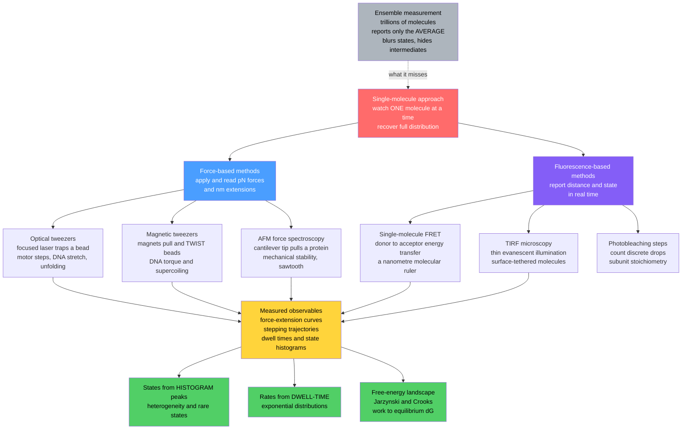

# 🔬 Single-Molecule Biophysics

> [!abstract] TL;DR
> **Single-molecule biophysics** measures and manipulates **one biomolecule at a time** instead of averaging over the trillions in a test tube — and that change of viewpoint is a revolution. Ensemble experiments report only the *mean* of a population, which blurs distinct states together, hides transient intermediates, masks static and dynamic heterogeneity, and cannot capture the stochastic, asynchronous nature of molecular events. Single-molecule tools do the opposite: **force methods** (optical tweezers, magnetic tweezers, and AFM) apply and read piconewton forces and nanometre extensions, while **fluorescence methods** (single-molecule FRET as a molecular ruler, plus TIRF microscopy and photobleaching step-counting) watch conformational changes in real time. Together they reveal *distributions* rather than averages, *rare states and intermediates*, and the *real-time molecular movie* of motors stepping, DNA stretching, and proteins folding — and they connect directly to free-energy landscapes through the Jarzynski and Crooks fluctuation theorems.

---

## Intuition

**Analogy:** Traditional biochemistry pours a test tube holding *trillions* of molecules into an instrument and reports one number — the **average**. That is like judging a symphony by the crowd's average noise level: you hear a bland hum and miss every solo, every fit and start, every quiet passage. Single-molecule biophysics instead **listens to one musician at a time**. It grabs an individual protein or DNA strand with a laser "tweezers", or lights it up with a single fluorescent tag, and watches that one molecule fold, step, twist, and bind in real time. Suddenly the rare states appear, the stops and starts become visible, and the hidden choreography that averaging erased is laid bare.

The technical payoff of listening to one molecule is that you recover the whole **distribution**, not just its mean. A population that ensemble methods report as "half folded" could be every molecule sitting at 50 percent occupancy, or two sharply separated groups — one fully folded, one fully unfolded — flickering back and forth. The average is identical; the biology is completely different. Only the single-molecule view can tell them apart.

---

## How It Works

### Core Mechanics

The single-molecule toolkit splits into two families — **force-based** methods that mechanically grab a molecule, and **fluorescence-based** methods that optically report on it.

1. **Optical tweezers.** A tightly focused laser beam creates an intensity gradient that traps a micron-sized dielectric bead near the focus, acting like an optical spring. Tether a molecule (DNA, a motor, an unfolding protein) between the bead and a surface or a second bead, and the bead's displacement reports **force** (typically 0.1 to 100 pN) while its position reports **extension** (sub-nanometre resolution). This is how kinesin's 8 nm steps, DNA stretching, and single-protein unfolding were first watched directly.

2. **Magnetic tweezers.** Permanent or electromagnets pull on a super-paramagnetic bead attached to a molecule. Their unique power is **torque**: rotating the magnets twists the bead, so magnetic tweezers are the ideal tool for DNA supercoiling, topoisomerase action, and any process that changes molecular twist. They naturally operate at constant force (a force clamp).

3. **Atomic force microscopy (AFM).** A sharp tip on a flexible cantilever touches the sample; cantilever deflection measures force. Beyond imaging surfaces at molecular resolution, AFM performs **force spectroscopy** — hook a protein between tip and surface, retract, and record a force-extension curve whose sawtooth peaks report the mechanical stability of each folded domain as it rips open.

4. **Single-molecule FRET (smFRET).** Attach two dyes — a donor and an acceptor — to a molecule. When they are within roughly 2 to 8 nm, the excited donor transfers energy to the acceptor non-radiatively, and the efficiency of that transfer falls off as the sixth power of distance. Reading the ratio of acceptor to donor emission turns the dye pair into a **nanometre molecular ruler** that reports conformational distance in real time, one molecule at a time.

5. **TIRF and detection tricks.** Total internal reflection fluorescence (TIRF) microscopy illuminates only a ~100 nm slab at the coverslip, suppressing background so surface-tethered single molecules stand out. **Photobleaching step-counting** counts how many discrete drops occur as fluorophores bleach one by one, revealing subunit stoichiometry, while single-particle tracking follows individual molecules diffusing.

6. **What you actually measure.** Force-extension curves (polymer elasticity, unfolding forces), stepping trajectories of motors, folding and unfolding transitions, and binding/unbinding events. From the raw traces you extract two things ensemble methods cannot give cleanly: **states**, from peaks in the signal histogram, and **rates**, from the exponential **dwell-time distributions** of how long the molecule waits before each transition.

7. **The link to statistical mechanics.** Because a single-molecule pulling experiment does measurable **work** on a molecule, it directly probes the underlying **free-energy landscape**. The **Jarzynski equality** and the **Crooks fluctuation theorem** are the beautiful result that lets you recover *equilibrium* free-energy differences from repeated *non-equilibrium* pulls — turning irreversible work histograms into thermodynamics. This is the experimental face of the free-energy machinery in the companion note *Statistical_Mechanics_of_Biomolecules*.

These mechanisms tie directly into the not-yet-written siblings *Molecular_Motors_and_Mechanochemistry* (the stepping motors these tools watch), *Protein_Structure_and_Folding* (the folding transitions AFM and smFRET resolve), *The_Physics_of_DNA_and_RNA* (the polymer elasticity that tweezers stretch and twist), *Fluorescence_Microscopy_and_Super_Resolution* (the imaging physics that grew out of single-molecule localization), and *Statistical_Mechanics_of_Biomolecules* (the landscapes these forces map).

### Flow / Architecture



---

## Key Concepts

### Secondary Level

- **The average can lie.** If half a population is fully "on" and half is fully "off", the average reads "half on" — the same number you would get if every molecule were sitting at exactly half. The mean cannot tell these apart; watching one molecule at a time can.
- **Grab it or light it up.** Two big ideas: physically *grab* a molecule with a laser or magnet and pull (force methods), or attach a tiny *light* and watch it blink and change (fluorescence methods).
- **Rare events matter.** Biology often hinges on brief, uncommon states — a fleeting open channel, a short-lived folding intermediate. Averages drown these out; single-molecule tools catch them in the act.

### Undergraduate Level

- **Piconewtons and nanometres are the natural units.** Molecular forces are a few pN and molecular motions are nanometres — exactly the scale optical tweezers (roughly 0.1 to 100 pN, sub-nm) and AFM resolve. The thermal energy $k_B T \approx 4.1$ pN·nm sets the noise floor everything must beat.
- **FRET is a ruler.** Transfer efficiency $E = 1 / \left(1 + (r/R_0)^6\right)$, where $R_0$ (the Förster radius, ~5 nm for common dye pairs) is the distance of 50 percent transfer. The steep sixth-power dependence makes FRET exquisitely sensitive to distance changes over the 2 to 8 nm window — perfect for conformational changes.
- **Two-state kinetics and dwell times.** A molecule hopping between two states (folded/unfolded, bound/free) is a two-state Markov process. The time spent in each state before hopping is **exponentially distributed**, and the rate constant is simply the inverse of the mean dwell time: $k = 1/\langle \tau \rangle$. This is how single-molecule traces yield kinetics.
- **Histograms give states; dwell times give rates.** Peaks in the signal histogram count the states and their populations; the distribution of waiting times between transitions gives the rate constants. Two observables, two different pieces of the mechanism.
- **Force-extension curves.** Stretching DNA yields the entropic-elasticity signature of a polymer (the worm-like chain), while pulling a multidomain protein gives a sawtooth as domains unfold one by one — each tooth a mechanical fingerprint.

### Graduate Level

- **Static vs dynamic heterogeneity.** Molecules may differ permanently (static disorder — distinct subpopulations) or each may interconvert over time (dynamic disorder). Ensemble methods conflate both into one broadened peak; only single-molecule time traces, and their autocorrelations, distinguish them.
- **Jarzynski and Crooks.** The Jarzynski equality $\langle e^{-W/k_B T} \rangle = e^{-\Delta G / k_B T}$ recovers an equilibrium free-energy difference from an exponential average over *non-equilibrium* work $W$ done during finite-speed pulls. The Crooks fluctuation theorem relates the forward and reverse work distributions, $P_F(W)/P_R(-W) = e^{(W - \Delta G)/k_B T}$, and their crossing point directly reads off $\Delta G$. Single-molecule pulling of RNA hairpins was the landmark experimental test.
- **Instrumental and photophysical limits.** Optical trap stiffness sets force resolution; corner-frequency calibration from the bead's Brownian power spectrum sets the force scale. In fluorescence, shot noise, dye photobleaching, and blinking cap trajectory length and time resolution — the eternal trade-off between watching brightly and watching long.
- **Force-dependent kinetics (Bell model).** Applied force tilts the energy landscape, so unfolding/unbinding rates rise exponentially with force, $k(F) = k_0 \, e^{F \Delta x^{\ddagger} / k_B T}$, where $\Delta x^{\ddagger}$ is the distance to the transition state. Dynamic force spectroscopy scans loading rate to map the barrier.
- **Modern extensions.** Single-molecule *localization* is the physical basis of **super-resolution microscopy** (PALM/STORM) that beats the diffraction limit; **zero-mode waveguides** confine excitation to a zeptolitre volume enabling real-time single-molecule DNA sequencing; and single-molecule methods now reach into living cells to track individual proteins in their native context.

---

## Python Demo

```python
# Single-molecule biophysics: analyzing a two-state trajectory.
# A molecule HOPS between two states (e.g. folded / unfolded) as a two-state
# Markov ("telegraph") process, observed through a noisy single-molecule signal
# (think smFRET efficiency or force). We recover from ONE trace:
#   (a) the noisy time trace  -> the "molecular movie"
#   (b) the signal histogram  -> TWO peaks the ensemble average would blur into one
#   (c) dwell-time histograms -> exponential -> transition RATES and rare states
# Requires: numpy, matplotlib
import numpy as np
import matplotlib.pyplot as plt

rng = np.random.default_rng(7)

# --- True (hidden) two-state kinetics ---------------------------------
# State 0 = "folded" (low signal),  State 1 = "unfolded" (high signal)
k01 = 2.0     # folded   -> unfolded  rate (per second)  (fast, rarer state)
k10 = 0.8     # unfolded -> folded    rate (per second)
signal_true = np.array([0.25, 0.75])   # true signal level of each state (e.g. FRET)
noise_sigma = 0.09                      # measurement noise (shot noise etc.)

dt = 0.005            # sampling interval (s)
T_total = 400.0       # total observation time (s)
n = int(T_total / dt)
t = np.arange(n) * dt

# --- Simulate the hidden Markov state trajectory (Gillespie-style hops) ---
state = np.empty(n, dtype=int)
s = 0                                     # start folded
for i in range(n):
    state[i] = s
    # per-step hop probability = rate * dt  (dt chosen << 1/rate)
    k_out = k01 if s == 0 else k10
    if rng.random() < k_out * dt:
        s = 1 - s                         # flip to the other state

# --- Observed noisy single-molecule signal ----------------------------
obs = signal_true[state] + rng.normal(0, noise_sigma, size=n)

# =====================================================================
# (b) SIGNAL HISTOGRAM: two peaks = two states.  Ensemble average = one blur.
# =====================================================================
ensemble_mean = obs.mean()                # what a bulk experiment would report

# =====================================================================
# (c) DWELL TIMES: how long the molecule waits in each state before hopping.
# =====================================================================
# Find transitions in the true state sequence, measure run lengths per state.
change_idx = np.flatnonzero(np.diff(state)) + 1
seg_bounds = np.concatenate(([0], change_idx, [n]))
dwell = {0: [], 1: []}
for a, b in zip(seg_bounds[:-1], seg_bounds[1:]):
    dwell[state[a]].append((b - a) * dt)
dwell = {k: np.array(v) for k, v in dwell.items()}

# Fit each dwell-time distribution to an exponential: rate = 1 / mean(dwell)
k01_fit = 1.0 / dwell[0].mean()           # leaving folded   -> unfolded
k10_fit = 1.0 / dwell[1].mean()           # leaving unfolded -> folded

# =====================================================================
# PLOTS
# =====================================================================
fig, ax = plt.subplots(2, 2, figsize=(13, 8))

# (a) noisy single-molecule time trace with the hidden state overlaid
tw = slice(0, int(40 / dt))               # show first 40 s for clarity
ax[0, 0].plot(t[tw], obs[tw], color="#4a9eff", lw=0.6, alpha=0.8, label="noisy signal")
ax[0, 0].step(t[tw], signal_true[state][tw], color="crimson", lw=1.6,
              where="post", label="hidden state")
ax[0, 0].set_xlabel("time (s)")
ax[0, 0].set_ylabel("single-molecule signal")
ax[0, 0].set_title("(a) One molecule hopping: folded <-> unfolded")
ax[0, 0].legend(loc="upper right", fontsize=8)

# (b) signal histogram: TWO peaks; ensemble average sits in the empty valley
ax[0, 1].hist(obs, bins=80, color="#845ef7", alpha=0.85, orientation="vertical")
for lvl, name in zip(signal_true, ["folded", "unfolded"]):
    ax[0, 1].axvline(lvl, ls="--", color="k", lw=1)
    ax[0, 1].text(lvl, ax[0, 1].get_ylim()[1]*0.9, name, ha="center", fontsize=8)
ax[0, 1].axvline(ensemble_mean, ls="-", color="red", lw=2,
                 label=f"ensemble average = {ensemble_mean:.2f}\n(blurs both states!)")
ax[0, 1].set_xlabel("signal value")
ax[0, 1].set_ylabel("counts")
ax[0, 1].set_title("(b) Histogram reveals TWO states")
ax[0, 1].legend(fontsize=8)

# (c) dwell-time distribution of the FOLDED state -> exponential -> rate k01
tau = np.linspace(0, dwell[0].max(), 200)
ax[1, 0].hist(dwell[0], bins=30, density=True, color="#51cf66", alpha=0.8,
              label="observed dwell times")
ax[1, 0].plot(tau, k01_fit * np.exp(-k01_fit * tau), "k-", lw=2,
              label=f"exp fit: k = {k01_fit:.2f}/s  (true {k01:.2f})")
ax[1, 0].set_xlabel("dwell time in folded state (s)")
ax[1, 0].set_ylabel("probability density")
ax[1, 0].set_title("(c) Dwell times -> folding->unfolding RATE")
ax[1, 0].legend(fontsize=8)

# (c) dwell-time distribution of the UNFOLDED state -> exponential -> rate k10
tau2 = np.linspace(0, dwell[1].max(), 200)
ax[1, 1].hist(dwell[1], bins=30, density=True, color="#ffa94d", alpha=0.8,
              label="observed dwell times")
ax[1, 1].plot(tau2, k10_fit * np.exp(-k10_fit * tau2), "k-", lw=2,
              label=f"exp fit: k = {k10_fit:.2f}/s  (true {k10:.2f})")
ax[1, 1].set_xlabel("dwell time in unfolded state (s)")
ax[1, 1].set_ylabel("probability density")
ax[1, 1].set_title("(c) Dwell times -> unfolding->folding RATE")
ax[1, 1].legend(fontsize=8)

plt.tight_layout()
plt.savefig("single_molecule_two_state.png", dpi=130)

# --- Console summary ---
print("=== Single-molecule two-state analysis ===")
print(f"Ensemble average signal      = {ensemble_mean:.3f}  (a value NO single molecule holds!)")
print(f"State populations (folded)   = {(state==0).mean()*100:.1f}%")
print(f"Recovered k(folded->unfold)  = {k01_fit:.2f}/s   (true {k01:.2f}/s)")
print(f"Recovered k(unfold->folded)  = {k10_fit:.2f}/s   (true {k10:.2f}/s)")
print(f"Equilibrium constant K = k01/k10 = {k01_fit/k10_fit:.2f}")
```

Running this prints an ensemble average (~0.4) that **no single molecule ever occupies** — it lives in the empty valley between the two histogram peaks. The four panels show the noisy hopping trace with its hidden state, the two-peak histogram that exposes the states a bulk measurement would smear into one, and the two exponential dwell-time distributions whose slopes recover the true transition rates $k_{01}$ and $k_{10}$. This is the essence of the method: **histograms give states, dwell times give rates**, and both are invisible to the average.

---

## Real-World Applications

> **Example — Watching kinesin walk (optical tweezers).** In the pioneering experiments of Block, Svoboda, and colleagues, a single kinesin motor was attached to a micron bead held in an optical trap. As the motor hauled its cargo along a microtubule, the trap recorded the bead's position at nanometre resolution and revealed **discrete 8 nm steps** — exactly the spacing of tubulin subunits — punctuated by pauses. The stochastic, hand-over-hand stepping and the motor's force-velocity relationship (stalling near 5 to 7 pN) were seen *directly*, not inferred from bulk ATPase assays. This is the founding demonstration that molecular machines are literal machines, and it underlies the mechanistic picture in *Molecular_Motors_and_Mechanochemistry*.

Other production-scale uses:

- **DNA mechanics and enzymes on DNA.** Magnetic and optical tweezers stretch and twist single DNA molecules to measure persistence length, the overstretching transition near 65 pN, and to watch RNA polymerase transcribe and topoisomerases relax supercoils base pair by base pair.
- **Protein and RNA folding.** smFRET and AFM force spectroscopy resolve folding intermediates and misfolded states hidden in bulk, mapping folding pathways one molecule at a time — central to *Protein_Structure_and_Folding*.
- **Ribosome dynamics.** smFRET on translating ribosomes exposed the ratcheting and tRNA transit steps of protein synthesis in real time.
- **Single-molecule sequencing.** Pacific Biosciences' **zero-mode waveguides** watch a single polymerase incorporate fluorescently labelled nucleotides in real time; this is single-molecule biophysics turned into a commercial DNA-sequencing platform (see *PCR_and_DNA_Sequencing*).
- **Super-resolution imaging.** PALM and STORM localize individual blinking fluorophores to ~10 nm, beating the diffraction limit — the direct descendant of single-molecule localization, detailed in *Fluorescence_Microscopy_and_Super_Resolution*.
- **Testing thermodynamics.** Reversible and irreversible pulling of RNA hairpins with optical tweezers provided the landmark experimental verification of the Crooks and Jarzynski fluctuation theorems.

---

## Common Pitfalls

- **Mistaking the average for a molecule.** The whole point is that the ensemble mean can be a value *no individual ever occupies* (the demo's ~0.4). Never assume the population's average reflects a single molecule's typical state — check the distribution first.
- **Confusing static and dynamic heterogeneity.** A broad histogram can mean either a mix of permanently different molecules or one molecule interconverting. You must inspect *time* traces and autocorrelations to tell them apart; a static histogram alone cannot.
- **Undersampling rare states and short dwells.** If the camera frame rate or trap bandwidth is slower than the fastest transitions, brief intermediates are missed and rates are underestimated. Always confirm your time resolution beats the kinetics you claim to measure.
- **Fluorophore artifacts.** Dye photobleaching truncates trajectories and blinking can masquerade as real conformational hops. Anti-fade buffers, controls, and cross-checks with force methods are essential before trusting an smFRET "transition".
- **Surface and tether artifacts.** Tethering a molecule to a bead or coverslip can perturb its behavior; non-specific sticking, off-axis geometry, and multiple attachments distort force-extension curves. Proper passivation and single-tether selection are mandatory.
- **Over-reading Jarzynski from few pulls.** The exponential average $\langle e^{-W/k_B T}\rangle$ is dominated by rare low-work trajectories, so too few or too-fast pulls bias the recovered $\Delta G$. Adequate sampling and near-reversible protocols matter.

---

## Related Concepts

- [[Statistical_Mechanics_of_Biomolecules]] — the free-energy landscapes and Boltzmann ensembles that single-molecule force experiments probe directly via fluctuation theorems.
- [[Energy_Entropy_and_Free_Energy_in_Biology]] — the $\Delta G$ that Jarzynski and Crooks recover from non-equilibrium single-molecule pulling.
- [[Biophysics_Overview]] — the parent survey placing single-molecule methods among the instruments that gave molecular biology its eyes.
- [[The_Cytoskeleton_and_Cell_Motility]] — the microtubules and motors (kinesin, myosin) whose stepping optical tweezers first resolved.
- [[Bioenergetics_and_ATP]] — the ~20 $k_B T$ per ATP that powers the motor steps seen one at a time.
- [[Proteins_and_Amino_Acids]] — the folded/unfolded transitions that AFM force spectroscopy and smFRET dissect.
- [[Protein_Structure_and_Function]] — conformational changes reported by the smFRET molecular ruler.
- [[DNA_Structure_and_Replication]] — the double helix that magnetic and optical tweezers stretch and twist.
- [[Transcription]] — RNA polymerase transcribing, watched base by base in single-molecule assays.
- [[Translation_and_the_Genetic_Code]] — ribosome ratcheting resolved by single-molecule FRET.
- [[PCR_and_DNA_Sequencing]] — single-molecule (zero-mode-waveguide) real-time sequencing built on these methods.
- [[Markov_Chains]] — the two-state telegraph process that models single-molecule hopping and dwell times.
- [[Probability_Theory]] — the exponential waiting-time statistics from which transition rates are extracted.
- [[Chemical_Kinetics]] — the rate constants $k = 1/\langle\tau\rangle$ that dwell-time distributions yield.
- [[Molecular_Spectroscopy_and_Symmetry]] — the fluorescence and FRET photophysics underlying single-molecule optical methods.
- [[Laser_Physics]] — the focused-beam optics and gradient forces that make an optical trap.
- [[Geometric_and_Wave_Optics]] — the total-internal-reflection and diffraction physics behind TIRF and super-resolution.
- [[Classical_Statistical_Mechanics]] — the canonical-ensemble backbone connecting work, free energy, and fluctuation theorems.

---

## Review Questions

**Secondary**
1. A bulk experiment reports that a protein sample is "40 percent folded". Explain, using the symphony analogy, two completely different molecular situations that could give this same number, and why only a single-molecule measurement can tell them apart.

**Undergraduate**
2. You record a noisy single-molecule signal and see a histogram with two clear peaks and a distribution of waiting times between hops. Which observable gives you the *states* and their populations, which gives you the *rate constants*, and how would you compute a rate from the dwell times? What shape should the dwell-time distribution have for a simple two-state process, and why?

**Graduate**
3. You want to measure the folding free energy $\Delta G$ of a small RNA hairpin, but pulling it fast enough to gather data drives the system out of equilibrium. Explain how the Jarzynski equality or Crooks fluctuation theorem lets you still recover the *equilibrium* $\Delta G$ from irreversible work, what practical sampling problem makes the Jarzynski exponential average tricky, and how the Crooks forward/reverse crossing point sidesteps part of it.

---

## Sources

- Neuman, K. C., & Nagy, A. (2008). "Single-molecule force spectroscopy: optical tweezers, magnetic tweezers and atomic force microscopy." *Nature Methods*, 5(6), 491–505.
- Roy, R., Hohng, S., & Ha, T. (2008). "A practical guide to single-molecule FRET." *Nature Methods*, 5(6), 507–516.
- Svoboda, K., Schmidt, C. F., Schnapp, B. J., & Block, S. M. (1993). "Direct observation of kinesin stepping by optical trapping interferometry." *Nature*, 365, 721–727.
- Collin, D., Ritort, F., Jarzynski, C., Smith, S. B., Tinoco, I., & Bustamante, C. (2005). "Verification of the Crooks fluctuation theorem and recovery of RNA folding free energies." *Nature*, 437, 231–234.
- Bustamante, C., Cheng, W., & Mejia, Y. X. (2011). "Revisiting the central dogma one molecule at a time." *Cell*, 144(4), 480–497.

---

#biophysics #single-molecule #optical-tweezers #smFRET #force-spectroscopy
