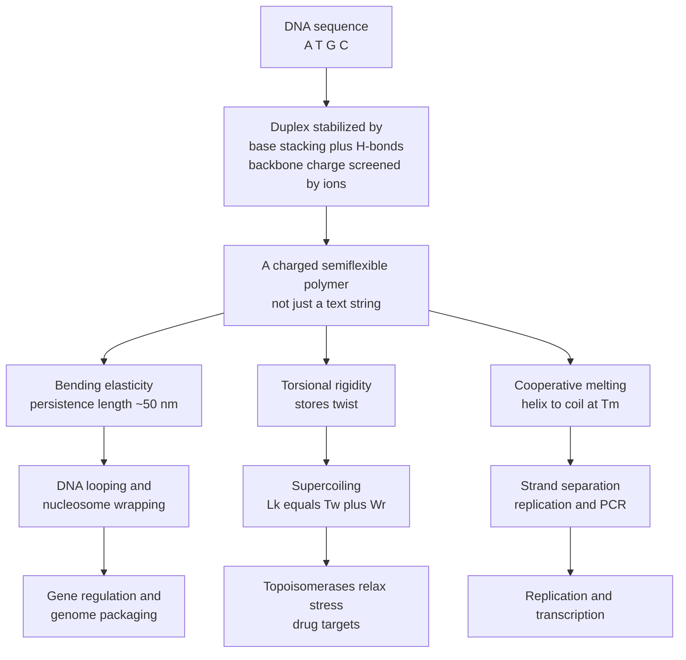

# 🧬 The Physics of DNA and RNA

> [!abstract] TL;DR
> DNA is not merely a text file of A's, T's, G's and C's — it is a real, charged, **semiflexible polymer** roughly two meters long that the cell must physically unzip, bend, loop, twist, supercoil, and package to replicate, transcribe, repair, and store it. Its double helix is held together far more by **base stacking** (π-stacking of aromatic bases) than by the hydrogen bonds most textbooks emphasize; it melts through a **cooperative** helix-to-coil transition with a melting temperature $T_m$ that rises with GC content and salt; it resists bending and stretching with a **persistence length** of about 50 nm (~150 bp) captured by the **worm-like chain** model; and its **torsional rigidity** turns the topological stress generated by every passing polymerase into **supercoils** that topoisomerases must relieve. RNA, being single-stranded, folds back on itself into hairpins, pseudoknots, and protein-like tertiary structures. This nucleic-acid biophysics is the mechanical foundation beneath replication, gene regulation by DNA looping, chromatin packaging, PCR, sequencing, and DNA nanotechnology.

---

## Intuition

**Analogy:** DNA is not just a text file of letters — it is a physical object, a two-meter-long molecular ribbon crammed into a nucleus a thousand times smaller than a grain of sand. Picture stuffing 40 km of ultra-thin fishing line into a tennis ball, then being required to find one specific centimeter of it, unzip that stretch cleanly down the middle, copy it, and repack everything without tangling — millions of times a day, in every cell. That ribbon bends, twists, coils, and springs back like a microscopic spring, and its two strands are glued shut by forces that must be pried apart on demand.

To read and copy the genome, then, the cell is not "reading a string." It is **wrestling with a real mechanical object** governed by elasticity, torsion, and thermodynamics. Every polymerase is a machine pushing against a stiff, charged, twist-storing rope. Once you see DNA this way, phenomena that look like abstract "regulation" — looping, packaging, supercoiling — become straightforward mechanics.

---

## How It Works

### The double helix is held shut by stacking, not just H-bonds

Two chemistries stabilize the duplex, and their relative importance is widely misjudged:

1. **Watson-Crick base pairing** — A pairs with T through **2 hydrogen bonds**; G pairs with C through **3 hydrogen bonds**. These bonds provide *specificity* (which base reads which) but, because they merely replace bonds the bases would otherwise make with water, contribute surprisingly little *net* stability.
2. **Base stacking** — the flat, aromatic bases stack face-to-face like a roll of coins, held by **π-stacking** and hydrophobic/van der Waals interactions in the helix interior, away from water. This is the **dominant stabilizing interaction**, and it is sequence-dependent (GC steps stack better than AT steps). This is why GC-rich DNA is more stable than AT-rich DNA for *two* reasons — an extra H-bond *and* stronger stacking.
3. **Backbone electrostatics** — the sugar-phosphate backbone carries one negative charge per nucleotide, so the two strands electrostatically repel. In water this repulsion is **screened by counterions** (Na⁺, Mg²⁺). Raising salt concentration screens the phosphates better, lets the strands sit closer, and *raises* $T_m$; lowering salt destabilizes the duplex. The aqueous, ionic environment is therefore inseparable from DNA stability — a theme developed in the sibling note *Intermolecular_Forces_and_the_Aqueous_Environment*.

### DNA melting is a cooperative helix-to-coil transition

Heat (or extreme pH, or pulling force) separates the strands. Plotting the fraction of open base pairs against temperature gives a **sigmoidal melting curve** with a sharp midpoint, the **melting temperature $T_m$**. The sharpness reflects **cooperativity**: opening one base pair makes its neighbor easier to open (the helix unzips in domains, not base-by-base), so the transition resembles a **first-order-like phase transition** rather than a gradual softening — conceptually kin to the cooperative transitions studied in [[Phase_Transitions_and_Critical_Phenomena]]. $T_m$ rises with GC content and with salt concentration and is the physical basis of **PCR** (the 95 °C denaturation step), hybridization probes, and primer design.

### Elasticity: DNA is a worm-like chain

Over lengths shorter than ~50 nm, DNA is essentially a stiff rod; over much longer lengths it looks like a random, floppy coil. The crossover scale is the **persistence length** $L_p \approx 50\ \text{nm} \approx 150\ \text{bp}$. The **worm-like chain (WLC)** models DNA as a continuously flexible rod with bending energy, and its force-extension behavior is captured by the **Marko-Siggia interpolation**:

$$F(z) = \frac{k_B T}{L_p}\left[\frac{1}{4\,(1-z)^2} - \frac{1}{4} + z\right], \qquad z = \frac{x}{L_0}$$

where $z$ is the fractional extension. At **low force** the restoring force is **entropic**: stretching DNA straightens out its thermal wiggles, reducing conformational entropy, and the chain pulls back exactly like the entropic springs discussed in [[Entropy_and_Second_Law]] and [[Polymer_Mechanics_and_Viscoelasticity]] — no chemical bonds are stretched at all. Only near full extension ($z \to 1$) does the force diverge as the last wiggles are pulled taut. It takes only a fraction of a piconewton to substantially extend DNA, and around 65 pN a dramatic **overstretching** transition to a ~1.7× longer form appears.

### Bending and looping

Bending DNA costs energy that scales with $L_p$; the sharper the bend, the higher the cost. Yet cells bend DNA severely: **nucleosomes** wrap ~147 bp nearly two full turns around a histone octamer, and gene regulation routinely relies on **DNA looping**, where a protein (e.g., a repressor or an enhancer-bound activator) bridges two sites hundreds of base pairs apart. The ease of forming a small loop is quantified by the **cyclization / j-factor**, which falls off sharply below ~150 bp because the bending penalty becomes prohibitive.

### Twisting and supercoiling

DNA also resists **twisting** (it has torsional rigidity). Because the two strands are wound around each other, the number of times one strand links through the other — the **linking number** $Lk$ — is a **topological invariant** for a closed or constrained molecule, and it partitions as:

$$Lk = Tw + Wr$$

**twist** ($Tw$, local winding of the strands) plus **writhe** ($Wr$, coiling of the axis in space). A polymerase or replication fork over- or under-winds the helix ahead of and behind it, changing $Tw$; the molecule relieves this stress by buckling into **supercoils** (converting $Tw$ into $Wr$), just as an over-twisted phone cord writhes. **Topoisomerases** relax supercoils by transiently cutting one strand (type I) or both strands (type II, e.g., gyrase) and rejoining them, changing $Lk$ — which is why they are major antibiotic and chemotherapy **drug targets**.

### Packaging and RNA

The compaction problem is extreme: ~2 m of DNA into a nucleus a few µm across, a ~10⁵-fold reduction. Cells solve it **hierarchically** — nucleosomes, chromatin fibers, loop domains, and chromosome territories — a physics of **confinement and DNA condensation** driven by bending mechanics and multivalent-ion-induced attraction. **RNA**, being single-stranded, is a different physical beast: it folds back on itself into **hairpins, pseudoknots, and complex tertiary structures** (like a protein), with its own folding thermodynamics, and some RNAs are catalytic (ribozymes). The statistical mechanics tying melting, folding, and elasticity together is the subject of the sibling note *Statistical_Mechanics_of_Biomolecules*.



---

## Key Concepts

**Secondary (foundations)**
- DNA is a physical object, not just a sequence: a long, thin, springy molecular ribbon.
- Base pairs: A-T (2 H-bonds), G-C (3 H-bonds) provide specificity; GC pairs are more stable.
- Heating separates the strands (denaturation / melting); GC-rich DNA melts at higher temperature.
- DNA is very long and must be folded/packaged to fit inside the tiny nucleus.

**Undergraduate (mechanism)**
- **Base stacking** is the dominant stabilizing interaction; **counterion screening** of the phosphate backbone tunes stability with salt.
- **Cooperative melting**: a sigmoidal helix-to-coil transition with midpoint $T_m$; basis of PCR and hybridization.
- **Persistence length** $L_p \approx 50\ \text{nm}$ sets DNA stiffness; the **worm-like chain** and **entropic elasticity** explain force-extension.
- **Supercoiling** and the topological relation $Lk = Tw + Wr$; **topoisomerases** relieve torsional stress.
- **Nucleosomes** require severe bending; the **j-factor** quantifies loop/cyclization propensity.

**Graduate (quantitative and frontier)**
- **Nearest-neighbor thermodynamics**: sequence-dependent $\Delta H, \Delta S$ per base-pair step (SantaLucia parameters) predict $T_m$; the **Poland-Scheraga** model treats melting with loop entropy and cooperativity parameter $\sigma$.
- **WLC statistical mechanics**: force-extension from the bending Hamiltonian; extension to twist via the **twistable WLC** and the coupling of stretch and twist measured in magnetic tweezers.
- **Topology**: writhe as a Gauss integral, the torque-supercoiling response, and buckling into plectonemes.
- **Single-molecule biophysics**: optical/magnetic tweezers measure $L_p$, torsional modulus $C \approx 100\ \text{nm}\cdot k_BT$, and watch helicases/polymerases in real time (see sibling *Single_Molecule_Biophysics* and *Molecular_Motors_and_Mechanochemistry*).
- **RNA folding**: minimum-free-energy secondary structure, pseudoknots, and coupled folding thermodynamics.

---

## Python Demo

```python
# The physics of DNA in two plots:
#   (a) DNA MELTING  -- cooperative helix-to-coil transition; GC-rich melts hotter
#   (b) DNA ELASTICITY -- worm-like chain (Marko-Siggia) force-extension law
# Requires: numpy, matplotlib
import numpy as np
import matplotlib.pyplot as plt

# ============================================================
# (a) DNA MELTING: helix <-> coil as a cooperative two-state transition
# ------------------------------------------------------------
# Fraction of base pairs OPEN, theta, from a van't Hoff two-state model:
#   K = theta / (1 - theta) = exp[ (dH / R) * (1/Tm - 1/T) ]
#   theta = K / (1 + K)
# At T = Tm, K = 1 -> theta = 0.5  (definition of the melting temperature).
# GC pairs (3 H-bonds + stronger stacking) -> higher Tm AND larger effective
# enthalpy dH (a steeper, more cooperative curve) than AT pairs (2 H-bonds).
# ============================================================
R = 8.314  # J / mol / K

def fraction_open(T_K, Tm, dH):
    K = np.exp((dH / R) * (1.0 / Tm - 1.0 / T_K))
    return K / (1.0 + K)

T_C = np.linspace(20, 110, 600)      # temperature in Celsius
T_K = T_C + 273.15

theta_AT = fraction_open(T_K, Tm=333.15, dH=3.5e5)   # AT-rich: Tm = 60 C
theta_GC = fraction_open(T_K, Tm=363.15, dH=5.0e5)   # GC-rich: Tm = 90 C (sharper)

# ============================================================
# (b) DNA ELASTICITY: the Worm-Like Chain (Marko-Siggia interpolation)
# ------------------------------------------------------------
#   F(z) = (kB*T / Lp) * [ 1 / (4 (1 - z)^2) - 1/4 + z ],   z = x / L0
# Lp ~ 50 nm is the persistence length (stiffness scale ~ 150 bp).
# Low force  -> entropic elasticity (stretching straightens thermal wiggles).
# Force diverges as z -> 1 (chain pulled taut).
# ============================================================
kBT = 4.114     # pN * nm at ~298 K
Lp  = 50.0      # nm, persistence length of double-stranded DNA

z = np.linspace(0.0, 0.985, 600)     # fractional extension x / L0
F_wlc = (kBT / Lp) * (1.0 / (4.0 * (1.0 - z) ** 2) - 0.25 + z)   # pN

# ---------------------------- plotting ----------------------------
fig, (ax1, ax2) = plt.subplots(1, 2, figsize=(12, 5))

ax1.plot(T_C, theta_AT, lw=2.2, color="#1f77b4", label="AT-rich (2 H-bonds)")
ax1.plot(T_C, theta_GC, lw=2.2, color="#d62728", label="GC-rich (3 H-bonds)")
ax1.axhline(0.5, ls=":", color="gray")
ax1.axvline(60, ls="--", color="#1f77b4", alpha=0.5)
ax1.axvline(90, ls="--", color="#d62728", alpha=0.5)
ax1.text(61, 0.03, "Tm = 60 C", color="#1f77b4")
ax1.text(70, 0.55, "Tm = 90 C", color="#d62728")
ax1.set_xlabel("Temperature (C)")
ax1.set_ylabel("Fraction of base pairs open")
ax1.set_title("(a) DNA melting: cooperative helix-to-coil")
ax1.legend(loc="center left")
ax1.grid(alpha=0.3)

ax2.plot(z, F_wlc, lw=2.2, color="#2ca02c")
ax2.axhline(kBT / Lp, ls=":", color="gray",
            label="kB*T / Lp = %.3f pN (entropic scale)" % (kBT / Lp))
ax2.set_ylim(0, 12)
ax2.set_xlabel("Fractional extension  x / L0")
ax2.set_ylabel("Force (pN)")
ax2.set_title("(b) DNA elasticity: worm-like chain (Marko-Siggia)")
ax2.legend(loc="upper left")
ax2.grid(alpha=0.3)

plt.tight_layout()
plt.show()

# Takeaways:
#  (a) A tiny change in base-pair chemistry (2 vs 3 H-bonds plus stacking)
#      shifts Tm by tens of degrees and sharpens the transition.
#  (b) Sub-piconewton forces already stretch DNA a lot -- its low-force stiffness
#      is ENTROPIC, set by the ~50 nm persistence length, not by bond stretching.
```

Running this reproduces the two signatures physicists use to characterize any DNA sample: a **sigmoidal melting curve** whose midpoint reports GC content and salt, and a **worm-like-chain force-extension curve** whose low-force slope reports the persistence length. Both are routinely measured — the first in a spectrophotometer, the second in optical or magnetic tweezers.

---

## Real-World Applications

- **PCR, qPCR, and hybridization** — every primer, probe, and melt-curve analysis is designed around $T_m$ prediction using nearest-neighbor thermodynamics; the 95 °C denaturation step *is* DNA melting exploited industrially.
- **Antibiotics and chemotherapy** — fluoroquinolones (ciprofloxacin) trap bacterial DNA gyrase and etoposide/doxorubicin trap human topoisomerase II, weaponizing the physics of supercoil relief.
- **Gene regulation and genome engineering** — DNA looping (lac repressor, enhancer-promoter contacts) and nucleosome positioning are bending-energy problems; understanding them guides synthetic-biology circuit design.
- **Single-molecule instrumentation** — optical/magnetic tweezers and AFM measure $L_p$, torsional stiffness, and watch helicases, polymerases, and topoisomerases operate in real time (the domain of the sibling *Single_Molecule_Biophysics* and *Molecular_Motors_and_Mechanochemistry*).
- **DNA nanotechnology** — origami and structural DNA devices exploit programmable base pairing plus the known bending/twisting mechanics to fold DNA into arbitrary shapes (see *DNA_Nanotechnology_and_Synthetic_Biophysics*).
- **Sequencing** — nanopore sequencing threads single-stranded DNA through a pore; its speed and signal depend directly on the polymer physics of translocation.

---

## Common Pitfalls

- **"Hydrogen bonds hold DNA together."** They provide specificity, but **base stacking is the dominant stabilizing force**. GC stability comes from *both* an extra H-bond and stronger stacking, not H-bonds alone.
- **Ignoring salt.** $T_m$ and even helix stability depend strongly on ionic strength via **counterion screening** of the phosphate backbone. Quoting a $T_m$ without stating salt conditions is meaningless.
- **Treating melting as gradual.** It is a **cooperative**, sharp, sigmoidal transition — nearly all-or-none for short duplexes — not a slow linear softening.
- **Confusing persistence length with contour length.** $L_p \approx 50\ \text{nm}$ is the *stiffness* scale; the *total length* $L_0$ of a chromosome is centimeters. DNA is stiff locally but floppy globally.
- **Forgetting DNA stores twist.** Because $Lk = Tw + Wr$ is conserved for constrained DNA, any process that unwinds the helix (replication, transcription) inevitably generates supercoils elsewhere that **must** be relieved by topoisomerases, or the machinery stalls.
- **Assuming RNA behaves like DNA.** RNA is single-stranded and folds into hairpins, pseudoknots, and tertiary structures with their own thermodynamics — closer to a protein-folding problem than to duplex melting.

---

## Related Concepts

- [[Nucleic_Acids]] — the chemical structure of DNA/RNA (bases, backbone) that this note treats as a physical polymer.
- [[Nucleic_Acids_and_the_Central_Dogma]] — biochemistry of base pairing and the central dogma these mechanics enable.
- [[Genetics/01_Molecular_Genetics/DNA_Structure_and_Replication|DNA Structure and Replication]] — helix geometry, supercoiling, and topoisomerases from the genetics side.
- [[Chromatin_Structure_and_Nucleosomes]] — the bending/packaging physics applied to nucleosomes and higher-order chromatin.
- [[Genome_Organization_and_Structure]] — hierarchical packaging, loops, and chromosome territories that solve the compaction problem.
- [[Transcription_and_RNA_Processing]] — transcription generates the supercoiling and requires the strand separation described here.
- [[Polymer_Mechanics_and_Viscoelasticity]] — the same entropic (rubber) elasticity physics underlying the worm-like chain.
- [[Phase_Transitions_and_Critical_Phenomena]] — the cooperative-transition framework behind sharp DNA melting.
- [[Entropy_and_Second_Law]] — the conformational entropy whose reduction gives DNA its entropic restoring force.
- [[Classical_Statistical_Mechanics]] — the statistical-mechanics machinery for two-state melting and chain conformations.
- [[Chemical_Bonding_and_Molecular_Geometry]] — hydrogen bonding and van der Waals/π interactions that stabilize the duplex.
- [[Water_and_Lifes_Chemistry]] — the aqueous, ionic environment that screens the backbone and drives hydrophobic stacking.
- [[PCR_and_DNA_Sequencing]] — technologies built directly on DNA melting and hybridization.

---

## Review Questions

**Secondary.** Why does GC-rich DNA melt at a higher temperature than AT-rich DNA? Name the *two* physical reasons, not just one.

**Undergraduate.** Using the worm-like chain picture, explain why the restoring force of stretched DNA at low force is called *entropic*, and estimate the force scale that governs it from $k_B T / L_p$. Why does the force diverge as the extension approaches the contour length?

**Graduate.** A transcribing RNA polymerase unwinds the helix as it moves. Using $Lk = Tw + Wr$, explain what topological stress accumulates ahead of and behind the enzyme, how it partitions into twist versus writhe, and why type II topoisomerases (and their drug inhibitors) are essential for the process to continue. How would you measure the torsional stiffness experimentally?

---

## Sources

- Marko, J. F., & Siggia, E. D. (1995). "Stretching DNA." *Macromolecules*, 28(26), 8759-8770.
- SantaLucia, J. (1998). "A unified view of polymer, dumbbell, and oligonucleotide DNA nearest-neighbor thermodynamics." *PNAS*, 95(4), 1460-1465.
- Bustamante, C., Bryant, Z., & Smith, S. B. (2003). "Ten years of tension: single-molecule DNA mechanics." *Nature*, 421, 423-427.
- Phillips, R., Kondev, J., Theriot, J., & Garcia, H. (2012). *Physical Biology of the Cell* (2nd ed.), Garland Science — chapters on DNA elasticity, melting, and topology.
- Nelson, P. (2020). *Biological Physics: Energy, Information, Life* (updated ed.), W. H. Freeman — worm-like chain and entropic elasticity.

---

#biophysics #DNA-mechanics #worm-like-chain #persistence-length #DNA-melting
