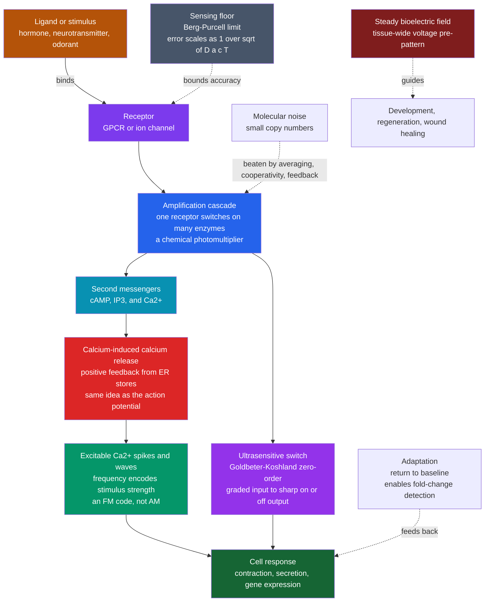

# ⚡ Bioelectricity and Cellular Signaling Physics

> [!abstract] TL;DR
> Electricity is not the private language of neurons — **every cell** maintains a membrane voltage and speaks in ionic signals. The workhorse is **calcium**: cells hold cytosolic $\text{Ca}^{2+}$ a factor of ~$10^4$ below the outside, then open channels to let it flood in as a fast, versatile message. Through **calcium-induced calcium release** (positive feedback identical in spirit to the action potential) $\text{Ca}^{2+}$ becomes an **excitable** signal that fires in **spikes and travelling waves whose frequency — not amplitude — encodes stimulus strength**. Downstream, **signal-transduction cascades** amplify one receptor's binding into thousands of activated molecules and sharpen graded inputs into near-digital switches (**Goldbeter–Koshland zero-order ultrasensitivity**). All of this fights a hard physical floor: the **Berg–Purcell limit** says a cell measuring a concentration by counting diffusing molecules has a relative error $\sim 1/\sqrt{D\,a\,c\,T}$, and real sensors like **E. coli chemotaxis** operate astonishingly close to it. Beyond neurons, steady **bioelectric voltage patterns** across tissues act as a spatial blueprint guiding development, regeneration, and wound healing — an ancient, body-wide information layer biophysics is only beginning to decode.

---

## Intuition

**Analogy:** We think of electricity as the language of nerves and brains — but every cell speaks it. A wound sets up an electric field that guides healing cells toward the breach like iron filings lining up along a magnet. A frog embryo paints voltage patterns across its skin that act as a blueprint saying "build an eye *here*." And inside a single cell, calcium ions surge in waves that act like a secret Morse code — where the **rhythm of the flashes**, not their brightness, carries the message. Beyond neurons, bioelectricity is an ancient, body-wide information system, and the physics of how a cell turns a whisper-quiet change in ion concentration into a loud, reliable signal is a marvel of noise-beating engineering.

Think of a cell as a paranoid accountant trying to read a number written in disappearing ink by molecules that arrive at random. It cannot trust any single glance. So it averages over time, pools many receptors, and uses chemical avalanches that turn a handful of binding events into an unmistakable roar — pushing right up against the fundamental limit that physics allows for measuring "how much of this chemical is out there?"

---

## How It Works

### Core Mechanics

**1. Bioelectricity is universal, not neural.** Neurons are the flashy specialists, but *every* cell runs an ion pump economy (the Na⁺/K⁺-ATPase and friends) that stockpiles ion gradients across the membrane, producing a **resting membrane potential** of tens of millivolts. That voltage — set by the balance of permeabilities described in the sibling note *Membrane_Potential_and_the_Nernst_Equation* — is a battery every cell keeps charged. Non-excitable cells use slow, graded changes in it as state variables; excitable cells (neurons, muscle, some secretory and immune cells) discharge it explosively via the machinery covered in *Ion_Channels_and_Transport* and *The_Hodgkin_Huxley_Model_and_Action_Potentials*.

**2. Calcium: the universal second messenger.** A cell keeps cytosolic $\text{Ca}^{2+}$ brutally low — around $100\,\text{nM}$, roughly $10{,}000\times$ lower than the extracellular fluid or the endoplasmic-reticulum (ER) store. That steep gradient is a *cocked spring*. Open a channel and $\text{Ca}^{2+}$ floods in from outside or bursts out of the ER, and the local concentration jumps orders of magnitude in milliseconds. Because the resting level is so low, even a tiny absolute influx is an enormous *fractional* change — a high signal-to-noise message. $\text{Ca}^{2+}$ then binds effector proteins (calmodulin, troponin, synaptotagmin) to trigger muscle **contraction**, vesicle **secretion**, egg **fertilization**, and **gene expression**.

**3. Calcium waves and oscillations are excitable dynamics.** The key trick is **calcium-induced calcium release (CICR)**: $\text{Ca}^{2+}$ itself opens the ER's release channels (ryanodine and IP₃ receptors), so a little released calcium triggers more — *positive feedback*, exactly the regenerative mechanism behind the neuronal action potential (see *Action_Potentials_and_Resting_Membrane_Potential*). Coupled to a slower recovery process (pumps refilling the store, channel inactivation), this positive-plus-slow-negative feedback makes cytosolic calcium an **excitable medium**: it produces all-or-none **spikes**, self-sustaining **oscillations**, and **travelling waves** that sweep across a cell or between coupled cells. Mathematically this is the same two-variable excitable structure as the **FitzHugh–Nagumo** system.

**4. Frequency encoding.** Because the spikes are all-or-none, amplitude carries little information — instead the cell encodes stimulus strength in the **frequency of $\text{Ca}^{2+}$ spikes** (an "FM radio," not "AM"). Stronger hormone or neurotransmitter → faster spiking. Downstream decoders (e.g., $\text{Ca}^{2+}$/calmodulin-dependent kinase II, CaMKII) integrate spike trains and respond to their frequency, so different genes switch on at different firing rates. Frequency coding is robust: it is immune to slow drifts in baseline that would corrupt an amplitude code.

**5. Signal transduction as physics: amplification, switching, adaptation.** A receptor caught binding one ligand molecule is a whisper. Cascades make it a shout:
   - **Amplification.** One activated receptor catalytically switches on many G-proteins; each activates an enzyme that makes thousands of second-messenger molecules — a chemical **photomultiplier**. Vision is the extreme case: a *single* photon-activated rhodopsin yields a measurable current.
   - **Switching / ultrasensitivity.** Cascades convert a graded input into a sharp, near-digital on/off decision. **Cooperativity** (Hill coefficients $> 1$) and **Goldbeter–Koshland zero-order ultrasensitivity** — where a kinase and phosphatase both run *saturated* — produce responses far steeper than a simple binding curve, effectively a molecular switch.
   - **Adaptation.** Feedback returns the output to baseline even while the stimulus persists, so the system reports **change** rather than absolute level. This enables **fold-change detection**: responding to a *ratio* of new-to-old concentration, the basis of bacterial chemotaxis.

**6. The physics of sensing — the Berg–Purcell limit.** How accurately can a cell know a concentration $c$? It measures by counting molecules that diffuse into a receptor of size $a$ over an averaging time $T$. The expected count is $N \sim D\,a\,c\,T$ (diffusive current $\times$ time), and by Poisson counting statistics the fractional error is $\delta c/c \sim 1/\sqrt{N}$, giving the celebrated **Berg–Purcell bound**:
$$\boxed{\;\frac{\delta c}{c}\;\sim\;\frac{1}{\sqrt{D\,a\,c\,T}}\;}$$
More diffusion, bigger receptors, higher concentration, and longer averaging all sharpen the estimate — but only as a *square root*, so halving the noise costs a **fourfold** increase in time or receptor area. This is a fundamental floor set by molecular counting, not by biochemistry, and it is the sensing analogue of the shot-noise limit in optics.

**7. Noise and reliability.** Signaling runs on **small numbers** of molecules, so it is intrinsically stochastic (see *Systems_Biophysics_and_Gene_Networks*). Cells beat the noise with **time-averaging**, **spatial integration** over many receptors, **cooperativity**, **redundancy**, and **feedback** — always paying in speed and energy. The **speed–accuracy–energy trade-off** is a recurring theme: fast, accurate sensing dissipates more free energy, a biological echo of the thermodynamics of measurement.

**8. Bacterial chemotaxis — the paradigm sensor.** *E. coli* senses chemical gradients with a network that is nearly information-optimal: receptors count attractant molecules near the Berg–Purcell floor, a methylation feedback loop gives **precise adaptation** (perfect return to baseline, so it measures gradients over time as it swims), and the output biases a flagellar motor between "run" and "tumble" to produce a **biased random walk** up the gradient. It is a triumph of quantitative systems biophysics — a chemical computer that measures, remembers, and steers.

**9. Developmental bioelectricity and wound healing.** Beyond fast signaling, **steady** voltage and ion-flux patterns across tissues act as a **pre-pattern** or blueprint. Michael Levin's work shows that manipulating the bioelectric state — the spatial map of resting potentials across cells — can redirect development: inducing ectopic eyes, triggering regeneration, and setting left–right body asymmetry. At a **wound**, disrupting the epithelial battery creates an endogenous **electric field** of ~$100\,\text{mV/mm}$ that guides migrating cells (galvanotaxis/electrotaxis) toward the breach to close it. Electricity here is not a signal *between* cells so much as a distributed *field* that stores positional information.

### Flow / Architecture



---

## Key Concepts

### Secondary (intuitive)
- **Every cell is electric.** Not just nerves — all cells keep a tiny voltage across their skin by pumping ions, like a charged battery they never let run flat.
- **Calcium is the cell's alarm bell.** Cells keep calcium inside almost zero, then let a burst flood in to shout "contract!", "release!", "divide!". Because the resting level is so low, even a small burst is a huge, clear signal.
- **The message is in the rhythm.** Calcium comes in flashes, and it is the *speed* of the flashing — not how bright each flash is — that tells the cell how strong the stimulus is, like Morse code.
- **Cells can only sense so well.** Counting molecules that randomly drift by is like guessing rainfall by catching a few drops in a cup — the longer you wait, the better your estimate, but you can never be perfect.
- **Voltage as a blueprint.** Patterns of electric charge across a growing embryo help decide where an eye or a limb goes, and electric fields at a cut guide cells in to heal it.

### Undergraduate (quantitative)
- **The calcium gradient:** cytosolic $\text{Ca}^{2+}\!\approx\!100\,\text{nM}$ vs $\sim\!1\text{–}2\,\text{mM}$ outside and in the ER — a $\sim\!10^4$ fold ratio maintained by pumps (PMCA, SERCA) and exchangers (NCX).
- **CICR and excitability:** positive feedback ($\text{Ca}^{2+}$ opens $\text{Ca}^{2+}$ channels) plus slow negative feedback (store depletion, inactivation) = a two-variable excitable oscillator; spikes are all-or-none above a threshold.
- **Frequency encoding:** information in inter-spike interval; decoders like CaMKII act as frequency-to-amplitude converters, switching genes at stimulus-specific rates.
- **Ultrasensitivity:** Hill function $\theta = x^n/(K^n + x^n)$; **Goldbeter–Koshland** zero-order regime (both converter enzymes saturated, Michaelis constants $J \ll 1$) yields effective Hill coefficients of tens — a sharp switch from a non-cooperative circuit.
- **Berg–Purcell limit:** $\delta c/c \sim 1/\sqrt{D a c T}$ (constants of order unity). Note the diffusive current to an absorbing sphere is $I = 4\pi D a c$; averaging for time $T$ counts $N \sim I\,T$ molecules, error $\sim 1/\sqrt N$.
- **Adaptation and fold-change detection:** integral feedback yields exact adaptation; response depends on $\Delta c/c$, not $\Delta c$ — Weber's-law behavior in chemotaxis.

### Graduate (advanced)
- **Reaction–diffusion calcium waves:** the fire–diffuse–fire and Li–Rinzel / De Young–Keizer models describe IP₃-receptor gating and give wave speeds $\sim 10\text{–}100\,\mu\text{m/s}$; bifurcation analysis (Hopf onset) predicts the oscillatory window and frequency–stimulus curve.
- **Refined sensing bounds:** the full Berg–Purcell result $(\delta c/c)^2 = 1/(\pi D a c T)$ for a single absorbing receptor; **Endres–Wingreen** improvements for receptor arrays and maximum-likelihood readout; the fundamental limit including receptor rebinding and cooperative arrays approaches the physical optimum.
- **Fisher information and sensing:** the Cramér–Rao bound frames concentration estimation as a statistical-inference problem; the Berg–Purcell floor is a diffusion-limited special case (see *Fisher_Information_and_the_Cramer_Rao_Bound*).
- **Energy–speed–accuracy trade-off:** nonequilibrium proofreading and driven feedback (e.g., the methylation cycle in chemotaxis) spend ATP to reduce readout variance; there are thermodynamic bounds relating dissipation to sensory precision.
- **Precise adaptation via integral control:** the Barkai–Leibler robustness argument shows chemotactic adaptation is a structural (topological) property of the network, independent of parameter fine-tuning.
- **Developmental bioelectric codes:** gap-junction-coupled voltage domains ($V_{\text{mem}}$ maps) as instructive, memory-bearing pre-patterns; ion-channel/pump manipulation reprogramming anatomical outcomes (regeneration, ectopic organs, planarian axis).

---

## Python Demo

```python
# Signaling physics in three acts:
#   A. Frequency-encoded calcium spikes from an excitable (FitzHugh-Nagumo) model
#   B. The Berg-Purcell sensing floor: relative error ~ 1/sqrt(D a c T)
#   C. Goldbeter-Koshland zero-order ultrasensitivity: a molecular on/off switch
# Requires: numpy, matplotlib
import numpy as np
import matplotlib.pyplot as plt

# =====================================================================
# PART A - Excitable calcium: spike FREQUENCY encodes stimulus strength
# =====================================================================
# Two-variable FitzHugh-Nagumo excitable system. Read v as (scaled) cytosolic
# Ca2+ and w as a slow recovery variable (pump refilling / channel inactivation).
# The stimulus I stands in for agonist/IP3 level. Positive feedback in v is the
# mathematical twin of calcium-induced calcium release.
a, b, eps = 0.7, 0.8, 0.08

def fhn_rhs(v, w, I):
    dv = v - v**3 / 3.0 - w + I
    dw = eps * (v + a - b * w)
    return dv, dw

def simulate(I, t_max=200.0, dt=0.01):
    n = int(t_max / dt)
    v, w = -1.2, -0.6            # start near rest
    V = np.empty(n); t = np.arange(n) * dt
    for k in range(n):           # RK4 integration
        k1v, k1w = fhn_rhs(v, w, I)
        k2v, k2w = fhn_rhs(v + 0.5*dt*k1v, w + 0.5*dt*k1w, I)
        k3v, k3w = fhn_rhs(v + 0.5*dt*k2v, w + 0.5*dt*k2w, I)
        k4v, k4w = fhn_rhs(v + dt*k3v,     w + dt*k3w,     I)
        v += dt*(k1v + 2*k2v + 2*k3v + k4v) / 6.0
        w += dt*(k1w + 2*k2w + 2*k3w + k4w) / 6.0
        V[k] = v
    return t, V

def spike_frequency(t, V, thr=1.0):
    # count upward threshold crossings after a transient, return spikes per unit time
    warm = len(t) // 5
    v = V[warm:]; tt = t[warm:]
    up = np.where((v[:-1] < thr) & (v[1:] >= thr))[0]
    if len(up) < 2:
        return 0.0
    return (len(up) - 1) / (tt[up[-1]] - tt[up[0]])

# (A1) three representative stimulus levels -> different spike RATES
stim_levels = [0.40, 0.60, 0.85]
traces = [simulate(I) for I in stim_levels]

# (A2) full stimulus->frequency encoding curve
I_sweep = np.linspace(0.30, 1.45, 40)
freqs = np.array([spike_frequency(*simulate(I)) for I in I_sweep])

# =====================================================================
# PART B - Berg-Purcell limit: how well can a cell measure concentration?
# =====================================================================
# Diffusive current to an absorbing receptor of radius a:  I = 4*pi*D*a*c.
# Counting for time T gives N ~ I*T molecules; Poisson error -> dc/c ~ 1/sqrt(N).
D = 100e-12                       # m^2/s, small molecule in water (~100 um^2/s)
c = 1e-9 * 6.022e23 * 1e3         # 1 nM -> molecules per m^3
T = np.logspace(-3, 1, 200)       # averaging time: 1 ms ... 10 s
receptor_radii = [1e-9, 5e-9, 25e-9]   # 1 nm, 5 nm, 25 nm
def bp_error(a_r, T):
    N = 4 * np.pi * D * a_r * c * T           # molecules counted
    return 1.0 / np.sqrt(N)                    # relative error dc/c

# =====================================================================
# PART C - Goldbeter-Koshland zero-order ultrasensitivity (the switch)
# =====================================================================
# Push-pull: a kinase (activity v1) and phosphatase (activity v2) with
# Michaelis constants J1, J2 (normalized to total protein). Fraction active:
def goldbeter_koshland(v1, v2, J1, J2):
    B = v2 - v1 + v2*J1 + v1*J2
    return 2*v1*J2 / (B + np.sqrt(B**2 - 4*(v2 - v1)*v1*J2))

ratio = np.linspace(0.2, 5.0, 400)            # kinase/phosphatase activity ratio
J_values = [1.0, 0.1, 0.01]                   # large J = graded, small J = ultrasensitive
gk_curves = [goldbeter_koshland(ratio, 1.0, J, J) for J in J_values]

# =====================================================================
# PLOTS
# =====================================================================
fig, ax = plt.subplots(2, 2, figsize=(13, 9))

# A1: calcium traces, offset vertically, showing frequency rise with stimulus
for i, (I, (t, V)) in enumerate(zip(stim_levels, traces)):
    ax[0, 0].plot(t, V + i*4.5, lw=1.2, label=f"stimulus I = {I:.2f}")
ax[0, 0].set_title("A. Excitable Ca2+ spikes\nstronger stimulus -> higher spike frequency")
ax[0, 0].set_xlabel("time (arb. units)")
ax[0, 0].set_ylabel("cytosolic Ca2+ (offset for clarity)")
ax[0, 0].legend(fontsize=8, loc="upper right"); ax[0, 0].grid(alpha=0.3)

# A2: frequency encoding curve
ax[0, 1].plot(I_sweep, freqs, "o-", color="#059669", ms=3, lw=1.5)
ax[0, 1].set_title("B. Frequency encoding\nspike rate carries the message (FM, not AM)")
ax[0, 1].set_xlabel("stimulus strength I (agonist / IP3)")
ax[0, 1].set_ylabel("Ca2+ spike frequency")
ax[0, 1].grid(alpha=0.3)

# B: Berg-Purcell sensing floor
for a_r in receptor_radii:
    ax[1, 0].loglog(T, bp_error(a_r, T), lw=2, label=f"receptor a = {a_r*1e9:.0f} nm")
ax[1, 0].loglog(T, 0.3*(T/T[0])**-0.5 * bp_error(receptor_radii[1], T)[0]/0.3,
                "k--", alpha=0.4, label="slope -1/2")
ax[1, 0].set_title("C. Berg-Purcell limit\nrelative error ~ 1/sqrt(D a c T)")
ax[1, 0].set_xlabel("averaging time T (s)")
ax[1, 0].set_ylabel("relative sensing error  dc/c")
ax[1, 0].legend(fontsize=8); ax[1, 0].grid(alpha=0.3, which="both")

# C: Goldbeter-Koshland ultrasensitive switch
for J, curve in zip(J_values, gk_curves):
    ax[1, 1].plot(ratio, curve, lw=2, label=f"J = {J} " +
                  ("(graded)" if J == 1.0 else "(ultrasensitive)" if J == 0.01 else ""))
ax[1, 1].axvline(1.0, ls=":", color="gray")
ax[1, 1].set_title("D. Zero-order ultrasensitivity\nsaturated enzymes -> sharp on/off switch")
ax[1, 1].set_xlabel("kinase / phosphatase activity ratio")
ax[1, 1].set_ylabel("fraction of protein active")
ax[1, 1].legend(fontsize=8); ax[1, 1].grid(alpha=0.3)

plt.tight_layout()
plt.show()
```

**What you should see.** Panel A: three calcium traces whose spikes get *closer together* as the stimulus rises — the amplitude is essentially fixed, only the rhythm changes. Panel B: the encoding curve, spike frequency climbing with stimulus across the oscillatory band (and falling back to zero outside it, since too much drive re-stabilizes the resting state). Panel C: the Berg–Purcell error falling as a straight line of slope $-1/2$ on log–log axes, with bigger receptors always more accurate — quadrupling the averaging time only halves the noise. Panel D: as the Michaelis constants shrink ($J = 1 \to 0.1 \to 0.01$) the response steepens from a lazy hyperbola into a near-vertical **switch** at the point where kinase and phosphatase activities balance — cooperativity manufactured from saturation alone.

---

## Real-World Applications

> **Example — muscle contraction (excitation–contraction coupling).** In a heart or skeletal muscle cell, a membrane action potential opens voltage-gated $\text{Ca}^{2+}$ channels; the trickle of entering calcium triggers **CICR** from the sarcoplasmic reticulum via ryanodine receptors, flooding the cytosol. Calcium binds troponin, exposing actin so myosin can pull. The heartbeat is literally a calcium wave — and cardiac arrhythmias are, in part, calcium-signaling dynamics gone unstable. This is the excitable, positive-feedback physics of Part A operating in your chest ~$10^5$ times a day.

- **Fertilization.** In many species a single **calcium wave** sweeps across the egg at the instant of sperm fusion, triggering the block to polyspermy and the metabolic awakening of the embryo — a one-shot, whole-cell excitable event (see *Fertilization_and_Early_Development*).
- **Hormone action and secretion.** Pancreatic beta cells translate blood glucose into **frequency-modulated $\text{Ca}^{2+}$ oscillations** that pace insulin release; many hormones act through cAMP/$\text{IP}_3$/$\text{Ca}^{2+}$ second messengers (see *The_Endocrine_System_and_Hormones*).
- **Vision as amplification.** A single photon activates one rhodopsin, which switches on hundreds of transducin G-proteins, each driving a phosphodiesterase that hydrolyzes thousands of cGMP — the photomultiplier cascade that lets you see starlight.
- **Bacterial chemotaxis in engineering.** *E. coli*'s near-optimal, precisely adapting sensor is the reference design for synthetic-biology gradient sensors and a benchmark in systems biology for how close biology gets to physical limits.
- **Regenerative medicine.** Manipulating tissue **bioelectric state** (ion-channel drugs, optogenetic voltage control) can induce regeneration or redirect patterning in model organisms — an emerging therapeutic frontier for wound healing, birth defects, and possibly cancer normalization.
- **Wound-healing devices.** Endogenous wound electric fields (~$100\,\text{mV/mm}$) guide cell migration; clinical **electrical stimulation** of chronic wounds exploits this galvanotaxis to accelerate closure.

---

## Common Pitfalls

- **"Bioelectricity means neurons."** The single most common misconception. All cells hold a membrane potential and use ionic signals; neurons just made it fast and long-range. Treating voltage as a nerve-only phenomenon blinds you to developmental and wound bioelectricity.
- **Reading calcium as an amplitude code.** Because spikes are all-or-none, the information is usually in the **frequency** (and sometimes spatial pattern), not the peak height. Analyzing $\text{Ca}^{2+}$ imaging by peak amplitude alone throws away the message.
- **Confusing the resting level with the signal.** The signal is the *fractional* jump from a very low baseline. Forgetting how aggressively cells pump $\text{Ca}^{2+}$ back down (to $\sim\!100\,\text{nM}$) makes the whole scheme look impossible — the low baseline is precisely what makes the signal loud.
- **Ignoring the square-root in Berg–Purcell.** Accuracy improves only as $\sqrt{T}$ and $\sqrt{a}$. Expecting a cell to sense arbitrarily precisely by "trying harder" is wrong: cutting the error in half costs $4\times$ the time or receptor area, and there is a hard diffusion-limited floor.
- **Assuming ultrasensitivity needs cooperative binding.** Goldbeter–Koshland shows a *non-cooperative* push–pull cycle becomes switch-like purely by running its enzymes near saturation (zero-order kinetics). Steep responses do not prove allostery.
- **Forgetting adaptation when interpreting a "no response."** An adapted sensor sitting at baseline in a constant high stimulus is not blind — it has reset to detect the *next change*. Reading adaptation as insensitivity misdiagnoses the circuit.
- **Neglecting noise from small copy numbers.** With tens to hundreds of signaling molecules, stochastic fluctuations are large; deterministic rate equations can badly mislead about reliability, timing, and thresholds.

---

## Related Concepts

**Biophysics foundations**
- [[Diffusion_and_Brownian_Motion_in_Cells]] — the diffusive current $4\pi D a c$ and $\sqrt{t}$ counting statistics that *derive* the Berg–Purcell sensing floor.
- [[Statistical_Mechanics_of_Biomolecules]] — the $k_BT$ scale, Boltzmann-governed channel gating, and the thermal noise cells must signal against.
- [[Enzyme_Kinetics_and_Catalysis_Physics]] — Michaelis–Menten kinetics whose *saturated* (zero-order) regime produces Goldbeter–Koshland ultrasensitivity.
- [[Biophysics_Overview]] — parent map placing bioelectricity and signaling in the physics-of-life landscape.
- [[Molecular_Motors_and_Mechanochemistry]] — the flagellar rotary motor that chemotaxis steers as its behavioral output.

**Bioelectricity and neurons**
- [[Action_Potentials_and_Resting_Membrane_Potential]] — the canonical regenerative positive-feedback event; CICR is its calcium twin.
- [[Ion_Channels_and_Receptor_Pharmacology]] — the voltage- and ligand-gated channels that admit the $\text{Ca}^{2+}$ signal.
- [[Synaptic_Transmission_and_Neurotransmitters]] — $\text{Ca}^{2+}$ influx triggering vesicle fusion, second messengers in action.
- [[Synaptic_Plasticity_and_LTP]] — CaMKII decoding $\text{Ca}^{2+}$ spike frequency to set the sign of plasticity.
- [[Hodgkin_Huxley_Model_and_Computational_Neurons]] — the excitable-membrane math shared by the FitzHugh–Nagumo calcium model.

**Cell and developmental biology**
- [[The_Cell_Membrane_and_Transport]] — the capacitor-and-pumps system that stores the ion gradients every cell signals with.
- [[Cell_Signaling_in_Development]] — receptor cascades and second messengers shaping the embryo.
- [[The_Endocrine_System_and_Hormones]] — hormones as first messengers relayed by cAMP/$\text{IP}_3$/$\text{Ca}^{2+}$.
- [[Fertilization_and_Early_Development]] — the fertilization calcium wave as a whole-cell excitable event.
- [[Morphogenesis_and_Pattern_Formation]] — positional information, into which bioelectric voltage pre-patterns feed.
- [[Aging_and_Regeneration]] — the regeneration Levin's bioelectric manipulations aim to reawaken.
- [[Bacteria_and_Archaea]] — *E. coli*, whose chemotaxis network is the paradigm near-optimal sensor.

**Dynamics, systems, and information**
- [[Feedback_Loops_and_Causality]] — the positive-plus-slow-negative feedback motif behind excitability and oscillation.
- [[Dynamical_Systems_and_Attractors]] — limit cycles and excitable trajectories underlying calcium spikes.
- [[Bifurcations_and_Tipping_Points]] — the Hopf bifurcation that switches calcium from quiescent to oscillating as stimulus rises.
- [[Nonlinearity_and_Feedback]] — the nonlinear gain that makes cascades amplify and sharpen.
- [[Emergence_and_Self_Organization]] — calcium waves as an emergent excitable-medium phenomenon.
- [[Information_Theory_in_Biology_and_Neuroscience]] — cells as noisy communication channels; the information a signal carries about concentration.
- [[Fisher_Information_and_the_Cramer_Rao_Bound]] — the statistical-estimation framing of which Berg–Purcell is the diffusion-limited case.

---

## Review Questions

1. **(Conceptual)** Calcium spikes are all-or-none, yet cells clearly convey *how strong* a stimulus is. Explain how frequency encoding solves this, why it is more robust than amplitude encoding against slow baseline drift, and name a downstream molecule that acts as the frequency decoder.
2. **(Scenario)** A cell must distinguish a ligand concentration of $1\,\text{nM}$ from $1.1\,\text{nM}$ — a 10% difference. Using the Berg–Purcell relation $\delta c/c \sim 1/\sqrt{D a c T}$, argue qualitatively whether a single $5\,\text{nm}$ receptor sampling for $1\,\text{ms}$ can do it, and list three physical strategies the cell could use to close the gap. What does each strategy cost?
3. **(Trade-off)** A push–pull phosphorylation cycle can behave as a graded sensor or a sharp switch depending on how saturated its kinase and phosphatase are. Explain the Goldbeter–Koshland mechanism, state when a cell would *want* the graded regime versus the ultrasensitive switch, and describe the downside of building an ultrasensitive switch out of a noisy, low-copy-number circuit.
4. **(Synthesis / Advanced)** Bacterial chemotaxis combines near-Berg–Purcell sensing, precise adaptation, and a biased-random-walk motor output. Explain how "precise adaptation" lets the cell perform *fold-change detection* rather than absolute-concentration reading, and why that is the right strategy for climbing a gradient while swimming.

---

## Sources

- Berg, H. C. & Purcell, E. M. "Physics of Chemoreception," *Biophysical Journal* 20, 193–219 (1977).
- Bialek, W. *Biophysics: Searching for Principles*, Princeton University Press (2012) — chapters on noise, sensing, and the Berg–Purcell limit.
- Goldbeter, A. & Koshland, D. E. "An amplified sensitivity arising from covalent modification in biological systems," *PNAS* 78, 6840–6844 (1981).
- Berridge, M. J., Bootman, M. D. & Roderick, H. L. "Calcium signalling: dynamics, homeostasis and remodelling," *Nature Reviews Molecular Cell Biology* 4, 517–529 (2003).
- Levin, M. "Bioelectric signaling: Reprogrammable circuits underlying embryogenesis, regeneration, and cancer," *Cell* 184, 1971–1989 (2021).
- Phillips, Kondev, Theriot & Garcia, *Physical Biology of the Cell*, 2nd ed., Garland Science (2012).

---

#biophysics #bioelectricity #calcium-signaling #signal-transduction #berg-purcell
