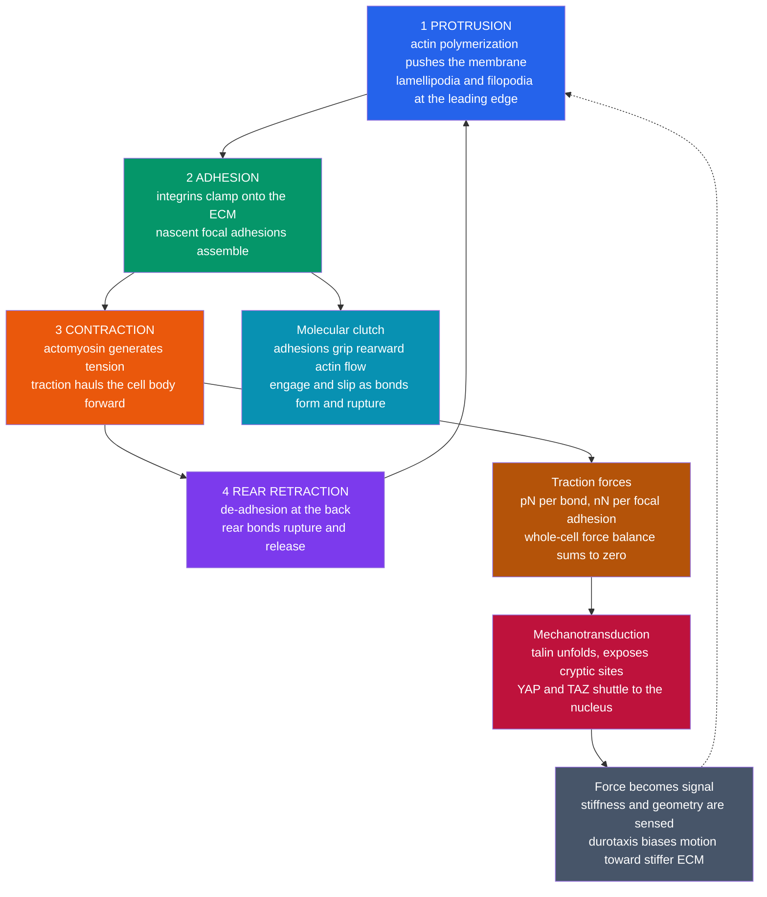

# 🦠 Cell Motility and Adhesion

> [!abstract] TL;DR
> Cells crawl by running a coordinated four-stroke **mechanical cycle**: **actin polymerization** pushes the membrane forward at the leading edge (protrusion), **integrins** clamp the new front onto the extracellular matrix (adhesion), **actomyosin** contraction generates **traction** that hauls the body forward, and the rear **de-adheres** as its bonds rupture (retraction). The grip is not glue but a population of **force-regulated molecular bonds**: in **Bell's model** a pulling force $F$ lowers the rupture barrier so a bond's lifetime *shrinks* exponentially, $\tau(F)=\tau_0 e^{-F x_\beta/k_BT}$ (a **slip bond**) — while some bonds counterintuitively *strengthen* under load (**catch bonds**), and clusters survive longer by **sharing load**. Cells pull on their surroundings with **piconewton-to-nanonewton** forces we can now measure, and they **feel** the stiffness they pull against — converting force into biochemical signal (**mechanotransduction**: talin unfolds, YAP/TAZ enter the nucleus). That sensing steers them (**durotaxis** toward stiffer matrix, **chemotaxis** up chemical gradients), sets **stem-cell fate** from substrate stiffness alone, and — lethally — is hijacked in **cancer metastasis**. Statistically their tracks are **persistent random walks**: ballistic ($\sim t^2$) for a persistence time, then diffusive ($\sim t$). This is where biology becomes mechanics.

---

## Intuition

**Analogy:** A crawling cell is like a rock climber with no legs, dragging itself up a wall. It reaches forward and pushes out a thin sticky sheet, grips the surface with molecular Velcro, hauls its whole body up toward the grip, then peels its rear hand-hold loose and repeats. Every cycle is *reach, grip, pull, release* — a treadmill of adhesion that inches the body along.

But the climber does more than move. To grip well it must *test* each hold: it tugs, feels how hard the rock pushes back, and even chooses its route based on where the wall feels most solid. A cell does exactly this. It does not merely *live* in a mechanical environment — it **pulls on that environment, senses the resistance, and decides where to go based on how stiff the ground is**. The surroundings are not a passive backdrop; they are physical terrain the cell grips, loads, and *feels*.

---

## How It Works

### The crawling cycle — a treadmill of grip and release

Directed crawling on a surface is a four-step mechanical cycle, repeated continuously and coordinated in space (front-to-back) and time:

1. **Protrusion.** At the **leading edge**, actin monomers add to the growing ends of a branched filament network, and the treadmilling meshwork pushes the plasma membrane outward — a flat sheet called a **lamellipodium**, spiked with finger-like **filopodia**. The force comes from **Brownian-ratcheted polymerization**: thermal fluctuations open a gap between filament tip and membrane, a monomer inserts, and the membrane can no longer slide back. This is the actin machinery detailed in [[The_Cytoskeleton_and_Cell_Motility]] and the forthcoming sibling *The_Cytoskeleton_and_Cell_Mechanics*.
2. **Adhesion.** The freshly protruded front attaches to the substrate. Transmembrane **integrin** receptors bind ligands in the **extracellular matrix (ECM)** on the outside and, on the inside, link through adaptor proteins (talin, vinculin) to the actin cytoskeleton. Small **nascent adhesions** form under the lamellipodium; some mature into large, force-bearing **focal adhesions**.
3. **Contraction.** **Myosin-II** motors pull on the actin network (the same actomyosin machinery as muscle; see [[Molecular_Motors_and_Mechanochemistry]]), generating **contractile tension**. Because the front is anchored, this tension is transmitted through the adhesions into the substrate as **traction**, and it hauls the cell body forward.
4. **Rear retraction.** At the trailing edge, adhesions must **let go**. Their bonds rupture under the mounting tail tension (and are actively disassembled), the rear releases, and the tail snaps forward. The cycle resets.

The net result is a self-propelled crawl at speeds of roughly $0.1$–$10\ \mu\text{m/min}$ — slow keratocytes and fast leukocytes bracketing the range. Movement requires **broken symmetry** (a defined front and back) and **adhesion that is neither too weak nor too strong**: with no grip the cell spins its wheels; with unbreakable grip it cannot release its rear. Migration speed is **biphasic** in adhesion strength — maximal at intermediate grip.

### Integrins, focal adhesions, and the molecular clutch

Actin in the lamellipodium flows *rearward* (retrograde flow) even as the network pushes forward — like a tank tread. Adhesions act as a **molecular clutch** engaging that flow to the ground: when integrin bonds are engaged, they transmit the rearward actin motion into rearward *traction on the substrate*, which by reaction pushes the cell forward; when bonds slip or rupture, the clutch disengages and actin flow spins uselessly. A **focal adhesion** is therefore not static glue but a dynamic, **mechanosensitive** cluster of hundreds of molecules that grows when loaded and dissolves when unloaded — a force sensor and force transmitter in one.

### Bonds under force — Bell's model, catch vs slip, load sharing

The central biophysics is that **adhesion bonds are stochastic and force-dependent**. A single receptor–ligand bond does not last forever; it ruptures at random with some off-rate. **Bell (1978)** proposed that pulling force $F$ tilts the bond's energy landscape, lowering the rupture barrier by $F x_\beta$ (where $x_\beta$ is the distance to the transition state along the pulling coordinate). The off-rate then rises exponentially and the **mean lifetime falls**:

$$
\tau(F) = \tau_0 \, \exp\!\left(-\frac{F x_\beta}{k_B T}\right) \qquad \text{(slip bond)}.
$$

Force **shortens** a slip bond's life — the harder you pull, the sooner it breaks. But nature also built the opposite: **catch bonds**, whose lifetime *increases* with force over a range before eventually falling (a catch-then-slip curve). Modeled as two competing dissociation pathways — a fast "catch" route that force suppresses and a slow "slip" route that force enhances — catch bonds let cells **grip harder precisely when yanked** (integrins, P-selectin on rolling leukocytes, and the bacterial adhesin FimH are famous examples). Finally, no adhesion is a single bond: a cluster **shares load** among $N$ parallel bonds, so each carries $F/N$ and lives dramatically longer — but if one breaks, the survivors bear more, which can trigger a **rupture cascade** (the origin of an adhesion's abrupt failure). The physics of pulling on single bonds is the province of [[Single_Molecule_Biophysics]].

### Traction forces and the whole-cell force balance

A crawling cell is an **overdamped** object: at cellular scale inertia is negligible (as in [[Diffusion_and_Brownian_Motion_in_Cells]]), so at every instant the forces **sum to zero**. The contractile tension the cell generates internally is exactly balanced by the **traction forces** it exerts on the substrate through its adhesions — typically a few **piconewtons per bond** and **nanonewtons per focal adhesion**, with the front pulling backward and the rear pulling forward so the whole pattern is force-balanced. We measure these directly by **traction force microscopy**: culture a cell on a soft gel seeded with fluorescent beads, watch the beads move as the cell pulls, and invert the substrate's known elasticity to recover the force field.

### Mechanotransduction — cells feel their environment

Because adhesions transmit force, they can also **read** it. Under tension, the adaptor protein **talin unfolds**, exposing cryptic binding sites that recruit **vinculin** and reinforce the adhesion — a molecular strain gauge. Substrate **stiffness** sets how much a cell can pull before the ground pushes back, so a cell on stiff matrix builds bigger adhesions and higher tension than the same cell on soft matrix. This mechanical state is transduced into gene expression, most famously through the **YAP/TAZ** transcriptional co-activators, which localize to the nucleus on stiff substrates and stay cytoplasmic on soft ones. Thus **force becomes signal**, and the cell's behavior — its speed, its shape, its fate — depends on the *mechanics* of its surroundings, not just their chemistry.

That sensing **steers** migration. **Durotaxis** biases motion up a stiffness gradient (toward stiffer matrix); **chemotaxis** follows a diffusing chemical gradient (coupling sensing to the crawling machinery); **haptotaxis** follows a gradient of *bound* adhesion ligand. In a landmark result, **substrate stiffness alone directed stem-cell differentiation** — soft brain-like gels pushed mesenchymal stem cells toward **neurons**, muscle-stiffness gels toward **myoblasts**, and rigid bone-like gels toward **osteoblasts** — establishing mechanics as a genuine developmental signal alongside growth factors (see [[Stem_Cells_and_Differentiation]]). And the same toolkit turns deadly in **cancer**: metastatic cells remodel their adhesions and contractility to detach, invade stiffened tumor matrix, and migrate — a central theme of the biophysics of cancer, developed in the forthcoming sibling *Physics_of_Cancer*.



---

## Key Concepts

### Secondary (intuitive)
- **Cells crawl.** White blood cells chase bacteria, skin cells close a wound, embryonic cells travel to build the body — all by crawling, not swimming.
- **Reach, grip, pull, release.** A crawling cell pushes out a sticky front, grabs the surface, pulls its body up, and lets go at the back — over and over, like a legless climber.
- **The grip is molecular Velcro.** Proteins called **integrins** stick the cell to its surroundings; the attachments form and break constantly, and force can make them let go sooner (or, oddly, hold tighter).
- **Cells feel their surroundings.** A cell can tell whether the ground under it is soft or stiff by pulling on it, and it changes what it does — even *what kind of cell it becomes* — based on the answer.
- **This matters for cancer.** Tumor cells that spread do so by changing how they stick and crawl, letting them break away and invade — the deadly process of **metastasis**.

### Undergraduate (quantitative)
- **Force scale.** Single bonds carry a few **pN**; focal adhesions carry **nN**; the thermal quantum is $k_BT\approx4.1\ \text{pN·nm}$, so pulling a bond a fraction of a nm does work comparable to $k_BT$ — force and thermal noise are the same order, which is *why* bonds are stochastic.
- **Bell's slip bond.** $\tau(F)=\tau_0\,e^{-F x_\beta/k_BT}$: lifetime falls e-fold every time $F$ increases by $k_BT/x_\beta$. With $x_\beta\!\sim\!0.3$ nm this is roughly every $\sim\!14$ pN.
- **Catch bond.** Two-pathway model $k_\text{off}(F)=k_c^0 e^{-F x_c/k_BT}+k_s^0 e^{+F x_s/k_BT}$; lifetime $\tau=1/k_\text{off}$ **rises then falls** with force.
- **Load sharing.** $N$ parallel bonds each bear $F/N$, so cluster lifetime grows super-linearly with $N$ (before cascade failure) — cooperativity, not glue.
- **Traction force microscopy.** Invert measured gel deformation via known Young's modulus $E$ to get the traction field; total traction integrates to zero (force balance).
- **Persistent random walk.** Cell tracks obey **Fürth's formula** $\langle r^2\rangle = 2S^2P\big(t - P(1-e^{-t/P})\big)$: **ballistic** $\langle r^2\rangle\!\approx\!(St)^2$ for $t\ll P$, **diffusive** $\langle r^2\rangle\!\approx\!2S^2P\,t$ for $t\gg P$, crossing over at the **persistence time** $P$. Effective diffusion $D=S^2P/2$ (2D).
- **Biphasic adhesion.** Migration speed peaks at intermediate adhesion strength — too little grip or too much both stall the cell.

### Graduate (advanced)
- **Motor-clutch model (Chan–Odde).** Actin retrograde flow engages a stochastic set of compliant clutches; the competition between clutch binding kinetics and load-and-fail dynamics yields an **optimal substrate stiffness** for traction and even **load-and-fail oscillations** — a mechanistic route to durotaxis.
- **Dynamic force spectrum (Dudko–Hummer–Szabo).** Pulling a bond at loading rate $\dot F$ gives a most-probable rupture force $F^*\propto \ln\dot F$; fitting the spectrum extracts $x_\beta$ and the intrinsic barrier, generalizing Bell to arbitrary loading.
- **Adhesion-cluster stability (Bell–Erdmann–Schwarz).** A stochastic cluster of shared-load bonds has a **critical force** above which rebinding cannot keep pace with force-accelerated rupture and the cluster fails catastrophically; the mean lifetime follows a Kramers-like escape over a collective barrier.
- **Active-matter description.** A crawling cell is a **self-propelled (active Brownian) particle**; ensembles obey active-fluid hydrodynamics, and collective migration (wound healing, tumor invasion) shows jamming, unjamming, and flocking transitions.
- **Rigidity sensing.** Cells sense stiffness through the **strain of individual adhesions**: on a stiffer substrate a given traction produces less displacement, so talin reaches its unfolding threshold and reinforces — a local, adhesion-level rheostat feeding YAP/TAZ mechanotransduction.
- **Mesenchymal vs amoeboid modes.** Cells switch between slow, adhesion- and protease-dependent **mesenchymal** crawling and fast, low-adhesion **amoeboid** squeezing — a plasticity that lets metastatic cells evade adhesion-targeting therapy.

---

## Python Demo

```python
# Cell motility & adhesion physics, four panels:
#   (a) CELL MIGRATION as a 2D persistent random walk (active Brownian particle):
#       constant speed S, direction reoriented by rotational diffusion (persistence P).
#   (b) MEAN-SQUARE DISPLACEMENT: ballistic (~t^2) -> diffusive (~t) crossover at t~P,
#       compared to Furth's formula; speed & persistence recovered from the fit.
#   (c) ADHESION BONDS under force -- Bell model: slip-bond lifetime shortens with force,
#       catch-slip bond lifetime rises then falls.
#   (d) LOAD SHARING: N parallel bonds each bear F/N -> cluster survives far longer.
import numpy as np
import matplotlib.pyplot as plt

rng = np.random.default_rng(7)

# ============================================================
# (a) PERSISTENT RANDOM WALK  (Furth: ballistic -> diffusive)
# ============================================================
S     = 0.5        # um/min, cell speed (typical crawling cell)
P     = 20.0       # min, persistence time
dt    = 0.2        # min per step
T     = 400.0      # min total
nstep = int(T / dt)
ncell = 400
Drot  = 1.0 / P                                   # 2D rotational diffusion (1/min)

theta = rng.uniform(0, 2*np.pi, ncell)
xy    = np.zeros((ncell, 2))
traj  = np.zeros((nstep + 1, ncell, 2))
for k in range(nstep):
    theta += np.sqrt(2 * Drot * dt) * rng.standard_normal(ncell)  # reorient
    xy[:, 0] += S * np.cos(theta) * dt
    xy[:, 1] += S * np.sin(theta) * dt
    traj[k + 1] = xy
t = np.arange(nstep + 1) * dt

msd       = np.mean(np.sum(traj**2, axis=2), axis=1)              # <r^2>(t), from origin
msd_furth = 2 * S**2 * P * (t - P * (1 - np.exp(-t / P)))         # Furth theory

# recover speed (short-time ballistic) and D_eff, P (long-time diffusive)
m_s   = (t > 0) & (t < 0.2 * P)
S_fit = np.sqrt(np.mean(msd[m_s] / t[m_s]**2))                    # MSD ~ S^2 t^2
m_l   = t > 5 * P
slope = np.polyfit(t[m_l], msd[m_l], 1)[0]                        # MSD ~ 4 D t
D_eff = slope / 4.0
P_fit = slope / (2 * S_fit**2)

# ============================================================
# (c) BELL MODEL of adhesion bonds under force
# ============================================================
kT = 4.1                              # pN*nm, thermal energy (room temp)
F  = np.linspace(0, 60, 400)          # pN

tau0, xb = 1.0, 0.30                   # s, nm  (slip bond)
tau_slip = tau0 * np.exp(-F * xb / kT)                            # shortens with force

kc0, xc = 5.0, 0.20                    # catch pathway: strong at F=0, weakens with F
ks0, xs = 0.10, 0.30                   # slip pathway: weak at F=0, strengthens with F
tau_catch = 1.0 / (kc0*np.exp(-F*xc/kT) + ks0*np.exp(F*xs/kT))    # rises then falls

# ---------------------------- plots ----------------------------
fig, ax = plt.subplots(2, 2, figsize=(13, 10))

for i in range(60):                                              # (a) trajectories
    ax[0, 0].plot(traj[:, i, 0], traj[:, i, 1], lw=0.7, alpha=0.6)
ax[0, 0].scatter([0], [0], c='k', s=25, zorder=5, label='start')
ax[0, 0].set_title(f"(a) Persistent random walk (60 cells)\nS = {S} um/min, P = {P:.0f} min")
ax[0, 0].set_xlabel("x (um)"); ax[0, 0].set_ylabel("y (um)")
ax[0, 0].set_aspect('equal'); ax[0, 0].legend(); ax[0, 0].grid(alpha=0.3)

ax[0, 1].loglog(t[1:], msd[1:], 'o', ms=3, alpha=0.4, label="simulated MSD")   # (b) MSD
ax[0, 1].loglog(t[1:], msd_furth[1:], 'k-', lw=2, label="Furth theory")
ax[0, 1].loglog(t[1:], (S*t[1:])**2, 'b--', lw=1.5, label="ballistic  ~ t^2")
ax[0, 1].loglog(t[1:], 2*S**2*P*t[1:], 'r--', lw=1.5, label="diffusive  ~ t")
ax[0, 1].axvline(P, color='gray', ls=':', label=f"crossover t = P = {P:.0f}")
ax[0, 1].set_title("(b) MSD: ballistic -> diffusive crossover")
ax[0, 1].set_xlabel("time (min)"); ax[0, 1].set_ylabel("MSD (um^2)")
ax[0, 1].legend(fontsize=8); ax[0, 1].grid(alpha=0.3, which='both')

ax[1, 0].plot(F, tau_slip, lw=2.5, color='crimson',              # (c) Bell bonds
              label="slip bond  tau0 exp(-F xb / kT)")
ax[1, 0].plot(F, tau_catch, lw=2.5, color='teal', label="catch-slip bond")
ax[1, 0].set_title("(c) Bond lifetime vs force (Bell model)")
ax[1, 0].set_xlabel("force per bond F (pN)"); ax[1, 0].set_ylabel("mean lifetime (s)")
ax[1, 0].set_yscale('log'); ax[1, 0].legend(fontsize=8)
ax[1, 0].grid(alpha=0.3, which='both')

Ftot = np.linspace(0, 60, 400)                                   # (d) load sharing
for nb in [1, 2, 5, 10]:
    ax[1, 1].plot(Ftot, tau0 * np.exp(-(Ftot/nb) * xb / kT), lw=2,
                  label=f"{nb} bond(s) share load")
ax[1, 1].set_title("(d) Load sharing: more bonds -> longer survival")
ax[1, 1].set_xlabel("total force on cluster (pN)"); ax[1, 1].set_ylabel("per-bond lifetime (s)")
ax[1, 1].set_yscale('log'); ax[1, 1].legend(fontsize=8)
ax[1, 1].grid(alpha=0.3, which='both')

plt.tight_layout(); plt.show()

# ---------------------------- summary ----------------------------
print("(a/b) PERSISTENT RANDOM WALK")
print(f"  input   S = {S:.3f} um/min , P = {P:.1f} min")
print(f"  fitted  S = {S_fit:.3f} um/min  (short-time ballistic slope)")
print(f"  fitted  D_eff = {D_eff:.3f} um^2/min , P = {P_fit:.1f} min  (long-time)")
print(f"  theory  D_eff = {S**2 * P / 2:.3f} um^2/min   (= S^2 P / 2)")
print("(c) BELL SLIP BOND lifetime")
for f in [0, 10, 20, 40]:
    print(f"  F = {f:2d} pN -> tau = {tau0 * np.exp(-f * xb / kT):.3f} s")
```

**What you should see.** Panel (a): sixty cells trace **persistent** paths — each runs roughly straight for a while, then reorients, spreading out over time. Panel (b): the MSD hugs the **ballistic** $\sim t^2$ line at short times (the cell moves purposefully), bends over at the **persistence time** $P$, and settles onto the **diffusive** $\sim t$ line at long times; the fit recovers the input speed and persistence, and $D_{\text{eff}}=S^2P/2$. Panel (c): the **slip bond**'s lifetime plunges exponentially with force (Bell), while the **catch bond** first *lengthens* under load before it too fails. Panel (d): splitting the same total force among more bonds keeps each below the rupture regime, so the cluster survives dramatically longer — the physical basis of cooperative, force-regulated adhesion.

---

## Real-World Applications

> **Example — traction force microscopy on soft gels.** Plate a fibroblast on a polyacrylamide gel of known stiffness studded with fluorescent beads. As the cell crawls, its integrin adhesions deform the gel; tracking the beads and inverting the substrate's elasticity ([[Stress_Strain_and_Elastic_Moduli]]) yields a map of **pN–nN traction forces** that sum to zero — a direct, quantitative readout of the force balance a single cell exerts on its world.

- **Immune surveillance.** Neutrophils and T cells crawl through tissue and roll along blood-vessel walls using **selectin catch bonds** that grip *harder* under the shear of flowing blood, then arrest and squeeze out to reach infection (see [[The_Innate_Immune_System]] and [[The_Adaptive_Immune_System]]).
- **Wound healing.** Epithelial sheets migrate collectively to close a wound; keratinocytes and fibroblasts crawl into the gap, and tissue stiffness tunes how fast they move — mechanics as a healing cue.
- **Embryonic development.** Gastrulation and neural-crest migration move cells across the embryo along adhesion and stiffness gradients, sculpting the body plan (see [[Embryonic_Development_and_Gastrulation]] and [[Morphogenesis_and_Pattern_Formation]]).
- **Stem-cell engineering.** Because substrate stiffness alone can steer differentiation, tissue engineers tune hydrogel elasticity to bias stem cells toward neuron, muscle, or bone lineages (see [[Stem_Cells_and_Differentiation]] and [[Biomaterials_and_Biocompatibility]]).
- **Cancer metastasis.** Tumor cells stiffen their surrounding matrix, switch adhesion and contractility, and invade — durotaxis and altered integrin signaling help them home to stiff tissue. Anti-metastatic strategies increasingly target the **mechanics** of invasion, not just cell division ([[Cancer_and_the_Cell_Cycle]]).

---

## Common Pitfalls

- **"Adhesion is glue — stronger is better."** Migration is **biphasic**: a cell that grips too hard cannot release its rear and stalls, just as one that grips too weakly cannot pull. Maximal speed is at *intermediate* adhesion. "More adhesion molecules = faster cell" is wrong.
- **Treating bonds as permanent.** A receptor–ligand bond is a **stochastic** object with a finite, force-dependent lifetime. Modeling adhesion as a fixed spring or static weld misses catch/slip behavior, rupture cascades, and rigidity sensing entirely.
- **Getting the sign of force wrong.** In a **slip** bond, force **shortens** lifetime ($\tau=\tau_0 e^{-Fx_\beta/k_BT}$, exponent negative). Writing a positive exponent, or assuming all bonds strengthen under load, confuses slip with the special **catch** bond.
- **Confusing traction with net force.** A crawling cell is overdamped, so its tractions **sum to zero** — front and rear pull in opposite senses. Large traction does not mean large net force; reporting a single "cell force" without the spatial pattern is meaningless.
- **Fitting cell tracks as pure diffusion.** Short-time motion is **ballistic** ($\sim t^2$), not diffusive; fitting $\langle r^2\rangle = 4Dt$ across the crossover underestimates speed and ignores persistence. Use the full **Fürth / persistent-random-walk** form.
- **Ignoring stiffness.** The *same* cell behaves differently on soft vs stiff substrate — different adhesions, tractions, YAP/TAZ localization, and even fate. Culturing on rigid glass and generalizing to soft tissue is a classic artifact.
- **Overlooking rectified thermal noise in protrusion.** Actin does not "shove" the membrane deterministically; polymerization **ratchets** thermal fluctuations (as with the motors in [[Molecular_Motors_and_Mechanochemistry]]). The energy scale is only a few $k_BT$.

---

## Related Concepts

- [[The_Cytoskeleton_and_Cell_Motility]] — the actin/microtubule machinery and motor biology that power protrusion and contraction; the biological companion to this note.
- [[Molecular_Motors_and_Mechanochemistry]] — myosin-II generates the contractile traction; actin polymerization is a Brownian ratchet, same physics as motors.
- [[Diffusion_and_Brownian_Motion_in_Cells]] — the overdamped, low-Reynolds world where inertia vanishes and force balance is instantaneous; also grounds the random-walk statistics.
- [[Single_Molecule_Biophysics]] — force spectroscopy that measures single-bond rupture forces and lifetimes, testing Bell's model directly.
- [[Statistical_Mechanics_of_Biomolecules]] — the $k_BT$ scale and Boltzmann/Kramers barrier crossing behind force-dependent bond lifetimes.
- [[Intermolecular_Forces_and_the_Aqueous_Environment]] — the noncovalent chemistry (electrostatics, H-bonds) that integrin–ECM bonds are built from.
- [[Protein_Structure_and_Folding]] — talin's force-induced unfolding that exposes cryptic binding sites is mechanotransduction at the molecular level.
- [[Stem_Cells_and_Differentiation]] — substrate stiffness alone can direct stem-cell fate: mechanics as a developmental signal.
- [[Cancer_and_the_Cell_Cycle]] — metastasis co-opts motility and adhesion to invade; the biophysics of cancer invasion.
- [[The_Innate_Immune_System]] — leukocyte rolling and arrest rely on selectin catch bonds and crawling.
- [[The_Adaptive_Immune_System]] — T-cell migration and the mechanosensitive immune synapse depend on integrin adhesion.
- [[Embryonic_Development_and_Gastrulation]] — large-scale cell migration builds the embryo.
- [[Morphogenesis_and_Pattern_Formation]] — guided migration and adhesion gradients pattern tissues.
- [[Stress_Strain_and_Elastic_Moduli]] — substrate Young's modulus is what traction force microscopy inverts and what cells "feel" as stiffness.
- [[Polymer_Mechanics_and_Viscoelasticity]] — the viscoelastic hydrogels and cytoskeletal networks whose mechanics set adhesion and rigidity sensing.
- [[Biomaterials_and_Biocompatibility]] — engineered substrates whose stiffness and ligand density steer cell behavior.
- [[Newtons_Laws_and_Kinematics]] — force balance and the overdamped limit that make cell mechanics quasi-static.
- [[The_Musculoskeletal_System]] — the same actomyosin contraction, scaled up to whole muscle (the forthcoming sibling *Biomechanics_of_Movement* bridges the two).

---

## Review Questions

1. **(Secondary)** A crawling white blood cell must both *stick* to a surface and *let go* of it to make progress. Explain in plain terms why a cell that sticks too strongly is just as stuck as one that cannot stick at all — and what "just right" adhesion looks like.
2. **(Undergraduate)** A single integrin–ligand bond is a slip bond with $\tau_0 = 1\ \text{s}$ and $x_\beta = 0.3\ \text{nm}$ at $k_BT = 4.1\ \text{pN·nm}$. (a) By how much does the force have to increase to cut the lifetime in half? (b) A focal adhesion of 20 identical such bonds shares a total load of $200\ \text{pN}$ equally; compare the lifetime of one bond in the cluster to a lone bond bearing the full $200\ \text{pN}$, and explain the biological point about load sharing.
3. **(Graduate)** A cell's trajectory obeys the Fürth formula $\langle r^2\rangle = 2S^2P\,[\,t - P(1-e^{-t/P})\,]$. (a) Derive the short-time and long-time limits and identify the crossover timescale and the effective 2D diffusion coefficient. (b) In the **motor-clutch** picture, argue physically why traction and migration can be *maximal at an intermediate substrate stiffness* rather than increasing monotonically, and connect this to how **durotaxis** could emerge from a stiffness gradient.

---

## Sources

- Phillips, R., Kondev, J., Theriot, J. & Garcia, H. (2012). *Physical Biology of the Cell*, 2nd ed. Garland Science — cell mechanics, adhesion, traction, and the physics of migration.
- Bell, G. I. (1978). "Models for the specific adhesion of cells to cells." *Science* 200(4342):618–627 — the original force-dependent bond-lifetime model.
- Chan, C. E. & Odde, D. J. (2008). "Traction dynamics of filopodia on compliant substrates." *Science* 322(5908):1687–1691 — the motor-clutch model and stiffness-dependent traction.
- Engler, A. J., Sen, S., Sweeney, H. L. & Discher, D. E. (2006). "Matrix elasticity directs stem cell lineage specification." *Cell* 126(4):677–689 — substrate stiffness steering stem-cell fate.
- Thomas, W. E., Vogel, V. & Sokurenko, E. (2008). "Biophysics of catch bonds." *Annual Review of Biophysics* 37:399–416 — catch vs slip bonds under force.
- Alberts, B. et al. (2022). *Molecular Biology of the Cell*, 7th ed., Ch. 16 & 19 — cytoskeleton, cell migration, integrins, and cell junctions.

---

#biophysics #cell-motility #adhesion #mechanotransduction #durotaxis
