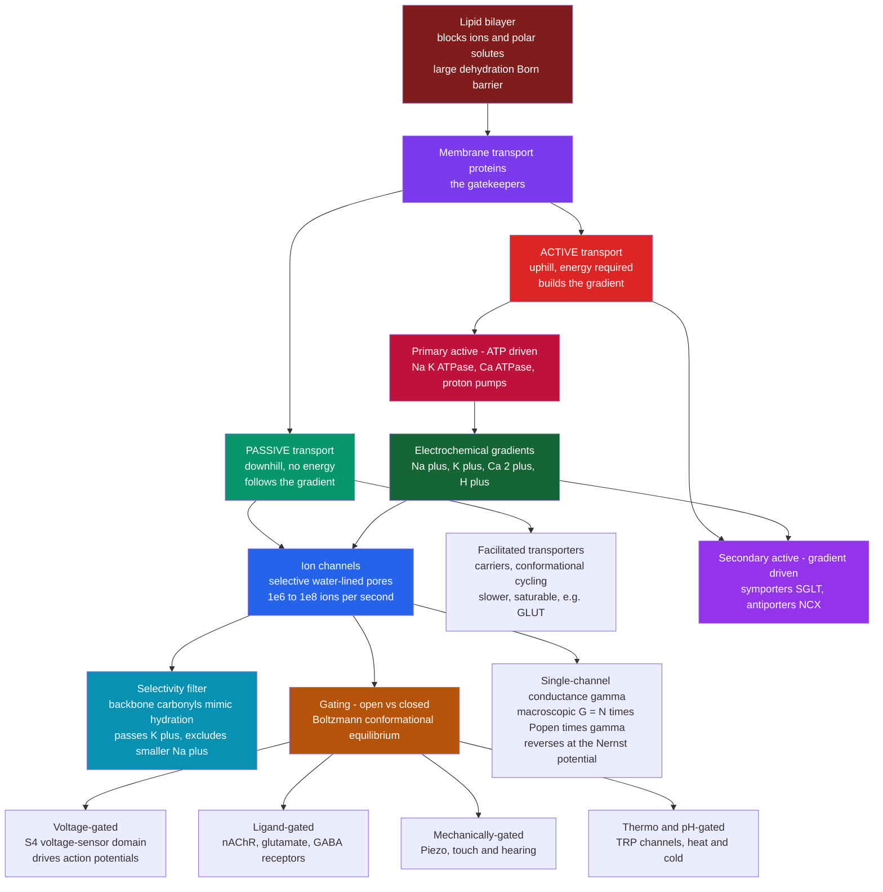

# ⚡ Ion Channels and Transport

> [!abstract] TL;DR
> The lipid bilayer is a superb **insulator**: stripping an ion of its water shell to drag it through the greasy core costs a prohibitive energy (~1.5 eV, tens of $k_BT$), so ions and polar solutes essentially *cannot* cross unaided. Membranes solve this by embedding **transport proteins**. **Ion channels** are gated, selective pores that let a specific ion flow **passively and downhill** at astonishing rates ($10^6$–$10^8$ ions/s, near the diffusion limit) — yet a K⁺ channel conducts K⁺ ~1000× better than the *smaller* Na⁺, a feat achieved by a **selectivity filter** whose backbone carbonyls mimic the ion's hydration shell. **Gating** (voltage, ligand, force, temperature, pH) is a Boltzmann-distributed conformational switch, revealed one molecule at a time by the **patch clamp**. **Pumps** run the process in reverse — burning ATP to push ions *uphill* and build the very gradients that channels later exploit. This machinery underlies all electrical signalling, nutrient uptake, and volume regulation; its failures are **channelopathies** and its proteins are premier **drug targets**.

---

## Intuition

**Analogy:** The cell membrane is a sealed **oily wall** that water-loving ions simply cannot climb over — so the cell drills it with exquisitely engineered **doorways**. Most doorways are **passive turnstiles** (channels): when a signal flips one open, a single specific ion rushes through a million times a second, always in the direction it already wanted to go. But some doorways are **active revolving doors** (pumps): they burn ATP to shove ions *uphill*, against their will, into the crowded side. The two astonishing tricks are (1) a potassium turnstile that waves K⁺ through but slams shut on the *smaller* Na⁺, and (2) gates that snap open on cue — in response to a voltage change, a chemical key, or a physical push.

Technically: the bilayer is a ~5 nm hydrophobic slab whose **Born energy** barrier makes ion permeation vanishingly rare; channels and transporters are the proteins that engineer a low-energy path across it, and the *sign of the energy budget* — spontaneous versus ATP-requiring — is what divides all transport into **passive** and **active**.

---

## How It Works

### The transport problem

An ion in water sits inside a tight cage of oriented water dipoles — its **hydration shell** — worth a large favourable **solvation free energy** (for K⁺, roughly $-300$ kJ/mol). To enter the bilayer's oily core (dielectric constant ~2 versus ~80 for water) the ion must shed that shell and sit in a medium that cannot stabilise its charge. The energetic penalty (the **Born energy**, $\propto q^2/(r\,\varepsilon)$) is tens of $k_BT$, so the bare permeability of a bilayer to Na⁺ or K⁺ is roughly $10^{-12}$ that of water. **This is the problem every cell must solve**: it needs ions to move for signalling and osmotic balance, yet its own membrane forbids them. The solution is a toolkit of membrane **transport proteins** — the gatekeepers deciding what enters and leaves.

### Channels: passive, fast, selective

An **ion channel** is a protein pore that provides a water-lined, low-energy tunnel so the ion never fully dehydrates. Consequences:

1. **Passive and downhill.** A channel is a hole, not a motor. Ions flow *down* their electrochemical gradient; the channel adds no energy and cannot pump uphill. Flip its gate open and current follows the gradient until the gradient is spent.
2. **Blazingly fast.** Because there is no bind-and-cycle chemistry, throughput approaches the **diffusion limit**: $10^6$–$10^8$ ions per second per channel. Channels are among the fastest molecular devices known — orders of magnitude faster than any carrier or enzyme.
3. **Selective.** Each channel passes essentially one ion species. The paradox: the **K⁺ channel** conducts K⁺ ~1000× better than Na⁺ *even though Na⁺ is smaller and should fit through any hole K⁺ fits through*. Roderick MacKinnon's crystal structures (1998, Nobel 2003) resolved it: the **selectivity filter** is a narrow stretch where main-chain **carbonyl oxygens** point into the pore, spaced to reproduce *exactly* the geometry of a K⁺ hydration shell. K⁺ pays no dehydration penalty — the carbonyls substitute for its lost waters. Na⁺, being smaller, cannot simultaneously touch all the carbonyls, so it stays hydrated and is excluded. Permeation is **multi-ion, single-file**: several K⁺ hop through in concert, their mutual electrostatic repulsion helping push each other along.

### Gating: the open/closed switch

A channel is useful only because it is *controlled*. **Gating** is a conformational change that opens or closes the pore, and it obeys a **Boltzmann conformational equilibrium**: the fraction of time open depends on the free-energy difference between the open and closed states, which a **stimulus** tilts. The major gating classes:

- **Voltage-gated** — a charged **voltage-sensor domain** (the S4 helix, studded with positive arginines) moves in the membrane field, opening the pore past a threshold voltage. These are the engines of the **action potential**.
- **Ligand-gated (ionotropic receptors)** — binding a chemical key opens the gate directly and in milliseconds: the **nicotinic acetylcholine receptor** at the neuromuscular junction, **glutamate receptors** (AMPA/NMDA) at excitatory synapses, GABA_A and glycine receptors for inhibition.
- **Mechanically-gated** — membrane tension or force pulls the gate open: **Piezo** channels transduce touch, proprioception, and blood-pressure sensing; related channels underlie hearing (hair-cell transduction) and osmotic sensing. (Ardem Patapoutian & David Julius, Nobel 2021.)
- **Temperature/pH-gated** — **TRP channels** (e.g., TRPV1 opened by heat and capsaicin, TRPM8 by cold and menthol) convert thermal and chemical stimuli into current.

### Measuring one molecule: the patch clamp

Erwin Neher and Bert Sakmann's **patch-clamp** technique (Nobel 1991) presses a fire-polished glass pipette against the membrane to form a gigaohm seal, isolating a patch containing (ideally) a **single channel** and measuring the picoampere current through it. The recording is startling: the current is not smooth but a train of **rectangular pulses** — the channel flips *stochastically* between fully closed (0 pA) and fully open (a fixed amplitude), like a two-state Markov switch. From these traces one reads the **single-channel conductance** $\gamma$ (pulse height / driving force) and the **open probability** $P_{open}$ (fraction of time open). Patch clamp is the foundational method of channel biophysics.

### Conductance and I–V relations

- **Single-channel conductance** $\gamma$ (typically 1–100 pS) relates the open-channel current to the driving force: $i = \gamma\,(V - E_{rev})$.
- **Macroscopic conductance** is the ensemble sum: $\boxed{G = N \cdot P_{open} \cdot \gamma}$ for $N$ channels — a smooth curve emerging from many stochastic switches (the law of large numbers made physiological).
- **Reversal potential** $E_{rev}$: the voltage at which current *reverses sign* because there is no net driving force. For a perfectly selective channel this equals the permeant ion's **Nernst potential** $E_{ion} = \frac{RT}{zF}\ln\frac{[\text{ion}]_{out}}{[\text{ion}]_{in}}$ — the equilibrium voltage where the electrical and concentration forces exactly cancel. Measuring $E_{rev}$ therefore *identifies* which ion a channel passes.

### Pumps and secondary transport: active, uphill

To build gradients in the first place you need **active transport**, which spends energy to move ions *against* their electrochemical gradient:

- **Primary active transport** hydrolyses ATP directly. The **Na⁺/K⁺-ATPase** exports 3 Na⁺ and imports 2 K⁺ per ATP (electrogenic; consumes up to ~70% of a neuron's ATP budget), setting up the Na⁺/K⁺ gradients that everything else runs on. The **Ca²⁺-ATPase (SERCA/PMCA)** keeps cytosolic Ca²⁺ ~10,000× below extracellular; **proton pumps** (V-ATPase, gastric H⁺/K⁺-ATPase) acidify organelles and the stomach.
- **Secondary active transport** couples an ion's *downhill* flow to another solute's *uphill* climb — no direct ATP. **Symporters** move both the same way (**SGLT1**, the Na⁺–glucose cotransporter that pulls glucose into the gut against its gradient using the Na⁺ gradient); **antiporters/exchangers** move them oppositely (the **Na⁺/Ca²⁺ exchanger**, NCX, using Na⁺ influx to extrude Ca²⁺). The energetics are pure gradient bookkeeping: the free energy released by the driver ion's descent must exceed that needed to lift the cargo.

**Aquaporins** round out the family — passive **water channels** (Peter Agre, Nobel 2003) that let water cross ~$10^9$ molecules/s while excluding protons — alongside the broad class of facilitated carriers (GLUT glucose transporters, neurotransmitter reuptake transporters, and more).

### Flow / Architecture



---

## Key Concepts

### Secondary (intuitive)
- The membrane is an **oily wall** ions cannot cross by themselves; the cell installs **protein doorways**.
- **Channels are turnstiles**: passive, super-fast, and picky about which ion they admit; they only work when a **gate** is flipped open.
- **Pumps are revolving doors** that spend ATP to force ions **uphill**, creating the imbalances (lots of K⁺ inside, lots of Na⁺ outside) that channels later cash in.
- Gates open in response to **voltage** (electrical signals), **chemical keys** (neurotransmitters), **force** (touch, sound), or **temperature** (hot/cold sensing).
- A **patch clamp** can eavesdrop on **one** channel, hearing it click open and shut at random.

### Undergraduate (quantitative)
- **Passive vs active** is a thermodynamic distinction: passive transport follows $\Delta\tilde\mu < 0$ (electrochemical potential decreasing); active transport drives $\Delta\tilde\mu > 0$ and must be coupled to an energy source (ATP or another ion's gradient).
- **Nernst / reversal potential:** $E_{ion} = \frac{RT}{zF}\ln\frac{[\text{ion}]_{out}}{[\text{ion}]_{in}}$; at 37 °C, $RT/F \approx 26.7$ mV, giving $E_K \approx -95$ mV, $E_{Na} \approx +60$ mV, $E_{Ca} \approx +120$ mV.
- **Single-channel Ohm's law:** $i = \gamma\,(V - E_{rev})$; **macroscopic** current $I = N\,P_{open}(V)\,\gamma\,(V - E_{rev})$.
- **Boltzmann gating:** $P_{open}(V) = \dfrac{1}{1 + \exp\!\big[-\frac{zF}{RT}(V - V_{1/2})\big]}$, a sigmoid centred at half-activation $V_{1/2}$ with steepness set by the effective **gating charge** $z$.
- **Selectivity** arises from a **snug-fit / dehydration** trade-off, not merely pore size — the filter must repay the ion's solvation energy to pass it.

### Graduate (advanced)
- **Two-state kinetics:** the closed↔open switch is a Markov process with rates $\alpha$ (opening) and $\beta$ (closing); $P_{open}^{ss} = \alpha/(\alpha+\beta)$, mean open dwell $= 1/\beta$, and the current-noise **variance–mean** relation $\sigma^2 = iI - I^2/N$ yields $i$ and $N$ from **non-stationary noise analysis**. Real channels need multi-state schemes (multiple closed states, **inactivation**).
- **Permeation energetics:** PNP (Poisson–Nernst–Planck) continuum theory, Eyring rate barriers, and MD/free-energy (PMF) calculations describe multi-ion single-file conduction; the knock-on mechanism explains near-diffusion-limited K⁺ throughput despite tight binding.
- **Voltage sensing:** gating charge $Q$ measured as **gating current**; the S4 sliding-helix / paddle models; the coupling of sensor displacement to pore opening (electromechanical coupling).
- **Thermodynamics of coupling** in secondary transporters (alternating-access model); stoichiometry sets the maximum gradient a symporter can build ($\Delta\tilde\mu_{cargo} \le n\,\Delta\tilde\mu_{driver}$).
- These threads connect directly to the not-yet-written siblings *Membrane_Potential_and_the_Nernst_Equation* (the equilibrium voltage a single ion sets), *The_Hodgkin_Huxley_Model_and_Action_Potentials* (voltage-gated Na⁺/K⁺ conductances assembled into a spike), *Membranes_and_Lipid_Bilayers* (the barrier these proteins pierce), and *Bioelectricity_and_Cellular_Signaling_Physics* (channels and pumps as the circuit elements of the cell), while the gating equilibrium itself is a straight application of [[Statistical_Mechanics_of_Biomolecules]].

---

## Python Demo

```python
# Ion-channel biophysics from three angles:
#   (A) single-channel patch-clamp trace as a two-state (closed/open) Markov
#       process -> square-pulse current, amplitude histogram, open probability
#   (B) voltage gating: Boltzmann P_open(V) sigmoid, and how N channels sum
#       into a smooth macroscopic conductance  G = N * P_open * gamma
#   (C) current-voltage (I-V) relations reversing at the Nernst potential
import numpy as np
import matplotlib.pyplot as plt

rng = np.random.default_rng(7)

# ---- physical constants & channel parameters --------------------------------
R, F, T = 8.314, 96485.0, 310.0          # J/mol/K, C/mol, body temperature K
RT_F    = R * T / F                       # ~0.0267 V  (26.7 mV)
gamma   = 20e-12                          # single-channel conductance, 20 pS
z       = 1                               # K+ charge for the Nernst potential

# K+ concentrations (mM) -> Nernst / reversal potential
K_out, K_in = 4.0, 140.0
E_rev = (RT_F / z) * np.log(K_out / K_in)          # volts  (~ -0.095 V)

# ============================================================================
# PART A - single-channel patch clamp: two-state Markov switch
# ============================================================================
dt      = 0.1e-3                          # 0.1 ms sample interval
n_pts   = 20000                           # 2 s recording
alpha   = 0.5e3                           # opening rate  (1/s)  -> per ms 0.5
beta    = 1.5e3                           # closing rate  (1/s)  -> per ms 1.5
p_co    = alpha * dt                      # P(closed->open) per step
p_oc    = beta  * dt                      # P(open->closed) per step

V_hold  = -0.020                          # holding potential, -20 mV
i_open  = gamma * (V_hold - E_rev)        # open-channel amplitude (A) -> ~1.5 pA

state = np.zeros(n_pts, dtype=int)        # 0 = closed, 1 = open
for k in range(1, n_pts):
    u = rng.random()
    if state[k-1] == 0:                   # currently closed
        state[k] = 1 if u < p_co else 0
    else:                                 # currently open
        state[k] = 0 if u < p_oc else 1

noise   = rng.normal(0.0, 0.20e-12, n_pts)          # 0.2 pA baseline noise
current = state * i_open + noise                    # amps
t_ms    = np.arange(n_pts) * dt * 1e3

P_open_sim   = state.mean()
P_open_theory = alpha / (alpha + beta)
print(f"Nernst / reversal potential E_K = {E_rev*1e3:6.1f} mV")
print(f"open-channel current i         = {i_open*1e12:5.2f} pA")
print(f"P_open  simulated / theory     = {P_open_sim:.3f} / {P_open_theory:.3f}")

# ============================================================================
# PART B - voltage gating: Boltzmann activation + macroscopic conductance
# ============================================================================
V     = np.linspace(-0.100, 0.060, 400)   # -100 .. +60 mV
V_half = -0.020                            # half-activation, -20 mV
z_gate = 4.0                               # effective gating charge
P_openV = 1.0 / (1.0 + np.exp(-(z_gate * F / (R * T)) * (V - V_half)))

N_ch   = 1000                              # channels in the membrane
G_macro = N_ch * P_openV * gamma           # siemens  ->  up to 20 nS

# ============================================================================
# PART C - current-voltage (I-V) relations, reversing at E_rev
# ============================================================================
i_single = gamma * (V - E_rev)                         # single channel (ohmic)
I_macro  = N_ch * P_openV * gamma * (V - E_rev)        # gated, outward-rectifying

# ============================================================================
# Plots
# ============================================================================
fig, ax = plt.subplots(2, 2, figsize=(12, 9))

# (1) single-channel square-pulse trace (first 400 ms window)
w = t_ms < 400
ax[0, 0].plot(t_ms[w], current[w] * 1e12, lw=0.7, color="#2563eb")
ax[0, 0].axhline(0, color="grey", lw=0.8, ls=":")
ax[0, 0].axhline(i_open * 1e12, color="#dc2626", lw=0.8, ls="--", label="open level")
ax[0, 0].set_title(f"Single-channel patch clamp  (P_open = {P_open_sim:.2f})")
ax[0, 0].set_xlabel("time (ms)"); ax[0, 0].set_ylabel("current (pA)")
ax[0, 0].legend(loc="upper right"); ax[0, 0].grid(alpha=0.3)

# (2) amplitude histogram: closed peak near 0, open peak near i_open
ax[0, 1].hist(current * 1e12, bins=120, orientation="horizontal",
              color="#0891b2", alpha=0.8)
ax[0, 1].axhline(0, color="grey", lw=0.8, ls=":")
ax[0, 1].axhline(i_open * 1e12, color="#dc2626", lw=0.8, ls="--")
ax[0, 1].set_title("Amplitude histogram: closed vs open")
ax[0, 1].set_xlabel("counts"); ax[0, 1].set_ylabel("current (pA)")
ax[0, 1].grid(alpha=0.3)

# (3) Boltzmann voltage-activation curve + macroscopic conductance (twin axis)
ax[1, 0].plot(V * 1e3, P_openV, lw=2, color="#b45309", label="P_open (Boltzmann)")
ax[1, 0].axvline(V_half * 1e3, color="grey", ls=":", lw=0.8)
ax[1, 0].set_xlabel("voltage (mV)"); ax[1, 0].set_ylabel("P_open")
ax[1, 0].set_title("Voltage gating -> smooth macroscopic conductance")
axb = ax[1, 0].twinx()
axb.plot(V * 1e3, G_macro * 1e9, lw=2, ls="--", color="#166534",
         label="G = N * P_open * gamma")
axb.set_ylabel("G (nS)")
ax[1, 0].legend(loc="upper left"); axb.legend(loc="lower right")
ax[1, 0].grid(alpha=0.3)

# (4) I-V curves: single-channel ohmic line and gated macroscopic current
ax[1, 1].plot(V * 1e3, i_single * 1e12, lw=2, color="#2563eb",
              label="single channel (pA)")
axr = ax[1, 1].twinx()
axr.plot(V * 1e3, I_macro * 1e9, lw=2, ls="--", color="#9333ea",
         label="macroscopic (nA)")
axr.set_ylabel("macroscopic I (nA)")
ax[1, 1].axhline(0, color="grey", lw=0.8, ls=":")
ax[1, 1].axvline(E_rev * 1e3, color="#dc2626", lw=1.0, ls="--",
                 label=f"E_rev = {E_rev*1e3:.0f} mV")
ax[1, 1].set_title("I-V relations reverse at the Nernst potential")
ax[1, 1].set_xlabel("voltage (mV)"); ax[1, 1].set_ylabel("single-channel i (pA)")
ax[1, 1].legend(loc="upper left"); axr.legend(loc="lower right")
ax[1, 1].grid(alpha=0.3)

plt.tight_layout()
plt.show()
```

**What you should see:** Part A prints $E_K \approx -95$ mV and a single-channel amplitude of ~1.5 pA, with the simulated $P_{open}$ matching $\alpha/(\alpha+\beta)=0.25$; the trace is a train of **rectangular openings** and the amplitude histogram is **bimodal** (a tall closed peak at 0 pA, a shorter open peak at ~1.5 pA). Part B's Boltzmann curve is a **steep sigmoid** through $V_{1/2}=-20$ mV, and the ensemble conductance $G=N P_{open}\gamma$ rises smoothly to ~20 nS — a clean macroscopic quantity built from stochastic switches. Part C shows the single-channel **ohmic line** and the gated macroscopic current **both crossing zero at $E_{rev}=E_K$**, illustrating why the reversal potential equals the permeant ion's Nernst potential.

---

## Real-World Applications

> **Example — the nerve impulse (patch clamp meets Hodgkin–Huxley).** The action potential is nothing but voltage-gated channels obeying exactly the equations above: depolarisation raises $P_{open}$ of Na⁺ channels (Boltzmann activation), Na⁺ rushes *toward* $E_{Na}\approx+60$ mV, then Na⁺ inactivates while slower K⁺ channels open and drive the membrane back toward $E_K\approx-95$ mV. Every term — $\gamma$, $P_{open}(V)$, $E_{rev}$ — was first measured with patch clamp on single channels, then summed into the macroscopic conductances of the spike.

- **Kidney and gut nutrient uptake.** **SGLT1** (Na⁺–glucose symport) drives glucose absorption uphill using the Na⁺ gradient — the molecular basis of **oral rehydration therapy** (glucose + salt water rescues cholera patients by boosting Na⁺-and-water absorption).
- **Sensory transduction.** **Piezo2** converts skin indentation into current (touch); hair-cell mechanotransduction channels do the same for **sound**; **TRPV1** reports painful heat and capsaicin, **TRPM8** cold and menthol.
- **Cardiac and neuronal rhythm.** The interplay of Na⁺, Ca²⁺, and K⁺ channels sets the heartbeat and neuronal firing; the Na⁺/Ca²⁺ exchanger (**NCX**) and Ca²⁺-ATPase reset Ca²⁺ each beat.
- **Channelopathies (disease).** **CFTR** (a Cl⁻ channel) mutations cause **cystic fibrosis**; loss-of-function K⁺/Na⁺ channel mutants cause **long-QT arrhythmias** and **epilepsy**; Na_V1.7 mutations cause inherited **pain** syndromes (or painlessness).
- **Pharmacology.** Channels/transporters are premier **drug targets**: local **anaesthetics** and **antiarrhythmics** block Na⁺ channels, **calcium-channel blockers** treat hypertension, **benzodiazepines** allosterically potentiate GABA_A, and **SSRIs** block the serotonin *transporter*.

---

## Common Pitfalls

- **"Channels can pump."** No. A channel is a passive hole; it moves ions only **downhill** and equilibrates at $E_{rev}$. Building a gradient requires a **pump** (primary) or a coupled gradient (secondary). Confusing the two breaks all the energetics.
- **"Smaller ions always permeate more easily."** The K⁺-over-Na⁺ paradox is the whole point: selectivity comes from a **snug-fit / dehydration** match, not a sieve. A filter tuned to K⁺'s hydration geometry *excludes* the smaller Na⁺.
- **"Single-channel current is tiny, so it's noise."** The pA square pulses are the *signal* — real, quantised openings of one molecule. Treating them as artefact throws away the entire information content of patch clamp.
- **"Reversal potential is a property of the channel voltage."** $E_{rev}$ is set by the **concentration gradient** (Nernst), not the channel; change $[K^+]_{out}$ and $E_{rev}$ shifts even though the protein is unchanged. This is exactly how experimenters identify the permeant ion.
- **"Macroscopic conductance is smooth because each channel is smooth."** It is smooth because **many** stochastic two-state switches average out ($G = N P_{open}\gamma$). At small $N$ the current is visibly noisy — the basis of noise analysis to extract $\gamma$ and $N$.
- **"Facilitated diffusion and secondary active transport are the same because both use carriers."** Facilitated diffusion is passive (downhill only); a symporter/antiporter is **active**, storing energy from one gradient to move the other uphill.

---

## Related Concepts

- [[The_Cell_Membrane_and_Transport]] — the biology-level overview of passive/active transport, osmosis, and the Na⁺/K⁺ pump this note deepens with single-channel physics.
- [[Ion_Channels_and_Receptor_Pharmacology]] — the neuroscience view of ionotropic vs metabotropic receptors and how drugs (agonists, antagonists, allosteric modulators) act on these gates.
- [[Action_Potentials_and_Resting_Membrane_Potential]] — voltage-gated channels and pumps assembled into the resting potential and the spike.
- [[Synaptic_Transmission_and_Neurotransmitters]] — ligand-gated channels are the fast machinery of chemical synapses.
- [[Electrochemistry]] — supplies the Nernst equation and electrochemical-potential formalism behind reversal potentials and gradient energetics.
- [[Statistical_Mechanics_of_Biomolecules]] — Boltzmann gating equilibria and two-state occupancy are direct applications of this framework.
- [[Membranes_and_Cell_Signaling]] — the biochemistry of the bilayer and receptor signalling these transport proteins are embedded in.
- [[Energy_Entropy_and_Free_Energy_in_Biology]] — the free-energy accounting that distinguishes passive from active transport.
- [[Protein_Structure_and_Folding]] — the structural biophysics (selectivity filters, voltage-sensor domains) that makes selectivity and gating possible.
- [[Pain_and_Nociception]] — TRP and Na_V channels as the molecular sensors of noxious stimuli.
- [[Auditory_System_and_Sound_Processing]] — mechanotransduction channels convert sound-induced force into current.
- [[Bioenergetics_and_ATP]] — the ATP currency that primary active pumps hydrolyse.

---

## Review Questions

1. **(Conceptual)** A potassium channel conducts K⁺ ~1000× better than the *smaller* Na⁺. Explain, in terms of hydration energy and the selectivity filter's backbone carbonyls, why being smaller does not help Na⁺ — and why a rigid "sieve by size" model fails here.
2. **(Scenario)** In a patch-clamp recording you measure single-channel pulses of 2 pA at a holding potential of 0 mV, and the current reverses at −80 mV. (a) What is the single-channel conductance $\gamma$? (b) Which ion is most likely permeant, and how does $E_{rev}$ tell you? (c) If you raise $[K^+]_{out}$ from 4 to 40 mM, which way does $E_{rev}$ move and by roughly how much?
3. **(Trade-off)** A cell must accumulate glucose from a lumen where glucose is *lower* than inside the cell. Compare using (i) a GLUT facilitated transporter and (ii) an SGLT Na⁺-coupled symporter. Which can do it, what is the energy source, and what upstream pump makes it possible — and what happens to glucose uptake if you poison the Na⁺/K⁺-ATPase?

---

## Sources

- Bertil Hille, *Ion Channels of Excitable Membranes*, 3rd ed., Sinauer Associates (2001).
- Doyle, D. A., et al. "The Structure of the Potassium Channel: Molecular Basis of K⁺ Conduction and Selectivity." *Science* 280, 69–77 (1998).
- Neher, E. & Sakmann, B. "Single-channel currents recorded from membrane of denervated frog muscle fibres." *Nature* 260, 799–802 (1976).
- Rob Phillips, Jane Kondev, Julie Theriot & Hernan Garcia, *Physical Biology of the Cell*, 2nd ed., Garland Science (2012).
- Coste, B., et al. "Piezo1 and Piezo2 Are Essential Components of Distinct Mechanically Activated Cation Channels." *Science* 330, 55–60 (2010).

---

#biophysics #ion-channels #patch-clamp #membrane-transport #selectivity
