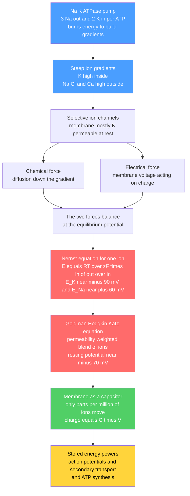

# ⚡ Membrane Potential and the Nernst Equation

> [!abstract] TL;DR
> Every living cell is a tiny battery. Ion pumps — above all the **Na⁺/K⁺-ATPase** — burn ATP to stack the deck: high K⁺ inside, high Na⁺, Cl⁻, and Ca²⁺ outside. Because the membrane is a near-perfect insulator pierced only by **selective ion channels**, ions leaking down their gradients pile up charge until an **electrical force** exactly cancels the **diffusive force**. That balance point for a single ion is the **Nernst equilibrium potential**, $E = \frac{RT}{zF}\ln\frac{[\text{out}]}{[\text{in}]}$ — about $-90$ mV for K⁺ and $+60$ mV for Na⁺. Because several ions are permeant at once, the **resting potential** ($\approx -70$ mV, inside negative) is a permeability-weighted blend of these, given by the **Goldman-Hodgkin-Katz** equation. Astonishingly, only a few parts per million of the cell's ions need to move to charge the membrane, because the thin lipid bilayer is a superb capacitor. This stored electrochemical energy is the power source for nerve and muscle signaling, secondary active transport, and ATP synthesis.

---

## Intuition

**Analogy:** A living cell is a rechargeable battery, and its power outlet is a membrane just five nanometers thick. Molecular pumps in that membrane work like a tiny hand-cranked charger, shoving positive ions across against their will until the inside of the cell sits at a voltage relative to the outside — only about a tenth of a volt, but spread across a film so thin that the electric field inside it, roughly ten million volts per meter, actually *exceeds* the field that ionizes air in a lightning strike. Poke a hole in this membrane and current flows, just like short-circuiting a battery. That is exactly what a nerve does when it fires.

Where does the voltage come from? A beautiful tug-of-war. An ion trapped in a high-concentration compartment "wants" to diffuse to the dilute side (the **chemical force**, pure crowd-spreading entropy). But every ion carries charge, so as they leak across they leave the origin side charged and build a voltage that pulls them back (the **electrical force**). The two forces grow until they exactly balance — and the voltage at that standoff is the cell's resting potential. The whole of bioelectricity is bookkeeping on this one balance.

---

## How It Works

### 1. Pumps build the gradients (charging the battery)

Left alone, ions would mix until concentrations equalized and no battery would exist. Cells prevent this by spending energy. The **Na⁺/K⁺-ATPase** hydrolyzes one ATP to pump **3 Na⁺ out and 2 K⁺ in** against their gradients, running continuously in every cell. The result is a set of steep, maintained gradients (mammalian, in mM):

| Ion | Outside | Inside | Role |
|-----|---------|--------|------|
| K⁺ | ~5 | ~140 | high inside; sets resting potential |
| Na⁺ | ~145 | ~15 | high outside; drives depolarization and cotransport |
| Cl⁻ | ~110 | ~10 | high outside; inhibitory in neurons |
| Ca²⁺ | ~2 | ~0.0001 | ~10,000-fold gradient; a signaling messenger |

These gradients are **stored free energy**, exactly analogous to charge separated on a capacitor — the deeper physics of that storage is developed in the sibling note *Energy_Entropy_and_Free_Energy_in_Biology*.

### 2. Selective permeability turns gradients into voltage

The lipid bilayer itself is impermeable to ions; they can only cross through **channels**, and channels are selective (a K⁺ channel passes K⁺ far better than Na⁺). This selectivity is decisive: **the ion that the membrane is most permeable to dominates the voltage.** At rest the membrane is mostly K⁺-permeable, so the resting potential sits close to the K⁺ equilibrium potential. Open Na⁺ channels and the voltage swings toward Na⁺ — the essence of signaling, elaborated in the sibling notes *Ion_Channels_and_Transport* and *The_Hodgkin_Huxley_Model_and_Action_Potentials*.

### 3. The two forces and the Nernst equation

Consider K⁺, permeant and 28× more concentrated inside. It diffuses out (chemical force), leaving the interior negative. That growing negativity pulls K⁺ back in (electrical force). **Equilibrium** is where the two exactly cancel. Setting the electrochemical potential difference to zero — the same Boltzmann-distribution logic developed in *Statistical_Mechanics_of_Biomolecules* — gives the **Nernst equation**:

$$E_{\text{ion}} = \frac{RT}{zF}\ln\frac{[\text{ion}]_{\text{out}}}{[\text{ion}]_{\text{in}}}$$

where $R$ is the gas constant, $T$ the temperature, $z$ the ionic charge, and $F$ the Faraday constant. At body temperature $\frac{RT}{F}\approx 26.7$ mV, so the potential changes by about **61 mV per tenfold** concentration ratio (for a monovalent ion). This yields $E_K \approx -89$ mV, $E_{Na} \approx +61$ mV, $E_{Cl} \approx -64$ mV, and $E_{Ca} \approx +130$ mV. The Nernst potential is the "target" voltage each ion is trying to drag the membrane toward.

### 4. Many ions at once: the Goldman-Hodgkin-Katz equation

Real membranes leak several ions simultaneously, each with its own permeability $P$. The steady-state voltage is a **permeability-weighted average** of the Nernst potentials, the **GHK voltage equation**:

$$V_m = \frac{RT}{F}\ln\frac{P_K[\text{K}]_o + P_{Na}[\text{Na}]_o + P_{Cl}[\text{Cl}]_i}{P_K[\text{K}]_i + P_{Na}[\text{Na}]_i + P_{Cl}[\text{Cl}]_o}$$

(note Cl⁻ appears "flipped" because of its negative charge). With resting permeabilities roughly $P_K : P_{Na} : P_{Cl} = 1 : 0.03 : 0.1$, this returns $\approx -70$ mV — near $E_K$ but pulled slightly positive by the small Na⁺ leak. Crank up $P_{Na}$ and $V_m$ marches toward $E_{Na}$: that is a spike.

### 5. The membrane is a capacitor — very few ions actually move

The bilayer ($\sim$5 nm of insulating hydrocarbon) is an excellent capacitor, $C_m \approx 1\ \mu\text{F/cm}^2$. From $Q = C V$, charging to $-70$ mV needs only $\sim 7\times10^{-8}$ C/cm² — a **tiny** number of ions (a few parts per million of the cytoplasmic pool). So the bulk concentrations barely change even as the voltage swings; the membrane potential is a thin skin of charge on the capacitor, not a wholesale redistribution of ions.



---

## Key Concepts

### Secondary Level

- **The cell is a battery.** A voltage (about $-70$ mV, inside negative) sits across every cell membrane, storing energy the cell can release to send signals.
- **Pumps do the charging.** Proteins burn ATP to pump Na⁺ out and K⁺ in, keeping K⁺ high inside and Na⁺ high outside — like winding up a spring.
- **Two pulls on an ion.** An ion is pushed by diffusion (from crowded to empty) and pulled by voltage (opposite charges attract). The resting voltage is where these two exactly balance.
- **Channels choose.** Ions cross only through selective channels; whichever ion has the most open channels controls the voltage.

### Undergraduate Level

- **Nernst equation:** $E = \frac{RT}{zF}\ln\frac{[\text{out}]}{[\text{in}]}$. The voltage that stops net flow of one ion. Slope $\approx 61$ mV per decade of concentration ratio at 37 °C (halved for divalent ions).
- **Equilibrium potentials:** $E_K \approx -90$ mV, $E_{Na} \approx +60$ mV, $E_{Cl} \approx -65$ mV, $E_{Ca} \approx +130$ mV. Each ion tugs $V_m$ toward its own $E$.
- **GHK / Goldman equation:** the resting potential is a permeability-weighted average of Nernst potentials. Because $P_K$ dominates at rest, $V_m$ sits near $E_K$; the small $P_{Na}$ leak is why it is not exactly $E_K$.
- **Driving force:** the *net* push on an ion is $(V_m - E_{\text{ion}})$; current is $I = g\,(V_m - E_{\text{ion}})$. At $V_m = E$, no net flow.
- **Membrane capacitance:** $C_m \approx 1\ \mu\text{F/cm}^2$; $Q = CV$ means only a whisper of ions must cross to change the voltage.

### Graduate Level

- **Thermodynamic derivation:** set the electrochemical potential $\tilde\mu = \mu^0 + RT\ln c + zF\phi$ equal across the membrane. $\Delta\tilde\mu = 0$ gives the Nernst equation directly — it is the Boltzmann distribution of ions in an electrostatic potential (see *Statistical_Mechanics_of_Biomolecules*).
- **GHK from constant-field theory:** the Goldman equation assumes a constant electric field across the membrane and integrates the Nernst-Planck flux equation for each ion; permeabilities $P = D\beta/L$ fold together diffusion coefficient, partition, and thickness. It is a *steady-state* (zero net current), not a true equilibrium.
- **Electrodiffusion vs equivalent circuit:** GHK (continuous flux) and the parallel-conductance model $V_m = \frac{g_K E_K + g_{Na}E_{Na} + g_{Cl}E_{Cl}}{g_K + g_{Na} + g_{Cl}}$ are two complementary formalisms; conductances $g$ and permeabilities $P$ are related but not identical.
- **The pump's electrogenic contribution:** because 3 Na⁺ leave for every 2 K⁺ entering, the Na⁺/K⁺-ATPase carries net outward current and adds a few mV of hyperpolarization beyond what passive GHK predicts.
- **Space and cable structure:** in extended cells the membrane potential varies with position; the full treatment couples GHK boundary conditions to cable theory, the bridge to *The_Hodgkin_Huxley_Model_and_Action_Potentials*.
- **Measurement:** sharp glass **microelectrodes**, the **patch clamp** (giga-ohm seal, single-channel and whole-cell recording; Neher and Sakmann, Nobel 1991), and **voltage-sensitive dyes / genetically encoded voltage indicators** for optical readout.

---

## Python Demo

```python
# Membrane potential from first principles:
#   (a) NERNST equilibrium potentials for K+, Na+, Cl-, Ca2+, and their
#       dependence on the concentration ratio (slope ~ 61 mV / decade, z=1).
#   (b) GOLDMAN-HODGKIN-KATZ resting potential and how it swings toward E_Na
#       as sodium permeability rises (a foreshadowing of the action potential).
#   (c) The membrane as a CAPACITOR: how few ions must move to reach -70 mV.
# Requires: numpy, matplotlib
import numpy as np
import matplotlib.pyplot as plt

# ----- Physical constants -----
R  = 8.314        # J / (mol K)   gas constant
F  = 96485.0      # C / mol       Faraday constant
T  = 310.0        # K             body temperature (37 C)
RT_F = R * T / F  # ~0.0267 V  ->  26.7 mV  (the Nernst prefactor for z = 1)

# ----- Physiological concentrations (mM), (charge z) -----
ions = {
    "K+":   dict(out=5.0,   inn=140.0,  z=+1, color="#1f77b4"),
    "Na+":  dict(out=145.0, inn=15.0,   z=+1, color="#d62728"),
    "Cl-":  dict(out=110.0, inn=10.0,   z=-1, color="#2ca02c"),
    "Ca2+": dict(out=2.0,   inn=1.0e-4, z=+2, color="#9467bd"),
}

def nernst_mV(out, inn, z):
    """Nernst equilibrium potential in millivolts."""
    return (RT_F / z) * np.log(out / inn) * 1000.0

# =====================================================================
# (a) Nernst equilibrium potentials
# =====================================================================
E = {ion: nernst_mV(d["out"], d["inn"], d["z"]) for ion, d in ions.items()}
for ion, e in E.items():
    print(f"E_{ion:4s} = {e:+7.1f} mV")

# Dependence on concentration ratio: E vs (out/in) for z=1 and z=2
ratio = np.logspace(-2, 2, 400)             # [out]/[in] from 0.01 to 100
E_z1  = RT_F * np.log(ratio) * 1000.0        # monovalent  -> ~61 mV/decade
E_z2  = (RT_F / 2) * np.log(ratio) * 1000.0  # divalent    -> ~31 mV/decade

# =====================================================================
# (b) Goldman-Hodgkin-Katz resting potential vs sodium permeability
# =====================================================================
Ko, Ki   = ions["K+"]["out"],  ions["K+"]["inn"]
Nao, Nai = ions["Na+"]["out"], ions["Na+"]["inn"]
Clo, Cli = ions["Cl-"]["out"], ions["Cl-"]["inn"]

def ghk_mV(pK, pNa, pCl):
    num = pK*Ko + pNa*Nao + pCl*Cli    # Cl flipped (negative charge)
    den = pK*Ki + pNa*Nai + pCl*Clo
    return RT_F * np.log(num / den) * 1000.0

pK, pCl = 1.0, 0.1                          # fixed reference permeabilities
pNa_ratio = np.logspace(-2, 1.5, 400)       # P_Na / P_K sweep: 0.01 -> ~32
Vm = np.array([ghk_mV(pK, r*pK, pCl) for r in pNa_ratio])

V_rest = ghk_mV(pK, 0.03*pK, pCl)           # resting: P_Na/P_K = 0.03
V_peak = ghk_mV(pK, 20.0*pK, pCl)           # spike:   P_Na/P_K = 20
print(f"\nResting Vm (P_Na/P_K=0.03) = {V_rest:+6.1f} mV")
print(f"Peak    Vm (P_Na/P_K=20)   = {V_peak:+6.1f} mV  (approaches E_Na)")

# =====================================================================
# (c) The membrane as a capacitor: how few ions must move?
# =====================================================================
Cm   = 1.0e-6            # F / cm^2   specific membrane capacitance
Vm70 = 70e-3            # V          target voltage magnitude
e_ch = 1.602e-19        # C          elementary charge
NA   = 6.022e23         # 1/mol      Avogadro's number

Q_per_cm2  = Cm * Vm70                      # C / cm^2  (Q = C V)
ions_per_cm2 = Q_per_cm2 / e_ch             # charges / cm^2 that must cross

# For a spherical cell of radius 25 microns:
r_cm  = 25e-4
area  = 4*np.pi*r_cm**2                      # cm^2
vol_L = (4/3)*np.pi*r_cm**3 * 1e-3           # cm^3 -> L
ions_moved = ions_per_cm2 * area             # charges crossing the whole cell
K_total    = Ki*1e-3 * vol_L * NA            # total intracellular K+ ions
fraction   = ions_moved / K_total
E_field    = Vm70 / 5e-9                      # V/m across a 5 nm membrane
print(f"\nCharge to reach -70 mV      = {ions_per_cm2:.3e} ions/cm^2")
print(f"Ions crossing (25 um cell)  = {ions_moved:.3e}")
print(f"Total intracellular K+      = {K_total:.3e}")
print(f"Fraction of K+ that moves   = {fraction:.2e}  (~parts per million)")
print(f"Electric field in membrane  = {E_field:.2e} V/m")

# =====================================================================
# PLOTS
# =====================================================================
fig, ax = plt.subplots(2, 2, figsize=(12, 9))

# (a1) bar chart of Nernst potentials
names  = list(E.keys())
vals   = [E[n] for n in names]
colors = [ions[n]["color"] for n in names]
ax[0,0].bar(names, vals, color=colors)
ax[0,0].axhline(-70, ls="--", color="gray", label="resting Vm ~ -70 mV")
ax[0,0].axhline(0, color="black", lw=0.8)
ax[0,0].set_ylabel("Equilibrium potential (mV)")
ax[0,0].set_title("(a) Nernst potentials at physiological concentrations")
for i, v in enumerate(vals):
    ax[0,0].text(i, v + (6 if v >= 0 else -12), f"{v:+.0f}", ha="center")
ax[0,0].legend()

# (a2) E vs concentration ratio
ax[0,1].semilogx(ratio, E_z1, color="#d62728", lw=2, label="z = +1 (~61 mV/decade)")
ax[0,1].semilogx(ratio, E_z2, color="#9467bd", lw=2, label="z = +2 (~31 mV/decade)")
ax[0,1].axhline(0, color="black", lw=0.8)
ax[0,1].axvline(1, ls=":", color="gray")
ax[0,1].set_xlabel("[out] / [in]")
ax[0,1].set_ylabel("Nernst potential (mV)")
ax[0,1].set_title("(a) Voltage vs concentration ratio")
ax[0,1].legend()

# (b) GHK resting potential vs P_Na/P_K
ax[1,0].semilogx(pNa_ratio, Vm, color="#1f77b4", lw=2)
ax[1,0].axhline(E["K+"],  ls="--", color="#1f77b4", label=f"E_K = {E['K+']:.0f} mV")
ax[1,0].axhline(E["Na+"], ls="--", color="#d62728", label=f"E_Na = {E['Na+']:.0f} mV")
ax[1,0].scatter([0.03], [V_rest], color="black", zorder=5)
ax[1,0].annotate("rest ~ -70 mV", (0.03, V_rest), textcoords="offset points",
                 xytext=(10, -18))
ax[1,0].set_xlabel("Sodium permeability ratio  P_Na / P_K")
ax[1,0].set_ylabel("Resting potential Vm (mV)")
ax[1,0].set_title("(b) GHK: raising P_Na swings Vm toward E_Na")
ax[1,0].legend(loc="center right")

# (c) how few ions move: total K+ vs ions crossing (log scale)
ax[1,1].bar(["Total K+\ninside cell", "Ions crossing\nfor -70 mV"],
            [K_total, ions_moved], color=["#1f77b4", "#ff7f0e"])
ax[1,1].set_yscale("log")
ax[1,1].set_ylabel("Number of ions (log scale)")
ax[1,1].set_title(f"(c) Only ~{fraction*1e6:.0f} ppm of K+ must move (Q = C V)")

plt.tight_layout()
plt.savefig("membrane_potential.png", dpi=130)
plt.show()
```

Running this prints $E_K \approx -89$ mV, $E_{Na} \approx +61$ mV, $E_{Cl} \approx -64$ mV, $E_{Ca} \approx +129$ mV; a GHK resting potential of about $-72$ mV that climbs to roughly $+50$ mV as $P_{Na}$ overtakes $P_K$; and the punchline of panel (c): only a few **parts per million** of the cell's K⁺ ions need to cross to charge the membrane to $-70$ mV, across which the electric field is $\sim 1.4\times10^{7}$ V/m. The battery is real, but it runs on a vanishingly thin skin of charge.

---

## Real-World Applications

> **Example — the neuron at rest and the nerve impulse.** A resting neuron holds $\approx -70$ mV precisely because, at rest, $P_K \gg P_{Na}$ and GHK parks $V_m$ near $E_K$. When a stimulus opens voltage-gated Na⁺ channels, $P_{Na}$ transiently swamps $P_K$, and — exactly as panel (b) of the demo shows — $V_m$ rockets toward $E_{Na}$, producing the upstroke of the **action potential**. K⁺ channels then reopen and drag it back. The entire nerve impulse is a fast, reversible reshuffling of the permeability weights in the Goldman equation, the subject of *The_Hodgkin_Huxley_Model_and_Action_Potentials*.

Other high-stakes uses:

- **Secondary active transport.** The Na⁺ gradient built by the pump is a rechargeable energy store. **SGLT** cotransporters let Na⁺ flow down its electrochemical gradient and drag glucose *uphill* into the gut and kidney; the same trick imports amino acids and neurotransmitters. The membrane potential itself is part of the driving force.
- **ATP synthesis (the proton-motive force).** Mitochondria and bacteria build an H⁺ electrochemical gradient across the inner membrane; its voltage-plus-chemical energy — a Nernst/GHK problem for protons — drives ATP synthase. See [[Oxidative_Phosphorylation]].
- **Cardiac and muscle physiology.** The resting potential and the equilibrium potentials of K⁺ and Ca²⁺ set the shape of the cardiac action potential; drugs (and blood potassium, i.e. $E_K$) that shift them cause arrhythmias.
- **Disease and pharmacology.** **Channelopathies** (mutant Na⁺/K⁺/Ca²⁺ channels) cause epilepsy, long-QT syndrome, and periodic paralysis; **hyperkalemia** raises $[\text{K}]_o$, shifts $E_K$ positive, and can stop the heart — the mechanism behind lethal-injection potassium.
- **Electrophysiology instrumentation.** Patch clamp, sharp microelectrodes, and voltage-sensitive dyes read the membrane potential directly and underpin drug-safety screening (e.g., hERG K⁺-channel testing).

---

## Common Pitfalls

- **Confusing the resting potential with a single Nernst potential.** The resting $V_m$ is *not* $E_K$; it is the GHK blend. Because $P_{Na}$ is small but nonzero, $V_m$ sits a few mV positive of $E_K$ — and that gap is exactly why the pump must run continuously to counter the slow Na⁺ leak.
- **Dropping the charge sign $z$.** For Cl⁻, $z = -1$ flips the log; for Ca²⁺, $z = +2$ halves the slope to $\sim 31$ mV/decade. Forgetting this gives wrong signs and magnitudes.
- **Thinking bulk concentrations change when the cell fires.** They barely move. From $Q = CV$, only parts per million of the ions cross to swing the voltage. The gradients are effectively constant on the timescale of a spike; it is *permeability*, not concentration, that changes.
- **Treating GHK as an equilibrium.** GHK is a *steady state* with continuous ionic flux and zero *net* current, sustained by the pump. Only the single-ion Nernst potential is a true equilibrium with zero flux of that ion.
- **Ignoring the electrogenic pump.** The 3:2 Na⁺/K⁺ stoichiometry means the pump itself contributes a few mV of hyperpolarization that pure passive GHK omits.
- **Confusing permeability $P$ with conductance $g$.** They track together but are not the same quantity; GHK uses $P$ (constant-field electrodiffusion), the equivalent-circuit model uses $g$ (Ohmic). Mixing their formulas silently gives wrong numbers.
- **Using room-temperature constants for body-temperature cells.** $\frac{RT}{F}$ is $\approx 25.3$ mV at 20 °C but $\approx 26.7$ mV at 37 °C (58 vs 61 mV/decade). State the temperature.

---

## Related Concepts

- [[Statistical_Mechanics_of_Biomolecules]] — the Nernst equation *is* the Boltzmann distribution of ions in an electrostatic potential; this note applies that machinery to the membrane.
- [[Diffusion_and_Brownian_Motion_in_Cells]] — the diffusive (chemical) force in the tug-of-war; the Nernst-Planck flux that GHK integrates comes from diffusion plus drift.
- [[Energy_Entropy_and_Free_Energy_in_Biology]] — ion gradients as stored free energy; the electrochemical potential $\tilde\mu$ that the pump raises and channels release.
- [[The_Cell_Membrane_and_Transport]] — the biological membrane, its channels and pumps, and active vs passive transport that this note quantifies.
- [[Action_Potentials_and_Resting_Membrane_Potential]] — the neuroscience view of the same resting potential and the spike that permeability changes produce.
- [[Ion_Channels_and_Receptor_Pharmacology]] — the selective channels whose opening sets the permeability weights in the Goldman equation.
- [[Electrochemistry]] — the Nernst equation in its original electrochemical-cell setting; half-cell potentials and the Nernst-Planck equation.
- [[Gauss_Law_and_Electric_Potential]] — the electrostatics of the membrane capacitor: field, potential, and $Q = CV$.
- [[Oxidative_Phosphorylation]] — the proton-motive force, an electrochemical-gradient battery that drives ATP synthesis by the same principles.

---

## Review Questions

**Secondary.** A cell keeps lots of potassium inside and lets a little leak out through channels. Explain in plain language why this makes the inside of the cell *negative*, and why the leak eventually stops even though there is still more potassium inside than outside.

**Undergraduate.** Compute $E_K$ and $E_{Na}$ at 37 °C from the concentrations in the table, and state which way each ion tends to push the membrane voltage. The measured resting potential is $-70$ mV, not $E_K = -89$ mV — use the Goldman equation to explain the difference, and predict qualitatively how $V_m$ changes if a toxin blocks all K⁺ channels.

**Graduate.** Starting from the electrochemical potential $\tilde\mu = \mu^0 + RT\ln c + zF\phi$, derive the Nernst equation, and then explain what additional physical assumption converts it into the Goldman-Hodgkin-Katz equation for multiple ions. Why is GHK a steady state rather than an equilibrium, and what role does the electrogenic Na⁺/K⁺-ATPase play that neither equation captures? Finally, estimate the fraction of intracellular ions that must cross to depolarize a 25-µm cell by 100 mV and comment on why this justifies treating concentrations as constant during a spike.

---

## Sources

- Hille, B. (2001). *Ion Channels of Excitable Membranes* (3rd ed.), Sinauer — the definitive treatment of Nernst, GHK, selectivity, and gating.
- Hodgkin, A. L., & Katz, B. (1949). "The effect of sodium ions on the electrical activity of the giant axon of the squid." *Journal of Physiology*, 108(1), 37-77 — origin of the constant-field (Goldman-Hodgkin-Katz) equation in biology.
- Goldman, D. E. (1943). "Potential, impedance, and rectification in membranes." *Journal of General Physiology*, 27(1), 37-60 — the constant-field derivation.
- Phillips, R., Kondev, J., Theriot, J., & Garcia, H. (2012). *Physical Biology of the Cell* (2nd ed.), Garland Science — membrane potential from statistical mechanics and the "few ions move" capacitor argument.
- Kandel, E. R., Schwartz, J. H., Jessell, T. M., Siegelbaum, S., & Hudspeth, A. J. (2013). *Principles of Neural Science* (5th ed.), McGraw-Hill — resting and action potentials, equilibrium potentials, and electrophysiology.

---

#biophysics #membrane-potential #nernst-equation #goldman-equation #bioelectricity
