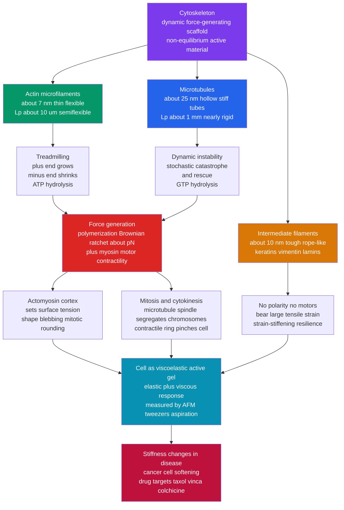

# 🕸️ The Cytoskeleton and Cell Mechanics

> [!abstract] TL;DR
> The **cytoskeleton** is the cell's dynamic, force-generating scaffold: three families of protein filaments — **actin microfilaments** (~7 nm, thin and flexible, drive shape, crawling, and the cortex), **microtubules** (~25 nm hollow tubes, stiff "highways" for motor transport and the mitotic spindle), and **intermediate filaments** (~10 nm rope-like cables that supply tensile resilience, e.g. keratins). Physically they are **semiflexible polymers** with hugely different stiffness — persistence lengths of ~10 µm (actin), ~1 mm (microtubules), and under a micron (intermediate filaments). What makes them alive is that their assembly is **non-equilibrium**: subunits add above a **critical concentration** $C_c = k_{off}/k_{on}$; actin **treadmills** (net growth at the plus end, loss at the minus end, powered by ATP); microtubules show **dynamic instability**, stochastically switching between slow growth and rapid shrinkage — "catastrophe" and "rescue" — driven by GTP hydrolysis, so the tip can *search* space fast. This scaffold also **generates and bears force**: a growing filament pushes by a **Brownian ratchet** at the piconewton scale, $f_{stall}=(k_BT/\delta)\ln(C/C_c)$, while **myosin** motors pull on actin to build **contractile tension**. Together this makes the cell a **viscoelastic, active material** — an "active gel" that changes shape, crawls, divides, and transports cargo. Its biophysics explains cell **rheology** (measured by AFM, micropipette aspiration, and optical/magnetic tweezers), **mitosis and cytokinesis**, cancer-cell **stiffness changes**, and is the direct target of front-line **chemotherapy** drugs (taxol, vinca alkaloids, colchicine).

## Intuition

**Analogy:** A cell is not a floppy water balloon. It has a skeleton — but a very strange one. Instead of fixed bones, it is a scaffold of protein girders that **assemble and dissolve in minutes**, letting the cell change shape, crawl, divide, and resist forces on demand. Imagine a building whose steel beams continuously **grow at one end and dissolve at the other**, so the whole structure can flow, remodel itself, and even push against walls — all while spending fuel to keep rebuilding. Some beams are thin, springy cables; some are rigid hollow rails carrying motorized trolleys; some are tough ropes that just take the strain.

This is the difference between a *bone* skeleton and a *cyto*skeleton. A bone is passive and permanent. The cytoskeleton is **active and impermanent**: it burns ATP and GTP to stay perpetually out of equilibrium, and that constant, energy-consuming turnover — plus the tension its motors generate — is exactly what gives the cell its mechanical life. When you understand the cytoskeleton as a *self-rebuilding, force-generating polymer network*, cell shape, movement, and division stop looking like biology and start looking like physics.

---

## How It Works

### Three filament systems, three mechanical roles

The scaffold is built from three chemically distinct polymers, each tuned to a different mechanical job (the biology is catalogued in [[The_Cytoskeleton_and_Cell_Motility]]):

- **Actin filaments (microfilaments).** Two-stranded helical polymers of **G-actin** subunits, ~7 nm wide, thin and **semiflexible** with persistence length $\ell_p \approx 10\text{–}17\ \mu\text{m}$ — comparable to a cell, so on cellular scales they bend noticeably. They form the **cortex** just under the membrane, the pushing meshwork at a crawling cell's front, and (with myosin) the contractile machinery.
- **Microtubules.** Hollow tubes of **α/β-tubulin** dimers, ~25 nm across, built from ~13 protofilaments. They are the stiffest filament, $\ell_p \approx 1\text{–}5\ \text{mm}$ — essentially rigid over a cell — which makes them ideal **compression struts** and straight **tracks** for kinesin and dynein (see [[Molecular_Motors_and_Mechanochemistry]]) and the fibers of the **mitotic spindle**.
- **Intermediate filaments.** Rope-like assemblies of coiled-coil proteins (keratins, vimentin, desmin, neurofilaments, nuclear lamins), ~10 nm wide. They are **floppy** individually ($\ell_p < 1\ \mu\text{m}$) but extraordinarily **tough in tension** — they strain-stiffen and survive large deformations without breaking, so they are the cell's shock-absorbing cables. Unlike the other two, they are **non-polar** and carry **no motors**.

### Filaments are semiflexible polymers

The mechanics start from polymer physics. A filament's resistance to bending is its **flexural rigidity** $\kappa = E I$ (Young's modulus times the cross-sectional second moment). Thermal bending randomizes the filament's direction over a length called the **persistence length**:

$$\ell_p = \frac{\kappa}{k_B T}.$$

Because $\ell_p$ spans three orders of magnitude across the three systems, the same cell contains near-rigid rails (microtubules), springy cables (actin), and floppy ropes (intermediate filaments). This is the physics that connects to [[Polymer_Mechanics_and_Viscoelasticity]] and semiflexible-polymer network theory: a crosslinked actin gel gets much of its elasticity from the *entropic* cost of pulling out thermal wrinkles, so networks **strain-stiffen** under load in a way ordinary flexible polymers do not.

### Non-equilibrium assembly: critical concentration, treadmilling, dynamic instability

Filaments are not static structures — they are **steady-state polymers** maintained far from equilibrium by nucleotide hydrolysis.

1. **Nucleation and elongation.** Forming a new filament from free subunits is slow (an unfavorable **nucleation** barrier); once a seed exists, subunits add rapidly. Net elongation depends on the free-subunit concentration $C$ through on/off kinetics, $dL/dt \propto k_{on}C - k_{off}$.
2. **Critical concentration.** The filament neither grows nor shrinks when $C = C_c = k_{off}/k_{on}$. Above $C_c$ it grows; below it dissolves. This threshold is the single most useful number in cytoskeletal assembly.
3. **Treadmilling (actin).** The two ends have *different* critical concentrations because ATP-actin adds and then hydrolyzes to ADP-actin. At an intermediate steady $C$ the **plus (barbed) end grows** while the **minus (pointed) end shrinks** at the same rate — subunits flux through the filament while its length holds constant. The filament effectively "walks" forward, converting ATP into directed treadmilling.
4. **Dynamic instability (microtubules).** A growing microtubule carries a **GTP cap** at its tip that stabilizes it. Tubulin hydrolyzes GTP after adding; if the cap is stochastically lost, the tip undergoes a **catastrophe** and depolymerizes explosively (shrinkage is ~10× faster than growth). A **rescue** can regrow a new cap. The tip thus flips between two states, powered by GTP hydrolysis, producing the characteristic **saw-tooth** length trace. Biologically this lets a microtubule tip **rapidly search** three-dimensional space — probing until it captures a kinetochore, for example.

The essential point: **all of this costs energy**. If you switched off ATP/GTP hydrolysis, filaments would relax to dull equilibrium polymers. Treadmilling and dynamic instability exist *only* because the cell continuously pays free energy to stay out of equilibrium — the defining feature of the cytoskeleton as an **active material**.

### Force generation: polymerization ratchets and motor tension

The scaffold does not just hold shape — it **pushes and pulls**.

- **Polymerization force (Brownian ratchet).** A growing filament tip can do mechanical work. Thermal fluctuations transiently open a gap between the tip and an obstacle; if a subunit slots into the gap, the obstacle can no longer return — the filament has **rectified thermal motion** into a push. The stall force (the load at which growth halts) is
$$f_{stall} = \frac{k_B T}{\delta}\,\ln\!\frac{C}{C_c},$$
where $\delta$ is the length added per subunit. With $k_BT \approx 4.1\ \text{pN·nm}$ and $\delta \approx 2.7\ \text{nm}$ for actin, a single filament pushes at the **piconewton** scale; **bundles** of many filaments (a lamellipodium's leading edge) or a growing microtubule (pushing chromosomes) sum these to nanonewtons. This shares the ratchet logic of the linear motors in [[Molecular_Motors_and_Mechanochemistry]].
- **Motor-generated tension.** **Myosin** motors crosslink and pull antiparallel actin filaments, generating **contractile stress**. In the **actomyosin cortex** this contraction sets the cell's **surface tension**, and in muscle the same physics scales up to macroscopic force.

### The cell as a viscoelastic active gel

Because the network is both elastic (crosslinked filaments store energy) and viscous (filaments turn over and slide), the cell is **viscoelastic**: probe it fast and it resists like a solid; probe it slowly and it flows like a fluid. Rheology captures this with the **complex modulus** $G^*(\omega) = G'(\omega) + iG''(\omega)$ (storage and loss moduli); real cells famously follow a weak **power law** $G^*(\omega)\sim\omega^{\alpha}$ over many decades, the signature of a *soft glassy* material rather than a simple spring-and-dashpot. Whole-cell stiffness ranges from ~100 Pa (soft cortex) to tens of kPa. Crucially, because myosin injects energy and filaments consume ATP/GTP, the material is **active** — it is an **active gel** that breaks detailed balance, generates its own stresses, and self-organizes (this is the biological face of active matter, adjacent to [[Liquid_Crystals_and_Colloids|soft active matter]] physics). Cell mechanics is measured by **AFM** indentation, **micropipette aspiration**, and **optical/magnetic tweezers** — the same single-molecule toolbox developed in [[Single_Molecule_Biophysics]].

### The cortex, cell shape, and division

- **Cortex and shape.** A thin actomyosin cortex under the membrane sets surface tension; when it locally weakens the pressurized cytoplasm herniates into a **bleb**, and at **mitotic entry** the cell globally stiffens and **rounds up**. Cortex tension is a master regulator of cell shape and, with adhesion, of cell motility — the subject of the forthcoming sibling *Cell_Motility_and_Adhesion*.
- **Mitosis and cytokinesis.** Cytoskeletal force generation is on full display in division (see [[The_Cell_Cycle_and_Mitosis]]): the microtubule **spindle** uses dynamic instability plus motors to capture and segregate chromosomes, then the actomyosin **contractile ring** tightens like a purse-string to pinch the cell in two.



---

## Key Concepts

### Secondary Level

- **The cell has a skeleton, but a living one.** Unlike your bones, the cytoskeleton constantly builds and un-builds itself, so the cell can change shape, crawl, and split in minutes.
- **Three kinds of fiber.** Thin springy **actin** for shape and movement, stiff hollow **microtubule** rails for transport and pulling chromosomes apart, and tough **intermediate-filament** ropes that stop the cell tearing.
- **It pushes and pulls.** Growing fibers can *push* the cell's edge outward (crawling); motor proteins on actin *pull* to create tension (how muscle contracts).
- **It runs on fuel.** Building and rebuilding the scaffold burns ATP and GTP the whole time — that constant rebuilding is what makes it so versatile.

### Undergraduate Level

- **Semiflexible polymers.** A filament's persistence length $\ell_p=\kappa/k_BT$ measures how far it stays straight against thermal bending: actin ~10 µm (semiflexible), microtubules ~1 mm (nearly rigid), intermediate filaments < 1 µm (floppy).
- **Critical concentration.** Assembly threshold $C_c = k_{off}/k_{on}$: filaments grow only when free-subunit concentration exceeds $C_c$. Below it they dissolve.
- **Treadmilling vs dynamic instability.** Actin treadmills (steady flux through a constant-length filament because plus- and minus-end $C_c$ differ). Microtubules show dynamic instability (a GTP cap; stochastic catastrophe and rescue give saw-tooth length traces). Both are GTP/ATP-driven, non-equilibrium behaviors.
- **Polymerization ratchet.** Growth against a load stalls at $f_{stall}=(k_BT/\delta)\ln(C/C_c)$ — piconewtons per filament, nanonewtons per bundle. This is how actin pushes membranes and how microtubules push chromosomes.
- **Viscoelasticity.** The cell stores *and* dissipates energy; short-time solid-like, long-time fluid-like. Simple models: **Maxwell** (spring + dashpot in series → flows) and **Kelvin–Voigt** (parallel → saturating creep).

### Graduate Level

- **Active gel / active matter.** Model the cytoskeleton as a crosslinked viscoelastic network with a myosin-driven **active stress** $\sigma_{active}$; energy input from ATP breaks detailed balance, so the material generates spontaneous flows, contractility, and pattern (nematic defects, cortical flows). This is the hydrodynamic active-gel theory of Marchetti, Jülicher, Prost, and colleagues.
- **Power-law rheology / soft glassy materials.** Cells obey $G^*(\omega)\sim\omega^{\alpha}$ with $\alpha \approx 0.1\text{–}0.3$ across many decades — inconsistent with any finite spring-dashpot circuit and instead described by **soft-glassy-rheology** (Sollich) with a distribution of trapping energies; the exponent shifts when ATP or crosslinking changes.
- **Semiflexible network elasticity.** Network modulus scales strongly with crosslink density and prestress; entropic filament tension gives **strain-stiffening** ($G'$ rising with stress), captured by the MacKintosh–Käs–Janmey model — physics absent in flexible-polymer gels.
- **Dynamic-instability parameters.** Four numbers set the behavior: growth velocity $v_g$, shrink velocity $v_s$, catastrophe frequency $f_{cat}$, rescue frequency $f_{res}$. The tip is **bounded** (bursty, near a template) when $f_{cat}v_s > f_{res}v_g$ and **unbounded** otherwise; the mean drift is $J=(v_g f_{res}-v_s f_{cat})/(f_{cat}+f_{res})$.
- **Force–velocity of the ratchet.** For a perfect Brownian ratchet the growth velocity under load $F$ is $v(F)=\delta\,[\,k_{on}C\,e^{-F\delta/k_BT}-k_{off}\,]$, recovering $f_{stall}=(k_BT/\delta)\ln(C/C_c)$ at $v=0$; load-sharing across the ~13 microtubule protofilaments modifies $\delta$ and softens the stall.

---

## Python Demo

```python
# Cytoskeletal dynamics & mechanics, four panels:
#   (a) MICROTUBULE DYNAMIC INSTABILITY -- a two-state (grow/shrink) stochastic
#       filament with catastrophe & rescue -> characteristic saw-tooth length traces
#   (b) POLYMERIZATION KINETICS -- filament mass approaches steady state; growth only
#       above the CRITICAL CONCENTRATION C_c = k_off / k_on
#   (c) POLYMERIZATION FORCE -- a growing tip is a Brownian ratchet:
#       f_stall = (kT / delta) * ln(C / C_c), ~ piconewtons
#   (d) VISCOELASTIC CREEP -- the cytoplasm as Maxwell (fluid-like) vs
#       Kelvin-Voigt (solid-like) responds to a step of constant stress
import numpy as np
import matplotlib.pyplot as plt

rng = np.random.default_rng(1)
kT = 4.1  # pN*nm, thermal energy at ~room temperature

fig, ax = plt.subplots(2, 2, figsize=(14, 10))

# ---- (a) Dynamic instability: two-state stochastic filament ----
v_g, v_s   = 2.0, 12.0     # um/min : growth (slow) and shrinkage (fast, ~6x)
f_cat, f_res = 0.30, 0.70  # 1/min  : catastrophe (grow->shrink), rescue (shrink->grow)
dt, T = 0.01, 40.0         # min
n = int(T / dt)
t = np.arange(n + 1) * dt
n_fil = 5
L = np.zeros((n_fil, n + 1))
for m in range(n_fil):
    length, growing = 0.0, True
    for i in range(n):
        if growing:
            length += v_g * dt
            if rng.random() < f_cat * dt:
                growing = False
        else:
            length -= v_s * dt
            if length <= 0.0:                 # hit the nucleation template -> forced rescue
                length, growing = 0.0, True
            elif rng.random() < f_res * dt:
                growing = True
        L[m, i + 1] = length
J = (v_g * f_res - v_s * f_cat) / (f_cat + f_res)   # analytic mean drift (um/min)

for m in range(n_fil):
    ax[0, 0].plot(t, L[m], lw=1.2, alpha=0.8)
ax[0, 0].set_title(f'(a) Microtubule dynamic instability\nsaw-tooth: slow growth, fast catastrophe '
                   f'(drift J = {J:+.1f} um/min -> bounded)')
ax[0, 0].set_xlabel('time (min)'); ax[0, 0].set_ylabel('filament length (um)')
ax[0, 0].grid(alpha=0.3)

# ---- (b) Polymerization kinetics & critical concentration ----
k_on, k_off = 1.0, 5.0     # 1/(uM*s), 1/s  ->  C_c = k_off/k_on = 5 uM
C_c = k_off / k_on
tt = np.linspace(0, 6, 400)                 # s
for C_tot, col in [(12.0, 'C0'), (7.0, 'C1'), (3.0, 'C2')]:
    # dP/dt = k_on*(C_tot - P) - k_off ; P = polymerized subunit conc (uM)
    P_ss = max(0.0, C_tot - C_c)            # steady-state polymer = C_tot - C_c
    P = P_ss * (1 - np.exp(-k_on * tt))     # exponential approach (rate ~ k_on)
    lbl = f'C_tot = {C_tot:.0f} uM' + ('  (< C_c: no assembly)' if C_tot < C_c else '')
    ax[0, 1].plot(tt, P, col, lw=2.2, label=lbl)
ax[0, 1].axhline(0, color='k', lw=0.8)
ax[0, 1].set_title(f'(b) Assembly kinetics -> steady state\ngrowth only above C_c = {C_c:.0f} uM')
ax[0, 1].set_xlabel('time (s)'); ax[0, 1].set_ylabel('polymerized subunits (uM)')
ax[0, 1].legend(fontsize=8); ax[0, 1].grid(alpha=0.3)

# ---- (c) Polymerization (Brownian-ratchet) stall force ----
delta = 2.7                                 # nm, length added per actin subunit
ratio = np.linspace(1.0, 40.0, 300)         # C / C_c
f_stall = (kT / delta) * np.log(ratio)      # pN
ax[1, 0].plot(ratio, f_stall, lw=2.5, color='crimson')
ax[1, 0].axhline(kT / delta, ls=':', color='gray',
                 label=f'kT/delta = {kT/delta:.2f} pN (per e-fold of C/C_c)')
for r in (10, 30):
    ax[1, 0].plot(r, (kT/delta)*np.log(r), 'ko')
    ax[1, 0].annotate(f'{(kT/delta)*np.log(r):.1f} pN', (r, (kT/delta)*np.log(r)),
                      textcoords='offset points', xytext=(6, -12), fontsize=8)
ax[1, 0].set_title('(c) Polymerization force = Brownian ratchet\nf_stall = (kT/delta) ln(C/C_c), '
                   'single actin filament ~ pN')
ax[1, 0].set_xlabel('supersaturation  C / C_c'); ax[1, 0].set_ylabel('stall force (pN)')
ax[1, 0].legend(fontsize=8); ax[1, 0].grid(alpha=0.3)

# ---- (d) Viscoelastic creep: Maxwell vs Kelvin-Voigt under constant stress ----
E   = 100.0     # Pa, elastic modulus (cell cortex ~ 0.1-1 kPa)
eta = 200.0     # Pa*s, viscosity
tau = eta / E   # s, relaxation/retardation time
sig = 50.0      # Pa, applied step stress
tc  = np.linspace(0, 8, 400)
eps_maxwell = sig / E + (sig / eta) * tc                 # instant jump + unbounded flow (fluid-like)
eps_kv      = (sig / E) * (1 - np.exp(-tc / tau))        # delayed, saturating creep (solid-like)
ax[1, 1].plot(tc, eps_maxwell, lw=2.3, label='Maxwell (fluid-like): flows forever')
ax[1, 1].plot(tc, eps_kv,      lw=2.3, label='Kelvin-Voigt (solid-like): saturates')
ax[1, 1].axhline(sig / E, ls=':', color='gray', label=f'elastic limit sigma/E = {sig/E:.2f}')
ax[1, 1].set_title(f'(d) Viscoelastic creep of cytoplasm\nstep stress {sig:.0f} Pa, tau = eta/E = {tau:.0f} s')
ax[1, 1].set_xlabel('time (s)'); ax[1, 1].set_ylabel('strain (dimensionless)')
ax[1, 1].legend(fontsize=8); ax[1, 1].grid(alpha=0.3)

plt.tight_layout(); plt.show()

# ---- Console summary ----
print(f"(a) mean drift J        = {J:+.2f} um/min  ({'bounded' if J < 0 else 'unbounded'} growth)")
print(f"    mean length         = {L[:, n//2:].mean():.2f} um   max reached = {L.max():.2f} um")
print(f"(b) critical conc C_c   = {C_c:.1f} uM ; steady polymer at 12 uM = {12 - C_c:.1f} uM")
print(f"(c) kT/delta            = {kT/delta:.2f} pN ; f_stall at C/C_c=30 = {(kT/delta)*np.log(30):.2f} pN")
print(f"(d) tau = eta/E         = {tau:.1f} s ; elastic strain sigma/E = {sig/E:.3f}")
```

Panel (a) shows five microtubules executing **dynamic instability**: each grows slowly, suffers a stochastic **catastrophe**, and collapses ~6× faster until a **rescue** (or the nucleation template at length 0) restarts growth — the hallmark saw-tooth, with a negative mean drift $J$ that keeps the population *bounded* near the organizing center. Panel (b) shows filament mass rising to a plateau set by the **critical concentration**: at $C_{tot}=12\ \mu\text{M}$ the steady polymer is $C_{tot}-C_c=7\ \mu\text{M}$, while at $3\ \mu\text{M}$ (below $C_c=5\ \mu\text{M}$) *nothing assembles*. Panel (c) plots the **polymerization stall force**: a single actin filament pushes at only a few piconewtons, growing logarithmically with supersaturation — which is why cells bundle many filaments to move membranes. Panel (d) contrasts the two textbook **viscoelastic** limits the cell lives between: Maxwell (flows without bound — fluid-like at long times) and Kelvin–Voigt (creep saturates — solid-like), the spring-and-dashpot intuition behind AFM and tweezer measurements of cell mechanics.

---

## Real-World Applications

- **Cancer chemotherapy targets dynamic instability.** Dividing cells depend on a working spindle, so **microtubule drugs** are front-line chemotherapy: **taxol (paclitaxel)** *hyper-stabilizes* microtubules and **vinca alkaloids / colchicine** *destabilize* them — either extreme freezes dynamic instability, stalls mitosis, and triggers death in fast-dividing tumor cells (the side effects on hair, gut, and marrow follow from the same mechanism).
- **Cancer-cell mechanics and metastasis.** Many metastatic cells are measurably **softer** (lower $G'$) than benign cells, and this altered rheology helps them squeeze through tissue. AFM and optical-stretcher "mechanical biomarkers" are being developed for diagnosis — a theme central to the forthcoming sibling *Physics_of_Cancer*.
- **Cell crawling and immune surveillance.** Actin polymerization at the leading edge (a polymerization ratchet) drives lamellipodial protrusion; neutrophils and metastatic cells crawl by continuously treadmilling actin — the mechanics detailed in the forthcoming sibling *Cell_Motility_and_Adhesion*.
- **Muscle and whole-body movement.** The actomyosin machinery scaled up in sarcomeres powers every heartbeat and stride, the applied mechanics of the forthcoming sibling *Biomechanics_of_Movement*.
- **Cytoskeletal disease.** Defects in **intermediate filaments** cause fragility syndromes (keratin mutations → blistering skin disease *epidermolysis bullosa*; lamin mutations → progeria and muscular dystrophy), and disrupted axonal microtubule transport is implicated in **neurodegeneration** (ALS, Alzheimer's).

---

## Common Pitfalls

- **"The cytoskeleton is a fixed frame like a bone skeleton."** It is a **steady-state, energy-consuming polymer**; turn off ATP/GTP and treadmilling and dynamic instability vanish. Its defining trait is constant, fueled remodeling — the metaphor of a static skeleton misses the whole point.
- **"Filaments grow toward equilibrium."** They are held *away* from equilibrium. Treadmilling flux and microtubule catastrophe/rescue are **non-equilibrium** cycles paid for by nucleotide hydrolysis, not relaxation to a minimum-energy state.
- **"Bigger filament, softer material."** Microtubules are the *thickest* filament yet by far the **stiffest** (highest $\ell_p$); intermediate filaments are floppy individually but toughest in a network. Diameter alone does not set mechanics — bending rigidity and network architecture do.
- **"A growing filament shoves the membrane like a piston."** The push is a **Brownian ratchet**: thermal fluctuations open a gap that a subunit fills, rectifying random motion into force. The stall is a *few piconewtons* per filament, not an arbitrary mechanical drive.
- **"A single spring-and-dashpot describes cell mechanics."** Real cells show **power-law rheology** over many decades (soft-glassy behavior); a single Maxwell or Kelvin–Voigt element captures the intuition but not the data, which need a broad spectrum of relaxation times.
- **"The cortex is passive."** It is an **active gel**: myosin injects mechanical energy, so the cortex generates its own tension and flows. Treating it as a passive elastic shell misses contractility, blebbing, and mitotic rounding.
- **"Softer always means healthier."** In cancer, *reduced* stiffness often marks *more* aggressive, invasive cells — mechanics is a biomarker, not a virtue.

---

## Related Concepts

- [[The_Cytoskeleton_and_Cell_Motility]] — the cell-biology companion: filament types, motor proteins, cilia and flagella in structural detail
- [[Molecular_Motors_and_Mechanochemistry]] — myosin/kinesin/dynein that walk on these tracks and generate the contractile tension; shares the Brownian-ratchet physics
- [[Diffusion_and_Brownian_Motion_in_Cells]] — the thermal-fluctuation background the polymerization ratchet rectifies into force
- [[Single_Molecule_Biophysics]] — AFM, optical/magnetic tweezers, and micropipette aspiration used to measure filament forces and cell rheology
- [[Statistical_Mechanics_of_Biomolecules]] — the $k_BT$ scale, Boltzmann weighting, and persistence-length physics of semiflexible filaments
- [[Energy_Entropy_and_Free_Energy_in_Biology]] — why ATP/GTP hydrolysis can drive the non-equilibrium assembly cycles
- [[Protein_Structure_and_Folding]] — actin, tubulin, and coiled-coil intermediate-filament proteins as the subunits that polymerize
- [[Scales_Units_and_Orders_of_Magnitude_in_Biophysics]] — piconewton forces, micron lengths, and the nm/pN·nm unit system used throughout
- [[Polymer_Mechanics_and_Viscoelasticity]] — the materials-science backbone: viscoelastic moduli, creep, and network elasticity
- [[Liquid_Crystals_and_Colloids]] — soft-matter and active-matter context for the cytoskeleton as an active gel
- [[Stress_Strain_and_Elastic_Moduli]] — elastic modulus, stress, and strain underlying cell stiffness measurements
- [[The_Cell_Cycle_and_Mitosis]] — the spindle and contractile ring: cytoskeletal force generation driving chromosome segregation and cytokinesis
- [[Cancer_and_the_Cell_Cycle]] — why microtubule-targeting drugs kill dividing cells and how mitotic control fails in cancer
- [[The_Cell_Membrane_and_Transport]] — the membrane the actin cortex mechanically supports and deforms

---

## Review Questions

1. **Secondary:** The cytoskeleton is called a "skeleton," yet it is constantly being taken apart and rebuilt. Explain in plain terms why a *dynamic*, self-rebuilding scaffold is more useful to a cell than a permanent, bone-like frame, and give one thing the cell could not do without it.
2. **Undergraduate:** Actin *treadmills* while microtubules undergo *dynamic instability*. (a) Define the critical concentration $C_c=k_{off}/k_{on}$ and explain how differing plus- and minus-end values enable treadmilling at constant length. (b) Describe the GTP-cap mechanism of catastrophe and rescue, and explain biologically why a microtubule tip that stochastically collapses is *useful* for finding a kinetochore. (c) Using $f_{stall}=(k_BT/\delta)\ln(C/C_c)$ with $\delta=2.7$ nm, estimate a single actin filament's push at $C/C_c=20$ and explain why cells bundle filaments.
3. **Graduate:** A cell's shear modulus follows $G^*(\omega)\sim\omega^{\alpha}$ with $\alpha\approx0.2$ across several decades of frequency. (a) Argue why no finite combination of springs and dashpots (Maxwell/Kelvin–Voigt) can reproduce this, and what soft-glassy rheology adds. (b) In the active-gel picture, write the total stress as elastic plus viscous plus an ATP-driven active term and explain how $\sigma_{active}$ lets the cortex generate spontaneous tension and flows while respecting the second law. (c) Given dynamic-instability parameters $v_g, v_s, f_{cat}, f_{res}$, state the condition for bounded vs unbounded tip growth and interpret each regime biologically.

---

## Sources

- Howard, J. (2001). *Mechanics of Motor Proteins and the Cytoskeleton.* Sinauer — filament mechanics, persistence lengths, polymerization forces, and dynamic instability.
- Boal, D. (2012). *Mechanics of the Cell*, 2nd ed. Cambridge University Press — semiflexible polymers, membranes, cortex mechanics, and cell rheology.
- Phillips, R., Kondev, J., Theriot, J. & Garcia, H. (2012). *Physical Biology of the Cell*, 2nd ed. — critical concentration, ratchets, and the $k_BT$/piconewton scale.
- Mitchison, T. & Kirschner, M. (1984). "Dynamic instability of microtubule growth." *Nature* 312:237–242 — the original catastrophe/rescue observation.
- Fletcher, D.A. & Mullins, R.D. (2010). "Cell mechanics and the cytoskeleton." *Nature* 463:485–492 — modern review of cytoskeletal mechanics and rheology.
- Marchetti, M.C. et al. (2013). "Hydrodynamics of soft active matter." *Rev. Mod. Phys.* 85:1143 — active-gel theory of the cytoskeleton as active matter.

---

#biophysics #cytoskeleton #dynamic-instability #cell-mechanics #actin-microtubules
