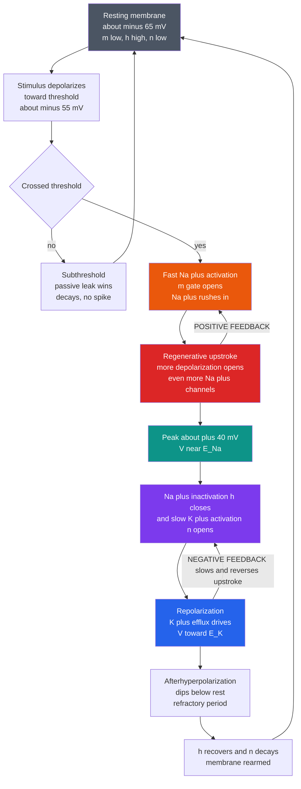

# ⚡ The Hodgkin-Huxley Model and Action Potentials

> [!abstract] TL;DR
> An **action potential** is the fundamental electrical signal of nerve and muscle: a rapid ($\sim 1$ ms), **all-or-nothing**, self-propagating spike of membrane voltage that shoots from a resting $\sim -70$ mV up to $\sim +40$ mV and back. In 1952 **Alan Hodgkin and Andrew Huxley** turned this phenomenon into one of the greatest triumphs of quantitative biology: from **voltage-clamp** recordings on the **squid giant axon** they built a *predictive mathematical model* that reconstructs the spike from first principles. The membrane is an **equivalent circuit** — a **capacitor** (the lipid bilayer) in parallel with **voltage-dependent conductances** (Na⁺ and K⁺ channels) each in series with a **battery** (the ion's Nernst potential) — obeying $C_m \, dV/dt = -(I_{Na}+I_K+I_{leak}) + I_{ext}$. The magic is that the Na⁺ and K⁺ conductances depend on **voltage and time**, captured by **gating variables** $m$ (Na⁺ activation), $h$ (Na⁺ inactivation), and $n$ (K⁺ activation), with $g_{Na}=\bar g_{Na}\,m^3 h$ and $g_K=\bar g_K\,n^4$. Fast Na⁺ activation creates **positive feedback** (the regenerative upstroke); slower Na⁺ inactivation plus K⁺ activation supply the **negative feedback** that repolarizes and imposes a **refractory period**. This single model explains threshold, all-or-nothing spiking, refractoriness, and propagation, launched **computational neuroscience**, and generalizes to cardiac cells and every **excitable medium**.

## Intuition

**Analogy:** A nerve signal is *not* electricity flowing down a wire like current in a copper cable. If it were, it would fade to nothing within a few millimetres, the way a voltage droops along a leaky garden hose. Instead, an action potential behaves more like a **line of gunpowder igniting itself as it burns**. Each patch of "powder" (membrane), once it gets hot enough (depolarizes past a **threshold**), releases its own stored energy — voltage-gated sodium gates fling open, Na⁺ ions rush in, and the resulting heat (depolarization) ignites the *next* patch, which ignites the next. The flame never gets weaker as it travels because every stretch of fuse **refreshes the signal's own amplitude**. The spike arrives at the far end of a metre-long axon exactly as tall as it started.

Two more features fall straight out of the analogy. First, it is **all-or-nothing**: a spark too weak to reach ignition temperature just fizzles (a subthreshold bump that decays), while any spark past threshold triggers the *full* burn — the size of the flame carries no information, only *when* and *how often* it ignites. Second, freshly burnt fuse cannot re-ignite until it "cools and reloads" — the **refractory period** — which is exactly why the flame runs one way and never backfires. The Hodgkin-Huxley model is the chemistry of that self-igniting fuse, written as differential equations.

---

## How It Works

### The membrane as an equivalent circuit

Hodgkin and Huxley's foundational move was to treat a patch of axon membrane as an **RC circuit with active elements** (the electrical picture of the bilayer is developed in the forthcoming sibling *Bioelectricity_and_Cellular_Signaling_Physics*):

- The **lipid bilayer** is a **capacitor** $C_m \approx 1\ \mu\text{F/cm}^2$. It is a thin insulator separating conducting salt solutions, so it stores charge — but ions cannot cross it directly (see [[The_Cell_Membrane_and_Transport]] and [[Intermolecular_Forces_and_the_Aqueous_Environment]]).
- Wired in parallel across the capacitor are **conductances** (variable resistors): one for Na⁺, one for K⁺, and a small constant **leak**. Each is a population of **ion channels** — protein pores that let one species through (the forthcoming sibling *Ion_Channels_and_Transport* treats channel gating in depth).
- Each conductance sits in series with a **battery** whose EMF is that ion's **Nernst equilibrium potential** ($E_{Na}\approx +50$ mV, $E_K\approx -77$ mV), set by the concentration gradient the Na⁺/K⁺-ATPase pump maintains (the electrochemistry is the subject of the forthcoming sibling *Membrane_Potential_and_the_Nernst_Equation*).

Conservation of charge on the capacitor gives the central equation — capacitive current plus ionic currents equals injected current:

$$C_m\frac{dV}{dt} = -\big[\, \bar g_{Na}\,m^3 h\,(V-E_{Na}) + \bar g_K\,n^4\,(V-E_K) + \bar g_L\,(V-E_L)\,\big] + I_{ext}$$

The genius is not the circuit — RC membranes were already understood. It is that the resistors are **nonlinear, voltage-controlled, and time-lagged**.

### Voltage-gated conductances and gating variables

From **voltage-clamp** experiments (holding $V$ fixed and measuring the ionic current), Hodgkin and Huxley discovered that $g_{Na}$ and $g_K$ are not constants but **functions of voltage and time**. They fitted this behaviour with dimensionless **gating variables**, each a probability between 0 (gate shut) and 1 (gate open) that relaxes toward a voltage-dependent steady state with a voltage-dependent time constant:

$$\frac{dx}{dt} = \alpha_x(V)\,(1-x) - \beta_x(V)\,x, \qquad x_\infty(V)=\frac{\alpha_x}{\alpha_x+\beta_x}, \qquad \tau_x(V)=\frac{1}{\alpha_x+\beta_x}$$

| Gate | Channel role | Behaviour on depolarization | Speed |
|------|--------------|------------------------------|-------|
| $m$ | Na⁺ **activation** | opens — starts the spike | **fast** ($\sim0.3$ ms) |
| $h$ | Na⁺ **inactivation** | closes — shuts Na⁺ off | slow ($\sim1$–$5$ ms) |
| $n$ | K⁺ **activation** | opens — drives repolarization | slow ($\sim1$–$5$ ms) |

The conductances are $g_{Na}=\bar g_{Na}\,m^3 h$ and $g_K=\bar g_K\,n^4$. The powers ($m^3$, $n^4$) encode **cooperativity**: the channel conducts only when several independent subunit gates are open at once — a remarkably prescient inference, made *decades before* ion channels were seen as physical proteins. Na⁺ conductance is large only in the brief window when $m$ has surged but $h$ has not yet collapsed.

### The choreography of one spike

1. **Rest.** $m$ is low, $h$ is high (Na⁺ channels closed but *available*), $n$ is low; the leak and K⁺ hold $V \approx -65$ to $-70$ mV.
2. **Depolarization to threshold.** A stimulus nudges $V$ up. Because $m$ is fast, some Na⁺ channels open.
3. **Regenerative upstroke — POSITIVE FEEDBACK.** Na⁺ influx depolarizes further, which opens *more* Na⁺ channels ($m\uparrow$), which admits *more* Na⁺ … a runaway loop that flings $V$ toward $E_{Na}\approx +50$ mV. This self-amplification is what makes the spike **all-or-nothing** and gives it a sharp **threshold**.
4. **Peak and turnaround.** Two slower processes catch up: Na⁺ channels **inactivate** ($h\downarrow$, shutting the influx) while K⁺ channels **activate** ($n\uparrow$).
5. **Repolarization — NEGATIVE FEEDBACK.** K⁺ now flows *out* toward $E_K\approx -77$ mV, dragging $V$ back down.
6. **Afterhyperpolarization and refractory reset.** K⁺ conductance lingers, so $V$ briefly dips *below* rest. Until $h$ recovers and $n$ decays, the membrane cannot fire again — the **refractory period**.

### Threshold, all-or-nothing, and the refractory period

The positive feedback of Na⁺ creates a genuine **threshold**: below it, the passive leak wins and a depolarization decays; above it, the regenerative loop ignites a **stereotyped, full-amplitude spike** whose size is set by the ion batteries, not by the stimulus. Consequently **information is carried by the timing and rate of spikes, not their amplitude** — the foundation of neural coding (see [[Neural_Coding_and_Spike_Trains]]). The **refractory period** comes in two flavours: the **absolute** phase (Na⁺ channels inactivated, $h$ low — no spike is possible at any stimulus) and the **relative** phase (recovering $h$ and elevated $n$ — a spike needs a stronger stimulus). Together they cap the maximum firing rate and, crucially, ensure the wave propagates **one way** — the fuse behind the flame is still "cooling."

### Propagation and cable theory

Local Na⁺ influx at an active patch spreads sideways as **local circuit current**, depolarizing the *next* patch to threshold — the spike therefore travels without decrement, governed by the **cable equation** balancing axial current, membrane capacitance, and the active ionic currents. Speed scales with axon geometry: thicker axons (lower axial resistance) conduct faster, which is why squid evolved a giant axon for escape. Vertebrates instead wrap axons in **myelin** and cluster channels at the bare **nodes of Ranvier**, so the spike leaps node-to-node — **saltatory conduction** — boosting velocity roughly 100-fold at a fraction of the energy cost (see [[Neuron_Structure_and_Function]]).



---

## Key Concepts

### Secondary Level

- **A spike is a self-refreshing wave, not a current in a wire.** Each bit of membrane re-fires the signal, so it never fades — like a burning fuse that reignites itself.
- **All-or-nothing.** A weak poke does nothing; a strong-enough poke triggers a full spike of fixed size. Neurons send information by *how often* they spike, not *how big* the spikes are.
- **Sodium in, then potassium out.** The rise is Na⁺ ions flooding in; the fall is K⁺ ions leaving. A pump resets the gradients afterward.
- **Refractory pause.** Just after firing, a patch of membrane needs a short rest before it can fire again — which keeps the signal moving forward.
- **Myelin makes it fast.** Insulating wrapping lets the spike jump between gaps, speeding nerve signals about 100-fold.

### Undergraduate Level

- **The four coupled ODEs.** One equation for voltage ($C_m\,dV/dt = -\sum I_{ion} + I_{ext}$) plus three for the gates ($m,h,n$), each a first-order relaxation toward $x_\infty(V)$ with time constant $\tau_x(V)$. This is a nonlinear system of ODEs (see [[Systems_of_ODEs]] and [[Ordinary_Differential_Equations]]).
- **Why $g_{Na}=\bar g_{Na}m^3h$.** Activation ($m$) and inactivation ($h$) are *separate* gates on the same channel; conduction needs three activation subunits open **and** the inactivation gate not yet shut.
- **Nernst batteries.** $E_{Na}$ and $E_K$ come from concentration gradients via the Nernst equation; ionic current is $g(V-E)$, so current reverses sign as $V$ crosses $E$.
- **Rheobase and the F-I curve.** Below a minimum sustained current (rheobase, $\sim 6$–$7\ \mu\text{A/cm}^2$ for standard HH) the cell stays silent; above it, firing frequency rises with current.
- **Voltage clamp was the key tool.** Holding $V$ fixed removes the capacitive term and linearizes the driving force, letting Hodgkin and Huxley isolate and measure $g_{Na}(V,t)$ and $g_K(V,t)$ directly.

### Graduate Level

- **HH as a fast-slow dynamical system.** With $m$ fast and $(V,h,n)$ slow, the spike is a **relaxation oscillation**. Reducing to two variables (fast $V$, one slow recovery) yields the **FitzHugh-Nagumo** model, whose phase plane makes threshold, excitability, and limit-cycle firing geometrically transparent (see [[Dynamical_Systems_and_Attractors]]).
- **Bifurcations of firing onset.** As $I_{ext}$ increases, repetitive firing is born via a **Hopf** or a **saddle-node-on-invariant-circle (SNIC)** bifurcation, distinguishing Type II (nonzero onset frequency) from Type I (arbitrarily low onset frequency) neurons (see [[Bifurcations_and_Tipping_Points]]).
- **Numerical stiffness.** Fast $m$ kinetics make HH mildly stiff; explicit Euler needs small $dt$, motivating RK4 or the **exponential-Euler (Rush-Larsen)** scheme that integrates each gate against its instantaneous $x_\infty,\tau_x$.
- **Excitable media and waves.** Coupling HH kinetics to spatial diffusion gives a reaction-diffusion system whose travelling-wave solution *is* the propagating spike; the same mathematics produces spiral waves in cardiac tissue and the Belousov-Zhabotinsky reaction (see [[Nonlinearity_and_Feedback]]).
- **Stochastic channels.** Finite channel numbers make gating a Markov jump process; **channel noise** produces spontaneous spikes and jitter, bridging deterministic HH to single-molecule statistics (see [[Diffusion_and_Brownian_Motion_in_Cells]]). The information such spikes carry is the theme of the forthcoming sibling *Neural_Biophysics_and_Information*.

---

## Python Demo

```python
# The Hodgkin-Huxley model: a fully runnable reconstruction of the nerve action potential.
# We implement the classic 1952 squid-axon equations (membrane capacitance + voltage-gated
# Na+ and K+ conductances with m, h, n gating variables) and integrate them with RK4.
# We then demonstrate, in one figure:
#   (a) THRESHOLD & ALL-OR-NOTHING  -- tiny stimuli fizzle; any suprathreshold stimulus fires
#                                      a full spike, and bigger stimuli do NOT make it taller
#   (b) the ANATOMY of a single ~1 ms spike (-65 mV -> ~+40 mV -> undershoot -> reset)
#   (c) the underlying GATING VARIABLES m, h, n
#   (d) the Na+ and K+ CONDUCTANCES that drive up- and down-strokes
#   (e) the REFRACTORY PERIOD via paired pulses (a too-soon second stimulus fails)
#   (f) REPETITIVE FIRING under a sustained current, plus an F-I curve printed to console
import numpy as np
import matplotlib.pyplot as plt

# ---- HH parameters (modern convention: V in mV, rest ~ -65 mV, time in ms) ----
Cm  = 1.0                       # membrane capacitance, uF/cm^2
gNa, gK, gL = 120.0, 36.0, 0.3  # max conductances, mS/cm^2
ENa, EK, EL = 50.0, -77.0, -54.387  # reversal potentials, mV
V_rest = -65.0

def _lin_over_exp(V, Vh, k):
    # Safe evaluation of dv / (1 - exp(-dv/k)); the removable singularity at dv=0 -> k
    dv = V - Vh
    dv = np.where(np.abs(dv) < 1e-6, 1e-6, dv)   # nudge off the singular point
    return dv / (1.0 - np.exp(-dv / k))

# Voltage-dependent rate constants (per ms)
alpha_m = lambda V: 0.1 * _lin_over_exp(V, -40.0, 10.0)
beta_m  = lambda V: 4.0 * np.exp(-(V + 65.0) / 18.0)
alpha_h = lambda V: 0.07 * np.exp(-(V + 65.0) / 20.0)
beta_h  = lambda V: 1.0 / (1.0 + np.exp(-(V + 35.0) / 10.0))
alpha_n = lambda V: 0.01 * _lin_over_exp(V, -55.0, 10.0)
beta_n  = lambda V: 0.125 * np.exp(-(V + 65.0) / 80.0)

x_inf = lambda a, b: a / (a + b)

def deriv(state, Iext):
    V, m, h, n = state
    INa = gNa * m**3 * h * (V - ENa)
    IK  = gK  * n**4     * (V - EK)
    IL  = gL             * (V - EL)
    dV = (Iext - INa - IK - IL) / Cm
    dm = alpha_m(V) * (1 - m) - beta_m(V) * m
    dh = alpha_h(V) * (1 - h) - beta_h(V) * h
    dn = alpha_n(V) * (1 - n) - beta_n(V) * n
    return np.array([dV, dm, dh, dn], dtype=float)

def integrate(I_of_t, T=50.0, dt=0.01, V0=V_rest):
    """RK4 integration of the HH equations. I_of_t(t) returns the injected current (uA/cm^2)."""
    steps = int(T / dt)
    t = np.arange(steps + 1) * dt
    V = np.empty(steps + 1); m = np.empty(steps + 1)
    h = np.empty(steps + 1); n = np.empty(steps + 1)
    # start from the resting steady state of each gate
    state = np.array([V0,
                      x_inf(alpha_m(V0), beta_m(V0)),
                      x_inf(alpha_h(V0), beta_h(V0)),
                      x_inf(alpha_n(V0), beta_n(V0))], dtype=float)
    V[0], m[0], h[0], n[0] = state
    for i in range(steps):
        ti = t[i]
        k1 = deriv(state,               I_of_t(ti))
        k2 = deriv(state + 0.5*dt*k1,   I_of_t(ti + 0.5*dt))
        k3 = deriv(state + 0.5*dt*k2,   I_of_t(ti + 0.5*dt))
        k4 = deriv(state + dt*k3,       I_of_t(ti + dt))
        state = state + (dt / 6.0) * (k1 + 2*k2 + 2*k3 + k4)
        V[i+1], m[i+1], h[i+1], n[i+1] = state
    gna = gNa * m**3 * h      # instantaneous conductances, mS/cm^2
    gk  = gK  * n**4
    return t, V, m, h, n, gna, gk

# current-injection helpers
def pulse(amp, t_on, dur):
    return lambda t: amp if (t_on <= t < t_on + dur) else 0.0
def paired(amp, t1, t2, dur):
    return lambda t: amp if (t1 <= t < t1 + dur) or (t2 <= t < t2 + dur) else 0.0
def constant(amp):
    return lambda t: amp

def count_spikes(V, thr=0.0):
    # upward crossings of 0 mV = spike count
    return int(np.sum((V[:-1] < thr) & (V[1:] >= thr)))

fig, ax = plt.subplots(3, 2, figsize=(14, 12))

# ---------- (a) THRESHOLD & ALL-OR-NOTHING: brief 0.5 ms pulses of increasing strength ----------
amps = [3, 6, 20, 40, 60]        # uA/cm^2 : first two fizzle, last three fire identical spikes
for amp in amps:
    t, V, *_ = integrate(pulse(amp, 5.0, 0.5), T=25.0)
    ax[0,0].plot(t, V, lw=1.8, label=f'{amp} uA/cm2')
ax[0,0].axhline(V_rest, color='gray', ls=':', lw=1)
ax[0,0].axvspan(5.0, 5.5, color='gold', alpha=0.3)
ax[0,0].set_title('(a) Threshold & all-or-nothing\nweak stimuli decay; strong ones fire IDENTICAL spikes')
ax[0,0].set_xlabel('time (ms)'); ax[0,0].set_ylabel('V (mV)')
ax[0,0].legend(fontsize=8, title='0.5 ms pulse'); ax[0,0].grid(alpha=0.3)

# reference suprathreshold single spike (reused for panels b, c, d)
t, V, m, h, n, gna, gk = integrate(pulse(40.0, 5.0, 0.5), T=25.0)

# ---------- (b) Anatomy of one action potential ----------
ax[0,1].plot(t, V, color='crimson', lw=2.2)
ax[0,1].axhline(V_rest, color='gray', ls=':', lw=1)
ax[0,1].axhline(0, color='gray', ls=':', lw=0.7)
ax[0,1].text(9.5, 30, 'upstroke\n(Na+ in)', color='darkred', fontsize=8)
ax[0,1].text(11.5, -30, 'repolarize\n(K+ out)', color='navy', fontsize=8)
ax[0,1].text(14, -74, 'afterhyperpolarization', color='teal', fontsize=8)
ax[0,1].set_title('(b) Anatomy of one spike\n~1 ms: -65 mV -> ~+40 mV -> undershoot -> reset')
ax[0,1].set_xlabel('time (ms)'); ax[0,1].set_ylabel('V (mV)')
ax[0,1].grid(alpha=0.3)

# ---------- (c) Gating variables m, h, n ----------
ax[1,0].plot(t, m, label='m  Na+ activation (fast)', lw=2)
ax[1,0].plot(t, h, label='h  Na+ inactivation', lw=2)
ax[1,0].plot(t, n, label='n  K+ activation', lw=2)
ax[1,0].set_title('(c) Gating variables\nm spikes first; h falls, n rises to end the spike')
ax[1,0].set_xlabel('time (ms)'); ax[1,0].set_ylabel('gate open probability')
ax[1,0].legend(fontsize=8); ax[1,0].grid(alpha=0.3)

# ---------- (d) Na+ and K+ conductances ----------
ax[1,1].plot(t, gna, color='orangered', label='g_Na = gNa m^3 h', lw=2)
ax[1,1].plot(t, gk,  color='royalblue', label='g_K  = gK n^4',    lw=2)
ax[1,1].set_title('(d) Ionic conductances\nfast Na+ (upstroke) then slower K+ (repolarization)')
ax[1,1].set_xlabel('time (ms)'); ax[1,1].set_ylabel('conductance (mS/cm2)')
ax[1,1].legend(fontsize=8); ax[1,1].grid(alpha=0.3)

# ---------- (e) Refractory period: paired pulses at short vs long spacing ----------
for gap, col, lbl in [(5.0, 'crimson', 'gap 5 ms: 2nd fails'),
                      (15.0, 'seagreen', 'gap 15 ms: 2nd fires')]:
    t2, V2, *_ = integrate(paired(40.0, 5.0, 5.0 + gap, 0.5), T=35.0)
    ax[2,0].plot(t2, V2, color=col, lw=1.8, label=lbl)
ax[2,0].axhline(V_rest, color='gray', ls=':', lw=1)
ax[2,0].set_title('(e) Refractory period\na too-soon second stimulus cannot re-fire')
ax[2,0].set_xlabel('time (ms)'); ax[2,0].set_ylabel('V (mV)')
ax[2,0].legend(fontsize=8); ax[2,0].grid(alpha=0.3)

# ---------- (f) Repetitive firing under sustained current ----------
t3, V3, *_ = integrate(constant(10.0), T=80.0)
ax[2,1].plot(t3, V3, color='purple', lw=1.5)
ax[2,1].axhline(V_rest, color='gray', ls=':', lw=1)
rate = count_spikes(V3) / (80.0e-3)   # spikes per second
ax[2,1].set_title(f'(f) Repetitive firing, I=10 uA/cm2\nsustained drive -> spike train ~ {rate:.0f} Hz')
ax[2,1].set_xlabel('time (ms)'); ax[2,1].set_ylabel('V (mV)')
ax[2,1].grid(alpha=0.3)

plt.tight_layout(); plt.show()

# ---------- Console: F-I curve (firing rate vs sustained current) ----------
print("Hodgkin-Huxley F-I curve (sustained current, 100 ms):")
print(f"{'I (uA/cm2)':>12} | {'spikes':>7} | {'rate (Hz)':>9}")
for I0 in [0, 2, 4, 6, 7, 8, 10, 15, 20]:
    _, Vc, *_ = integrate(constant(float(I0)), T=100.0)
    ns = count_spikes(Vc)
    print(f"{I0:>12} | {ns:>7} | {ns/0.1:>9.0f}")
print("\nBelow ~6-7 uA/cm2 the cell is silent (subthreshold); above it, it fires repetitively.")
```

Panel (a) is the punchline of the whole model: the 3 and 6 $\mu\text{A/cm}^2$ pulses deliver too little charge to ignite the Na⁺ positive-feedback loop, so the membrane simply relaxes back to rest — while the 20, 40, and 60 $\mu\text{A/cm}^2$ pulses all trigger the *same* full-height spike. Stimulus strength controls **whether** the neuron fires, never **how big** the spike is. Panels (b)-(d) dissect that spike: the fast $m$ gate opens first, Na⁺ conductance surges and throws $V$ toward $E_{Na}$, then $h$ collapses and $n$ rises so K⁺ conductance takes over and hauls $V$ back below rest. Panel (e) shows why the spike runs one way: a second stimulus arriving 5 ms later lands while $h$ is still low and $n$ still high — the membrane is refractory and cannot re-fire — whereas at 15 ms it has recovered. Panel (f) and the console F-I curve show that a *sustained* current above rheobase converts the excitable cell into an oscillator, encoding current strength as firing rate.

---

## Real-World Applications

- **All of computational neuroscience.** Every conductance-based neuron simulation — in NEURON, Brian2, or NEST — descends directly from HH. Reduced descendants (**FitzHugh-Nagumo**, **Morris-Lecar**, **leaky integrate-and-fire**) trade biophysical detail for the speed to simulate whole networks (see [[Hodgkin_Huxley_Model_and_Computational_Neurons]]).
- **Cardiology and defibrillation.** Cardiac action potentials (with added Ca²⁺ channels and pumps) use HH-style formalism; the Noble, Luo-Rudy, and O'Hara-Rudy models simulate heartbeats, predict how drugs prolong the QT interval, and explain how spiral re-entrant waves cause fibrillation — the excitable-medium mathematics of the spike scaled to a whole organ.
- **Pharmacology and anaesthesia.** Local anaesthetics (lidocaine) block the voltage-gated Na⁺ channel — the $\bar g_{Na}m^3h$ term — abolishing the upstroke; many antiepileptics and antiarrhythmics also target these channels (see [[Ion_Channels_and_Receptor_Pharmacology]]).
- **Channelopathies.** Mutations that shift gating (epilepsy, long-QT syndrome, periodic paralysis, some chronic-pain disorders) are understood as altered $\alpha_x(V),\beta_x(V)$, letting HH-type models connect a single amino-acid change to a clinical phenotype.
- **Neuromorphic and sensory engineering.** Silicon "neurons" and cochlear/retinal models reuse HH excitability; the transduction stages that feed those spikes are the theme of the forthcoming sibling *The_Physics_of_Hearing_and_Vision*.

---

## Common Pitfalls

- **"The action potential is current flowing down the axon like in a wire."** It is a *regenerating* wave: each patch re-fires the signal. Passive (electrotonic) spread alone would decay within millimetres — the active Na⁺ current is what refreshes the amplitude.
- **Confusing bigger stimulus with bigger spike.** Above threshold the spike height is fixed by the ion batteries, not the stimulus. Stronger input raises *firing rate*, never spike amplitude (all-or-nothing). Assuming otherwise misreads panel (a).
- **Treating $m$, $h$, $n$ as the same kind of gate.** $m$ and $h$ act on the *same* Na⁺ channel with opposite polarity and different speed; $n$ is a separate K⁺ channel. Na⁺ conductance is large only in the sliver of time when $m$ is up but $h$ has not yet fallen.
- **Forgetting the pump does not make the spike.** The Na⁺/K⁺-ATPase sets up the gradients (the batteries) but is far too slow to shape a 1 ms spike; a single action potential moves so few ions that the concentrations barely change. The pump is the battery charger, not the firing mechanism.
- **Ignoring numerical stiffness.** The fast $m$ kinetics demand a small $dt$; forward Euler with a coarse step produces spurious oscillations or blow-up. Use RK4 (as here) or exponential-Euler, and check convergence by halving $dt$.
- **Reading gating variables as literal channels.** In 1952 they were an empirical fit; only later did structural biology reveal the four-domain Na⁺ channel and tetrameric K⁺ channel that justify $m^3h$ and $n^4$. The variables model *populations*, not individual pores.
- **Assuming threshold is a fixed voltage.** Threshold is dynamic — it depends on how fast you depolarize and on the recent history of $h$ and $n$ (accommodation and refractoriness), which is exactly why a rheobase-plus current fired at a slow ramp may never spike.

---

## Related Concepts

- [[Action_Potentials_and_Resting_Membrane_Potential]] — the physiology companion: resting potential, threshold, and spike phases from the neuroscience side
- [[Hodgkin_Huxley_Model_and_Computational_Neurons]] — reduced models (LIF, AdEx) and how HH scales to network and neuromorphic simulation
- [[Ion_Channels_and_Receptor_Pharmacology]] — the molecular channels realizing the $g_{Na}m^3h$ and $g_K n^4$ conductances, and drugs that block them
- [[Neuron_Structure_and_Function]] — axons, myelin, and nodes of Ranvier that set conduction velocity
- [[Neural_Coding_and_Spike_Trains]] — why information lives in spike timing and rate, given all-or-nothing amplitude
- [[Synaptic_Transmission_and_Neurotransmitters]] — what the arriving spike triggers at the synapse
- [[The_Cell_Membrane_and_Transport]] — the lipid bilayer as capacitor and the pumps that build ion gradients
- [[Homeostasis_and_the_Nervous_System]] — the whole-organism context of nerve signalling
- [[Diffusion_and_Brownian_Motion_in_Cells]] — thermal fluctuations and channel noise underlying stochastic gating
- [[Energy_Entropy_and_Free_Energy_in_Biology]] — the electrochemical free energy stored in ion gradients that the spike discharges
- [[Intermolecular_Forces_and_the_Aqueous_Environment]] — why the bilayer insulates and ions stay hydrated
- [[Systems_of_ODEs]] — the four coupled nonlinear ODEs at the model's core
- [[Ordinary_Differential_Equations]] — first-order relaxation kinetics of each gating variable
- [[Dynamical_Systems_and_Attractors]] — fast-slow structure, phase-plane view, and limit-cycle firing
- [[Bifurcations_and_Tipping_Points]] — Hopf and SNIC onset of repetitive firing (Type I vs Type II excitability)
- [[Nonlinearity_and_Feedback]] — positive Na⁺ feedback and negative K⁺ feedback as the engine of excitability
- [[Feedback_Loops_and_Causality]] — the regenerative loop and its self-limiting counterpart
- [[Oscillations_and_SHM]] — contrast with linear oscillators: the spike is a nonlinear relaxation oscillation
- [[Biophysics_Overview]] — where membrane excitability sits in the broader map of biophysics

---

## Review Questions

1. **Secondary:** A brief, weak electrical tap on an axon produces nothing, but a slightly stronger tap produces a full-sized nerve impulse — and tapping harder still does not make the impulse any bigger. Explain, using the burning-fuse analogy, why the signal is "all-or-nothing" and why its size carries no information about the stimulus.
2. **Undergraduate:** In the Hodgkin-Huxley model the sodium conductance is written $g_{Na}=\bar g_{Na}\,m^3 h$. (a) Explain the distinct biophysical roles of $m$ and $h$ and why they must have *different* speeds for a spike to occur at all. (b) Sketch (or describe) the time courses of $m$, $h$, $n$, $g_{Na}$, and $g_K$ during one action potential, and identify which term supplies the positive feedback of the upstroke and which supplies the negative feedback of repolarization.
3. **Graduate:** The full HH system is four-dimensional, yet the FitzHugh-Nagumo reduction to two variables captures threshold, excitability, and repetitive firing. (a) Justify the fast-slow separation that makes this reduction valid, and explain what the fast and slow variables represent. (b) Describe how, as the injected current $I_{ext}$ increases, the resting fixed point loses stability and a limit cycle is born; contrast a Hopf-mediated onset (Type II, nonzero onset frequency) with a SNIC-mediated onset (Type I, arbitrarily low frequency), and state one experimental signature that would distinguish them.

---

## Sources

- Hodgkin, A. L. & Huxley, A. F. (1952). "A quantitative description of membrane current and its application to conduction and excitation in nerve." *Journal of Physiology* 117(4):500–544 — the original model.
- Johnston, D. & Wu, S. M.-S. (1995). *Foundations of Cellular Neurophysiology.* MIT Press — voltage clamp, HH derivation, and cable theory.
- Koch, C. (1999). *Biophysics of Computation: Information Processing in Single Neurons.* Oxford University Press — conductance-based modelling and single-neuron biophysics.
- Izhikevich, E. M. (2007). *Dynamical Systems in Neuroscience.* MIT Press — bifurcation analysis of excitability, Type I vs Type II, and reduced models.
- Sterratt, D., Graham, B., Gillies, A. & Willshaw, D. (2011). *Principles of Computational Modelling in Neuroscience.* Cambridge University Press — numerical integration of HH and practical modelling.
- Nobel Prize in Physiology or Medicine 1963 — Hodgkin, Huxley, and Eccles, "for their discoveries concerning the ionic mechanisms involved in excitation and inhibition in the peripheral and central portions of the nerve cell membrane."

---

#biophysics #action-potential #hodgkin-huxley #neuron #excitability
