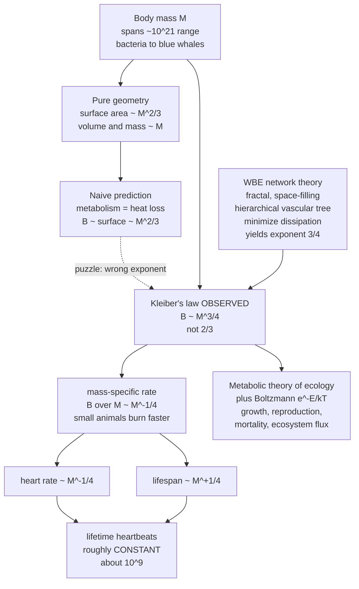

# 📏 Allometry and Scaling Laws in Biology

> [!abstract] TL;DR
> **Allometry** is the study of how anatomy, physiology, and life history change with body size, and the astonishing finding is that they change according to simple **power laws** $Y = a\,M^{b}$ that hold across ~20 orders of magnitude of mass. The most famous is **Kleiber's law**: metabolic rate scales as $M^{3/4}$ — not the naive surface-area $M^{2/3}$ — and from this single "quarter-power" exponent cascades a whole predictable physiology: heart rate $\propto M^{-1/4}$, lifespan $\propto M^{+1/4}$, and lifetime heartbeats roughly **constant** (~$10^{9}$) across mammals. The leading explanation (West–Brown–Enquist) roots these laws in the physics of **fractal, space-filling resource-distribution networks**, making allometry some of biology's strongest evidence that physical constraints shape the design of all living things.

---

## Intuition

**Analogy:** A mouse and an elephant are built from the same stuff — the same proteins, the same cells, the same ATP chemistry — yet a mouse's heart races at ~500 beats a minute while an elephant's ambles at ~30, and a mouse must eat frantically all day while an elephant sips by comparison. It is as if both animals are running the same movie but at wildly different playback speeds. Astonishingly, across a billionfold range of body sizes — from bacteria to blue whales — metabolism follows one simple mathematical rule tied to the number **3/4**. Nature seems to obey hidden scaling laws, as if all of life were variations on a single design constrained by the physics of distributing resources through a body.

Where a naive intuition says "twice the mass needs twice the fuel," biology answers with a *fractional* exponent: double the mass and metabolism rises by only about $2^{0.75} \approx 1.68$. That gentle-but-universal deviation from proportionality is the entire subject of allometry, and it turns out to encode deep truths about geometry, transport networks, and the pace of life itself. (This note sits in the wider map laid out in [[Biophysics_Overview]] and leans on the unit-fluency of [[Scales_Units_and_Orders_of_Magnitude_in_Biophysics]].)

---

## How It Works

### Core Mechanics

1. **Everything is a power law.** Plot almost any biological quantity $Y$ against body mass $M$ and you get $Y = a\,M^{b}$. Taking logs gives $\log Y = \log a + b\log M$ — a **straight line on log-log axes whose slope is the scaling exponent $b$**. This is why biology is drowning in power laws: over many decades of mass, the *only* relationships that stay simple are the scale-free ones. The intercept $a$ is a taxon- or trait-specific constant; the slope $b$ is where the physics lives.

2. **Isometric vs allometric.** If a trait scaled by pure geometry (an organism just being a scaled-up copy of itself), the exponent would follow from dimensions alone — this is **isometric** scaling. When the measured exponent *differs* from the geometric prediction, the scaling is **allometric** ("different measure"), and that difference is a clue that something beyond naive geometry — physics, transport, mechanics — is at work.

3. **The geometric starting point: the square-cube law.** Length scales as $L$, surface area as $L^{2}$, and volume (hence mass, at fixed density) as $L^{3}$. So area $\propto M^{2/3}$ and volume $\propto M$. **Galileo** first saw the consequence in 1638: strength scales with cross-sectional area ($\propto M^{2/3}$) but weight scales with volume ($\propto M$), so a giant animal's bones must become *disproportionately thick* to avoid crushing under their own weight — you cannot simply blow up a mouse into an elephant. The same square-cube logic governs heat loss (surface $\propto M^{2/3}$), setting thermoregulation and why small mammals struggle to stay warm.

4. **Kleiber's puzzle.** Because heat is lost through the surface, a natural guess is that **metabolic rate** should also scale as surface area, $B \propto M^{2/3}$. But in 1932 **Max Kleiber** measured basal metabolic rate across mammals and found $B \propto M^{3/4}$. The 3/4 exponent has since held from single cells and bacteria up to whales — a ~$10^{21}$ range in mass — making it one of the most universal quantitative laws in all of biology. The gap between the observed **3/4** and the geometric **2/3** is the central mystery.

5. **Why 3/4? Fractal resource networks (West–Brown–Enquist, 1997).** The influential WBE theory argues that metabolic rate is limited not by surface area but by the **resource-distribution network** — the circulatory and respiratory trees that deliver oxygen and nutrients to every cell. Assume the network is (i) **space-filling** (it must reach the whole 3-D volume), (ii) **hierarchical and fractal-like** (branching self-similarly, see [[Fractals_and_Self_Similarity]]), and (iii) **optimized** to minimize the energy dissipated pushing fluid through it, with size-invariant terminal units (capillaries). Optimizing such a branching transport network under these constraints yields the quarter-power exponent: $B \propto M^{3/4}$. The extra "1/4" beyond the naive "1/3" is, in effect, the fingerprint of an extra effective dimension contributed by the fractal network — biology behaves as if it lives in **four** dimensions, three of space plus one of the hierarchical network. The exact exponent and mechanism remain debated (some argue for $2/3$, or for a variable exponent), but the network idea reframed the question from geometry to **optimal transport**.

6. **The quarter-power cascade.** Once $B \propto M^{3/4}$ is fixed, a whole physiology follows by simple algebra:
   - **Mass-specific metabolic rate** $B/M \propto M^{-1/4}$ — each gram of a small animal burns energy *faster*, so small animals run hot and fast.
   - **Heart rate** and other biological rates $\propto M^{-1/4}$ — small hearts race, big hearts amble.
   - **Lifespan** and other biological *times* $\propto M^{+1/4}$ — big animals live slow and long.
   - Multiply a rate ($M^{-1/4}$) by a time ($M^{+1/4}$) and the mass **cancels**: **lifetime heartbeats ≈ constant** (~$10^{9}$, roughly 1.5 billion) across mammals. "Biological time" ticks in units of $M^{1/4}$ — small animals live fast and die young, but every mammal gets about the same number of heartbeats.

7. **From physiology to ecology.** The **Metabolic Theory of Ecology** (Brown, Gillooly, West et al., 2004) extends the law by combining the $M^{3/4}$ mass dependence with a **temperature** dependence via the Boltzmann factor $e^{-E/kT}$ (metabolism speeds up with warmth). Together these set the rates of growth, reproduction, mortality, population density, and even ecosystem-level biogeochemical fluxes — a bid to derive much of ecology from the metabolism of individuals.

### Flow / Architecture



---

## Key Concepts

### Secondary Level

- **Scaling means "how a trait changes with size."** Bigger is not just "more of the same" — proportions shift. An elephant is not a giant mouse; its legs are far thicker relative to its body.
- **Power law $Y = a\,M^{b}$.** The exponent $b$ tells you the *kind* of scaling: $b = 1$ is proportional, $b < 1$ means the trait grows *slower* than mass (metabolism, $b=3/4$), $b > 1$ means faster.
- **Log-log plots turn power laws into straight lines.** The slope you measure on a log-log graph *is* the exponent $b$. This is the single most useful reading skill in allometry, and it rests on logarithms — see [[Exponential_and_Logarithmic_Functions]].
- **Square-cube rule.** Double the length and area goes up 4x while volume/weight goes up 8x. This is why big animals need thick bones and why small animals lose heat fast.

### Undergraduate Level

- **Isometry vs allometry, quantitatively.** Isometric (geometric) scaling predicts specific exponents: any area $\propto M^{2/3}$, any length $\propto M^{1/3}$. A measured exponent that departs from these signals allometry. Skeletal mass, for instance, scales slightly steeper than $M^{1}$ in mammals, exactly as Galileo's argument predicts.
- **Kleiber's law $B = a\,M^{3/4}$.** For mammals a common fit is basal metabolic rate $B \approx 70\,M^{0.75}$ kcal/day ($M$ in kg). The exponent, not the prefactor, is the universal part.
- **The $-1/4$ / $+1/4$ family.** Because rate $=$ (throughput)/(store) and both track metabolism and mass, biological *rates* scale as $M^{-1/4}$ (heart rate, respiration rate, mass-specific metabolism) and biological *times* scale as $M^{+1/4}$ (lifespan, gestation, time to maturity, circulation time).
- **The invariant.** rate $\times$ time cancels mass: lifetime heartbeats $\approx 10^{9}$, and lifetime respirations are similarly conserved. Life is lived at a mass-dependent tempo but with a near-constant "budget" of ticks.
- **Fitting exponents.** In practice you take logs of your data and run ordinary least squares (see [[Exponential_and_Logarithmic_Functions]]); the fitted slope estimates $b$ with a confidence interval, letting you test 3/4 against 2/3 statistically.

### Graduate Level

- **The WBE derivation sketch.** Model the vasculature as a branching network of $N$ generations. Space-filling requires the volume served by each terminal unit to tile 3-D space; area-preserving branching (to keep flow smooth) plus minimization of viscous dissipation under a fixed total blood volume forces the number and size of vessels at each level into a self-similar geometric series. Solving the optimization gives metabolic rate (set by total capillary throughput) $\propto M^{3/4}$. The "quarter" arises because a 3-D organism is serviced by an effectively 4-D fractal network ($D+1$).
- **Metabolic Theory of Ecology.** Individual metabolic rate $B = b_0\,M^{3/4}\,e^{-E/kT}$, where $E \approx 0.6$–0.7 eV is an activation energy and $kT$ the thermal energy (the same Boltzmann factor central to [[Bioenergetics_and_ATP]] and chemical kinetics). Mass-corrected rates then predict developmental rates, mortality, and population growth, linking cell biochemistry to ecosystem carbon flux.
- **The 3/4-vs-2/3 controversy.** Large compilations sometimes find exponents between 2/3 and 3/4, with the "true" value depending on taxon, whether basal or field metabolic rate is used, statistical methods (OLS vs reduced major axis), and phylogenetic correction. Critics (e.g. Dodds, White & Seymour) argue 2/3 is not excluded; defenders note the 3/4 network model predicts many *other* quarter-power laws simultaneously. The debate is a case study in how to test a "universal" law against messy data.
- **Limits of body size.** Scaling sets the *edges* of the possible: below a minimum size, surface heat loss and the cost of running organs become unsustainable (the smallest mammals, shrews, must eat almost continuously); at the largest sizes, bone strength ($\propto M^{2/3}$) and the delivery capacity of the vascular network cap how big a land animal can be. Allometry thus explains not just the trend but the boundaries of viable design.
- **Applied allometry.** Pharmacokinetics uses **allometric scaling** to convert drug doses across species ($\text{clearance} \propto M^{3/4}$, a workhorse of first-in-human dose estimation); brain size scales with body mass ($\sim M^{3/4}$) via **encephalization quotients**; and home-range area, blood flow, and aortic radius all obey quarter-power relations.

---

## Python Demo

```python
# Allometric scaling laws, three demonstrations:
#   (a) KLEIBER'S LAW  - metabolic rate vs body mass on log-log axes;
#       fit the power law and recover the ~3/4 exponent (vs naive 2/3).
#   (b) DERIVED SCALINGS - mass-specific rate & heart rate ~ M^-1/4,
#       lifespan ~ M^+1/4, and lifetime heartbeats ~ constant (~10^9).
#   (c) GEOMETRIC area-vs-volume (square-cube) scaling for contrast.
import numpy as np
import matplotlib.pyplot as plt

rng = np.random.default_rng(0)

# ------------------------------------------------------------------
# (a) KLEIBER'S LAW: simulate many "species" spanning ~10 orders of mass
# ------------------------------------------------------------------
n = 200
logM = rng.uniform(-6, 5, n)                 # mass 1e-6 kg (insect) .. 1e5 kg (whale)
M = 10.0**logM
a_true, b_true = 70.0, 0.75                  # ground truth: B = 70 * M^0.75 kcal/day
B = a_true * M**b_true * 10.0**(rng.normal(0, 0.10, n))   # lognormal scatter

# Fit power law by least squares in log-space: log B = log a + b*log M
b_fit, loga_fit = np.polyfit(np.log10(M), np.log10(B), 1)
a_fit = 10.0**loga_fit
print("=== Kleiber fit ===")
print("fitted exponent b = %.3f   (Kleiber 3/4 = 0.750, naive surface 2/3 = 0.667)" % b_fit)
print("fitted prefactor a = %.1f" % a_fit)

# ------------------------------------------------------------------
# (b) DERIVED SCALINGS from B ~ M^(3/4)
# ------------------------------------------------------------------
Mgrid = np.logspace(-3, 5, 100)                       # 1 g .. 100 tonnes
mass_specific = 70.0 * Mgrid**0.75 / Mgrid            # B/M   ~ M^-1/4
heart_rate    = 240.0 * Mgrid**(-0.25)               # bpm   ~ M^-1/4 (mouse ~600, human ~80)
lifespan_yr   = 11.8 * Mgrid**(0.25)                 # years ~ M^+1/4
min_per_yr    = 60 * 24 * 365.0
lifetime_beats = heart_rate * min_per_yr * lifespan_yr

print("\n=== Derived scalings ===")
for label, Mx in [("mouse", 0.02), ("human", 70.0), ("elephant", 5000.0)]:
    hr = 240.0 * Mx**(-0.25)
    ls = 11.8 * Mx**(0.25)
    lb = hr * min_per_yr * ls
    print("%-9s M=%8.2f kg  heart=%5.0f bpm  lifespan=%5.1f yr  lifetime beats=%.2e"
          % (label, Mx, hr, ls, lb))

# ------------------------------------------------------------------
# (c) GEOMETRIC (isometric) area-vs-volume scaling
# ------------------------------------------------------------------
area   = Mgrid**(2.0/3.0)      # surface area ~ M^2/3
volume = Mgrid**(1.0)          # volume / mass ~ M
sa_vol = area / volume         # surface-to-volume ~ M^-1/3

# ------------------------------------------------------------------
# PLOTS
# ------------------------------------------------------------------
fig, ax = plt.subplots(2, 2, figsize=(13, 10))

# Panel 1: Kleiber log-log with fit and naive 2/3 line
a1 = ax[0, 0]
a1.scatter(M, B, s=12, alpha=0.4, color="#4a9eff", label="species (simulated)")
xline = np.logspace(-6, 5, 50)
a1.plot(xline, a_fit * xline**b_fit, "r-", lw=2, label="fit  B ~ M^%.2f" % b_fit)
a1.plot(xline, a_fit * xline**(2/3), "k--", lw=1.5, label="naive surface  M^0.67")
a1.set_xscale("log"); a1.set_yscale("log")
a1.set_xlabel("body mass M (kg)"); a1.set_ylabel("metabolic rate B (kcal/day)")
a1.set_title("Kleiber's law: B ~ M^3/4 over ~10 orders of magnitude")
a1.legend(fontsize=8)

# Panel 2: mass-specific rate & heart rate (both ~ M^-1/4)
a2 = ax[0, 1]
a2.plot(Mgrid, mass_specific, color="#ff6b6b", lw=2, label="mass-specific rate B/M ~ M^-1/4")
a2.plot(Mgrid, heart_rate, color="#9775fa", lw=2, label="heart rate ~ M^-1/4")
a2.set_xscale("log"); a2.set_yscale("log")
a2.set_xlabel("body mass M (kg)"); a2.set_ylabel("rate (per unit)")
a2.set_title("Small animals live 'faster': rates ~ M^-1/4")
a2.legend(fontsize=8)

# Panel 3: lifespan (M^+1/4) and lifetime heartbeats (~constant)
a3 = ax[1, 0]
a3.plot(Mgrid, lifespan_yr, color="#20c997", lw=2, label="lifespan ~ M^+1/4")
a3.set_xscale("log"); a3.set_yscale("log")
a3.set_xlabel("body mass M (kg)"); a3.set_ylabel("lifespan (years)", color="#20c997")
a3b = a3.twinx()
a3b.plot(Mgrid, lifetime_beats, color="#f76707", lw=2, ls="--", label="lifetime heartbeats")
a3b.set_yscale("log"); a3b.set_ylabel("lifetime heartbeats", color="#f76707")
a3b.set_ylim(1e8, 1e10)
a3.set_title("Lifespan ~ M^1/4, but lifetime beats ~ 10^9 (constant)")
a3.legend(fontsize=8, loc="upper left")

# Panel 4: geometric area vs volume, surface-to-volume ratio
a4 = ax[1, 1]
a4.plot(Mgrid, area, color="#845ef7", lw=2, label="surface area ~ M^2/3")
a4.plot(Mgrid, volume, color="#495057", lw=2, label="volume / mass ~ M")
a4.plot(Mgrid, sa_vol, color="#e8590c", lw=2, ls="--", label="surface / volume ~ M^-1/3")
a4.set_xscale("log"); a4.set_yscale("log")
a4.set_xlabel("body mass M (kg)"); a4.set_ylabel("geometric quantity (arb. units)")
a4.set_title("Square-cube: area lags volume -> big animals need thick bones")
a4.legend(fontsize=8)

plt.tight_layout()
plt.savefig("allometry_scaling.png", dpi=130)
print("\nSaved figure to allometry_scaling.png")
```

Running this recovers a fitted exponent of **~0.75** despite heavy scatter (clearly distinguishing Kleiber's 3/4 from the naive 2/3 dashed line), prints heart rates of ~640 bpm for a mouse versus ~28 bpm for an elephant, and shows that **lifetime heartbeats come out at ~1.5 × 10⁹ for all three animals** — the mass dependence cancels exactly, just as the theory predicts.

---

## Real-World Applications

> **Example — allometric drug dosing in pharmacology.** When a drug moves from mouse trials toward a first-in-human dose, pharmacologists do *not* scale the dose linearly with body weight. Drug **clearance** (the volume of blood cleared per unit time by liver and kidney) is itself a metabolic-transport process and scales as $M^{3/4}$, exactly Kleiber's exponent. So a regulator's "human-equivalent dose" is computed by multiplying the animal dose by $(M_{\text{animal}}/M_{\text{human}})^{1/4}$ rather than $M^{1}$. Ignoring the quarter-power correction systematically overdoses small-animal-derived estimates — a direct, life-or-death consequence of allometry that is written into FDA guidance.

Other applications: veterinary and zoo medicine scale anesthetic and nutritional needs across species by quarter-power rules; ecologists use the metabolic theory to predict population densities (which scale as $M^{-3/4}$, so biomass per unit area is roughly size-independent) and ecosystem respiration; conservation biology estimates extinction risk partly from slow, large-bodied life histories ($\propto M^{1/4}$); and physiologists predict organ blood flow, aortic dimensions, and drug half-lives for species never directly measured. The same square-cube mechanics govern the design questions taken up in the companion notes **Biomechanics_of_Movement** (why bone and muscle cross-sections must outpace body mass) and **Fluid_Dynamics_in_Biology** (how the vascular network minimizes pumping cost).

---

## Common Pitfalls

- **Confusing the exponent with the prefactor.** The universal physics lives in the slope $b$, not the intercept $a$. Two clades can share $b = 3/4$ while differing several-fold in $a$ (e.g. cold-blooded vs warm-blooded). Comparing prefactors as if they were the "law" misses the point.
- **Reading power laws off linear axes.** On linear axes a power law looks like an unremarkable curve and small and large species get visually crushed together. **Always plot log-log** — only then does the exponent appear as a slope and the multi-decade linearity become visible (see [[Exponential_and_Logarithmic_Functions]]).
- **Assuming metabolism must follow surface area.** The seductive $M^{2/3}$ heat-loss argument is *wrong* for basal metabolic rate; the data say $M^{3/4}$. Surface-area scaling governs heat exchange and drag, not the whole metabolic budget — the resource network, not the skin, sets the ceiling.
- **Over-claiming universality.** Real data have genuine scatter and the 3/4-vs-2/3 debate is unsettled; some traits deviate strongly, and single-species ontogenetic growth need not share the interspecific exponent. Scaling laws reveal deep *tendencies* and constraints, not exceptionless decrees.
- **Mixing basal, resting, and field metabolic rates.** These differ by large factors and can carry different exponents. Fitting a pooled, inconsistent dataset produces a meaningless "average" slope. Define the metabolic state before you fit.
- **Naive OLS on log-transformed data.** Ordinary least squares assumes error only in $Y$; for allometry with error in both mass and rate, reduced-major-axis regression can shift the estimated exponent enough to matter in the 2/3-vs-3/4 argument.

---

## Related Concepts

- [[Scales_Units_and_Orders_of_Magnitude_in_Biophysics]] — the unit-fluency and log-scale thinking that make reading and estimating scaling relations second nature; explicitly flags allometry as the cross-organism scaling problem.
- [[Biophysics_Overview]] — situates allometry as the "whole-organism" tier of biophysics, above molecules and cells.
- [[Fractals_and_Self_Similarity]] — the fractal, space-filling geometry that WBE theory invokes to explain why the exponent is 3/4 rather than 2/3.
- [[Bioenergetics_and_ATP]] — metabolic rate is ultimately ATP turnover; the Boltzmann factor $e^{-E/kT}$ that adds temperature to the metabolic theory of ecology comes from the same energetics.
- [[Oxidative_Phosphorylation]] — the cellular machinery whose aggregate throughput *is* the metabolic rate that Kleiber's law scales.
- [[The_Circulatory_and_Respiratory_Systems]] — the physical resource-distribution networks whose branching geometry sets the quarter-power exponents.
- [[The_Musculoskeletal_System]] — where Galileo's square-cube law bites: bone and muscle cross-section must scale faster than mass.
- [[Ecosystems_and_Energy_Flow]] — the metabolic theory of ecology scales individual metabolism up to community energy budgets.
- [[Population_Ecology]] — population density scales as $M^{-3/4}$, a direct ecological consequence of metabolic scaling.
- [[Aging_and_Regeneration]] — the $M^{1/4}$ scaling of lifespan and the near-constant lifetime energy/heartbeat budget bear on theories of aging.
- [[Small_World_and_Scale_Free_Networks]] — allometry is a biological instance of scale-free structure and network-limited transport.
- [[Exponential_and_Logarithmic_Functions]] — the mathematics behind log-log plots and the linear regression used to estimate scaling exponents.

---

## Review Questions

1. **(Conceptual)** A student argues that because animals lose heat through their skin, metabolic rate "obviously" must scale as surface area, $M^{2/3}$. Explain why this reasoning is appealing, what the data actually show, and what the West–Brown–Enquist theory proposes instead. What does the "extra quarter" in the exponent physically represent?
2. **(Scenario / estimation)** A mouse (0.02 kg) has a resting heart rate near 600 bpm and lives ~3 years; an elephant (5000 kg) beats ~30 bpm and lives ~60 years. Using quarter-power scaling, show that both animals experience roughly the same number of lifetime heartbeats, and estimate that number. Which two scaling exponents combine to make the mass cancel, and why?
3. **(Trade-off / limits)** You must estimate a safe first-in-human dose of a new drug from rat data. Compare linear ($M^{1}$) scaling with allometric ($M^{3/4}$) clearance scaling: which gives the larger human dose, by roughly what factor for a 250 g rat to a 70 kg human, and what are the risks of choosing the wrong one? Then discuss one reason a purely allometric estimate could still fail.

---

## Sources

- Kleiber, M. (1932). "Body size and metabolism." *Hilgardia* 6(11): 315–353. — [doi.org/10.3733/hilg.v06n11p315](https://doi.org/10.3733/hilg.v06n11p315)
- West, G. B., Brown, J. H. & Enquist, B. J. (1997). "A General Model for the Origin of Allometric Scaling Laws in Biology." *Science* 276: 122–126. — [doi.org/10.1126/science.276.5309.122](https://doi.org/10.1126/science.276.5309.122)
- Brown, J. H., Gillooly, J. F., Allen, A. P., Savage, V. M. & West, G. B. (2004). "Toward a Metabolic Theory of Ecology." *Ecology* 85(7): 1771–1789. — [doi.org/10.1890/03-9000](https://doi.org/10.1890/03-9000)
- Schmidt-Nielsen, K. (1984). *Scaling: Why Is Animal Size So Important?* Cambridge University Press.
- West, G. B. (2017). *Scale: The Universal Laws of Growth, Innovation, Sustainability, and the Pace of Life in Organisms, Cities, Economies, and Companies.* Penguin Press.

---

#biophysics #allometry #scaling-laws #kleibers-law #metabolic-theory
