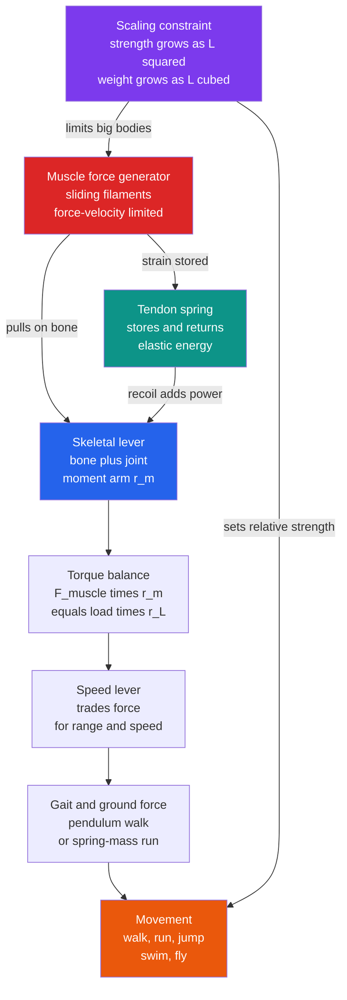

# 🦿 Biomechanics of Movement

> [!abstract] TL;DR
> **Biomechanics** applies the physics of mechanics — **forces, torques, materials, and energy** — to how organisms move, support themselves, and interact with their physical world. Four ideas do most of the work. (1) **Muscles are force generators**: arrays of myosin motors pull actin (the sliding-filament mechanism), and the whole muscle behaves as a *tunable actuator* governed by the **force–velocity relation** (Hill's equation: less force when shortening faster) and the **length–tension relation** — a fundamental trade-off between force and speed. (2) **Skeletons are levers**: bones + joints + muscles form lever systems, and most vertebrate limbs are **speed levers** — the muscle inserts *near* the joint, sacrificing force for a large **range and speed** of motion, set by torque balance $F_{muscle}\,r_{m} = F_{load}\,r_{L}$. (3) **Tendons are springs**: elastic elements (the Achilles tendon, insect resilin) store and return energy like a pogo stick, making running efficient and enabling **power amplification** — catapult mechanisms that beat muscle's raw power limit (mantis shrimp, fleas, trap-jaw ants). (4) Above all, **scaling** rules everything: muscle and bone **strength scale as area** ($L^{2}$) while **weight scales as volume** ($L^{3}$), so **relative strength falls as $1/L$** — which is why an ant can lift 50 times its weight while an elephant can barely jump, and why (in the ideal geometric model) *absolute jump height is roughly independent of size*. Biomechanics reveals movement as applied physics, underpinning sports science, orthopedics, prosthetics, ergonomics, and bio-inspired robotics.

## Intuition

**Analogy:** A flea jumps 100 times its body length. An ant lifts 50 times its own weight. Yet an elephant can barely get all four feet off the ground at once, and a giant the size of a house could not stand up without its own bones snapping. It is tempting to conclude that small animals simply have *better muscles* — that insect muscle is some superior material. It is not. Insect and elephant muscle produce almost exactly the same **force per unit cross-sectional area** (roughly 20–35 newtons per square centimetre). The real explanation is **geometry**.

Imagine scaling an animal up while keeping its shape fixed. Double every length, and the cross-sectional area of every muscle and bone — which sets **strength** — grows by $2^{2} = 4$. But the **weight** the animal must carry and lift, which depends on **volume**, grows by $2^{3} = 8$. Strength doubled fourfold; weight octupled. Every time you scale up, weight wins the race against strength. So the *relative* strength of a body — what it can do compared to its own weight — inexorably **falls as it gets bigger**. The flea is not strong; it is *small*, and smallness is a mechanical superpower. Layer onto this the physics of **levers** (skeletons that trade force for speed), **springy tendons** (that recycle energy like a bouncing ball), and **material limits** (bone that is stiff but brittle), and you have the toolkit that explains why animals of wildly different sizes move in such radically different ways.

---

## How It Works

### Muscle as a force generator

At the microscale, a muscle contracts because vast arrays of **myosin motors** pull on **actin** filaments and slide them past one another (the **sliding-filament mechanism**; the molecular engine itself is covered in [[Molecular_Motors_and_Mechanochemistry]]). Two macroscale "laws" emerge from summing billions of these motors:

- **Length–tension relation.** A muscle produces maximal active force at an intermediate length, where the overlap between actin and myosin filaments allows the most cross-bridges to form. Too stretched or too bunched, and force falls off.
- **Force–velocity relation (Hill's equation).** A muscle that is *shortening* produces **less force the faster it shortens** — a hyperbolic falloff, $(F + a)(v + b) = (F_{0} + a)\,b$. At zero velocity it holds its maximum **isometric** force $F_{0}$; at maximum shortening velocity it produces no force at all. Conversely, muscle being *stretched while active* (eccentric contraction) can bear *more* than $F_{0}$.

The consequence is a permanent **force-versus-speed trade-off**, baked into the actuator itself. Peak *mechanical power* (force $\times$ velocity) occurs at intermediate load, roughly one-third of $F_{0}$ — which is why gears, levers, and elastic springs matter so much: they let an animal operate its muscles near their efficient sweet spot while the *limb* moves fast or forcefully as the task demands. Muscle is best thought of as a **tunable actuator**, not a fixed spring or a fixed force source.

### The skeleton as a system of levers

Bones + joints + muscles form **lever systems**. Take the forearm: the **elbow** is the fulcrum, the **biceps** inserts only a few centimetres past it ($r_{m} \approx 4$ cm), and the **load** in the hand sits far out ($r_{L} \approx 35$ cm). Static equilibrium demands **torque balance** about the joint:

$$F_{muscle}\,r_{m} = F_{load}\,r_{L} \quad\Rightarrow\quad F_{muscle} = F_{load}\,\frac{r_{L}}{r_{m}}$$

With those numbers, holding a 5 kg weight requires the biceps to pull with roughly $5\times 9.8 \times (0.35/0.04) \approx 430$ N — nearly **nine times** the load. The **mechanical advantage** $r_{m}/r_{L} < 1$ is *unfavourable* for force. Why build limbs this way? Because the **velocity ratio is the inverse**: the hand sweeps through $r_{L}/r_{m} \approx 9$ times the distance (and speed) that the muscle shortens. Most vertebrate limbs are deliberately **"speed levers"** — they *spend* force to *buy* range and speed of motion. A muscle that contracts a few centimetres slowly can hurl a hand (or a spear, or a tennis racket) many times faster. The **moment arm** — the perpendicular distance from the joint to the line of muscle pull — is the single most important design parameter, and it changes with joint angle, tuning the trade-off dynamically.

### Forces, torques, and gait

Standing, walking, and running are Newtonian mechanics of a jointed body under gravity (see [[Newtons_Laws_and_Kinematics]] and [[Rotational_Dynamics]]). Stability requires the **centre of mass** to project within the base of support; every footfall generates a **ground reaction force** that must be balanced against gravity and inertia. Two elegant physical models describe the two main gaits:

- **Walking = an inverted pendulum.** The body vaults up and over a relatively stiff leg, trading **kinetic energy** (fast at the bottom) for **gravitational potential energy** (high at the top) and back, like a swinging pendulum. This exchange recovers up to 65% of the energy per step passively — walking is cheap.
- **Running = a spring-mass "bounce."** Now kinetic and potential energy are *in phase* (both lowest at mid-stance), so the pendulum trick fails. Instead the leg behaves like a **pogo stick**: it compresses, storing energy elastically, then rebounds. The relevant model is a point mass on a spring (the SLIP model — spring-loaded inverted pendulum), closely related to simple harmonic motion (see [[Oscillations_and_SHM]]).

### Elastic energy storage and power amplification

That spring is largely the **tendon**. The **Achilles tendon** stretches during the stance phase of running and recoils to return roughly **90–93%** of the stored energy (its **resilience**), acting as the literal spring of the "pogo stick" and cutting the metabolic cost of running dramatically. Insects use **resilin**, a rubber-like protein of near-perfect resilience, in flight hinges and jumping legs.

Elastic elements also enable **power amplification**, which sidesteps a hard limit: muscle can only deliver power so fast (a few hundred watts per kilogram). To jump or strike faster than muscle alone allows, animals use a **catapult**: the muscle contracts *slowly* over a long time to load a spring against a latch, then the latch releases, dumping the stored energy in milliseconds. The output power far exceeds what the muscle could ever produce directly. The **mantis shrimp** strikes at accelerations over $10^{4}\,g$, the **flea** and the **trap-jaw ant** launch via latched resilin springs. Muscle sets the *energy*; the spring-and-latch sets the *power*.

### Materials of the body

Biological structures are **composite materials** (see [[Composite_Materials_and_Fiber_Reinforcement]]) tuned to their mechanical job, described by **stress–strain** behaviour (see [[Stress_Strain_and_Elastic_Moduli]]):

- **Bone** — a composite of stiff mineral (hydroxyapatite) in a tough collagen matrix; **stiff and strong in compression**, but relatively **brittle** — its resistance to cracking (toughness) matters as much as strength (see [[Fracture_Mechanics_and_Toughness]]).
- **Tendon and ligament (collagen)** — **tough in tension**, springy, high resilience; they transmit and store, not resist compression.
- **Cartilage** — a **viscoelastic** cushion at joints, distributing load and reducing friction (see [[Polymer_Mechanics_and_Viscoelasticity]]).

Bodies are **optimized composites**: stiffness, strength, and toughness are separately tuned by mixing mineral and protein — a design logic that engineered **biomaterials** for implants and prosthetics try to imitate (see [[Biomaterials_and_Biocompatibility]]).

### Scaling and allometry — the master constraint

Everything above is reshaped by **size**. Under **geometric (isometric) scaling** — keep shape, change length $L$ — key quantities scale as powers of $L$:

- Muscle and bone **cross-sectional area** $\propto L^{2}$, so maximum **force** $\propto L^{2}$.
- **Volume and mass (weight)** $\propto L^{3}$.
- **Relative strength** (force per body weight) $\propto L^{2}/L^{3} = 1/L$ — it **falls** with size.
- **Muscle work per jump** $\propto (\text{stress}\times\text{area})\times(\text{strain}\times\text{length}) \propto L^{2}\cdot L = L^{3} \propto \text{mass}$, so ideal **jump height** $= \text{work}/(mg) \propto L^{3}/L^{3} = \text{constant}$ — roughly **independent of body size** (fleas cheat this only via elastic power amplification).

This is **Galileo's insight** (1638): a giant cannot simply be a scaled-up man, because its bones would have to grow disproportionately thick to bear the cube-law weight on square-law cross-sections. Real large animals compensate by **positive allometry** — elephant leg bones are proportionally far thicker and held straighter (columnar) than a gazelle's. Scaling also governs stride length, the **cost of transport** (energy per unit distance per unit mass falls with size), and metabolic rate. The broader scaling framework is the subject of the forthcoming sibling *Allometry_and_Scaling_Laws_in_Biology*.

### Locomotion across media

The dominant physics changes with the medium:

- **On land** — fight **gravity** with levers and springs; walking (pendulum) and running (spring-mass) as above.
- **In water** — inertia versus **drag**. Large swimmers exploit inertia and streamlining; **microbes swim at Reynolds number $\ll 1$**, where viscosity crushes inertia, coasting is impossible, and a corkscrew or breaststroke that is time-reversible produces *zero* net motion (the "scallop theorem"). This low-Reynolds regime, and drag more generally, connects to [[Viscous_Fluids_and_Navier_Stokes]] and to the forthcoming sibling *Fluid_Dynamics_in_Biology*; the same viscous world governs [[Diffusion_and_Brownian_Motion_in_Cells]].
- **In air** — generate **lift** against **drag** via wings; flapping flight adds unsteady aerodynamics (leading-edge vortices) that fixed-wing theory misses.

Strikingly, physics forces **convergent solutions**: streamlined bodies for swimmers, springy tendons for runners, catapults for jumpers, appear independently across unrelated lineages because the mechanics leave few good options. Movement at the *cellular* scale — crawling, adhesion, and cytoskeletal force generation — is a different regime again, taken up in the siblings *The_Cytoskeleton_and_Cell_Mechanics* and *Cell_Motility_and_Adhesion* and previewed in [[The_Cytoskeleton_and_Cell_Motility]].



---

## Key Concepts

### Secondary Level

- **Movement is applied physics.** Muscles pull, bones act as levers, and everything obeys Newton's laws — force, balance, and energy.
- **Muscles trade force for speed.** A muscle pulls hardest when it barely moves and produces almost no force when it shortens very fast (the force–speed trade-off).
- **Limbs are speed levers.** Muscles attach *close* to a joint, so a small, slow muscle pull makes the hand or foot move *far and fast* — at the cost of needing a large muscle force.
- **Tendons are springs.** In running, tendons stretch and snap back like a bouncing ball, returning most of the energy so you do not have to re-power every step.
- **Small animals are relatively strong.** Strength depends on cross-section (area), weight depends on volume; small bodies have a lot of area for little weight, so a flea or ant is "super strong" for its size while an elephant cannot jump.

### Undergraduate Level

- **Hill's force–velocity relation.** $(F+a)(v+b)=(F_{0}+a)b$: force falls hyperbolically with shortening velocity; power $= Fv$ peaks near $F \approx F_{0}/3$. Isometric force $F_{0} \approx 20\text{–}35\ \text{N/cm}^{2}$ of physiological cross-section — nearly size-independent across animals.
- **Lever torque balance.** $F_{muscle}\,r_{m} = F_{load}\,r_{L}$; mechanical advantage $r_{m}/r_{L}$, velocity ratio $r_{L}/r_{m}$. The **moment arm** varies with joint angle, tuning the trade-off through the range of motion.
- **Gaits as mechanical models.** Walking = inverted pendulum (out-of-phase KE and PE, energy recovered passively); running = spring-mass / SLIP (in-phase KE and PE, energy stored elastically). Transition set by the **Froude number** $v^{2}/(gL) \approx 0.5$.
- **Elastic energy and resilience.** Stored energy $=\tfrac{1}{2}k x^{2}$; tendon **resilience** $\approx 90\text{–}93\%$. **Power amplification** via latched springs decouples output power from muscle's intrinsic power limit.
- **Geometric scaling.** Force $\propto L^{2}$, weight $\propto L^{3}$, relative strength $\propto L^{-1}$, ideal jump height $\propto L^{0}$ (constant). Bone stress under gravity $\propto L$, forcing thicker bones in larger animals.

### Graduate Level

- **Muscle as a Hill-type actuator.** Contractile element (force–velocity, force–length), in series and parallel with elastic elements; activation dynamics and pennation angle set the effective force and excursion. Cross-bridge (Huxley) models derive Hill's equation from myosin kinetics.
- **Allometric exponents.** Isometry predicts specific power scalings (e.g., stress $\propto M^{1/3}$, jump height $\propto M^{0}$); real data show **elastic-similarity** or **static-stress-similarity** deviations (bone diameter $\propto$ length$^{3/2}$ under elastic similarity). Metabolic **cost of transport** $\propto M^{-0.3}$ empirically.
- **Spring-mass dynamics of running.** Dimensionless leg stiffness $\tilde k = k L_{0}/(mg)$ and touchdown angle govern stable periodic gaits; self-stabilizing (passive-dynamic) solutions exist without active control — the basis of passive walkers and legged robots.
- **Latch-mediated spring actuation (LaMSA).** A unifying framework for power-amplified motion (mantis shrimp, fleas, trap-jaw ants, snapping plants): a motor slowly loads a spring against a latch; released, the spring-mass-latch system sets peak acceleration and delivers energy on a timescale muscle cannot match.
- **Low-Reynolds swimming.** At $Re \ll 1$ the Navier–Stokes equations lose their inertial term; Purcell's **scallop theorem** forbids net motion from time-reversible strokes, forcing non-reciprocal gaits (rotating flagella, metachronal cilia). Efficiency and the geometry of swimming are strongly constrained.

---

## Python Demo

```python
# Biomechanics of movement, three physical stories:
#   (a) LEVER   -- the forearm as a speed lever: muscle force to hold a load
#                  versus insertion distance, exposing the force-vs-speed trade-off
#   (b) SCALING -- geometric scaling (force ~ L^2, weight ~ L^3): why relative
#                  strength FALLS with size while ideal jump height is size-independent
#   (c) ELASTIC -- spring-mass "pogo stick" running: a tendon that returns energy
#                  keeps the bounce alive; a dissipative leg decays and must be re-powered
import numpy as np
import matplotlib.pyplot as plt

g = 9.81
fig, ax = plt.subplots(1, 3, figsize=(17, 5))

# ---- (a) Forearm lever: F_muscle * r_m = F_load * r_L -------------------------
m_load = 5.0                       # kg held in the hand
F_load = m_load * g                # N, the weight to support
r_L    = 0.35                      # m, hand distance from elbow (fulcrum)
r_m    = np.linspace(0.02, 0.10, 300)   # m, biceps insertion distance from elbow
F_muscle = F_load * r_L / r_m      # N, required muscle force (torque balance)
vel_ratio = r_L / r_m              # hand speed / muscle-shortening speed
r_m_human = 0.04                   # m, typical biceps insertion
F_human   = F_load * r_L / r_m_human

axL = ax[0]
axL.plot(r_m * 100, F_muscle, lw=2.5, color='crimson', label='muscle force needed')
axL.axhline(F_load, ls=':', color='gray', label=f'load weight = {F_load:.0f} N')
axL.plot(r_m_human * 100, F_human, 'ko', ms=8)
axL.annotate(f'human biceps\n{F_human:.0f} N to hold {m_load:.0f} kg',
             xy=(r_m_human * 100, F_human), xytext=(5.0, F_human * 0.9),
             fontsize=9, arrowprops=dict(arrowstyle='->'))
axL.set_xlabel('muscle insertion distance r_m (cm)')
axL.set_ylabel('muscle force (N)', color='crimson')
axL.tick_params(axis='y', labelcolor='crimson')
axL.set_title('(a) Forearm = speed lever\ninsert near joint: big force, but fast hand')
axL.grid(alpha=0.3); axL.legend(loc='upper right', fontsize=8)
axR = axL.twinx()
axR.plot(r_m * 100, vel_ratio, lw=2.0, ls='--', color='navy')
axR.set_ylabel('hand-speed advantage r_L / r_m', color='navy')
axR.tick_params(axis='y', labelcolor='navy')

# ---- (b) Scaling: relative strength and jump height vs body mass --------------
M = np.logspace(-6, 4, 200)        # kg, from flea (~0.5 mg) to elephant (~5 t)
rel_strength = M ** (-1.0 / 3.0)   # force/weight ~ L^2 / L^3 = L^-1 ~ M^(-1/3)
sigma, eps, rho, f_musc = 3.0e5, 0.25, 1060.0, 0.10   # muscle stress, strain, density, muscle fraction
h_ideal = f_musc * sigma * eps / (rho * g)            # size-independent jump height (m)
h_jump  = np.full_like(M, h_ideal)
animals = {'flea': 5e-7, 'ant': 5e-6, 'frog': 0.03, 'human': 70.0, 'elephant': 5000.0}

axS = ax[1]
axS.loglog(M, rel_strength, lw=2.5, color='purple', label='relative strength ~ M^(-1/3)')
for name, mass in animals.items():
    axS.plot(mass, mass ** (-1.0 / 3.0), 'o', color='purple', ms=6)
    axS.annotate(name, (mass, mass ** (-1.0 / 3.0)), fontsize=8,
                 textcoords='offset points', xytext=(3, 4))
axS.set_xlabel('body mass M (kg)')
axS.set_ylabel('relative strength (a.u.)', color='purple')
axS.tick_params(axis='y', labelcolor='purple')
axS.set_title('(b) Scaling: small = relatively strong,\nideal jump height ~ size-independent')
axS.grid(alpha=0.3, which='both')
axJ = axS.twinx()
axJ.plot(M, h_jump, lw=2.5, ls='--', color='green')
axJ.set_xscale('log'); axJ.set_ylim(0, 1.5)
axJ.set_ylabel('ideal jump height (m)', color='green')
axJ.tick_params(axis='y', labelcolor='green')
axJ.text(1e-3, h_ideal + 0.05, f'~{h_ideal:.2f} m for ALL sizes',
         color='green', fontsize=9)

# ---- (c) Spring-mass "pogo stick": tendon returns energy, lossy leg decays ----
m_hop, L0, k_leg = 70.0, 1.0, 20000.0     # runner mass (kg), leg length (m), stiffness (N/m)
dt, T_sim = 1.0e-4, 3.0
steps = int(T_sim / dt)
t = np.arange(steps) * dt

def hop(damping):
    y, v = 1.15, 0.0                       # start above L0 -> falls and bounces
    ys, comp_max = np.empty(steps), 0.0
    for i in range(steps):
        if y < L0:                         # stance: leg spring is compressed
            comp = L0 - y
            comp_max = max(comp_max, comp)
            F = k_leg * comp - m_hop * g - damping * v   # spring - gravity - damping
        else:                              # flight: ballistic
            F = -m_hop * g
        v += (F / m_hop) * dt
        y += v * dt
        ys[i] = y
    return ys, comp_max

y_tendon,   comp = hop(damping=0.0)        # elastic Achilles-like tendon
y_dissip,   _    = hop(damping=1500.0)     # dissipative leg, no elastic return
E_stored = 0.5 * k_leg * comp ** 2         # J stored at peak compression

axB = ax[2]
axB.plot(t, y_tendon, lw=2.0, color='teal',  label='elastic tendon (~90% return)')
axB.plot(t, y_dissip, lw=2.0, color='chocolate', label='dissipative leg (energy lost)')
axB.axhline(L0, ls=':', color='gray', label='leg length L0')
axB.set_xlabel('time (s)'); axB.set_ylabel('body height (m)')
axB.set_title(f'(c) Spring-mass running\ntendon stores {E_stored:.0f} J per stance')
axB.grid(alpha=0.3); axB.legend(loc='upper right', fontsize=8)

plt.tight_layout(); plt.show()

# ---- Console summary ---------------------------------------------------------
print(f"(a) to hold {m_load:.0f} kg, biceps (r_m={r_m_human*100:.0f} cm) pulls {F_human:.0f} N "
      f"= {F_human/F_load:.1f}x the load; hand moves {r_L/r_m_human:.1f}x faster than the muscle")
print(f"(b) relative strength: flea/elephant ratio = "
      f"{animals['elephant']**(1/3) / animals['flea']**(1/3):.0f}x stronger per body weight for the flea")
print(f"    ideal jump height (all sizes)          = {h_ideal:.2f} m")
print(f"(c) elastic energy stored per stance       = {E_stored:.0f} J "
      f"(returned each step by the tendon 'spring')")
```

Panel (a) plots the biceps force needed to hold a 5 kg weight as the muscle's insertion moves along the forearm: inserting *near* the elbow (small $r_{m}$) demands a huge muscle force (the black dot: ~430 N to hold 49 N) — but the dashed navy curve shows the payoff, a hand that moves ~9 times faster than the muscle shortens. That is the **speed-lever trade-off** made quantitative. Panel (b) plots the two master scaling laws across ten decades of body mass: **relative strength** (purple) falls as $M^{-1/3}$ — the flea is dozens of times "stronger" per body weight than the elephant purely from geometry — while **ideal jump height** (green dashed) is a flat line near 0.7 m, size-independent, because muscle work and body weight both scale as $L^{3}$. Panel (c) runs the **spring-mass "pogo stick"**: an elastic tendon (teal) returns its stored energy and keeps the bounce alive at nearly constant height, while a dissipative leg (chocolate) loses energy each contact and decays — the runner would have to burn extra muscle energy every stride to replace it. The tendon is the reason running is cheap.

---

## Real-World Applications

- **Sports science and performance.** Force–velocity profiling, moment-arm geometry, and tendon energy return explain sprinting, jumping, and throwing; training targets the muscle's power sweet spot and the elastic recoil of the Achilles and patellar tendons.
- **Orthopedics and rehabilitation.** Joint loads computed from lever mechanics guide surgery (e.g., where a tendon reattaches changes its moment arm and thus strength versus range); gait analysis diagnoses pathology from ground reaction forces and joint torques.
- **Prosthetics and exoskeletons.** Energy-storing "spring" feet (carbon-fibre blades) copy the Achilles tendon; powered exoskeletons and prostheses are designed around the spring-mass model and muscle force–velocity limits.
- **Robotics and bio-inspired design.** Legged robots use SLIP-model spring-loaded legs and passive-dynamic principles; **LaMSA** catapult mechanisms inspire small, high-acceleration jumping and gripping robots that beat their motors' power limits.
- **Ergonomics and injury prevention.** Lifting mechanics (spine as a lever with a tiny erector-spinae moment arm) explain why lifting a modest load imposes enormous compressive forces on the lumbar discs — the basis of safe-lifting guidance (see [[Recovery_Mobility_and_Injury_Prevention]]).
- **Paleobiology.** Scaling and bone-stress arguments reconstruct how extinct giants (sauropods, large theropods) must have stood and moved, and set upper limits on body size for running versus graviportal (columnar-limbed) locomotion.

---

## Common Pitfalls

- **"Insect muscle is stronger than mammal muscle."** No — force per cross-sectional area is nearly constant across animals. The flea's feats are **geometry** (small size, favourable area-to-weight ratio) plus **elastic power amplification**, not superior muscle.
- **Confusing force advantage with speed advantage.** A lever cannot give both. Speed levers (most limbs) *sacrifice* force for range and speed; reading a limb's mechanical advantage without stating whether you mean force or velocity is meaningless.
- **Treating muscle as a constant force source.** Force depends strongly on length *and* velocity (Hill). A muscle shortening fast produces far less force than its isometric maximum, and mechanical power is zero at both zero and maximum velocity.
- **Ignoring elastic storage in running.** Modelling a runner as pure muscle work vastly overestimates metabolic cost. Tendons recycle ~90% of stance energy; the "spring" is not optional bookkeeping, it is the mechanism.
- **Applying isometric scaling too literally.** Real large animals are *not* geometrically similar to small ones — they show positive allometry (disproportionately thick, straight bones). The $L^{2}$-vs-$L^{3}$ law tells you *why they must deviate*, not that they don't.
- **Forgetting the medium.** Land locomotion intuition fails in water and air. At low Reynolds number a reciprocating stroke produces *no* net swimming (scallop theorem); drag and lift, not gravity and levers, dominate for microbes and flyers.
- **Equating muscle power with jump power.** In power-amplified jumps the *muscle* sets the stored energy over a long loading time; the *spring-and-latch* sets the peak power over a millisecond release. The jump's peak power can exceed the muscle's by orders of magnitude.

---

## Related Concepts

- [[Newtons_Laws_and_Kinematics]] — the Newtonian foundation of standing, walking, running, and ground reaction forces
- [[Rotational_Dynamics]] — torque, moment arm, and rigid-body rotation: the physics of a joint as a lever
- [[Work_Energy_and_Conservation]] — force times distance: muscle work per contraction and the energy of a jump
- [[Oscillations_and_SHM]] — the spring-mass / SLIP model of running and hopping; tendon as a harmonic spring
- [[Stress_Strain_and_Elastic_Moduli]] — stiffness, strength, and elastic energy storage in bone, tendon, and cartilage
- [[Fracture_Mechanics_and_Toughness]] — why bone resists cracking, not just crushing: toughness of biological materials
- [[Composite_Materials_and_Fiber_Reinforcement]] — bone and tendon as natural mineral-collagen fibre composites
- [[Polymer_Mechanics_and_Viscoelasticity]] — the viscoelastic behaviour of collagen and cartilage
- [[Biomaterials_and_Biocompatibility]] — engineered bone/joint replacements that imitate biological mechanics
- [[Viscous_Fluids_and_Navier_Stokes]] — drag and the low-Reynolds regime that governs swimming microbes
- [[The_Musculoskeletal_System]] — the biology of muscles, bones, and joints underlying the mechanics
- [[Molecular_Motors_and_Mechanochemistry]] — myosin, the molecular origin of muscle force (sliding-filament mechanism)
- [[The_Cytoskeleton_and_Cell_Motility]] — movement one scale down: force generation and motility inside cells
- [[Diffusion_and_Brownian_Motion_in_Cells]] — the viscosity-dominated, low-Reynolds world microbes must swim through
- [[Strength_Resistance_Training_and_Muscle]] — applied muscle mechanics, force production, and adaptation
- [[Recovery_Mobility_and_Injury_Prevention]] — biomechanics applied to joint loads, orthopedics, and injury
- [[Scales_Units_and_Orders_of_Magnitude_in_Biophysics]] — the orders-of-magnitude and scaling backbone this note relies on

---

## Review Questions

1. **Secondary:** A flea can jump 100 times its body length, but an elephant can barely leave the ground. Explain, without any equations, why this is about *size and geometry* rather than the flea having "better" muscles. What happens to strength versus weight as an animal is scaled up?
2. **Undergraduate:** The biceps inserts about 4 cm from the elbow while a weight is held 35 cm away. (a) Using torque balance, find the muscle force needed to hold a 5 kg mass and express it as a multiple of the load. (b) The limb is a "speed lever" — quantify the speed advantage of the hand, and explain the trade-off the body accepts to gain it. (c) Given Hill's force–velocity relation, why does peak muscle *power* occur at an intermediate load rather than at maximum force or maximum speed?
3. **Graduate:** (a) Under geometric (isometric) scaling, derive why relative strength scales as $M^{-1/3}$ while ideal jump height is independent of body mass. (b) Real large animals violate isometry — state the elastic-similarity prediction for bone diameter versus length and explain physically why it arises. (c) Explain how a latch-mediated spring (LaMSA) lets a flea or mantis shrimp exceed its muscles' intrinsic power limit, and identify which quantity the muscle sets and which the spring-latch sets.

---

## Sources

- Alexander, R. McN. (2003). *Principles of Animal Locomotion.* Princeton University Press — the standard synthesis of levers, gaits, springs, and scaling in locomotion.
- Vogel, S. (2013). *Comparative Biomechanics: Life's Physical World*, 2nd ed. Princeton University Press — accessible, physics-forward treatment across land, water, and air.
- Biewener, A. A. & Patek, S. N. (2018). *Animal Locomotion*, 2nd ed. Oxford University Press — muscle mechanics, elastic energy storage, and power amplification.
- Hill, A. V. (1938). "The heat of shortening and the dynamic constants of muscle." *Proceedings of the Royal Society B* 126(843):136–195 — the original force–velocity relation.
- McMahon, T. A. (1984). *Muscles, Reflexes, and Locomotion.* Princeton University Press — spring-mass running, elastic similarity, and scaling of the musculoskeletal system.
- Ilton, M. et al. (2018). "The principles of cascading power limits in small, fast biological and engineered systems." *Science* 360(6387):eaao1082 — the LaMSA framework for spring-and-latch power amplification.

---

#biophysics #biomechanics #scaling #muscle-mechanics #locomotion
